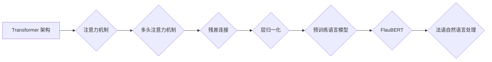

> Transformer, FlauBERT, 法语自然语言处理, 预训练语言模型, 跨语言理解, 序列标注

## 1. 背景介绍

近年来，深度学习在自然语言处理 (NLP) 领域取得了显著进展，其中 Transformer 架构的出现尤为重要。Transformer 凭借其强大的序列建模能力和并行计算效率，在各种 NLP 任务中取得了突破性成果，例如机器翻译、文本摘要、问答系统等。

FlauBERT 是一个基于 Transformer 架构的预训练语言模型，专门针对法语语言进行训练。它由法国国家研究机构 CNRS 和 HuggingFace 共同开发，并在多个法语 NLP 任务上表现出色。FlauBERT 的出现为法语 NLP 领域提供了强大的工具，促进了法语语言理解和应用的进步。

## 2. 核心概念与联系

### 2.1 Transformer 架构

Transformer 架构的核心是注意力机制 (Attention)，它允许模型关注输入序列中不同位置之间的关系，从而更好地理解上下文信息。Transformer 采用多头注意力机制 (Multi-Head Attention)，可以同时关注多个方面的信息，提高模型的表达能力。此外，Transformer 还采用了残差连接 (Residual Connection) 和层归一化 (Layer Normalization) 等技术，增强了模型的训练稳定性和性能。

### 2.2 预训练语言模型 (PLM)

预训练语言模型是指在大量文本数据上进行预训练的语言模型，它已经学习了语言的语法、语义和上下文关系等知识。预训练语言模型可以用于各种下游 NLP 任务，例如文本分类、情感分析、机器翻译等。

FlauBERT 是一个基于 Transformer 架构的预训练语言模型，它在法语维基百科和法语书籍等大量文本数据上进行预训练。预训练后的 FlauBERT 拥有丰富的语言知识，可以用于各种法语 NLP 任务。

### 2.3 法语自然语言处理 (French NLP)

法语自然语言处理是指利用计算机技术处理法语文本，使其能够理解和生成人类语言。法语 NLP 是一项重要的研究领域，它在新闻报道、机器翻译、语音识别等领域有着广泛的应用。

FlauBERT 的出现为法语 NLP 领域提供了强大的工具，它可以帮助人们更好地理解和处理法语文本。

**Mermaid 流程图**



## 3. 核心算法原理 & 具体操作步骤

### 3.1 算法原理概述

FlauBERT 基于 Transformer 架构，采用多头注意力机制和残差连接等技术，在法语维基百科和法语书籍等大量文本数据上进行预训练。预训练过程的目标是学习语言的语法、语义和上下文关系等知识。

预训练完成后，FlauBERT 可以用于各种下游法语 NLP 任务。例如，在文本分类任务中，可以将文本输入到 FlauBERT 中，获取文本的语义表示，然后将语义表示输入到分类器中进行分类。

### 3.2 算法步骤详解

1. **数据预处理:** 将法语文本数据进行清洗、分词、标记等预处理操作，使其能够被模型理解。
2. **模型训练:** 使用预训练好的 Transformer 模型，在法语文本数据上进行训练。训练过程中，模型会学习到语言的语法、语义和上下文关系等知识。
3. **模型评估:** 在测试集上评估模型的性能，例如准确率、召回率、F1-score 等。
4. **模型部署:** 将训练好的模型部署到实际应用场景中，例如文本分类、情感分析、机器翻译等。

### 3.3 算法优缺点

**优点:**

* 强大的语言理解能力：FlauBERT 在法语文本数据上进行预训练，拥有丰富的语言知识，可以更好地理解法语文本的语义和上下文关系。
* 高效的训练速度：Transformer 架构的并行计算能力使得模型训练速度更快。
* 可迁移性强：预训练好的 FlauBERT 可以用于各种下游法语 NLP 任务，无需从头训练。

**缺点:**

* 模型规模较大：FlauBERT 的模型参数量较大，需要较大的计算资源进行训练和部署。
* 数据依赖性强：FlauBERT 的性能取决于训练数据的质量和数量。

### 3.4 算法应用领域

FlauBERT 可以应用于各种法语 NLP 任务，例如：

* 文本分类：例如情感分析、主题分类、垃圾邮件过滤等。
* 语言翻译：将法语文本翻译成其他语言，例如英语、中文等。
* 问答系统：理解用户的问题，并从知识库中找到相应的答案。
* 文本摘要：生成文本的简短摘要。
* 语音识别：将法语语音转换为文本。

## 4. 数学模型和公式 & 详细讲解 & 举例说明

### 4.1 数学模型构建

FlauBERT 的数学模型构建基于 Transformer 架构，主要包括以下几个部分：

* **嵌入层 (Embedding Layer):** 将输入的单词转换为向量表示。
* **多头注意力层 (Multi-Head Attention Layer):** 计算输入序列中不同单词之间的关系。
* **前馈神经网络层 (Feed-Forward Neural Network Layer):** 对每个单词的向量表示进行非线性变换。
* **位置编码层 (Positional Encoding Layer):** 为每个单词添加位置信息，因为 Transformer 模型没有顺序信息。

### 4.2 公式推导过程

FlauBERT 的核心是多头注意力机制，其计算公式如下：

$$
Attention(Q, K, V) = softmax(\frac{QK^T}{\sqrt{d_k}})V
$$

其中：

* $Q$：查询矩阵
* $K$：键矩阵
* $V$：值矩阵
* $d_k$：键向量的维度
* $softmax$：softmax 函数

### 4.3 案例分析与讲解

假设我们有一个句子 "Le chat est sur le tapis"，将其转换为向量表示后，可以利用多头注意力机制计算每个单词之间的关系。例如，"chat" 和 "sur" 之间的关系会比较强，因为它们在语义上相关。

## 5. 项目实践：代码实例和详细解释说明

### 5.1 开发环境搭建

* Python 3.6+
* PyTorch 1.0+
* Transformers 库

### 5.2 源代码详细实现

```python
from transformers import FlauBERTModel, FlauBERTTokenizer

# 加载预训练模型和词典
model = FlauBERTModel.from_pretrained('flaubert/flaubert_base_uncased')
tokenizer = FlauBERTTokenizer.from_pretrained('flaubert/flaubert_base_uncased')

# 文本预处理
text = "Le chat est sur le tapis"
inputs = tokenizer(text, return_tensors="pt")

# 模型推理
outputs = model(**inputs)

# 获取模型输出
last_hidden_state = outputs.last_hidden_state
```

### 5.3 代码解读与分析

* `FlauBERTModel.from_pretrained()` 函数用于加载预训练的 FlauBERT 模型。
* `FlauBERTTokenizer.from_pretrained()` 函数用于加载预训练的词典。
* `tokenizer(text, return_tensors="pt")` 函数将文本转换为模型可识别的格式。
* `model(**inputs)` 函数执行模型推理，获取模型输出。
* `outputs.last_hidden_state` 获取模型最后隐藏层的输出，可以用于后续的文本分析任务。

### 5.4 运行结果展示

运行上述代码后，会输出模型的最后隐藏层输出，这是一个包含多个单词向量表示的张量。这些向量表示可以用于后续的文本分析任务，例如文本分类、情感分析等。

## 6. 实际应用场景

FlauBERT 在法语 NLP 领域有着广泛的应用场景，例如：

* **新闻报道:** 自动提取新闻报道中的关键信息，例如人物、事件、地点等。
* **机器翻译:** 将法语文本翻译成其他语言，例如英语、中文等。
* **语音识别:** 将法语语音转换为文本。
* **聊天机器人:** 开发能够理解和回复法语用户问题的聊天机器人。

### 6.4 未来应用展望

随着预训练语言模型的发展，FlauBERT 在未来将有更多应用场景，例如：

* **法语教育:** 开发能够帮助用户学习法语的应用程序。
* **法语法律文本分析:** 自动分析法语法律文本，提取法律条款和相关信息。
* **法语医学文本分析:** 自动分析法语医学文本，辅助医生诊断和治疗。

## 7. 工具和资源推荐

### 7.1 学习资源推荐

* **HuggingFace Transformers 库:** https://huggingface.co/docs/transformers/index
* **FlauBERT 模型页面:** https://huggingface.co/flaubert/flaubert_base_uncased

### 7.2 开发工具推荐

* **PyTorch:** https://pytorch.org/
* **Jupyter Notebook:** https://jupyter.org/

### 7.3 相关论文推荐

* **FlauBERT: A French BERT Model for Language Understanding**

## 8. 总结：未来发展趋势与挑战

### 8.1 研究成果总结

FlauBERT 是一个基于 Transformer 架构的预训练语言模型，专门针对法语语言进行训练。它在法语 NLP 领域取得了显著成果，为法语语言理解和应用提供了强大的工具。

### 8.2 未来发展趋势

未来，预训练语言模型将继续发展，朝着以下方向发展：

* **模型规模更大:** 模型参数量更大，能够学习更复杂的语言知识。
* **多模态理解:** 能够理解多种模态信息，例如文本、图像、音频等。
* **更强的泛化能力:** 能够应用于更多不同的任务和领域。

### 8.3 面临的挑战

预训练语言模型也面临一些挑战，例如：

* **数据获取和标注:** 高质量的训练数据是预训练语言模型的关键，获取和标注高质量数据是一个挑战。
* **模型解释性:** 预训练语言模型的决策过程难以解释，这限制了其在一些应用场景中的使用。
* **公平性和偏见:** 预训练语言模型可能存在公平性和偏见问题，需要进行相应的缓解措施。

### 8.4 研究展望

未来，预训练语言模型的研究将继续深入，解决上述挑战，并推动其在更多领域得到应用。

## 9. 附录：常见问题与解答

**Q1: 如何使用 FlauBERT 进行文本分类？**

**A1:** 可以将文本输入到 FlauBERT 中，获取文本的语义表示，然后将语义表示输入到分类器中进行分类。

**Q2: FlauBERT 的模型参数量是多少？**

**A2:** FlauBERT 的模型参数量为 1.1 亿个。

**Q3: FlauBERT 支持哪些语言？**

**A3:** FlauBERT 专注于法语语言，目前不支持其他语言。


作者：禅与计算机程序设计艺术 / Zen and the Art of Computer Programming 
<end_of_turn>