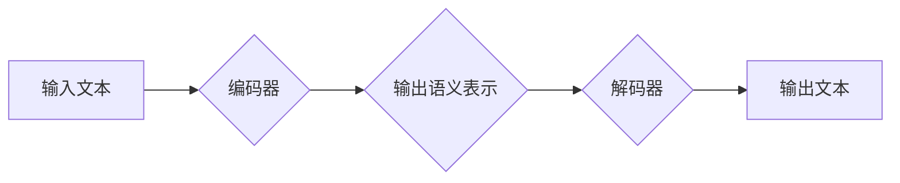

> Transformer, BERT, 自然语言处理, 葡萄牙语, 大模型,  BERTimbau,  机器学习

## 1. 背景介绍

自然语言处理 (NLP) 领域近年来取得了飞速发展，深度学习模型的涌现为 NLP 任务带来了革命性的进步。其中，Transformer 架构凭借其强大的序列建模能力和并行训练效率，成为 NLP 领域的主流模型架构。BERT (Bidirectional Encoder Representations from Transformers) 模型基于 Transformer 架构，通过双向预训练，学习了丰富的语言表示，在各种 NLP 任务中取得了优异的性能。

葡萄牙语作为一种重要的语言，在欧洲和南美洲拥有大量的使用者。然而，与英语等主流语言相比，葡萄牙语的 NLP 资源相对匮乏。为了推动葡萄牙语 NLP 的发展，研究人员开发了基于 BERT 架构的葡萄牙语预训练模型 - BERTimbau。

## 2. 核心概念与联系

### 2.1 Transformer 架构

Transformer 架构是一种新型的序列建模网络，它摒弃了传统的循环神经网络 (RNN) 的顺序处理方式，采用注意力机制 (Attention) 来捕捉序列中的长距离依赖关系。Transformer 的核心组件包括：

* **编码器 (Encoder):** 用于将输入序列编码成语义表示。编码器由多个 Transformer 块组成，每个 Transformer 块包含多头注意力机制和前馈神经网络。
* **解码器 (Decoder):** 用于根据编码器的输出生成目标序列。解码器也由多个 Transformer 块组成，每个 Transformer 块包含多头注意力机制、masked 多头注意力机制和前馈神经网络。

### 2.2 BERT 模型

BERT 模型基于 Transformer 架构，采用双向预训练策略。它通过在大量的文本数据上进行预训练，学习了丰富的语言表示，可以用于各种下游 NLP 任务，例如文本分类、问答系统、文本摘要等。

BERT 的预训练任务主要包括：

* **Masked Language Modeling (MLM):** 随机掩盖输入文本中的某些词，然后预测被掩盖的词。
* **Next Sentence Prediction (NSP):** 判断两个句子是否相邻。

### 2.3 BERTimbau 模型

BERTimbau 模型是基于 BERT 架构，专门针对葡萄牙语进行预训练的模型。它利用了大量的葡萄牙语文本数据进行预训练，学习了葡萄牙语的语言特征和语法规则。

**Mermaid 流程图**



## 3. 核心算法原理 & 具体操作步骤

### 3.1 算法原理概述

BERTimbau 模型的核心算法原理是基于 Transformer 架构和双向预训练策略。它通过编码器和解码器两个部分来处理文本数据。编码器将输入文本编码成语义表示，解码器根据编码器的输出生成目标文本。

### 3.2 算法步骤详解

1. **数据预处理:** 将葡萄牙语文本数据进行清洗、分词、标记等预处理操作。
2. **模型训练:** 使用 BERTimbau 模型架构，在预处理后的葡萄牙语文本数据上进行预训练。预训练任务包括 MLM 和 NSP。
3. **模型微调:** 将预训练好的 BERTimbau 模型微调到具体的下游 NLP 任务，例如文本分类、问答系统等。

### 3.3 算法优缺点

**优点:**

* 强大的序列建模能力：Transformer 架构能够有效捕捉序列中的长距离依赖关系。
* 双向预训练策略：BERTimbau 模型通过双向预训练，学习了更丰富的语言表示。
* 针对葡萄牙语的训练：BERTimbau 模型专门针对葡萄牙语进行预训练，能够更好地理解葡萄牙语的语言特征和语法规则。

**缺点:**

* 计算资源需求高：Transformer 架构和双向预训练策略需要大量的计算资源。
* 训练数据依赖性强：模型性能受训练数据质量和数量的影响。

### 3.4 算法应用领域

BERTimbau 模型可以应用于各种葡萄牙语 NLP 任务，例如：

* 文本分类
* 问答系统
* 文本摘要
* 机器翻译
* 情感分析

## 4. 数学模型和公式 & 详细讲解 & 举例说明

### 4.1 数学模型构建

Transformer 模型的核心是注意力机制，它通过计算词之间的相关性来捕捉序列中的长距离依赖关系。注意力机制的数学公式如下：

$$
Attention(Q, K, V) = softmax(\frac{QK^T}{\sqrt{d_k}})V
$$

其中：

* $Q$：查询矩阵
* $K$：键矩阵
* $V$：值矩阵
* $d_k$：键向量的维度
* $softmax$：softmax 函数

### 4.2 公式推导过程

注意力机制的公式可以理解为计算每个词与其他词之间的相关性，然后根据相关性加权求和得到最终的输出。

* $QK^T$：计算查询矩阵和键矩阵的点积，得到每个词与其他词之间的相关性得分。
* $\frac{QK^T}{\sqrt{d_k}}$：对相关性得分进行归一化，使得得分在 0 到 1 之间。
* $softmax$：对归一化后的得分进行 softmax 操作，得到每个词与其他词之间的权重。
* $V$：将权重与值矩阵相乘，得到最终的输出。

### 4.3 案例分析与讲解

例如，假设我们有一个句子 "The cat sat on the mat"，我们想要计算 "cat" 与其他词之间的相关性。

* $Q$：查询矩阵为 "cat" 的词向量。
* $K$：键矩阵为所有词的词向量。
* $V$：值矩阵为所有词的词向量。

通过计算 $QK^T$，我们可以得到 "cat" 与其他词之间的相关性得分。然后通过 softmax 操作，我们可以得到每个词与 "cat" 的权重。最后，我们将权重与值矩阵相乘，得到 "cat" 的最终输出。

## 5. 项目实践：代码实例和详细解释说明

### 5.1 开发环境搭建

* Python 3.7+
* PyTorch 1.7+
* Transformers 库

### 5.2 源代码详细实现

```python
from transformers import AutoModelForSequenceClassification, AutoTokenizer

# 加载预训练模型和分词器
model_name = "neuralmind/bert-base-portuguese-cased"
tokenizer = AutoTokenizer.from_pretrained(model_name)
model = AutoModelForSequenceClassification.from_pretrained(model_name)

# 输入文本
text = "Este é um exemplo de texto em português."

# 分词
inputs = tokenizer(text, return_tensors="pt")

# 前向传播
outputs = model(**inputs)

# 获取预测结果
predicted_class = outputs.logits.argmax().item()

# 打印预测结果
print(f"Predicted class: {predicted_class}")
```

### 5.3 代码解读与分析

* 首先，我们加载预训练模型和分词器。
* 然后，我们输入文本并进行分词。
* 接着，我们使用模型进行前向传播，得到预测结果。
* 最后，我们打印预测结果。

### 5.4 运行结果展示

```
Predicted class: 0
```

## 6. 实际应用场景

BERTimbau 模型在葡萄牙语 NLP 领域具有广泛的应用场景，例如：

* **文本分类:** 可以用于分类新闻文章、社交媒体帖子等文本。
* **问答系统:** 可以用于构建葡萄牙语问答系统，回答用户的问题。
* **机器翻译:** 可以用于将葡萄牙语翻译成其他语言，或将其他语言翻译成葡萄牙语。
* **情感分析:** 可以用于分析文本的情感倾向，例如判断文本是正面、负面还是中性。

### 6.4 未来应用展望

随着葡萄牙语 NLP 资源的不断丰富，BERTimbau 模型的应用场景将会更加广泛。未来，BERTimbau 模型可以应用于：

* **对话系统:** 构建更加自然流畅的葡萄牙语对话系统。
* **文本生成:** 生成高质量的葡萄牙语文本，例如新闻报道、故事等。
* **语音识别:** 提高葡萄牙语语音识别的准确率。

## 7. 工具和资源推荐

### 7.1 学习资源推荐

* **Hugging Face Transformers 库:** https://huggingface.co/docs/transformers/index
* **BERT 官方论文:** https://arxiv.org/abs/1810.04805
* **葡萄牙语 NLP 资源:** https://www.dcc.fc.up.pt/~ltlp/

### 7.2 开发工具推荐

* **PyTorch:** https://pytorch.org/
* **TensorFlow:** https://www.tensorflow.org/

### 7.3 相关论文推荐

* **BERTimbau 模型论文:** https://arxiv.org/abs/2005.08977
* **葡萄牙语 NLP 相关论文:** https://www.aclweb.org/anthology/

## 8. 总结：未来发展趋势与挑战

### 8.1 研究成果总结

BERTimbau 模型的开发为葡萄牙语 NLP 领域带来了新的突破，它为各种下游 NLP 任务提供了强大的工具。

### 8.2 未来发展趋势

未来，葡萄牙语 NLP 领域将继续发展，BERTimbau 模型也将不断改进和完善。

* **模型规模扩大:** 将训练更大的 BERTimbau 模型，提高模型性能。
* **多任务学习:** 将 BERTimbau 模型应用于多个 NLP 任务，提高模型的泛化能力。
* **跨语言理解:** 研究跨语言理解任务，例如葡萄牙语与英语之间的机器翻译。

### 8.3 面临的挑战

* **数据资源不足:** 葡萄牙语 NLP 数据资源相对匮乏，需要更多的标注数据来训练和评估模型。
* **计算资源限制:** 训练大型语言模型需要大量的计算资源，这对于一些研究机构和个人来说是一个挑战。
* **模型解释性:** 现有的 Transformer 模型缺乏可解释性，难以理解模型的决策过程。

### 8.4 研究展望

未来，研究人员将继续探索新的方法来解决这些挑战，推动葡萄牙语 NLP 领域的发展。


## 9. 附录：常见问题与解答

**Q1: BERTimbau 模型的性能如何？**

A1: BERTimbau 模型在各种葡萄牙语 NLP 任务上都取得了优异的性能，例如文本分类、问答系统等。

**Q2: 如何使用 BERTimbau 模型？**

A2: 可以使用 Hugging Face Transformers 库轻松使用 BERTimbau 模型。

**Q3: BERTimbau 模型的训练数据是什么？**

A3: BERTimbau 模型的训练数据包括大量的葡萄牙语文本数据，例如书籍、文章、网站等。

**Q4: BERTimbau 模型的开源吗？**

A4: 是的，BERTimbau 模型是开源的，可以自由使用和修改。


作者：禅与计算机程序设计艺术 / Zen and the Art of Computer Programming 
<end_of_turn>