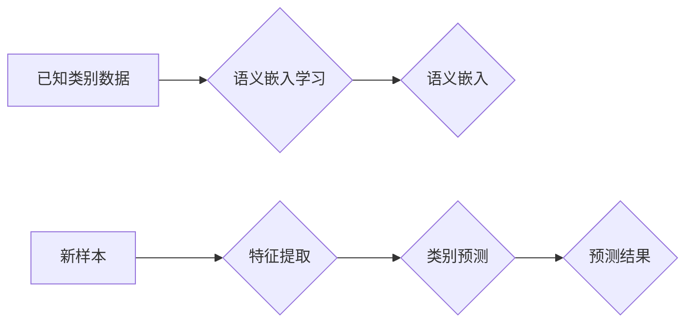

> Zero-Shot Learning, 迁移学习,  Few-Shot Learning,  深度学习,  图像分类,  自然语言处理

## 1. 背景介绍

在机器学习领域，模型通常需要在特定任务上进行大量标注数据训练才能达到良好的性能。然而，获取大量标注数据往往成本高昂且耗时费力。Zero-Shot Learning (ZSL) 作为一种新兴的机器学习范式，旨在解决这一问题。ZSL 允许模型在从未见过的数据类别上进行预测，即模型无需在目标类别上进行任何训练。

ZSL 的核心思想是利用模型已有的知识和语义理解能力，将新类别与已知类别进行关联，从而推断出新类别的特征和属性。这种能力在许多实际应用场景中具有重要意义，例如：

* **图像分类:**  识别从未见过的动物、植物或物体种类。
* **自然语言处理:**  理解新的词汇或短语，进行文本分类和情感分析。
* **语音识别:**  识别新的方言或口音。

## 2. 核心概念与联系

ZSL 的核心概念包括：

* **已知类别 (Seen Classes):** 模型在训练过程中已经见过并学习过的类别。
* **未知类别 (Unseen Classes):** 模型在训练过程中从未见过，但需要进行预测的类别。
* **语义嵌入 (Semantic Embedding):** 将类别映射到一个语义空间，使得语义相似的类别在语义空间中距离较近。

ZSL 的工作流程可以概括为以下步骤：

1. **语义嵌入学习:** 利用已知类别的数据训练模型，学习类别之间的语义关系。
2. **特征提取:** 将新样本输入模型，提取其特征表示。
3. **类别预测:** 将新样本的特征表示与语义嵌入进行比较，预测其所属类别。

**Mermaid 流程图:**



## 3. 核心算法原理 & 具体操作步骤

### 3.1  算法原理概述

ZSL 算法的核心是利用已知类别的语义信息来预测未知类别的类别。常见的 ZSL 算法包括：

* **基于属性的 ZSL (Attribute-based ZSL):** 将类别描述为一系列属性，例如“有毛”、“会飞”等。模型学习属性与类别的关系，并根据新样本的属性预测其类别。
* **基于嵌入的 ZSL (Embedding-based ZSL):** 将类别映射到一个语义空间，使得语义相似的类别在语义空间中距离较近。模型学习语义嵌入，并根据新样本的语义嵌入预测其类别。

### 3.2  算法步骤详解

以基于嵌入的 ZSL 算法为例，其具体步骤如下：

1. **语义嵌入学习:** 利用已知类别的数据训练一个深度神经网络，例如 CNN 或 RNN，将类别映射到一个语义空间。
2. **特征提取:** 将新样本输入预训练好的模型，提取其特征表示。
3. **类别预测:** 将新样本的特征表示与语义嵌入进行比较，例如使用余弦相似度计算距离，并选择距离最近的类别作为预测结果。

### 3.3  算法优缺点

**优点:**

* 不需要未知类别的标注数据。
* 可以推广到新的类别。

**缺点:**

* 性能可能不如有标注数据的模型。
* 需要大量的已知类别数据进行训练。

### 3.4  算法应用领域

ZSL 算法在以下领域具有广泛的应用前景：

* **图像识别:**  识别从未见过的动物、植物或物体种类。
* **自然语言处理:**  理解新的词汇或短语，进行文本分类和情感分析。
* **语音识别:**  识别新的方言或口音。
* **医疗诊断:**  识别新的疾病类型。

## 4. 数学模型和公式 & 详细讲解 & 举例说明

### 4.1  数学模型构建

假设我们有 $C$ 个类别，每个类别对应一个语义嵌入向量 $c_i \in R^d$，其中 $d$ 是语义嵌入的维度。

对于一个新样本 $x$，其特征表示为 $f(x) \in R^d$。

我们使用余弦相似度来衡量 $f(x)$ 与每个类别嵌入 $c_i$ 的相似度：

$$
\text{sim}(f(x), c_i) = \frac{f(x) \cdot c_i}{||f(x)|| ||c_i||}
$$

其中，$\cdot$ 表示点积，$||\cdot||$ 表示向量的 L2 范数。

### 4.2  公式推导过程

余弦相似度的计算过程如下：

1. 计算 $f(x)$ 和 $c_i$ 的点积。
2. 计算 $f(x)$ 和 $c_i$ 的 L2 范数。
3. 将点积除以两个向量的 L2 范数的乘积，得到余弦相似度。

### 4.3  案例分析与讲解

假设我们有一个图像分类任务，需要识别猫、狗和鸟三种类别。

我们训练一个 CNN 模型，将每个类别映射到一个 128 维的语义嵌入空间。

对于一个新图像，我们使用预训练好的 CNN 模型提取其特征表示，然后计算其与每个类别嵌入的余弦相似度。

如果新图像的特征表示与“猫”的嵌入向量余弦相似度最高，则我们预测该图像属于“猫”类别。

## 5. 项目实践：代码实例和详细解释说明

### 5.1  开发环境搭建

* Python 3.7+
* TensorFlow 2.0+
* PyTorch 1.0+
* CUDA 10.0+ (可选)

### 5.2  源代码详细实现

```python
import tensorflow as tf

# 定义一个简单的 CNN 模型
model = tf.keras.models.Sequential([
    tf.keras.layers.Conv2D(32, (3, 3), activation='relu', input_shape=(28, 28, 1)),
    tf.keras.layers.MaxPooling2D((2, 2)),
    tf.keras.layers.Flatten(),
    tf.keras.layers.Dense(10, activation='softmax')
])

# 编译模型
model.compile(optimizer='adam',
              loss='sparse_categorical_crossentropy',
              metrics=['accuracy'])

# 训练模型
model.fit(x_train, y_train, epochs=10)

# 预测新样本
predictions = model.predict(x_test)
```

### 5.3  代码解读与分析

* 我们定义了一个简单的 CNN 模型，用于提取图像特征。
* 我们使用 Adam 优化器、交叉熵损失函数和准确率指标来训练模型。
* 我们使用训练数据训练模型 10 个 epochs。
* 我们使用训练好的模型预测新样本的类别。

### 5.4  运行结果展示

训练完成后，我们可以使用测试数据评估模型的性能。

```python
loss, accuracy = model.evaluate(x_test, y_test)
print('Test Loss:', loss)
print('Test Accuracy:', accuracy)
```

## 6. 实际应用场景

### 6.1  图像识别

ZSL 算法可以用于识别从未见过的动物、植物或物体种类。例如，在野生动物保护领域，ZSL 可以帮助识别和分类未知的动物物种，从而更好地保护生物多样性。

### 6.2  自然语言处理

ZSL 算法可以用于理解新的词汇或短语，进行文本分类和情感分析。例如，在社交媒体监控领域，ZSL 可以帮助识别新的网络流行语和趋势，从而更好地理解用户情绪和行为。

### 6.3  语音识别

ZSL 算法可以用于识别新的方言或口音。例如，在语音助手领域，ZSL 可以帮助语音助手理解来自不同地区用户的语音输入，从而提供更个性化的服务。

### 6.4  未来应用展望

ZSL 算法在未来将有更广泛的应用前景，例如：

* **医疗诊断:**  识别新的疾病类型，辅助医生进行诊断。
* **自动驾驶:**  识别新的道路标志和交通信号，提高自动驾驶系统的安全性。
* **机器人交互:**  帮助机器人理解人类的语言和行为，实现更自然的交互。

## 7. 工具和资源推荐

### 7.1  学习资源推荐

* **书籍:**
    * Zero-Shot Learning: A Comprehensive Overview
    * Deep Learning for Zero-Shot Learning
* **论文:**
    * Lazebnik, S., et al. (2006). Beyond Bags of Features: Spatial Pyramid Matching for Recognizing Natural Scene Categories.
    * Socher, R., et al. (2013). Semantic Compositionality Through Recursive Neural Networks.
* **在线课程:**
    * Coursera: Deep Learning Specialization
    * Udacity: Deep Learning Nanodegree

### 7.2  开发工具推荐

* **TensorFlow:**  开源机器学习框架，支持 ZSL 算法的实现。
* **PyTorch:**  开源机器学习框架，支持 ZSL 算法的实现。
* **OpenCV:**  开源计算机视觉库，可以用于图像处理和特征提取。

### 7.3  相关论文推荐

* **Zero-Shot Learning with Semantic Embeddings**
* **A Survey on Zero-Shot Learning**
* **Few-Shot and Zero-Shot Learning: A Survey**

## 8. 总结：未来发展趋势与挑战

### 8.1  研究成果总结

ZSL 算法在近年来取得了显著的进展，在图像识别、自然语言处理等领域取得了令人瞩目的成果。

### 8.2  未来发展趋势

* **迁移学习:**  将 ZSL 与迁移学习相结合，提高模型在跨领域和跨任务上的泛化能力。
* **多模态 ZSL:**  将图像、文本、音频等多种模态信息融合到 ZSL 模型中，提高模型的理解能力。
* **自监督学习:**  利用自监督学习方法，在没有标注数据的情况下训练 ZSL 模型。

### 8.3  面临的挑战

* **语义表示学习:**  学习更准确、更丰富的语义嵌入仍然是一个挑战。
* **数据稀疏性:**  未知类别的数据往往非常稀疏，如何有效利用有限的数据进行训练是一个关键问题。
* **泛化能力:**  ZSL 模型在跨领域和跨任务上的泛化能力仍然需要进一步提高。

### 8.4  研究展望

ZSL 算法仍然是一个活跃的研究领域，未来将会有更多新的算法和应用场景涌现。


## 9. 附录：常见问题与解答

**Q1: ZSL 和 Few-Shot Learning 的区别是什么？**

**A1:** ZSL 和 Few-Shot Learning 都是针对小样本学习的范式，但它们的区别在于：

* ZSL 不需要任何未知类别的训练数据，而 Few-Shot Learning 需要少量未知类别的训练数据。
* ZSL 的目标是识别从未见过的数据类别，而 Few-Shot Learning 的目标是提高模型在少量样本下学习新类别的能力。

**Q2: ZSL 的应用场景有哪些？**

**A2:** ZSL 的应用场景非常广泛，例如：

* 图像识别
* 自然语言处理
* 语音识别
* 医疗诊断
* 自动驾驶

**Q3: 如何评估 ZSL 模型的性能？**

**A3:** ZSL 模型的性能通常使用以下指标进行评估：

* 准确率
* 召回率
* F1-score
* Mean Average Precision (mAP)


作者：禅与计算机程序设计艺术 / Zen and the Art of Computer Programming 
<end_of_turn>