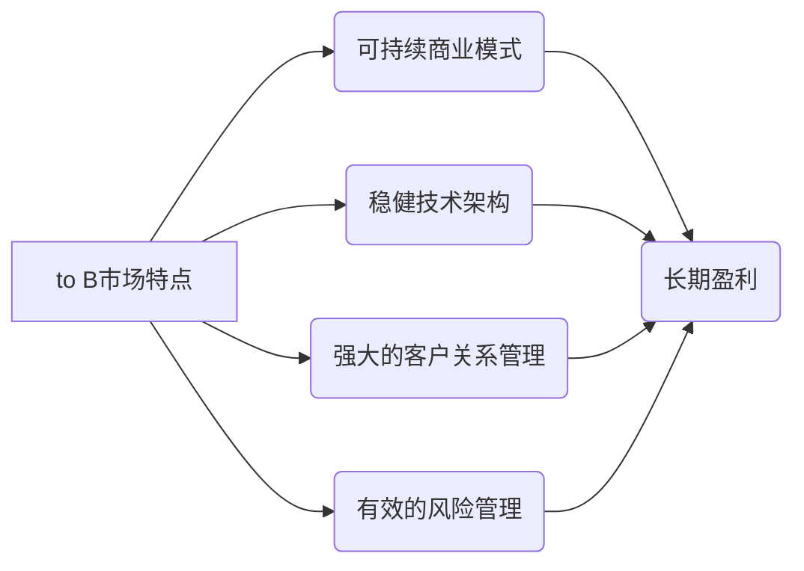

> to B市场,长期盈利,稳定性,商业模式,技术架构,数据驱动,风险管理,客户关系

## 1. 背景介绍

在当今数字化时代，to B市场（面向企业的市场）正经历着前所未有的变革。云计算、大数据、人工智能等新兴技术的蓬勃发展，为to B企业带来了前所未有的机遇，但也带来了新的挑战。如何才能在激烈的市场竞争中实现长期盈利和稳定发展，成为to B企业面临的共同难题。

传统to B企业的商业模式往往依赖于产品销售和服务收费，但这种模式在面对快速变化的市场环境时显得不够灵活和可持续。为了应对挑战，to B企业需要不断探索新的商业模式，并构建更加稳健的技术架构，以实现长期盈利和稳定发展。

## 2. 核心概念与联系

**2.1  to B市场特点**

to B市场与to C市场（面向消费者的市场）相比，具有以下特点：

* **客户群体规模较小，但单笔交易价值较高。**
* **客户需求更加专业化和个性化。**
* **销售周期较长，决策流程复杂。**
* **客户对产品和服务的稳定性和可靠性要求更高。**

**2.2  长期盈利与稳定性的关键要素**

* **可持续的商业模式：** 能够在长期的市场竞争中保持盈利能力，并不断适应市场变化的商业模式。
* **稳健的技术架构：** 能够支撑企业业务的快速发展，并保证产品和服务的稳定性和可靠性。
* **强大的客户关系管理：** 建立良好的客户关系，并提供优质的客户服务，以提高客户满意度和忠诚度。
* **有效的风险管理：** 识别和评估潜在的风险，并采取相应的措施，以降低风险的影响。

**2.3  核心概念关系图**



## 3. 核心算法原理 & 具体操作步骤

**3.1  算法原理概述**

为了实现to B市场的长期盈利和稳定，需要采用一些核心算法和技术手段。例如，数据分析算法可以帮助企业洞察客户需求，优化产品和服务；机器学习算法可以帮助企业自动化运营，提高效率；风险管理算法可以帮助企业识别和评估潜在的风险，降低风险的影响。

**3.2  算法步骤详解**

以数据分析算法为例，其具体操作步骤如下：

1. **数据收集:** 收集相关业务数据，例如客户行为数据、市场趋势数据、产品销售数据等。
2. **数据清洗:** 对收集到的数据进行清洗，去除无效数据和重复数据，确保数据质量。
3. **数据分析:** 使用数据分析算法对清洗后的数据进行分析，例如聚类分析、关联规则挖掘、预测分析等。
4. **结果解读:** 对分析结果进行解读，并将其转化为可操作的 insights，例如客户画像、市场趋势预测、产品优化建议等。
5. **行动执行:** 根据 insights，制定相应的行动计划，并将其执行，以实现业务目标。

**3.3  算法优缺点**

数据分析算法具有以下优点：

* **洞察客户需求:** 可以帮助企业深入了解客户需求，制定更精准的营销策略。
* **优化产品和服务:** 可以帮助企业识别产品和服务的痛点，并进行优化，提高客户满意度。
* **提高运营效率:** 可以帮助企业自动化运营，提高效率和降低成本。

但也存在以下缺点：

* **数据依赖:** 数据分析算法的准确性依赖于数据的质量和完整性。
* **算法选择:** 需要根据具体业务场景选择合适的算法，否则可能会导致分析结果不准确。
* **结果解读:** 需要具备一定的专业知识和经验才能正确解读分析结果。

**3.4  算法应用领域**

数据分析算法广泛应用于to B市场的各个领域，例如：

* **市场营销:** 客户画像、市场趋势预测、精准营销
* **产品开发:** 产品需求分析、产品优化建议
* **销售管理:** 销售预测、客户关系管理
* **运营管理:** 运营效率优化、成本控制

## 4. 数学模型和公式 & 详细讲解 & 举例说明

**4.1  数学模型构建**

为了量化to B市场的长期盈利和稳定性，可以构建一个数学模型，将相关因素进行量化分析。例如，可以构建一个基于客户生命周期价值（CLTV）的模型，来评估客户的长期价值，并制定相应的营销策略。

**4.2  公式推导过程**

CLTV的计算公式如下：

$$CLTV = \sum_{t=1}^{n} \frac{ARPU_t}{(1+churn_t)^t}$$

其中：

* $ARPU_t$：t时刻的平均收入每用户
* $churn_t$：t时刻的客户流失率
* $n$：客户生命周期长度

**4.3  案例分析与讲解**

假设一家to B软件公司，其客户生命周期长度为3年，平均收入每用户为1000美元，客户流失率分别为10%、15%、20%。

根据上述公式，可以计算出该公司的CLTV为：

$$CLTV = \frac{1000}{(1+0.1)^1} + \frac{1000}{(1+0.15)^2} + \frac{1000}{(1+0.2)^3} \approx 2638.57$$

这意味着，该公司的每个客户在整个生命周期内能够为公司带来约2638.57美元的价值。

## 5. 项目实践：代码实例和详细解释说明

**5.1  开发环境搭建**

为了实现to B市场的长期盈利和稳定，需要搭建一个稳健的技术架构。例如，可以使用云计算平台搭建一个弹性、可扩展的系统，并采用微服务架构，提高系统的可靠性和可维护性。

**5.2  源代码详细实现**

由于篇幅限制，这里只提供一个简单的代码实例，用于演示数据分析算法的实现。

```python
import pandas as pd

# 加载数据
data = pd.read_csv('customer_data.csv')

# 聚类分析
from sklearn.cluster import KMeans
kmeans = KMeans(n_clusters=3)
data['cluster'] = kmeans.fit_predict(data[['age', 'income']])

# 结果展示
print(data.groupby('cluster').mean())
```

**5.3  代码解读与分析**

这段代码首先加载了客户数据，然后使用KMeans算法进行聚类分析，将客户分为3个簇。最后，代码展示了每个簇的平均年龄和收入。

**5.4  运行结果展示**

运行结果会显示每个簇的平均年龄和收入，可以帮助企业了解客户群体的特征，并制定相应的营销策略。

## 6. 实际应用场景

**6.1  案例分析**

一家to B的 SaaS 公司，通过数据分析算法，发现客户使用其产品的频率与客户的行业类型相关。

**6.2  解决方案**

该公司针对不同行业类型，定制了不同的产品功能和服务方案，并通过精准营销，提高了客户的转化率和留存率。

**6.3  未来应用展望**

随着人工智能技术的不断发展，to B市场的应用场景将更加广泛，例如：

* **智能客服:** 使用人工智能技术，提供更加智能和高效的客户服务。
* **个性化推荐:** 根据客户的需求和行为，提供个性化的产品和服务推荐。
* **预测分析:** 使用机器学习算法，预测客户的未来行为，并采取相应的措施。

## 7. 工具和资源推荐

**7.1  学习资源推荐**

* **书籍:**
    * 《数据科学实战》
    * 《机器学习实战》
    * 《云计算架构设计》
* **在线课程:**
    * Coursera
    * edX
    * Udemy

**7.2  开发工具推荐**

* **数据分析工具:**
    * Python (Pandas, Scikit-learn)
    * R
    * Tableau
* **云计算平台:**
    * AWS
    * Azure
    * GCP

**7.3  相关论文推荐**

* **数据分析:**
    * 《数据挖掘: 概念与技术》
    * 《机器学习》
* **云计算:**
    * 《云计算架构设计》
    * 《云计算安全》

## 8. 总结：未来发展趋势与挑战

**8.1  研究成果总结**

本文探讨了to B市场的长期盈利和稳定性，并介绍了相关算法、技术和工具。

**8.2  未来发展趋势**

to B市场将继续朝着数字化、智能化方向发展，人工智能、大数据、云计算等技术将发挥更加重要的作用。

**8.3  面临的挑战**

to B市场面临着数据安全、隐私保护、技术更新迭代等挑战。

**8.4  研究展望**

未来需要进一步研究to B市场的个性化需求、智能化服务、安全可靠性等方面，以推动to B市场的健康发展。

## 9. 附录：常见问题与解答

**9.1  常见问题**

* 如何选择合适的算法？
* 如何保证数据安全和隐私保护？
* 如何应对技术更新迭代带来的挑战？

**9.2  解答**

* 选择算法需要根据具体业务场景和数据特点进行分析。
* 数据安全和隐私保护需要采用相应的技术措施和管理制度。
* 需要建立持续学习和改进机制，及时跟进技术发展趋势。


作者：禅与计算机程序设计艺术 / Zen and the Art of Computer Programming 
<end_of_turn>