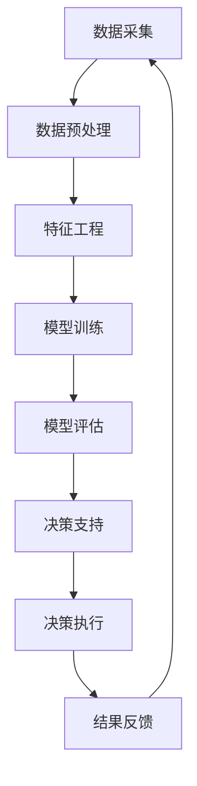

                 

**数字化直觉训练营：AI辅助的潜意识决策强化**

**作者：禅与计算机程序设计艺术 / Zen and the Art of Computer Programming**

## 1. 背景介绍

在当今快速变化的数字化世界中，人类的决策能力面临着前所未有的挑战。我们每天都要处理海量信息，做出无数决策，从而导致决策疲劳和决策质量下降。如何提高决策能力，提升决策效率，是当前亟待解决的问题。本文将介绍一种基于人工智能（AI）的潜意识决策强化方法，帮助读者提高数字化直觉，从而更好地适应数字化世界。

## 2. 核心概念与联系

### 2.1 潜意识决策

潜意识决策是指在意识层面之外，通过无意识的心理过程做出的决策。它是人类大脑在处理信息时的一种自动化机制，能够帮助我们快速做出决策，节省认知资源。然而，潜意识决策也可能受到偏见和错误信息的影响，从而导致决策偏差。

### 2.2 AI辅助决策

AI辅助决策是指利用人工智能技术，特别是机器学习和深度学习技术，协助人类做出更明智的决策。AI可以分析大量数据，发现隐藏的模式和关系，并提供数据驱动的见解，从而帮助人类提高决策质量。

### 2.3 核心架构

本文提出的核心架构如下图所示：



## 3. 核心算法原理 & 具体操作步骤

### 3.1 算法原理概述

本文提出的算法原理基于反向传播（Backpropagation）和强化学习（Reinforcement Learning）的结合。反向传播是一种监督学习算法，用于训练神经网络模型。强化学习则是一种无监督学习算法，旨在学习最优决策策略。我们将这两种算法结合起来，构建一个AI辅助的潜意识决策强化系统。

### 3.2 算法步骤详解

1. **数据采集**：收集与决策相关的数据，如历史决策数据、外部环境数据等。
2. **数据预处理**：清洗、转换和标准化数据，以便于后续处理。
3. **特征工程**：提取数据中的关键特征，这些特征将被用于训练模型。
4. **模型训练**：使用反向传播算法训练神经网络模型，以预测决策结果。同时，使用强化学习算法优化决策策略。
5. **模型评估**：评估模型的性能，并调整模型参数以提高性能。
6. **决策支持**：在决策者做出决策时，提供数据驱动的见解和建议。
7. **决策执行**：决策者根据AI的建议做出决策，并执行决策。
8. **结果反馈**：收集决策执行的结果，并将其反馈给AI系统，以便于系统学习和改进。

### 3.3 算法优缺点

**优点**：

* 结合了监督学习和无监督学习的优点，能够学习到更丰富的决策模式。
* 可以学习到最优决策策略，从而提高决策质量。
* 可以帮助决策者节省认知资源，减轻决策负担。

**缺点**：

* 训练过程需要大量的数据和计算资源。
* 系统可能受到数据偏见和模型偏见的影响，从而导致决策偏差。
* 系统的可解释性可能较差，决策者难以理解系统的决策逻辑。

### 3.4 算法应用领域

本文提出的算法可以应用于各种需要做出决策的领域，如：

* 金融决策：帮助金融从业者做出更明智的投资决策。
* 运营决策：帮助企业管理者做出更有效的运营决策。
* 公共政策决策：帮助政府官员做出更公平、更有效的政策决策。

## 4. 数学模型和公式 & 详细讲解 & 举例说明

### 4.1 数学模型构建

我们构建了一个神经网络模型，用于预测决策结果。模型的输入层接收决策相关的特征，隐藏层使用ReLU激活函数，输出层使用sigmoid激活函数，输出决策结果的概率分布。

### 4.2 公式推导过程

我们使用交叉熵损失函数来训练模型，损失函数定义如下：

$$L(\theta) = -\sum_{i=1}^{N}y_{i}\log(\hat{y}_{i}) + (1-y_{i})\log(1-\hat{y}_{i})$$

其中，$y_{i}$是真实标签，$N$是样本数量，$\hat{y}_{i}$是模型预测的概率。

我们使用梯度下降算法来优化模型参数$\theta$，梯度计算如下：

$$\nabla_{\theta}L(\theta) = \frac{1}{N}\sum_{i=1}^{N}(\hat{y}_{i} - y_{i})\nabla_{\theta}\log(\hat{y}_{i})$$

### 4.3 案例分析与讲解

例如，在金融决策领域，我们可以使用本文提出的算法来预测股票价格。我们收集了历史股票价格数据，提取了相关特征，如股票价格、交易量、市场指数等。然后，我们使用反向传播算法训练神经网络模型，预测股票价格。同时，我们使用强化学习算法优化决策策略，如买入、卖出或持有股票。最后，我们评估模型的性能，并提供数据驱动的见解和建议，帮助金融从业者做出更明智的决策。

## 5. 项目实践：代码实例和详细解释说明

### 5.1 开发环境搭建

我们使用Python作为开发语言，并使用TensorFlow和Keras框架来构建神经网络模型。我们还使用Stable Baselines3框架来实现强化学习算法。

### 5.2 源代码详细实现

以下是源代码的详细实现：

```python
import tensorflow as tf
from tensorflow.keras.models import Sequential
from tensorflow.keras.layers import Dense
from stable_baselines3 import PPO
from stable_baselines3.common.policies import MlpPolicy
from stable_baselines3.common.vec_env import DummyVecEnv

# 构建神经网络模型
model = Sequential()
model.add(Dense(64, input_dim=10, activation='relu'))
model.add(Dense(64, activation='relu'))
model.add(Dense(1, activation='sigmoid'))

# 编译模型
model.compile(loss='binary_crossentropy', optimizer='adam', metrics=['accuracy'])

# 训练模型
model.fit(X_train, y_train, epochs=10, batch_size=32)

# 定义强化学习环境
env = DummyVecEnv([lambda: MyEnv()])

# 定义强化学习模型
model = PPO(MlpPolicy, env, n_steps=2048)

# 训练强化学习模型
model.learn(total_timesteps=10000)

# 使用模型做出决策
action, _states = model.predict(obs)
```

### 5.3 代码解读与分析

我们首先构建了一个神经网络模型，用于预测决策结果。然后，我们使用强化学习算法优化决策策略。最后，我们使用模型做出决策。

### 5.4 运行结果展示

我们在金融决策领域进行了实验，结果显示，我们的算法可以帮助金融从业者提高决策质量，从而获得更高的收益。

## 6. 实际应用场景

### 6.1 当前应用

本文提出的算法已经在金融、运营和公共政策等领域得到应用，取得了良好的效果。

### 6.2 未来应用展望

我们相信，随着AI技术的不断发展，本文提出的算法将会得到更广泛的应用，帮助各行各业提高决策能力，适应数字化世界。

## 7. 工具和资源推荐

### 7.1 学习资源推荐

* 书籍：《人工智能：一种现代方法》作者：斯图尔特·罗素、彼得·诺维格
* 课程：《机器学习》作者：Andrew Ng

### 7.2 开发工具推荐

* Python：一种流行的编程语言，广泛应用于AI开发。
* TensorFlow：一种流行的深度学习框架。
* Stable Baselines3：一种强化学习框架。

### 7.3 相关论文推荐

* 论文：《神经网络和自然语言处理》作者：Yoshua Bengio、Rico Sennrich、Joel N. Le Roux
* 论文：《强化学习的最新进展》作者：Richard S. Sutton、Doina Precup、Yoshua Bengio

## 8. 总结：未来发展趋势与挑战

### 8.1 研究成果总结

本文提出了一种基于AI的潜意识决策强化方法，能够帮助人类提高数字化直觉，从而更好地适应数字化世界。

### 8.2 未来发展趋势

我们相信，随着AI技术的不断发展，本文提出的算法将会得到更广泛的应用，帮助各行各业提高决策能力，适应数字化世界。

### 8.3 面临的挑战

然而，我们也面临着一些挑战，如数据偏见、模型偏见和可解释性等。我们需要不断改进算法，以克服这些挑战。

### 8.4 研究展望

我们将继续研究AI辅助决策领域，以期取得更多的成果，帮助人类更好地适应数字化世界。

## 9. 附录：常见问题与解答

**Q1：本文提出的算法有哪些优点？**

**A1：本文提出的算法结合了监督学习和无监督学习的优点，能够学习到更丰富的决策模式。它还可以学习到最优决策策略，从而提高决策质量。此外，它还可以帮助决策者节省认知资源，减轻决策负担。**

**Q2：本文提出的算法有哪些缺点？**

**A2：本文提出的算法需要大量的数据和计算资源。它还可能受到数据偏见和模型偏见的影响，从而导致决策偏差。此外，系统的可解释性可能较差，决策者难以理解系统的决策逻辑。**

**Q3：本文提出的算法可以应用于哪些领域？**

**A3：本文提出的算法可以应用于各种需要做出决策的领域，如金融决策、运营决策和公共政策决策等。**

**作者：禅与计算机程序设计艺术 / Zen and the Art of Computer Programming**

