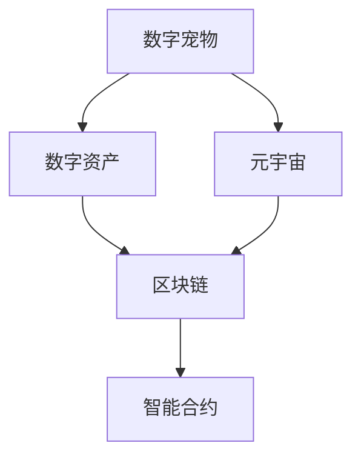

                 

数字宠物、元宇宙、人工生命、法律地位、数字权益、数字资产、区块链、智能合约、数字身份、法人地位

## 1. 背景介绍

随着元宇宙的兴起，数字宠物作为其中一个重要组成部分，正在受到越来越多的人关注。数字宠物是一种数字资产，它可以在元宇宙中被创建、购买、交易和收藏。然而，与传统的实体宠物不同，数字宠物的法律地位尚未明确，这给数字宠物的所有者和创造者带来了不确定性和风险。本文将探讨数字宠物的法律地位，以及如何在元宇宙中保护数字宠物的权益。

## 2. 核心概念与联系

### 2.1 数字宠物与数字资产

数字宠物是一种数字资产，它可以被创建、购买、交易和收藏。数字资产是一种虚拟资产，它存在于数字世界中，而不是实体世界中。数字资产可以是任何形式的数字内容，从图像和视频到音乐和软件。数字宠物是数字资产的一个子集，它具有独特的特性和功能。

### 2.2 元宇宙与数字宠物

元宇宙是一个虚拟的、基于互联网的世界，它由数字资产组成，包括数字宠物。元宇宙允许用户创建、购买、交易和收藏数字资产，包括数字宠物。数字宠物在元宇宙中具有独特的价值，因为它们可以与其他数字资产互动，并具有独特的属性和特征。

### 2.3 区块链与智能合约

区块链是一种分布式账本技术，它可以用于记录和验证数字资产的所有权和交易。智能合约是一种自动执行的计算机程序，它可以在区块链上运行，并用于管理数字资产的所有权和交易。智能合约可以用于创建和管理数字宠物，并确保它们的所有权和交易的安全性。



## 3. 核心算法原理 & 具体操作步骤

### 3.1 算法原理概述

数字宠物的创建和管理可以使用智能合约在区块链上实现。智能合约可以使用各种编程语言编写，包括Solidity、Vyper和Rust。智能合约可以定义数字宠物的属性、行为和交易规则。数字宠物的所有权可以使用区块链上的地址表示，并可以通过智能合约转移。

### 3.2 算法步骤详解

1. 定义数字宠物的属性和行为。数字宠物的属性可以包括名称、种类、外观、技能和等级等。数字宠物的行为可以包括进食、睡觉、玩耍和战斗等。
2. 编写智能合约，定义数字宠物的创建、交易和管理规则。智能合约可以使用Solidity、Vyper或Rust等编程语言编写。
3. 部署智能合约到区块链上。智能合约可以部署到以太坊、EOS或其他区块链平台上。
4. 创建数字宠物。数字宠物可以通过调用智能合约中的创建函数创建。创建函数可以接受数字宠物的属性作为参数。
5. 管理数字宠物。数字宠物的所有权可以通过智能合约转移。数字宠物的属性和行为可以通过调用智能合约中的函数修改。
6. 交易数字宠物。数字宠物可以通过智能合约转移给其他用户。交易可以通过调用智能合约中的转移函数完成。

### 3.3 算法优缺点

优点：

* 安全性：智能合约可以确保数字宠物的所有权和交易的安全性。
* 透明性：区块链上的交易是公开的，任何人都可以查看数字宠物的交易历史。
* 可编程性：智能合约可以定义数字宠物的属性、行为和交易规则。

缺点：

* 成本：部署智能合约到区块链上需要支付手续费。
* 复杂性：智能合约的编写和部署需要一定的技术水平。
* 可靠性：智能合约一旦部署到区块链上，就无法修改。如果智能合约中存在 bug，则可能导致数字宠物的所有权和交易出现问题。

### 3.4 算法应用领域

数字宠物的创建和管理可以应用于各种领域，包括但不限于：

* 游戏：数字宠物可以作为游戏中的宠物或道具使用。
* 收藏：数字宠物可以作为收藏品购买和交易。
* 社交媒体：数字宠物可以作为社交媒体上的头像或个性化图标使用。
* 金融：数字宠物可以作为数字资产进行交易和投资。

## 4. 数学模型和公式 & 详细讲解 & 举例说明

### 4.1 数学模型构建

数字宠物的数学模型可以使用面向对象的方法构建。数字宠物可以被表示为一个对象，它具有属性和方法。数字宠物的属性可以包括名称、种类、外观、技能和等级等。数字宠物的方法可以包括进食、睡觉、玩耍和战斗等。

数字宠物的数学模型可以表示为以下形式：

```lua
class Pet {
    name: string;
    type: string;
    appearance: string;
    skills: Array<string>;
    level: number;

    constructor(name: string, type: string, appearance: string, skills: Array<string>, level: number) {
        this.name = name;
        this.type = type;
        this.appearance = appearance;
        this.skills = skills;
        this.level = level;
    }

    eat(): void {
        // 实现进食行为
    }

    sleep(): void {
        // 实现睡觉行为
    }

    play(): void {
        // 实现玩耍行为
    }

    fight(): void {
        // 实现战斗行为
    }
}
```

### 4.2 公式推导过程

数字宠物的交易可以使用区块链上的地址表示。数字宠物的所有权可以通过智能合约转移。数字宠物的交易可以使用以下公式表示：

$$
\text{Transaction} = (\text{Sender}, \text{Recipient}, \text{Pet}, \text{Value})
$$

其中：

* Sender：交易发送者的地址。
* Recipient：交易接收者的地址。
* Pet：交易中的数字宠物。
* Value：交易中的数字资产的价值。

数字宠物的交易可以通过以下步骤推导：

1. 确定交易发送者和接收者的地址。
2. 确定交易中的数字宠物。
3. 确定交易中的数字资产的价值。
4. 使用上述公式表示交易。
5. 将交易发送到区块链网络进行验证和确认。

### 4.3 案例分析与讲解

假设数字宠物的所有者想要将自己的数字宠物出售给另一个用户。数字宠物的所有者可以创建一个交易，并指定交易发送者、接收者、数字宠物和数字资产的价值。交易可以通过智能合约转移数字宠物的所有权。数字宠物的新所有者可以查看交易历史，并验证数字宠物的所有权。

## 5. 项目实践：代码实例和详细解释说明

### 5.1 开发环境搭建

要创建和管理数字宠物，需要搭建开发环境。开发环境需要包括以下组件：

* 编程语言：Solidity、Vyper或Rust等编程语言。
* 区块链平台：以太坊、EOS或其他区块链平台。
* 智能合约开发工具：Truffle、Remix或其他智能合约开发工具。
* 代码编辑器：Visual Studio Code、Atom或其他代码编辑器。

### 5.2 源代码详细实现

以下是一个简单的数字宠物智能合约的实现示例，使用Solidity编程语言和以太坊区块链平台：

```solidity
pragma solidity ^0.8.0;

contract Pet {
    struct PetStruct {
        string name;
        string type;
        string appearance;
        string owner;
        uint level;
    }

    mapping(address => PetStruct) public pets;
    mapping(address => uint) public petCount;

    event PetCreated(address indexed owner, uint indexed id);
    event PetTransferred(address indexed from, address indexed to, uint indexed id);

    function createPet(string memory _name, string memory _type, string memory _appearance) public {
        require(petCount[msg.sender] == 0, "You already have a pet.");
        uint newId = petCount[msg.sender];
        pets[msg.sender] = PetStruct(_name, _type, _appearance, msg.sender, 1);
        petCount[msg.sender] = newId + 1;
        emit PetCreated(msg.sender, newId);
    }

    function transferPet(address payable _to, uint _id) public {
        require(msg.sender == pets[_id].owner, "You are not the owner of this pet.");
        pets[_to] = pets[_id];
        pets[_id].owner = _to;
        emit PetTransferred(msg.sender, _to, _id);
    }
}
```

### 5.3 代码解读与分析

上述智能合约定义了一个数字宠物的结构，并使用映射来存储数字宠物的所有者和属性。智能合约包含两个函数：`createPet`和`transferPet`。`createPet`函数允许用户创建一个新的数字宠物，并将其所有权设置为创建者。`transferPet`函数允许用户将数字宠物转移给另一个用户。智能合约还定义了两个事件：`PetCreated`和`PetTransferred`，用于记录数字宠物的创建和转移。

### 5.4 运行结果展示

部署上述智能合约到以太坊区块链平台后，用户可以调用`createPet`函数创建一个新的数字宠物。创建成功后，数字宠物的所有者可以调用`transferPet`函数将数字宠物转移给另一个用户。数字宠物的创建和转移都会触发相应的事件，并记录在区块链上。

## 6. 实际应用场景

### 6.1 游戏场景

数字宠物可以应用于各种游戏场景。例如，数字宠物可以作为游戏中的宠物或道具使用。玩家可以购买和交易数字宠物，并使用它们来帮助自己在游戏中取得成功。数字宠物的属性和行为可以根据游戏规则进行定义和修改。

### 6.2 收藏场景

数字宠物也可以作为收藏品进行购买和交易。数字宠物的收藏者可以购买独特的数字宠物，并将其作为收藏品展示。数字宠物的收藏价值可以根据其稀有性和独特性进行评估。数字宠物的所有权可以通过智能合约进行转移，并记录在区块链上。

### 6.3 社交媒体场景

数字宠物还可以应用于社交媒体场景。数字宠物可以作为社交媒体上的头像或个性化图标使用。用户可以创建和管理自己的数字宠物，并与其他用户分享。数字宠物的属性和行为可以根据用户的喜好进行定制和修改。

### 6.4 未来应用展望

随着元宇宙的兴起，数字宠物的应用场景将会越来越多。数字宠物可以应用于虚拟现实、增强现实和元宇宙等领域。数字宠物的所有权和交易可以通过智能合约和区块链技术进行管理和记录。数字宠物的法律地位也将变得越来越重要，需要进行明确的定义和保护。

## 7. 工具和资源推荐

### 7.1 学习资源推荐

* "以太坊智能合约编程"：这本书提供了详细的指南，帮助读者学习智能合约编程。
* "区块链技术与应用"：这本书提供了区块链技术的基础知识和应用实例。
* "元宇宙：下一代互联网"：这本书提供了元宇宙的概念和应用场景。

### 7.2 开发工具推荐

* Truffle：这是一个流行的智能合约开发框架，支持Solidity和JavaScript等编程语言。
* Remix：这是一个在线智能合约开发工具，支持Solidity和 Vyper等编程语言。
* MetaMask：这是一个以太坊钱包，可以用于管理数字资产和交易。

### 7.3 相关论文推荐

* "数字资产的法律地位"：这篇论文讨论了数字资产的法律地位和保护问题。
* "区块链技术与数字资产"：这篇论文讨论了区块链技术在数字资产管理中的应用。
* "元宇宙中的数字宠物"：这篇论文讨论了数字宠物在元宇宙中的应用场景和法律地位。

## 8. 总结：未来发展趋势与挑战

### 8.1 研究成果总结

本文讨论了数字宠物的法律地位，以及如何在元宇宙中保护数字宠物的权益。数字宠物是一种数字资产，它可以在元宇宙中被创建、购买、交易和收藏。数字宠物的法律地位尚未明确，需要进行明确的定义和保护。数字宠物的所有权和交易可以通过智能合约和区块链技术进行管理和记录。

### 8.2 未来发展趋势

随着元宇宙的兴起，数字宠物的应用场景将会越来越多。数字宠物的法律地位也将变得越来越重要，需要进行明确的定义和保护。数字宠物的所有权和交易可以通过智能合约和区块链技术进行管理和记录。数字宠物的创建和管理也将变得越来越智能化和自动化。

### 8.3 面临的挑战

数字宠物的法律地位尚未明确，这是一个需要解决的关键问题。数字宠物的所有权和交易也面临着安全性和可靠性的挑战。智能合约和区块链技术虽然可以提供安全性和可靠性，但也存在着bug和漏洞的风险。数字宠物的创建和管理也需要考虑到智能化和自动化的挑战。

### 8.4 研究展望

未来的研究可以从以下几个方面展开：

* 数字宠物的法律地位：需要进行更深入的研究，明确数字宠物的法律地位和保护问题。
* 数字宠物的安全性和可靠性：需要进行更多的研究，提高数字宠物的安全性和可靠性。
* 数字宠物的智能化和自动化：需要进行更多的研究，提高数字宠物的智能化和自动化水平。

## 9. 附录：常见问题与解答

### 9.1 数字宠物的法律地位是什么？

数字宠物的法律地位尚未明确，需要进行明确的定义和保护。数字宠物可以被视为一种数字资产，它具有独特的价值和功能。数字宠物的所有权和交易可以通过智能合约和区块链技术进行管理和记录。

### 9.2 数字宠物的所有权如何转移？

数字宠物的所有权可以通过智能合约和区块链技术进行转移。智能合约可以定义数字宠物的创建、交易和管理规则。数字宠物的所有权可以通过调用智能合约中的转移函数进行转移。

### 9.3 数字宠物的安全性如何保证？

数字宠物的安全性可以通过智能合约和区块链技术进行保证。智能合约可以确保数字宠物的所有权和交易的安全性。区块链上的交易是公开的，任何人都可以查看数字宠物的交易历史。数字宠物的所有权和交易也可以通过数字签名和加密技术进行保护。

### 9.4 数字宠物的创建和管理需要什么技术？

数字宠物的创建和管理需要智能合约和区块链技术。智能合约可以定义数字宠物的属性、行为和交易规则。区块链可以记录和验证数字宠物的所有权和交易。数字宠物的创建和管理也需要编程语言和开发工具，如Solidity、Vyper、Rust、Truffle和Remix等。

### 9.5 数字宠物的未来发展趋势是什么？

数字宠物的未来发展趋势是智能化和自动化。数字宠物的创建和管理将变得越来越智能化和自动化。数字宠物的法律地位也将变得越来越重要，需要进行明确的定义和保护。数字宠物的应用场景也将变得越来越多，从游戏和收藏到社交媒体和元宇宙等。

## 作者：禅与计算机程序设计艺术 / Zen and the Art of Computer Programming

