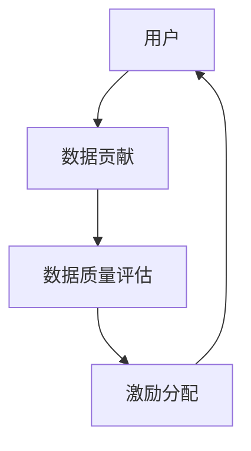

                 

**数据集众包激励:有效调动用户贡献数据的新机制**

**作者：禅与计算机程序设计艺术 / Zen and the Art of Computer Programming**

## 1. 背景介绍

在大数据时代，数据是最宝贵的资源。然而，获取高质量、多样化的数据并非易事。传统的数据采集方式成本高、效率低，难以满足当今快速发展的需求。因此，探索新的数据采集机制，有效调动用户贡献数据，成为当前的迫切需求。

## 2. 核心概念与联系

### 2.1 核心概念

- **数据集众包（Data Set Crowdsourcing）**：指动员广大用户贡献数据，共同构建数据集的过程。
- **激励机制（Incentive Mechanism）**：指鼓励用户参与数据贡献的机制，如物质激励、声誉激励等。
- **数据质量（Data Quality）**：指数据的准确性、完整性、一致性、时效性等特性。

### 2.2 核心概念联系

数据集众包激励机制的核心在于建立用户贡献数据与激励之间的联系。高质量的数据贡献应得到相应的激励，从而鼓励更多用户参与，构建高质量的数据集。



## 3. 核心算法原理 & 具体操作步骤

### 3.1 算法原理概述

数据集众包激励机制的核心算法旨在评估用户贡献的数据质量，并根据评估结果分配激励。算法原理包括数据质量评估模型和激励分配函数。

### 3.2 算法步骤详解

1. **数据收集**：收集用户贡献的数据。
2. **数据预处理**：清洗、转换数据，提高数据质量。
3. **数据质量评估**：使用数据质量评估模型评估数据质量。
4. **激励分配**：根据数据质量评估结果，使用激励分配函数分配激励。
5. **激励反馈**：将激励反馈给用户，鼓励其继续贡献高质量数据。

### 3.3 算法优缺点

**优点**：能够有效调动用户贡献数据，构建高质量的数据集。

**缺点**：数据质量评估模型和激励分配函数的设计复杂，需要大量实验数据调优。

### 3.4 算法应用领域

数据集众包激励机制可应用于各种需要构建高质量数据集的领域，如地理信息系统、交通信息系统、气象信息系统等。

## 4. 数学模型和公式 & 详细讲解 & 举例说明

### 4.1 数学模型构建

设用户集为 $U = \{u_1, u_2,..., u_n\}$, 数据集为 $D = \{d_1, d_2,..., d_m\}$, 数据质量评估函数为 $Q(d)$, 激励分配函数为 $R(d, Q(d))$.

### 4.2 公式推导过程

数据质量评估函数 $Q(d)$ 可以使用各种指标构建，如准确性、完整性、一致性等。激励分配函数 $R(d, Q(d))$ 可以使用线性函数、指数函数等构建。

### 4.3 案例分析与讲解

例如，在交通信息系统中，数据质量评估函数 $Q(d)$ 可以使用路况准确性、更新频率等指标构建。激励分配函数 $R(d, Q(d))$ 可以使用线性函数 $R(d, Q(d)) = a \cdot Q(d)$, 其中 $a$ 是激励系数。

## 5. 项目实践：代码实例和详细解释说明

### 5.1 开发环境搭建

本项目使用 Python 语言开发，需要安装 NumPy、Pandas、Scikit-learn 等库。

### 5.2 源代码详细实现

```python
import numpy as np
import pandas as pd
from sklearn.model_selection import train_test_split

# 数据质量评估函数
def data_quality(d):
    # 计算数据准确性、完整性等指标
    # 返回数据质量评分
    pass

# 激励分配函数
def reward(d, q):
    # 根据数据质量评分分配激励
    # 返回激励值
    pass

# 数据集
data = pd.read_csv('data.csv')

# 数据预处理
data = data_preprocess(data)

# 数据质量评估
data['quality'] = data.apply(data_quality, axis=1)

# 激励分配
data['reward'] = data.apply(lambda d: reward(d, data_quality(d)), axis=1)

# 激励反馈
data['reward'].plot(kind='hist')
```

### 5.3 代码解读与分析

代码首先导入必要的库，然后定义数据质量评估函数和激励分配函数。之后，读取数据，进行预处理，评估数据质量，分配激励，并绘制激励分布图。

### 5.4 运行结果展示

激励分布图展示了用户贡献数据的激励情况，可以帮助我们调整激励分配函数，鼓励用户贡献更多高质量数据。

## 6. 实际应用场景

### 6.1 当前应用

数据集众包激励机制已应用于各种领域，如 Waze、Google Map 等交通信息系统，Ushahidi、CrisisNET 等灾难信息系统。

### 6.2 未来应用展望

未来，数据集众包激励机制将会应用于更多领域，如智慧城市、物联网等。此外，区块链技术的发展也将为数据集众包激励机制带来新的机遇。

## 7. 工具和资源推荐

### 7.1 学习资源推荐

- 书籍：《数据挖掘》《大数据》《区块链技术与应用》
- 课程：Coursera《数据挖掘》《大数据》《区块链技术与应用》

### 7.2 开发工具推荐

- 编程语言：Python
- 开发环境：Jupyter Notebook、PyCharm
- 数据库：MySQL、MongoDB

### 7.3 相关论文推荐

- [Crowdsourcing Geographic Information: A Survey](https://ieeexplore.ieee.org/document/7045464)
- [Blockchain-based Incentive Mechanism for Crowdsourcing Systems](https://ieeexplore.ieee.org/document/8454445)

## 8. 总结：未来发展趋势与挑战

### 8.1 研究成果总结

数据集众包激励机制能够有效调动用户贡献数据，构建高质量的数据集。然而，数据质量评估模型和激励分配函数的设计复杂，需要大量实验数据调优。

### 8.2 未来发展趋势

未来，数据集众包激励机制将会应用于更多领域，并与区块链技术结合，构建更加安全、透明的数据贡献机制。

### 8.3 面临的挑战

数据集众包激励机制面临的挑战包括数据质量评估模型的设计复杂性、激励分配函数的调优难度、用户参与度的提高等。

### 8.4 研究展望

未来的研究方向包括数据质量评估模型的优化、激励分配函数的自动调优、区块链技术在数据集众包激励机制中的应用等。

## 9. 附录：常见问题与解答

**Q1：数据集众包激励机制与传统数据采集方式有何不同？**

**A1：数据集众包激励机制动员广大用户贡献数据，构建数据集，而传统数据采集方式成本高、效率低，难以满足当今快速发展的需求。**

**Q2：数据质量评估模型和激励分配函数的设计复杂，如何解决？**

**A2：可以使用机器学习技术构建数据质量评估模型，使用动态调优技术优化激励分配函数。**

**Q3：数据集众包激励机制的未来发展趋势是什么？**

**A3：数据集众包激励机制将会应用于更多领域，并与区块链技术结合，构建更加安全、透明的数据贡献机制。**

**作者：禅与计算机程序设计艺术 / Zen and the Art of Computer Programming**

