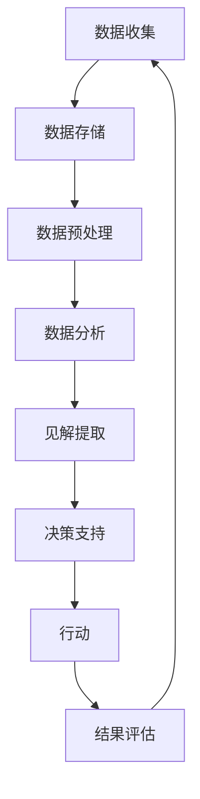

                 

**数据驱动：如何利用数据进行创新和发展？**

**作者：禅与计算机程序设计艺术 / Zen and the Art of Computer Programming**

## 1. 背景介绍

在当今信息爆炸的时代，数据无处不在。从社交媒体到物联网，从商业交易到卫星遥感，数据以各种形式被创造、收集和存储。然而，数据本身并没有价值，真正有价值的是我们从数据中提取的见解和洞察。数据驱动决策和创新是当今商业和技术的关键，本文将探讨如何利用数据进行创新和发展。

## 2. 核心概念与联系

### 2.1 数据驱动的定义

数据驱动（Data-Driven）是指将数据作为决策的基础，通过分析和理解数据来指导行动和创新。它强调从数据中提取见解，而不是仅仅基于直觉或经验做出决策。

### 2.2 数据驱动的架构

数据驱动的架构可以用下面的 Mermaid 流程图表示：



## 3. 核心算法原理 & 具体操作步骤

### 3.1 算法原理概述

数据驱动的核心是数据分析，这涉及到各种算法，如统计分析、机器学习、数据挖掘等。这些算法的目的是从数据中提取见解和模式。

### 3.2 算法步骤详解

1. **数据收集**：收集相关的数据。数据可以来自各种来源，如数据库、API、文件等。
2. **数据预处理**：清洗、转换和整理数据，以便于分析。这包括处理缺失值、异常值、数据格式不一致等问题。
3. **数据分析**：使用统计分析、机器学习等方法对数据进行分析，以提取见解和模式。
4. **见解提取**：将分析结果转化为可以理解和应用的见解。
5. **决策支持**：将见解应用于决策过程，指导行动。
6. **行动**：基于数据驱动的决策采取行动。
7. **结果评估**：评估行动的结果，并根据需要调整决策过程。

### 3.3 算法优缺点

**优点**：

- 客观：数据驱动决策基于客观事实，而不是主观臆断。
- 精确：数据分析可以提供准确的见解和预测。
- 可量化：数据驱动决策可以量化结果，并跟踪进度。

**缺点**：

- 依赖数据质量：数据驱动决策的有效性取决于数据的质量和完整性。
- 复杂性：数据分析和建模过程可能很复杂，需要专门的技能和工具。
- 解释性：数据驱动决策可能难以解释，特别是当涉及到复杂的机器学习模型时。

### 3.4 算法应用领域

数据驱动决策在各个领域都有应用，包括商业、科学研究、政府决策等。例如，商业可以使用数据驱动决策来优化营销策略、改进产品设计、提高运营效率等；科学研究可以使用数据驱动决策来发现新的模式和关系；政府可以使用数据驱动决策来改进政策、提高服务质量等。

## 4. 数学模型和公式 & 详细讲解 & 举例说明

### 4.1 数学模型构建

数据分析常常涉及到构建数学模型。例如，回归分析是一种常用的数据分析技术，它构建了一个线性方程来描述因变量和自变量之间的关系。

### 4.2 公式推导过程

回归分析的公式推导过程如下：

给定一组数据 $(x_1, y_1), (x_2, y_2), \ldots, (x_n, y_n)$, 我们的目标是找到一条直线 $y = ax + b$ 来拟合这些数据。我们可以使用最小平方法来找到这条直线。最小平方法的目标是最小化误差平方和：

$$S = \sum_{i=1}^{n} (y_i - (ax_i + b))^2$$

通过对 $a$ 和 $b$ 求导并设置为零，我们可以找到 $a$ 和 $b$ 的值：

$$a = \frac{n\sum_{i=1}^{n} x_iy_i - \sum_{i=1}^{n} x_i\sum_{i=1}^{n} y_i}{n\sum_{i=1}^{n} x_i^2 - (\sum_{i=1}^{n} x_i)^2}$$

$$b = \frac{\sum_{i=1}^{n} y_i - a\sum_{i=1}^{n} x_i}{n}$$

### 4.3 案例分析与讲解

例如，假设我们想要预测销售量与广告支出之间的关系。我们收集了一组数据：

| 广告支出 ($) | 销售量 (单位) |
| --- | --- |
| 1000 | 500 |
| 2000 | 800 |
| 3000 | 1100 |
| 4000 | 1400 |
| 5000 | 1700 |

我们可以使用回归分析来构建一个模型来预测销售量。使用上面推导的公式，我们可以找到 $a$ 和 $b$ 的值，并构建模型 $y = 200x - 100$。这个模型可以用来预测给定广告支出下的销售量。

## 5. 项目实践：代码实例和详细解释说明

### 5.1 开发环境搭建

要进行数据分析，我们需要一个开发环境。推荐使用 Python 编程语言，因为它有丰富的数据分析库，如 Pandas、NumPy、Matplotlib、Scikit-learn 等。我们还需要一个集成开发环境（IDE），如 Jupyter Notebook、PyCharm、Visual Studio Code 等。

### 5.2 源代码详细实现

以下是使用 Python 和 Scikit-learn 进行回归分析的示例代码：

```python
import numpy as np
from sklearn.linear_model import LinearRegression

# 数据
X = np.array([1000, 2000, 3000, 4000, 5000]).reshape(-1, 1)
y = np.array([500, 800, 1100, 1400, 1700])

# 创建模型
model = LinearRegression()

# 拟合模型
model.fit(X, y)

# 预测
y_pred = model.predict(X)

# 打印系数和常数项
print("Coefficients:", model.coef_)
print("Intercept:", model.intercept_)
```

### 5.3 代码解读与分析

这段代码使用 Scikit-learn 的 `LinearRegression` 类来拟合回归模型。我们首先导入所需的库，然后定义我们的数据。注意，我们需要将数据转换为 NumPy 数组，并将 X 数据reshape 为列向量。然后，我们创建一个 `LinearRegression` 对象，并使用 `fit` 方法拟合模型。最后，我们使用 `predict` 方法进行预测，并打印系数和常数项。

### 5.4 运行结果展示

运行这段代码后，我们会得到系数 $a = 200$ 和常数项 $b = -100$，这与我们手动推导的结果一致。我们还可以使用 `y_pred` 来预测给定广告支出下的销售量。

## 6. 实际应用场景

### 6.1 当前应用

数据驱动决策在各个领域都有广泛的应用。例如，在商业领域，数据驱动决策可以用于市场分析、客户细分、产品推荐等；在科学研究领域，数据驱动决策可以用于发现新的模式和关系；在政府领域，数据驱动决策可以用于政策制定、服务改进等。

### 6.2 未来应用展望

随着数据的爆炸式增长和技术的发展，数据驱动决策的应用将会越来越广泛。未来，数据驱动决策将会更加自动化和实时，并会涉及到更复杂的数据和模型。此外，数据驱动决策将会更加注重解释性，以帮助决策者理解模型的结果。

## 7. 工具和资源推荐

### 7.1 学习资源推荐

- **书籍**：推荐阅读 "Python for Data Analysis" 由 Wes McKinney 所著，以及 "Hands-On Machine Learning with Scikit-Learn, Keras, and TensorFlow" 由 Aurélien Géron 所著。
- **在线课程**：推荐 Coursera 上的 "Data Science Specialization" 由 Johns Hopkins University 所提供，以及 edX 上的 "Introduction to Data Science" 由 Microsoft 所提供。
- **博客**：推荐 KDnuggets（<https://www.kdnuggets.com/>）、Towards Data Science（<https://towardsdatascience.com/>）和Data Science Central（<https://www.datasciencecentral.com/>）等博客。

### 7.2 开发工具推荐

- **编程语言**：推荐使用 Python、R 等。
- **IDE**：推荐使用 Jupyter Notebook、PyCharm、Visual Studio Code 等。
- **数据库**：推荐使用 PostgreSQL、MySQL、MongoDB 等。
- **数据分析库**：推荐使用 Pandas、NumPy、Matplotlib、Scikit-learn 等。

### 7.3 相关论文推荐

- **统计学习理论基础**：推荐阅读 "The Elements of Statistical Learning" 由 Trevor Hastie、Robert Tibshirani 和 Jerome Friedman 所著。
- **机器学习算法**：推荐阅读 "Pattern Recognition and Machine Learning" 由 Christopher M. Bishop 所著。
- **数据挖掘**：推荐阅读 "Data Mining: Concepts and Techniques" 由 Han、Kamber 和 Pei 所著。

## 8. 总结：未来发展趋势与挑战

### 8.1 研究成果总结

数据驱动决策是一种有效的方法，可以帮助我们从数据中提取见解和洞察，指导决策和创新。本文介绍了数据驱动决策的原理、算法、数学模型和实践，并提供了相关工具和资源的推荐。

### 8.2 未来发展趋势

未来，数据驱动决策将会更加自动化和实时，并会涉及到更复杂的数据和模型。此外，数据驱动决策将会更加注重解释性，以帮助决策者理解模型的结果。同时，数据驱动决策将会更加注重隐私和安全，以保护数据和个人信息。

### 8.3 面临的挑战

数据驱动决策面临的挑战包括数据质量问题、模型复杂性、解释性问题、隐私和安全问题等。此外，数据驱动决策需要专门的技能和工具，这可能会限制其应用。

### 8.4 研究展望

未来的研究将会关注数据驱动决策的自动化和实时性，模型的解释性，隐私和安全问题，以及数据驱动决策的应用扩展等领域。

## 9. 附录：常见问题与解答

**Q1：数据驱动决策和人工智能有什么区别？**

A1：数据驱动决策和人工智能都是利用数据和算法做出决策，但它们的侧重点不同。数据驱动决策侧重于从数据中提取见解和洞察，指导决策和创新；而人工智能侧重于模仿人类智能，进行学习、推理和决策。

**Q2：数据驱动决策需要什么样的技能？**

A2：数据驱动决策需要统计学、编程（如 Python、R）、数据库、数据分析和可视化等技能。此外，还需要对业务和数据有深入的理解。

**Q3：数据驱动决策的数据从哪里来？**

A3：数据驱动决策的数据可以来自各种来源，如数据库、API、文件、社交媒体等。数据的种类包括结构化数据（如关系型数据库）、半结构化数据（如 JSON、XML）和非结构化数据（如文本、图像、音频）等。

**Q4：数据驱动决策的优势是什么？**

A4：数据驱动决策的优势包括客观性、精确性、可量化性、创新性和竞争优势等。它可以帮助我们做出更明智的决策，发现新的机会和模式，并提高效率和效果。

**Q5：数据驱动决策的挑战是什么？**

A5：数据驱动决策的挑战包括数据质量问题、模型复杂性、解释性问题、隐私和安全问题等。此外，数据驱动决策需要专门的技能和工具，这可能会限制其应用。

**Q6：如何开始数据驱动决策？**

A6：开始数据驱动决策的第一步是收集数据。然后，需要对数据进行预处理，如清洗、转换和整理。接下来，使用统计分析、机器学习等方法对数据进行分析，提取见解和模式。最后，将见解应用于决策过程，指导行动。

**Q7：数据驱动决策的未来是什么？**

A7：数据驱动决策的未来将会更加自动化和实时，并会涉及到更复杂的数据和模型。此外，数据驱动决策将会更加注重解释性，以帮助决策者理解模型的结果。同时，数据驱动决策将会更加注重隐私和安全，以保护数据和个人信息。

**Q8：如何评估数据驱动决策的结果？**

A8：评估数据驱动决策的结果需要量化指标，如精确度、召回率、准确率、F1 分数等。此外，还需要评估决策的影响，如销售额增长、成本节省、客户满意度等。

**Q9：数据驱动决策和人类判断有什么关系？**

A9：数据驱动决策和人类判断并不互斥，而是互补的。数据驱动决策可以提供客观的见解和洞察，帮助人类判断做出更明智的决策。同时，人类判断可以提供主观的见解和洞察，帮助数据驱动决策避免片面和偏见。

**Q10：如何平衡数据驱动决策和伦理考虑？**

A10：平衡数据驱动决策和伦理考虑需要考虑数据的合法性、透明度、公平性和隐私等因素。数据驱动决策应该遵循伦理准则，尊重个人隐私和数据主权，并考虑决策的道德和社会影响。

## 结束语

数据驱动决策是一种有效的方法，可以帮助我们从数据中提取见解和洞察，指导决策和创新。它涉及到数据收集、预处理、分析、见解提取、决策支持和行动等步骤。数据驱动决策需要专门的技能和工具，并面临数据质量问题、模型复杂性、解释性问题、隐私和安全问题等挑战。未来，数据驱动决策将会更加自动化和实时，并会涉及到更复杂的数据和模型。数据驱动决策的未来充满机遇和挑战，需要我们不断学习和创新。

**作者：禅与计算机程序设计艺术 / Zen and the Art of Computer Programming**

