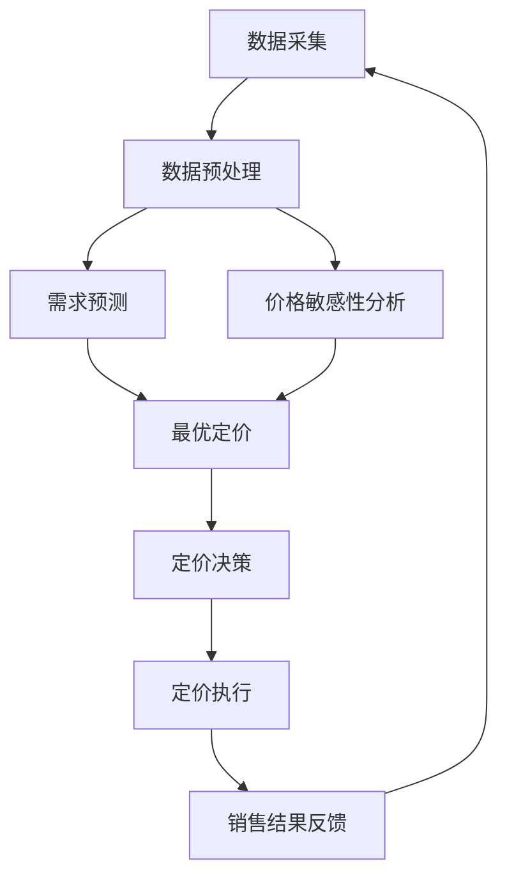

                 

**智能定价技术在电商中的创新应用**

**作者：禅与计算机程序设计艺术 / Zen and the Art of Computer Programming**

## 1. 背景介绍

在电商快速发展的今天，定价策略对商家的盈利能力和市场竞争力至关重要。传统的定价策略往往基于经验和直觉，难以适应市场的快速变化。智能定价技术的应用为电商提供了新的机遇，通过数据驱动和算法智能，实现动态定价和个性化定价，提高定价的精确性和灵活性。

## 2. 核心概念与联系

智能定价技术的核心是利用机器学习算法和大数据分析，预测商品的需求和价格敏感性，从而制定最优定价策略。其核心概念包括：

- **需求预测**：预测商品在未来某一时段的需求量。
- **价格敏感性分析**：分析消费者对价格变化的反应，评估价格变化对需求的影响。
- **最优定价**：基于需求预测和价格敏感性分析，制定最能提高利润的定价策略。

下图是智能定价技术的架构流程图：



## 3. 核心算法原理 & 具体操作步骤

### 3.1 算法原理概述

智能定价技术的核心算法是回归分析和机器学习算法，常用的算法包括线性回归、逻辑回归、决策树、随机森林、神经网络等。

### 3.2 算法步骤详解

1. **数据采集**：收集商品的销量、价格、特征等数据，如商品类别、属性、上架时间、销售渠道等。
2. **数据预处理**：清洗数据，处理缺失值，特征工程，如one-hot编码、标准化等。
3. **需求预测**：使用回归分析或机器学习算法预测商品的需求量。
4. **价格敏感性分析**：使用回归分析或机器学习算法分析价格变化对需求的影响。
5. **最优定价**：基于需求预测和价格敏感性分析，使用线性规划或动态规划算法制定最优定价策略。
6. **定价决策**：根据最优定价策略，制定具体的定价方案。
7. **定价执行**：将定价方案应用于电商平台。
8. **销售结果反馈**：收集销售结果，更新数据，重新训练模型。

### 3.3 算法优缺点

**优点**：

- 精确性高：通过数据驱动，提高定价的精确性。
- 灵活性强：动态定价和个性化定价，适应市场变化。
- 自动化：减少人工干预，提高效率。

**缺点**：

- 数据依赖：算法的有效性取决于数据的质量和量。
- 复杂性高：算法实现和维护的复杂性高。
- 解释性差：机器学习模型的解释性差，难以理解模型的决策过程。

### 3.4 算法应用领域

智能定价技术在电商、旅游、酒店、交通等行业有广泛应用。例如，电商平台可以根据商品的销量和价格敏感性，动态调整商品价格；旅游平台可以根据客房的预订情况和价格敏感性，实现动态定价。

## 4. 数学模型和公式 & 详细讲解 & 举例说明

### 4.1 数学模型构建

需求预测和价格敏感性分析的数学模型通常是回归模型。设商品的需求量为$y$, 价格为$x_1$, 其他特征为$x_2, x_3,..., x_n$, 则回归模型为：

$$y = f(x_1, x_2,..., x_n) + \epsilon$$

其中，$f$是回归函数，$epsilon$是误差项。

### 4.2 公式推导过程

例如，使用线性回归模型预测商品的需求量，则回归函数为：

$$y = \beta_0 + \beta_1x_1 + \beta_2x_2 +... + \beta_nx_n$$

其中，$\beta_0, \beta_1,..., \beta_n$是回归系数，可以通过最小二乘法估计。

### 4.3 案例分析与讲解

假设某电商平台销售iphone手机，通过回归分析发现，iphone的需求量与价格、上架时间、商品类别等特征有关。设iphone的需求量为$y$, 价格为$x_1$, 上架时间为$x_2$, 商品类别为$x_3$, 则回归模型为：

$$y = \beta_0 + \beta_1x_1 + \beta_2x_2 + \beta_3x_3 + \epsilon$$

通过回归分析，得到回归系数$\beta_0 = 100, \beta_1 = -10, \beta_2 = 5, \beta_3 = 20$. 当iphone的价格为$1000, 上架时间为1天, 商品类别为手机时，预测的需求量为：

$$y = 100 - 10 \times 1000 + 5 \times 1 + 20 \times 1 = 15$$

即预测iphone的需求量为15台。

## 5. 项目实践：代码实例和详细解释说明

### 5.1 开发环境搭建

智能定价技术的开发环境包括数据库、数据处理工具、机器学习库等。常用的开发环境包括：

- 数据库：MySQL、PostgreSQL、MongoDB等。
- 数据处理工具：Pandas、NumPy等。
- 机器学习库：Scikit-learn、TensorFlow、PyTorch等。

### 5.2 源代码详细实现

以下是使用Python和Scikit-learn实现智能定价技术的示例代码：

```python
import pandas as pd
from sklearn.model_selection import train_test_split
from sklearn.linear_model import LinearRegression
from sklearn.metrics import mean_squared_error

# 加载数据
data = pd.read_csv('data.csv')

# 数据预处理
X = data[['price', 'time', 'category']]
y = data['demand']

# 划分训练集和测试集
X_train, X_test, y_train, y_test = train_test_split(X, y, test_size=0.2, random_state=42)

# 训练模型
model = LinearRegression()
model.fit(X_train, y_train)

# 预测需求量
y_pred = model.predict(X_test)

# 评估模型
mse = mean_squared_error(y_test, y_pred)
print('Mean Squared Error:', mse)
```

### 5.3 代码解读与分析

代码首先加载数据，然后进行数据预处理，将数据分为特征和目标变量。之后，代码使用训练集训练线性回归模型，并使用测试集预测需求量。最后，代码使用均方误差评估模型的性能。

### 5.4 运行结果展示

运行结果展示了模型的均方误差，该指标越小，模型的性能越好。

## 6. 实际应用场景

智能定价技术在电商中的实际应用场景包括：

### 6.1 价格敏感性分析

电商平台可以通过智能定价技术分析消费者对价格变化的反应，评估价格变化对需求的影响，从而制定最优定价策略。

### 6.2 动态定价

电商平台可以根据商品的销量和价格敏感性，动态调整商品价格，实现动态定价。

### 6.3 个性化定价

电商平台可以根据消费者的购买历史和偏好，实现个性化定价，提高定价的针对性和有效性。

### 6.4 未来应用展望

未来，智能定价技术将与人工智能、大数据、物联网等技术结合，实现更加智能化和个性化的定价策略。例如，智能定价技术将与物联网结合，实现基于物联网的动态定价；智能定价技术将与人工智能结合，实现基于人工智能的个性化定价。

## 7. 工具和资源推荐

### 7.1 学习资源推荐

- **书籍**：《机器学习》《统计学习方法》《数据挖掘导论》等。
- **在线课程**：Coursera、Udacity、edX等平台上的机器学习和数据挖掘课程。
- **博客**：KDnuggets、Towards Data Science、Medium等技术博客。

### 7.2 开发工具推荐

- **编程语言**：Python、R等。
- **机器学习库**：Scikit-learn、TensorFlow、PyTorch等。
- **数据处理工具**：Pandas、NumPy、Spark等。
- **数据库**：MySQL、PostgreSQL、MongoDB等。

### 7.3 相关论文推荐

- [Dynamic Pricing with Machine Learning](https://arxiv.org/abs/1806.05520)
- [Personalized Pricing with Reinforcement Learning](https://arxiv.org/abs/1803.01859)
- [A Survey of Pricing Optimization in E-commerce](https://ieeexplore.ieee.org/document/8454636)

## 8. 总结：未来发展趋势与挑战

### 8.1 研究成果总结

智能定价技术在电商中的应用取得了显著成果，提高了定价的精确性和灵活性，提高了电商平台的盈利能力和市场竞争力。

### 8.2 未来发展趋势

未来，智能定价技术将与人工智能、大数据、物联网等技术结合，实现更加智能化和个性化的定价策略。此外，智能定价技术将与区块链技术结合，实现基于区块链的智能定价。

### 8.3 面临的挑战

智能定价技术面临的挑战包括：

- **数据质量**：智能定价技术的有效性取决于数据的质量和量。
- **模型解释性**：机器学习模型的解释性差，难以理解模型的决策过程。
- **道德和伦理**：智能定价技术可能导致价格歧视和不公平，需要考虑道德和伦理问题。

### 8.4 研究展望

未来的研究方向包括：

- **模型解释性**：提高机器学习模型的解释性，使模型的决策过程更易于理解。
- **动态定价**：研究动态定价的新方法，实现更加智能化和个性化的定价策略。
- **区块链技术**：研究基于区块链的智能定价技术，实现更加安全和透明的定价过程。

## 9. 附录：常见问题与解答

**Q1：智能定价技术的优点是什么？**

**A1：智能定价技术的优点包括精确性高、灵活性强、自动化等。**

**Q2：智能定价技术的缺点是什么？**

**A2：智能定价技术的缺点包括数据依赖、复杂性高、解释性差等。**

**Q3：智能定价技术在哪些行业有应用？**

**A3：智能定价技术在电商、旅游、酒店、交通等行业有广泛应用。**

**Q4：智能定价技术的未来发展趋势是什么？**

**A4：未来，智能定价技术将与人工智能、大数据、物联网等技术结合，实现更加智能化和个性化的定价策略。此外，智能定价技术将与区块链技术结合，实现基于区块链的智能定价。**

**Q5：智能定价技术面临的挑战是什么？**

**A5：智能定价技术面临的挑战包括数据质量、模型解释性、道德和伦理等。**

**Q6：未来的研究方向是什么？**

**A6：未来的研究方向包括模型解释性、动态定价、区块链技术等。**

**Q7：如何实现智能定价技术？**

**A7：智能定价技术的实现包括数据采集、数据预处理、需求预测、价格敏感性分析、最优定价、定价决策、定价执行、销售结果反馈等步骤。**

**Q8：智能定价技术的核心算法是什么？**

**A8：智能定价技术的核心算法是回归分析和机器学习算法，常用的算法包括线性回归、逻辑回归、决策树、随机森林、神经网络等。**

**Q9：智能定价技术的数学模型是什么？**

**A9：智能定价技术的数学模型通常是回归模型，设商品的需求量为$y$, 价格为$x_1$, 其他特征为$x_2, x_3,..., x_n$, 则回归模型为：$y = f(x_1, x_2,..., x_n) + \epsilon$, 其中，$f$是回归函数，$epsilon$是误差项。**

**Q10：如何评估智能定价技术的性能？**

**A10：评估智能定价技术的性能可以使用均方误差、R平方等指标。**

**Q11：智能定价技术的学习资源是什么？**

**A11：智能定价技术的学习资源包括书籍、在线课程、博客等。**

**Q12：智能定价技术的开发工具是什么？**

**A12：智能定价技术的开发工具包括编程语言、机器学习库、数据处理工具、数据库等。**

**Q13：智能定价技术的相关论文是什么？**

**A13：智能定价技术的相关论文包括Dynamic Pricing with Machine Learning、Personalized Pricing with Reinforcement Learning、A Survey of Pricing Optimization in E-commerce等。**

**Q14：智能定价技术的实际应用场景是什么？**

**A14：智能定价技术的实际应用场景包括价格敏感性分析、动态定价、个性化定价等。**

**Q15：智能定价技术的研究成果是什么？**

**A15：智能定价技术的研究成果包括提高定价的精确性和灵活性，提高电商平台的盈利能力和市场竞争力等。**

**Q16：智能定价技术的未来发展趋势是什么？**

**A16：未来，智能定价技术将与人工智能、大数据、物联网等技术结合，实现更加智能化和个性化的定价策略。此外，智能定价技术将与区块链技术结合，实现基于区块链的智能定价。**

**Q17：智能定价技术面临的挑战是什么？**

**A17：智能定价技术面临的挑战包括数据质量、模型解释性、道德和伦理等。**

**Q18：未来的研究方向是什么？**

**A18：未来的研究方向包括模型解释性、动态定价、区块链技术等。**

**Q19：如何实现智能定价技术的项目？**

**A19：智能定价技术的项目实现包括开发环境搭建、源代码详细实现、代码解读与分析、运行结果展示等步骤。**

**Q20：智能定价技术的核心概念是什么？**

**A20：智能定价技术的核心概念包括需求预测、价格敏感性分析、最优定价等。**

**Q21：智能定价技术的架构流程图是什么？**

**A21：智能定价技术的架构流程图包括数据采集、数据预处理、需求预测、价格敏感性分析、最优定价、定价决策、定价执行、销售结果反馈等步骤。**

**Q22：智能定价技术的关键词是什么？**

**A22：智能定价技术的关键词包括需求预测、价格敏感性分析、最优定价、动态定价、个性化定价等。**

**Q23：智能定价技术的优缺点是什么？**

**A23：智能定价技术的优点包括精确性高、灵活性强、自动化等；缺点包括数据依赖、复杂性高、解释性差等。**

**Q24：智能定价技术的应用领域是什么？**

**A24：智能定价技术的应用领域包括电商、旅游、酒店、交通等。**

**Q25：智能定价技术的数学模型和公式是什么？**

**A25：智能定价技术的数学模型和公式包括回归模型、线性回归模型等。**

**Q26：智能定价技术的项目实践包括哪些内容？**

**A26：智能定价技术的项目实践包括开发环境搭建、源代码详细实现、代码解读与分析、运行结果展示等。**

**Q27：智能定价技术的实际应用场景包括哪些内容？**

**A27：智能定价技术的实际应用场景包括价格敏感性分析、动态定价、个性化定价等。**

**Q28：智能定价技术的未来发展趋势是什么？**

**A28：未来，智能定价技术将与人工智能、大数据、物联网等技术结合，实现更加智能化和个性化的定价策略。此外，智能定价技术将与区块链技术结合，实现基于区块链的智能定价。**

**Q29：智能定价技术面临的挑战是什么？**

**A29：智能定价技术面临的挑战包括数据质量、模型解释性、道德和伦理等。**

**Q30：未来的研究方向是什么？**

**A30：未来的研究方向包括模型解释性、动态定价、区块链技术等。**

**Q31：智能定价技术的研究成果是什么？**

**A31：智能定价技术的研究成果包括提高定价的精确性和灵活性，提高电商平台的盈利能力和市场竞争力等。**

**Q32：智能定价技术的学习资源包括哪些内容？**

**A32：智能定价技术的学习资源包括书籍、在线课程、博客等。**

**Q33：智能定价技术的开发工具包括哪些内容？**

**A33：智能定价技术的开发工具包括编程语言、机器学习库、数据处理工具、数据库等。**

**Q34：智能定价技术的相关论文包括哪些内容？**

**A34：智能定价技术的相关论文包括Dynamic Pricing with Machine Learning、Personalized Pricing with Reinforcement Learning、A Survey of Pricing Optimization in E-commerce等。**

**Q35：智能定价技术的核心算法是什么？**

**A35：智能定价技术的核心算法是回归分析和机器学习算法，常用的算法包括线性回归、逻辑回归、决策树、随机森林、神经网络等。**

**Q36：智能定价技术的数学模型和公式是什么？**

**A36：智能定价技术的数学模型和公式包括回归模型、线性回归模型等。**

**Q37：智能定价技术的项目实践包括哪些内容？**

**A37：智能定价技术的项目实践包括开发环境搭建、源代码详细实现、代码解读与分析、运行结果展示等。**

**Q38：智能定价技术的实际应用场景包括哪些内容？**

**A38：智能定价技术的实际应用场景包括价格敏感性分析、动态定价、个性化定价等。**

**Q39：智能定价技术的未来发展趋势是什么？**

**A39：未来，智能定价技术将与人工智能、大数据、物联网等技术结合，实现更加智能化和个性化的定价策略。此外，智能定价技术将与区块链技术结合，实现基于区块链的智能定价。**

**Q40：智能定价技术面临的挑战是什么？**

**A40：智能定价技术面临的挑战包括数据质量、模型解释性、道德和伦理等。**

**Q41：未来的研究方向是什么？**

**A41：未来的研究方向包括模型解释性、动态定价、区块链技术等。**

**Q42：智能定价技术的研究成果是什么？**

**A42：智能定价技术的研究成果包括提高定价的精确性和灵活性，提高电商平台的盈利能力和市场竞争力等。**

**Q43：智能定价技术的学习资源包括哪些内容？**

**A43：智能定价技术的学习资源包括书籍、在线课程、博客等。**

**Q44：智能定价技术的开发工具包括哪些内容？**

**A44：智能定价技术的开发工具包括编程语言、机器学习库、数据处理工具、数据库等。**

**Q45：智能定价技术的相关论文包括哪些内容？**

**A45：智能定价技术的相关论文包括Dynamic Pricing with Machine Learning、Personalized Pricing with Reinforcement Learning、A Survey of Pricing Optimization in E-commerce等。**

**Q46：智能定价技术的核心概念是什么？**

**A46：智能定价技术的核心概念包括需求预测、价格敏感性分析、最优定价等。**

**Q47：智能定价技术的架构流程图是什么？**

**A47：智能定价技术的架构流程图包括数据采集、数据预处理、需求预测、价格敏感性分析、最优定价、定价决策、定价执行、销售结果反馈等步骤。**

**Q48：智能定价技术的关键词是什么？**

**A48：智能定价技术的关键词包括需求预测、价格敏感性分析、最优定价、动态定价、个性化定价等。**

**Q49：智能定价技术的优缺点是什么？**

**A49：智能定价技术的优点包括精确性高、灵活性强、自动化等；缺点包括数据依赖、复杂性高、解释性差等。**

**Q50：智能定价技术的应用领域是什么？**

**A50：智能定价技术的应用领域包括电商、旅游、酒店、交通等。**

**Q51：智能定价技术的数学模型和公式是什么？**

**A51：智能定价技术的数学模型和公式包括回归模型、线性回归模型等。**

**Q52：智能定价技术的项目实践包括哪些内容？**

**A52：智能定价技术的项目实践包括开发环境搭建、源代码详细实现、代码解读与分析、运行结果展示等。**

**Q53：智能定价技术的实际应用场景包括哪些内容？**

**A53：智能定价技术的实际应用场景包括价格敏感性分析、动态定价、个性化定价等。**

**Q54：智能定价技术的未来发展趋势是什么？**

**A54：未来，智能定价技术将与人工智能、大数据、物联网等技术结合，实现更加智能化和个性化的定价策略。此外，智能定价技术将与区块链技术结合，实现基于区块链的智能定价。**

**Q55：智能定价技术面临的挑战是什么？**

**A55：智能定价技术面临的挑战包括数据质量、模型解释性、道德和伦理等。**

**Q56：未来的研究方向是什么？**

**A56：未来的研究方向包括模型解释性、动态定价、区块链技术等。**

**Q57：智能定价技术的研究成果是什么？**

**A57：智能定价技术的研究成果包括提高定价的精确性和灵活性，提高电商平台的盈利能力和市场竞争力等。**

**Q58：智能定价技术的学习资源包括哪些内容？**

**A58：智能定价技术的学习资源包括书籍、在线课程、博客等。**

**Q59：智能定价技术的开发工具包括哪些内容？**

**A59：智能定价技术的开发工具包括编程语言、机器学习库、数据处理工具、数据库等。**

**Q60：智能定价技术的相关论文包括哪些内容？**

**A60：智能定价技术的相关论文包括Dynamic Pricing with Machine Learning、Personalized Pricing with Reinforcement Learning、A Survey of Pricing Optimization in E-commerce等。**

**Q61：智能定价技术的核心概念是什么？**

**A61：智能定价技术的核心概念包括需求预测、价格敏感性分析、最优定价等。**

**Q62：智能定价技术的架构流程图是什么？**

**A62：智能定价技术的架构流程图包括数据采集、数据预处理、需求预测、价格敏感性分析、最优定价、定价决策、定价执行、销售结果反馈等步骤。**

**Q63：智能定价技术的关键词是什么？**

**A63：智能定价技术的关键词包括需求预测、价格敏感性分析、最优定价、动态定价、个性化定价等。**

**Q64：智能定价技术的优缺点是什么？**

**A64：智能定价技术的优点包括精确性高、灵活性强、自动化等；缺点包括数据依赖、复杂性高、解释性差等。**

**Q65：智能定价技术的应用领域是什么？**

**A65：智能定价技术的应用领域包括电商、旅游、酒店、交通等。**

**Q66：智能定价技术的数学模型和公式是什么？**

**A66：智能定价技术的数学模型和公式包括回归模型、线性回归模型等。**

**Q67：智能定价技术的项目实践包括哪些内容？**

**A67：智能定价技术的项目实践包括开发环境搭建、源代码详细实现、代码解读与分析、运行结果展示等。**

**Q68：智能定价技术的实际应用场景包括哪些内容？**

**A68：智能定价技术的实际应用场景包括价格敏感性分析、动态定价、个性化定价等。**

**Q69：智能定价技术的未来发展趋势是什么？**

**A69：未来，智能定价技术将与人工智能、大数据、物联网等技术结合，实现更加智能化和个性化的定价策略。此外，智能定价技术将与区块链技术结合，实现基于区块链的智能定价。**

**Q70：智能定价技术面临的挑战是什么？**

**A70：智能定价技术面临的挑战包括数据质量、模型解释性、道德和伦理等。**

**Q71：未来的研究方向是什么？**

**A71：未来的研究方向包括模型解释性、动态定价、区块链技术等。**

**Q72：智能定价技术的研究成果是什么？**

**A72：智能定价技术的研究成果包括提高定价的精确性和灵活性，提高电商平台的盈利能力和市场竞争力等。**

**Q73：智能定价技术的学习资源包括哪些内容？**

**A73：智能定价技术的学习资源包括书籍、在线课程、博客等。**

**Q74：智能定价技术的开发工具包括哪些内容？**

**A74：智能定价技术的开发工具包括编程语言、机器学习库、数据处理工具、数据库等。**

**Q75：智能定价技术的相关论文包括哪些内容？**

**A75：智能定价技术的相关论文包括Dynamic Pricing with Machine Learning、Personalized Pricing with Reinforcement Learning、A Survey of Pricing Optimization in E-commerce等。**

**Q76：智能定价

