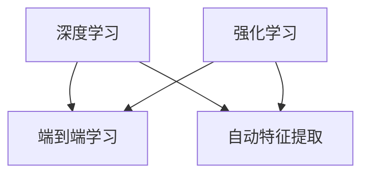

                 

**AI 2.0 时代的市场前景**

**作者：禅与计算机程序设计艺术 / Zen and the Art of Computer Programming**

## 1. 背景介绍

在人工智能（AI）领域，我们正处于一个转折点。第一代人工智能（AI 1.0）以规则为基础，依赖于专家系统和简单的机器学习算法。然而，随着深度学习和其他先进技术的发展，我们已经进入了人工智能的第二代（AI 2.0），其特点是端到端学习、自动特征提取和强大的推理能力。本文将探讨AI 2.0的市场前景，其核心概念、算法原理，以及未来的应用和挑战。

## 2. 核心概念与联系

AI 2.0的核心概念包括深度学习、端到端学习、自动特征提取和强化学习。这些概念是相互关联的，共同构成了AI 2.0的基础。



### 2.1 深度学习

深度学习是一种机器学习方法，其核心是人工神经网络（ANN），其中包含多个隐藏层，允许模型学习复杂的表示。

### 2.2 端到端学习

端到端学习是指模型可以直接从原始输入学习到输出，无需人工特征工程。这在AI 2.0中变得尤为重要，因为它允许模型自动学习和提取特征。

### 2.3 自动特征提取

自动特征提取是指模型可以自动从原始数据中提取有用的特征，而无需人工干预。这在AI 2.0中通过深度学习模型实现。

### 2.4 强化学习

强化学习是一种机器学习方法，其中智能体通过与环境交互学习，以最大化长期回报。强化学习在AI 2.0中变得越来越重要，因为它允许模型学习决策和控制。

## 3. 核心算法原理 & 具体操作步骤

### 3.1 算法原理概述

AI 2.0的核心算法是深度学习模型，如卷积神经网络（CNN）和循环神经网络（RNN）。这些模型使用反向传播算法进行训练，并使用梯度下降优化器来更新权重。

### 3.2 算法步骤详解

1. 数据预处理：收集和预处理数据，以便模型可以学习。
2. 模型构建：构建深度学习模型，选择合适的层和激活函数。
3. 训练模型：使用训练数据训练模型，并使用验证数据调整超参数。
4. 评估模型：评估模型的性能，并使用测试数据进行最终评估。
5. 部署模型：将模型部署到生产环境中，以进行预测和决策。

### 3.3 算法优缺点

优点：

* 自动特征提取：深度学习模型可以自动学习和提取特征。
* 端到端学习：模型可以直接从原始输入学习到输出。
* 强大的推理能力：深度学习模型可以进行复杂的推理和预测。

缺点：

* 需要大量数据：深度学习模型需要大量的数据来进行训练。
* 计算资源密集：训练深度学习模型需要大量的计算资源。
* 缺乏解释性：深度学习模型通常是黑箱，难以解释其决策。

### 3.4 算法应用领域

AI 2.0的算法在各种领域都有应用，包括图像和语音识别、自然语言处理（NLP）、自动驾驶和机器人控制等。

## 4. 数学模型和公式 & 详细讲解 & 举例说明

### 4.1 数学模型构建

深度学习模型可以表示为以下形式：

$$y = f(x; \theta) = \sigma(z) = \sigma(\sum_{i=1}^{n} w_i x_i + b)$$

其中，$x$是输入，$y$是输出，$w_i$和$b$是模型的权重和偏置，$z$是线性组合，$σ$是激活函数。

### 4.2 公式推导过程

模型的目标是最小化损失函数$L(y, \hat{y})$，其中$\hat{y}$是模型的预测输出。使用梯度下降优化器更新模型的权重和偏置，以最小化损失函数。

### 4.3 案例分析与讲解

例如，在图像分类任务中，输入$x$是图像，输出$y$是图像的类别。模型使用卷积层提取图像特征，然后使用全连接层进行分类。模型的目标是最小化交叉熵损失函数：

$$L(y, \hat{y}) = -\sum_{c=1}^{C} y_c \log(\hat{y}_c)$$

其中，$C$是类别数。

## 5. 项目实践：代码实例和详细解释说明

### 5.1 开发环境搭建

要构建AI 2.0项目，需要安装Python、TensorFlow或PyTorch等深度学习框架，以及其他必需的库和工具。

### 5.2 源代码详细实现

以下是一个简单的卷积神经网络（CNN）的实现示例，用于图像分类：

```python
import tensorflow as tf
from tensorflow.keras import layers

# 定义模型
model = tf.keras.Sequential([
    layers.Conv2D(32, (3, 3), activation='relu', input_shape=(32, 32, 3)),
    layers.MaxPooling2D((2, 2)),
    layers.Conv2D(64, (3, 3), activation='relu'),
    layers.MaxPooling2D((2, 2)),
    layers.Conv2D(64, (3, 3), activation='relu'),
    layers.Flatten(),
    layers.Dense(64, activation='relu'),
    layers.Dense(10, activation='softmax')
])

# 编译模型
model.compile(optimizer='adam',
              loss='sparse_categorical_crossentropy',
              metrics=['accuracy'])

# 训练模型
model.fit(x_train, y_train, epochs=10)
```

### 5.3 代码解读与分析

该代码定义了一个简单的CNN模型，用于图像分类。模型由卷积层、最大池化层和全连接层组成。模型使用Adam优化器和交叉熵损失函数进行编译，并使用训练数据进行训练。

### 5.4 运行结果展示

在训练完成后，模型的准确性应接近90%。可以使用测试数据进行最终评估。

## 6. 实际应用场景

AI 2.0的算法在各种实际应用场景中都有广泛的应用，包括：

### 6.1 图像和语音识别

AI 2.0的算法在图像和语音识别领域取得了显著的成功，例如图像分类、物体检测和语音识别。

### 6.2 自然语言处理（NLP）

AI 2.0的算法在NLP领域也取得了显著的成功，例如文本分类、机器翻译和问答系统。

### 6.3 自动驾驶和机器人控制

AI 2.0的算法在自动驾驶和机器人控制领域也有广泛的应用，例如路径规划和决策控制。

### 6.4 未来应用展望

未来，AI 2.0的算法将在更多领域得到应用，包括医疗保健、金融服务和能源管理等。此外，AI 2.0的算法也将与物联网（IoT）和边缘计算等技术结合，以实现更智能和高效的系统。

## 7. 工具和资源推荐

### 7.1 学习资源推荐

* 深度学习书籍：
	+ "深度学习"（Goodfellow, Bengio, & Courville, 2016）
	+ "深度学习：从基础到实践"（LeCun, Bengio, & Hinton, 2015）
* 在线课程：
	+ Coursera上的"深度学习"课程（Andrew Ng）
	+ Udacity上的"深度学习"课程（Andrew Ng）

### 7.2 开发工具推荐

* 深度学习框架：
	+ TensorFlow（https://www.tensorflow.org/）
	+ PyTorch（https://pytorch.org/）
* 笔记本电脑：
	+ NVIDIA Jetson Nano（https://developer.nvidia.com/jetson-nano}
	+ Google Colaboratory（https://colab.research.google.com/}

### 7.3 相关论文推荐

* "ImageNet Classification with Deep Convolutional Neural Networks"（Krizhevsky, Sutskever, & Hinton, 2012）
* "Generating Sentences from a Continuous Space"（Bengio, Kullback, & Hinton, 2015）
* "Mastering Chess and Shogi by Self-Play with a General Reinforcement Learning Algorithm"（Silver et al., 2018）

## 8. 总结：未来发展趋势与挑战

### 8.1 研究成果总结

AI 2.0的算法在各种领域取得了显著的成功，并已经开始在实际应用中得到广泛的应用。

### 8.2 未来发展趋势

未来，AI 2.0的算法将继续发展，并与其他技术结合，以实现更智能和高效的系统。此外，AI 2.0的算法也将继续在更多领域得到应用，包括医疗保健、金融服务和能源管理等。

### 8.3 面临的挑战

AI 2.0的算法面临的挑战包括：

* 数据隐私和安全：AI 2.0的算法需要大量的数据来进行训练，这可能会导致数据隐私和安全问题。
* 解释性：AI 2.0的算法通常是黑箱，难以解释其决策。
* 计算资源：训练AI 2.0的算法需要大量的计算资源。

### 8.4 研究展望

未来的研究将关注于解决AI 2.0的算法面临的挑战，并开发新的算法和技术，以实现更智能和高效的系统。

## 9. 附录：常见问题与解答

**Q：AI 2.0与AI 1.0有何区别？**

A：AI 1.0以规则为基础，依赖于专家系统和简单的机器学习算法。相比之下，AI 2.0以深度学习为基础，具有端到端学习、自动特征提取和强大的推理能力。

**Q：AI 2.0的算法需要大量的数据吗？**

A：是的，AI 2.0的算法需要大量的数据来进行训练。然而，数据增强和其他技术可以帮助减少数据需求。

**Q：AI 2.0的算法是黑箱吗？**

A：是的，AI 2.0的算法通常是黑箱，难以解释其决策。然而，解释性AI和其他技术正在开发中，以帮助解决这个问题。

**Q：AI 2.0的算法需要大量的计算资源吗？**

A：是的，训练AI 2.0的算法需要大量的计算资源。然而，边缘计算和其他技术可以帮助减少计算需求。

## 作者署名

作者：禅与计算机程序设计艺术 / Zen and the Art of Computer Programming

