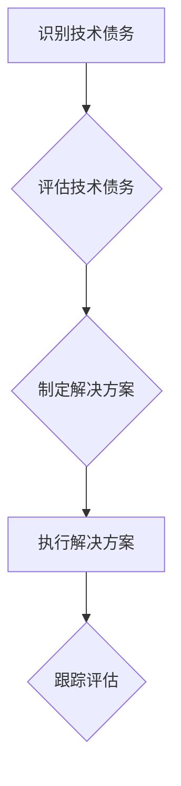

> 技术债务，软件架构，代码质量，持续交付，敏捷开发，软件维护

## 1. 背景介绍

随着软件行业的发展，软件系统越来越复杂，开发周期越来越短，对软件质量的要求也越来越高。在快速迭代的开发环境下，为了满足用户的需求和缩短开发周期，开发团队往往会做出一些“妥协”，这些妥协最终会积累成“技术债务”。

技术债务是指在软件开发过程中为了快速交付功能而做出的短期权宜之计，这些权宜之计可能会导致代码质量下降、维护成本增加、功能扩展困难等问题。

技术债务就像一个沉重的包袱，会拖累软件项目的长期发展。如果技术债务积累过多，会严重影响软件项目的质量、稳定性和可维护性，甚至导致项目失败。

## 2. 核心概念与联系

**2.1 技术债务的类型**

技术债务可以分为以下几种类型：

* **代码质量债务:** 代码结构混乱、缺乏注释、测试覆盖率低等问题。
* **架构债务:** 架构设计不合理、缺乏可扩展性、难以维护等问题。
* **功能债务:** 功能实现不完善、缺乏文档、难以理解等问题。
* **技术债务:** 使用过时技术、缺乏对新技术的学习等问题。

**2.2 技术债务的形成原因**

技术债务的形成原因多种多样，主要包括以下几个方面：

* **时间压力:** 开发团队为了赶进度，往往会选择快速实现功能，而忽略代码质量和架构设计。
* **资源限制:** 开发团队缺乏经验丰富的开发人员、测试人员和架构师，导致技术债务难以避免。
* **沟通不足:** 开发团队与产品经理、用户之间沟通不足，导致需求理解不准确，从而导致技术债务的产生。
* **技术选型错误:** 选择不合适的技术或工具，导致技术债务的积累。

**2.3 技术债务的危害**

技术债务会对软件项目造成以下危害：

* **降低软件质量:** 代码质量下降、功能缺陷增加、系统稳定性降低。
* **增加维护成本:** 代码难以理解、修改和维护，导致维护成本增加。
* **阻碍功能扩展:** 架构设计不合理、缺乏可扩展性，导致功能扩展困难。
* **影响项目进度:** 技术债务积累过多，会影响项目进度和交付时间。

**2.4 技术债务管理的重要性**

技术债务管理是软件开发过程中不可或缺的一部分。通过有效的技术债务管理，可以降低技术债务的风险，提高软件项目的质量和效率。

**2.5 技术债务管理的原则**

技术债务管理应遵循以下原则：

* **主动管理:** 不等技术债务积累到一定程度才进行管理，而是要主动识别和管理技术债务。
* **量化评估:** 对技术债务进行量化评估，以便更好地了解技术债务的规模和影响。
* **优先处理:** 根据技术债务的风险等级和影响程度，优先处理高风险、高影响的技术债务。
* **持续改进:** 不断改进技术债务管理流程，提高技术债务管理的效率和效果。

**2.6 技术债务管理的流程**

技术债务管理流程一般包括以下几个步骤：

* **识别技术债务:** 通过代码审查、架构分析、用户反馈等方式识别技术债务。
* **评估技术债务:** 对识别出的技术债务进行评估，确定其风险等级和影响程度。
* **制定解决方案:** 根据技术债务的类型和影响程度，制定相应的解决方案。
* **执行解决方案:** 将解决方案付诸实践，修复技术债务。
* **跟踪评估:** 对修复后的技术债务进行跟踪评估，确保其有效性。

**2.7 Mermaid 流程图**



## 3. 核心算法原理 & 具体操作步骤

**3.1 算法原理概述**

技术债务管理算法的核心是基于风险评估和优先级排序。通过分析代码质量、架构设计、功能实现等方面的指标，对技术债务进行量化评估，并根据风险等级和影响程度，制定相应的解决方案。

**3.2 算法步骤详解**

1. **数据收集:** 收集代码质量、架构设计、功能实现等方面的指标数据。
2. **指标计算:** 对收集到的数据进行计算，生成技术债务的量化指标。
3. **风险评估:** 根据技术债务的量化指标，评估其风险等级和影响程度。
4. **优先级排序:** 根据风险等级和影响程度，对技术债务进行优先级排序。
5. **解决方案制定:** 根据技术债务的类型和影响程度，制定相应的解决方案。
6. **解决方案执行:** 将解决方案付诸实践，修复技术债务。
7. **跟踪评估:** 对修复后的技术债务进行跟踪评估，确保其有效性。

**3.3 算法优缺点**

* **优点:**

    * 可以量化评估技术债务，以便更好地了解技术债务的规模和影响。
    * 可以根据风险等级和影响程度，优先处理高风险、高影响的技术债务。
    * 可以提高技术债务管理的效率和效果。

* **缺点:**

    * 技术债务的量化评估有一定的主观性，可能会导致评估结果不准确。
    * 算法无法解决所有类型的技术债务，例如一些隐性技术债务。

**3.4 算法应用领域**

技术债务管理算法可以应用于各种软件开发项目，例如：

* Web 应用开发
* 移动应用开发
* 企业级软件开发
* 游戏开发

## 4. 数学模型和公式 & 详细讲解 & 举例说明

**4.1 数学模型构建**

技术债务的量化评估可以使用以下数学模型：

```latex
TD = \sum_{i=1}^{n} w_i * S_i
```

其中：

* TD 表示技术债务的总量。
* $w_i$ 表示第 i 种技术债务类型的权重。
* $S_i$ 表示第 i 种技术债务类型的严重程度。
* n 表示技术债务类型的总数。

**4.2 公式推导过程**

该公式的推导过程如下：

1. 首先，需要确定技术债务的类型和权重。
2. 然后，需要对每种技术债务类型进行量化评估，确定其严重程度。
3. 最后，将每种技术债务类型的权重和严重程度相乘，并求和，得到技术债务的总量。

**4.3 案例分析与讲解**

假设我们有一个软件项目，其技术债务类型包括代码质量、架构设计和功能实现，权重分别为 0.4、0.3 和 0.3。

代码质量的严重程度为 5，架构设计的严重程度为 3，功能实现的严重程度为 2。

则该项目的技术债务总量为：

```latex
TD = 0.4 * 5 + 0.3 * 3 + 0.3 * 2 = 2 + 0.9 + 0.6 = 3.5
```

## 5. 项目实践：代码实例和详细解释说明

**5.1 开发环境搭建**

* 操作系统：Windows/macOS/Linux
* 编程语言：Python
* 开发工具：VS Code/IntelliJ IDEA

**5.2 源代码详细实现**

```python
import pandas as pd

# 定义技术债务类型和权重
debt_types = {
    "代码质量": 0.4,
    "架构设计": 0.3,
    "功能实现": 0.3
}

# 定义技术债务严重程度
debt_severity = {
    "代码质量": 5,
    "架构设计": 3,
    "功能实现": 2
}

# 计算技术债务总量
total_debt = sum([debt_types[type] * debt_severity[type] for type in debt_types])

# 打印技术债务总量
print(f"技术债务总量: {total_debt}")
```

**5.3 代码解读与分析**

* 该代码首先定义了技术债务类型和权重，以及技术债务的严重程度。
* 然后，使用列表推导式计算技术债务总量。
* 最后，打印技术债务总量。

**5.4 运行结果展示**

```
技术债务总量: 3.5
```

## 6. 实际应用场景

**6.1 软件开发项目**

技术债务管理可以应用于各种软件开发项目，例如：

* **Web 应用开发:** 识别代码质量问题、架构设计缺陷、功能实现不足等技术债务。
* **移动应用开发:** 识别代码冗余、性能瓶颈、用户体验问题等技术债务。
* **企业级软件开发:** 识别数据安全问题、系统稳定性问题、可扩展性问题等技术债务。

**6.2 软件维护项目**

技术债务管理可以帮助软件维护团队更好地理解软件系统的现状，并制定相应的维护策略。

**6.3 软件重构项目**

技术债务管理可以帮助软件重构团队识别需要重构的代码模块，并制定相应的重构方案。

**6.4 未来应用展望**

随着人工智能技术的不断发展，技术债务管理将更加智能化和自动化。

* **自动识别技术债务:** 利用机器学习算法自动识别代码质量问题、架构设计缺陷等技术债务。
* **自动评估技术债务风险:** 利用机器学习算法自动评估技术债务的风险等级和影响程度。
* **自动生成解决方案:** 利用机器学习算法自动生成修复技术债务的解决方案。

## 7. 工具和资源推荐

**7.1 学习资源推荐**

* **书籍:**
    * 《软件工程》
    * 《代码的艺术》
    * 《设计模式》
* **在线课程:**
    * Coursera: Software Engineering
    * Udemy: Software Architecture
* **博客:**
    * Martin Fowler: https://martinfowler.com/
    * Uncle Bob: https://blog.cleancoder.com/

**7.2 开发工具推荐**

* **代码分析工具:** SonarQube, Code Climate
* **架构设计工具:** ArchiMate, UML
* **版本控制工具:** Git, SVN

**7.3 相关论文推荐**

* **Technical Debt: A Review**
* **The Impact of Technical Debt on Software Development**
* **Managing Technical Debt in Agile Software Development**

## 8. 总结：未来发展趋势与挑战

**8.1 研究成果总结**

技术债务管理已经成为软件开发领域的重要研究方向。研究成果表明，技术债务会对软件项目造成严重影响，因此需要采取有效的措施进行管理。

**8.2 未来发展趋势**

未来技术债务管理将更加智能化和自动化，利用人工智能技术自动识别、评估和修复技术债务。

**8.3 面临的挑战**

技术债务管理面临着以下挑战：

* **技术债务的定义和量化评估:** 技术债务的定义和量化评估存在一定的模糊性和主观性。
* **技术债务的优先级排序:** 如何根据技术债务的风险等级和影响程度进行优先级排序是一个难题。
* **技术债务的修复成本:** 修复技术债务的成本可能很高，需要权衡利弊。

**8.4 研究展望**

未来研究方向包括：

* **开发更准确的技术债务量化评估模型。**
* **研究更有效的技术债务优先级排序算法。**
* **探索降低技术债务修复成本的方法。**

## 9. 附录：常见问题与解答

**9.1 如何识别技术债务？**

技术债务可以通过以下方式识别：

* 代码审查
* 架构分析
* 用户反馈
* 测试报告

**9.2 如何评估技术债务风险？**

技术债务风险可以通过以下因素进行评估：

* 技术