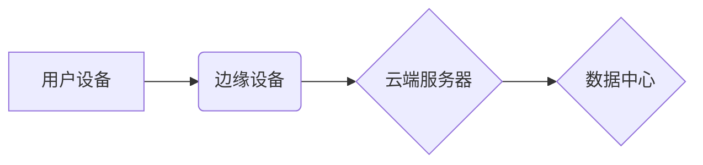

> 边缘计算、AI模型部署、模型压缩、模型量化、联邦学习、边缘推理

## 1. 背景介绍

随着物联网、5G、人工智能等技术的快速发展，海量数据在边缘设备上被实时生成和处理。传统的云端计算模式面临着数据传输延迟高、网络带宽压力大、隐私安全等问题。边缘计算应运而生，将计算资源和数据处理能力部署到靠近数据源的边缘节点，实现低延迟、高效率、安全可靠的数据处理。

AI模型在边缘计算环境中的部署，能够将智能化应用推向更广泛的场景，例如智能家居、智能交通、工业自动化等。然而，边缘设备资源有限，部署大型AI模型面临着挑战。因此，需要针对边缘计算环境的特点，制定有效的AI模型部署策略。

## 2. 核心概念与联系

**2.1 边缘计算**

边缘计算是一种将计算、存储和网络功能分布到网络边缘的架构，将数据处理离散化，靠近数据源。

**2.2 AI模型部署**

AI模型部署是指将训练好的AI模型部署到实际应用环境中，使其能够对新数据进行预测或分类。

**2.3 核心概念联系**

边缘计算为AI模型部署提供了低延迟、高效率、安全可靠的环境。AI模型部署则赋予边缘设备智能化能力，使其能够对本地数据进行实时处理和决策。

**2.4 架构图**



## 3. 核心算法原理 & 具体操作步骤

**3.1 算法原理概述**

边缘计算环境下的AI模型部署主要涉及以下核心算法：

* **模型压缩:** 减少模型大小，降低部署成本。
* **模型量化:** 将模型参数精度降低，减少存储空间和计算量。
* **联邦学习:** 在不共享原始数据的情况下，训练模型。

**3.2 算法步骤详解**

**3.2.1 模型压缩**

1. **选择压缩方法:** 常用的压缩方法包括剪枝、权值共享、知识蒸馏等。
2. **压缩模型:** 根据选择的压缩方法，对模型进行压缩。
3. **评估压缩效果:** 评估压缩后的模型精度和效率。

**3.2.2 模型量化**

1. **选择量化方法:** 常用的量化方法包括整型量化、浮点量化等。
2. **量化模型:** 根据选择的量化方法，对模型参数进行量化。
3. **评估量化效果:** 评估量化后的模型精度和效率。

**3.2.3 联邦学习**

1. **数据分片:** 将原始数据分成多个部分，分别存储在不同的边缘设备上。
2. **模型训练:** 各个边缘设备对本地数据进行模型训练，并将模型参数更新上传到中央服务器。
3. **模型聚合:** 中央服务器将所有边缘设备的模型参数进行聚合，得到全局模型。
4. **模型更新:** 全局模型更新后，分发到各个边缘设备。

**3.3 算法优缺点**

| 算法 | 优点 | 缺点 |
|---|---|---|
| 模型压缩 | 降低模型大小，提高部署效率 | 可能导致模型精度下降 |
| 模型量化 | 降低模型存储空间和计算量 | 可能导致模型精度下降 |
| 联邦学习 | 保护数据隐私，提高模型鲁棒性 | 训练速度慢，模型性能可能受限 |

**3.4 算法应用领域**

* **模型压缩:** 语音识别、图像分类、自然语言处理等领域。
* **模型量化:** 物联网设备、嵌入式系统等资源有限的设备。
* **联邦学习:** 医疗保健、金融、电商等领域，需要保护用户隐私的数据。

## 4. 数学模型和公式 & 详细讲解 & 举例说明

**4.1 数学模型构建**

假设我们有一个包含N个样本的训练数据集D，每个样本包含特征向量x和标签y。我们的目标是训练一个模型f(x)来预测新的样本的标签。

**4.2 公式推导过程**

常用的损失函数包括均方误差(MSE)和交叉熵损失(Cross-Entropy Loss)。

* **均方误差(MSE):**

$$
MSE = \frac{1}{N} \sum_{i=1}^{N} (f(x_i) - y_i)^2
$$

* **交叉熵损失(Cross-Entropy Loss):**

$$
Cross-Entropy Loss = -\frac{1}{N} \sum_{i=1}^{N} y_i \log(f(x_i)) + (1-y_i) \log(1-f(x_i))
$$

**4.3 案例分析与讲解**

假设我们训练一个二分类模型，用于判断图像是否包含猫。我们可以使用交叉熵损失函数来评估模型的性能。

**4.3.1 数据集:**

我们使用一个包含1000张图像的训练数据集，其中500张包含猫，500张不包含猫。

**4.3.2 模型:**

我们使用一个简单的多层感知机(MLP)模型，包含两层隐藏层。

**4.3.3 训练过程:**

我们将训练数据集分成训练集和验证集，分别使用70%和30%的数据。我们使用梯度下降算法来优化模型参数，目标是最小化交叉熵损失函数。

**4.3.4 评估结果:**

在训练完成后，我们将模型部署到边缘设备上，并使用验证集进行评估。模型的准确率达到90%，表明模型在边缘设备上能够有效地进行分类任务。

## 5. 项目实践：代码实例和详细解释说明

**5.1 开发环境搭建**

* 操作系统: Ubuntu 20.04
* Python 版本: 3.8
* 深度学习框架: TensorFlow 2.x

**5.2 源代码详细实现**

```python
import tensorflow as tf

# 定义模型结构
model = tf.keras.models.Sequential([
    tf.keras.layers.Dense(128, activation='relu', input_shape=(784,)),
    tf.keras.layers.Dense(10, activation='softmax')
])

# 编译模型
model.compile(optimizer='adam',
              loss='sparse_categorical_crossentropy',
              metrics=['accuracy'])

# 训练模型
model.fit(x_train, y_train, epochs=10)

# 保存模型
model.save('edge_model.h5')
```

**5.3 代码解读与分析**

* 我们使用TensorFlow框架构建了一个简单的多层感知机模型。
* 模型包含两层隐藏层，分别有128个神经元。
* 激活函数使用ReLU函数，输出层使用softmax函数。
* 我们使用Adam优化器，交叉熵损失函数和准确率作为评估指标。
* 训练模型10个epochs。
* 最后，我们将训练好的模型保存为`edge_model.h5`文件。

**5.4 运行结果展示**

在训练完成后，我们可以使用验证集评估模型的性能。

```python
loss, accuracy = model.evaluate(x_val, y_val)
print('Loss:', loss)
print('Accuracy:', accuracy)
```

## 6. 实际应用场景

**6.1 智能家居**

边缘计算可以将AI模型部署到智能家居设备上，实现语音识别、图像识别、行为识别等功能。例如，智能音箱可以识别用户的语音指令，控制家电设备。

**6.2 智能交通**

边缘计算可以将AI模型部署到车辆、交通信号灯等设备上，实现自动驾驶、交通流量预测、拥堵路段预警等功能。

**6.3 工业自动化**

边缘计算可以将AI模型部署到工业设备上，实现设备故障预测、生产过程优化、质量控制等功能。

**6.4 未来应用展望**

随着边缘计算技术的不断发展，AI模型在边缘计算环境中的部署将更加广泛和深入。例如，我们可以看到：

* 更小、更轻量级的AI模型，能够部署在更加资源有限的设备上。
* 更智能的边缘设备，能够自主学习和决策，无需依赖云端服务。
* 更安全的边缘计算环境，能够保护用户隐私和数据安全。

## 7. 工具和资源推荐

**7.1 学习资源推荐**

* TensorFlow官方文档: https://www.tensorflow.org/
* PyTorch官方文档: https://pytorch.org/
* Edge Computing for AI: https://www.amazon.com/Edge-Computing-Artificial-Intelligence-Applications/dp/1492079339

**7.2 开发工具推荐**

* TensorFlow Lite: https://www.tensorflow.org/lite
* PyTorch Mobile: https://pytorch.org/mobile/
* AWS Greengrass: https://aws.amazon.com/greengrass/

**7.3 相关论文推荐**

* MobileBERT: https://arxiv.org/abs/1909.09494
* TinyBERT: https://arxiv.org/abs/1903.10051
* Edge-AI: https://arxiv.org/abs/1908.07377

## 8. 总结：未来发展趋势与挑战

**8.1 研究成果总结**

近年来，在边缘计算环境下的AI模型部署取得了显著进展。模型压缩、模型量化、联邦学习等技术不断发展，使得AI模型能够部署在更加资源有限的设备上。

**8.2 未来发展趋势**

* 更小、更轻量级的AI模型
* 更智能的边缘设备
* 更安全的边缘计算环境
* 更广泛的应用场景

**8.3 面临的挑战**

* 模型精度与效率之间的平衡
* 数据隐私和安全保护
* 边缘设备资源的有限性
* 部署和维护的复杂性

**8.4 研究展望**

未来，我们需要继续探索新的模型压缩、模型量化和联邦学习技术，以提高AI模型在边缘计算环境中的部署效率和性能。同时，还需要关注数据隐私和安全保护、边缘设备资源管理等问题，推动边缘计算和AI技术的融合发展。

## 9. 附录：常见问题与解答

**9.1 如何选择合适的模型压缩方法？**

选择合适的模型压缩方法需要根据具体的应用场景和模型结构进行评估。

**9.2 如何保证模型在边缘设备上的部署效率？**

可以通过模型量化、模型剪枝等方法降低模型大小，提高部署效率。

**9.3 如何保护用户隐私数据在联邦学习过程中？**

联邦学习通过在本地训练模型，并将模型参数上传到中央服务器进行聚合，避免共享原始数据，从而保护用户隐私。


作者：禅与计算机程序设计艺术 / Zen and the Art of Computer Programming 
<end_of_turn>