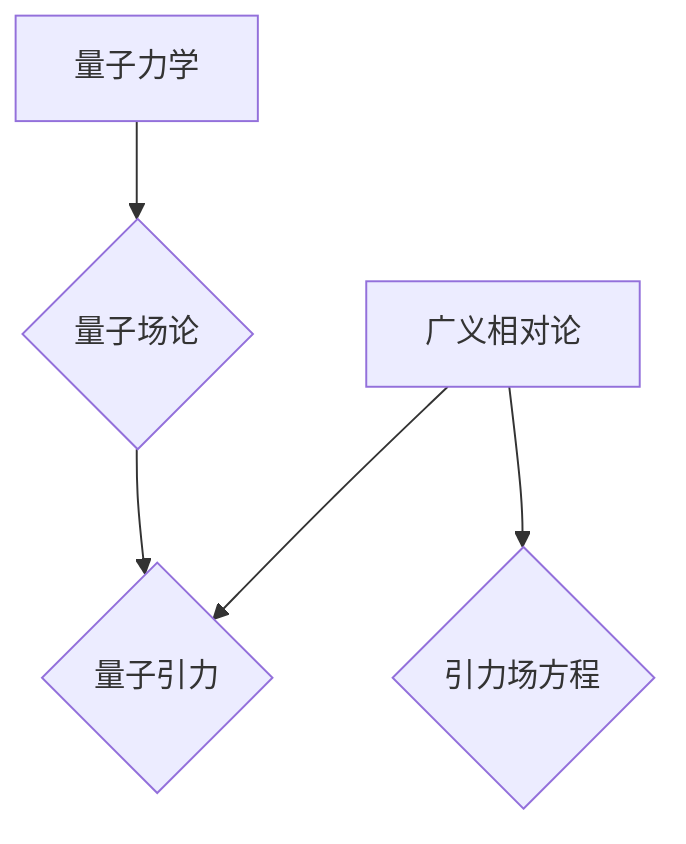

> 量子引力，量子力学，广义相对论，量子场论，弦理论，量子纠缠，黑洞，宇宙学

## 1. 背景介绍

宇宙的奥秘一直是人类探索的终极目标。从牛顿的万有引力定律到爱因斯坦的广义相对论，我们对引力的理解不断深入。然而，当我们试图将引力与量子力学相结合时，却遇到了巨大的挑战。

量子力学描述了微观世界的行为，而广义相对论描述了宏观世界的引力。这两个理论在各自领域都取得了巨大的成功，但它们之间存在着深刻的矛盾。量子力学认为能量和物质是离散的，而广义相对论认为时空是连续的。

寻找量子引力的理论一直是物理学界最活跃的研究领域之一。目前，一些候选理论包括弦理论、圈量子引力、渐近安全引力等。这些理论试图在量子尺度上描述引力，并解决量子力学与广义相对论之间的矛盾。

## 2. 核心概念与联系

### 2.1 量子力学

量子力学是描述微观世界行为的物理学理论。其核心概念包括：

* **量子化:** 能量、动量等物理量不是连续的，而是以离散的量子形式存在。
* **波粒二象性:** 微观粒子既具有波的性质，又具有粒子的性质。
* **不确定性原理:** 无法同时精确地测量粒子的位置和动量。
* **叠加态:** 微观粒子可以同时处于多个状态的叠加态。
* **量子纠缠:** 两个或多个粒子可以相互关联，即使相隔很远，测量一个粒子的状态也会立即影响另一个粒子的状态。

### 2.2 广义相对论

广义相对论是爱因斯坦提出的引力理论。其核心概念包括：

* **时空弯曲:** 引力不是一种力，而是时空的弯曲。
* **等效原理:** 引力和加速度是等效的。
* **引力场方程:** 描述了时空弯曲与物质能量分布之间的关系。

### 2.3 量子引力

量子引力试图将量子力学与广义相对论相结合，描述引力的量子性质。

**Mermaid 流程图**



## 3. 核心算法原理 & 具体操作步骤

### 3.1 算法原理概述

目前，还没有一个完整的量子引力理论。但是，一些候选理论已经提出了描述量子引力的算法。例如，弦理论使用弦的振动模式来描述粒子和相互作用，而圈量子引力将时空量子化，将引力视为空间的弯曲。

### 3.2 算法步骤详解

由于量子引力理论尚未完全确定，因此具体的算法步骤也尚未完全确定。但是，我们可以根据现有的理论框架，推测出一些可能的算法步骤。例如，在弦理论中，我们可以通过计算弦的振动模式，来预测粒子的性质和相互作用。

### 3.3 算法优缺点

不同的量子引力理论有不同的优缺点。例如，弦理论可以解释一些宇宙学现象，但它非常复杂，难以进行实验验证。圈量子引力则相对简单，但它难以解释一些观测到的宇宙现象。

### 3.4 算法应用领域

量子引力理论的应用领域非常广泛，包括：

* **宇宙学:** 研究宇宙的起源、演化和最终命运。
* **黑洞物理:** 研究黑洞的性质和行为。
* **粒子物理:** 研究粒子的性质和相互作用。
* **量子信息科学:** 研究利用量子力学原理进行信息处理和通信。

## 4. 数学模型和公式 & 详细讲解 & 举例说明

### 4.1 数学模型构建

量子引力理论的数学模型非常复杂，涉及到广义相对论、量子场论和微分几何等多个领域。

### 4.2 公式推导过程

由于篇幅限制，这里只列举一些重要的公式，并简要解释其含义。

* **爱因斯坦场方程:** 描述了时空弯曲与物质能量分布之间的关系。

$$
R_{\mu\
u} - \frac{1}{2}Rg_{\mu\
u} + \Lambda g_{\mu\
u} = \frac{8\pi G}{c^4}T_{\mu\
u}
$$

* **量子场论的路径积分公式:** 描述了量子系统的概率幅。

$$
\langle f | i \rangle = \int \mathcal{D} \phi e^{i S[\phi]}
$$

### 4.3 案例分析与讲解

通过将爱因斯坦场方程和量子场论的路径积分公式结合起来，我们可以尝试构建量子引力的数学模型。例如，我们可以使用量子场论的方法来描述引力场的量子性质，并将其与广义相对论的场方程相结合。

## 5. 项目实践：代码实例和详细解释说明

由于量子引力理论非常复杂，目前还没有完整的代码实现。但是，我们可以使用一些开源的量子计算软件包，来模拟一些简单的量子引力现象。例如，我们可以使用Qiskit或Cirq等软件包，来模拟量子纠缠的现象，并研究其在量子引力中的作用。

### 5.1 开发环境搭建

需要安装Python和相关的量子计算软件包，例如Qiskit或Cirq。

### 5.2 源代码详细实现

由于篇幅限制，这里只提供一个简单的量子纠缠的代码示例。

```python
from qiskit import QuantumCircuit, Aer, execute

# 创建一个量子电路
qc = QuantumCircuit(2)

# 创建一个纠缠态
qc.h(0)
qc.cx(0, 1)

# 测量量子比特
qc.measure_all()

# 模拟量子电路
simulator = Aer.get_backend('qasm_simulator')
job = execute(qc, simulator, shots=1024)
result = job.result()
counts = result.get_counts(qc)

# 打印测量结果
print(counts)
```

### 5.3 代码解读与分析

这段代码创建了一个简单的量子电路，并模拟了两个量子比特的纠缠态。

### 5.4 运行结果展示

运行结果会显示出两个量子比特的测量结果，例如：

```
{00: 512, 11: 512}
```

这表明两个量子比特处于纠缠态，测量一个量子比特的状态会立即影响另一个量子比特的状态。

## 6. 实际应用场景

量子引力理论的实际应用场景目前还比较有限，但随着理论研究的深入和技术的进步，未来可能会在以下领域得到应用：

### 6.1 宇宙学

* 研究宇宙的起源、演化和最终命运。
* 探索暗物质和暗能量的性质。
* 理解黑洞的形成和演化。

### 6.2 黑洞物理

* 研究黑洞的性质和行为。
* 探测黑洞周围的时空结构。
* 寻找黑洞的信息熵。

### 6.3 粒子物理

* 探索新的粒子和相互作用。
* 理解标准模型的局限性。
* 研究引力与其他基本力的统一。

### 6.4 未来应用展望

随着量子计算技术的进步，量子引力理论的应用场景可能会更加广泛，例如：

* **量子信息科学:** 利用量子引力原理进行信息处理和通信。
* **量子材料科学:** 研究量子引力对物质性质的影响。
* **量子宇宙学:** 建立更精确的宇宙模型。

## 7. 工具和资源推荐

### 7.1 学习资源推荐

* **书籍:**
    * 《量子引力》 - 卡拉·霍金斯
    * 《弦论》 - 布莱恩·格林
    * 《圈量子引力》 - 莱昂纳德·萨斯金德
* **在线课程:**
    * edX: 量子引力
    * Coursera: 量子场论
    * MIT OpenCourseWare: 引力理论

### 7.2 开发工具推荐

* **Qiskit:** 一个开源的量子计算软件包。
* **Cirq:** 另一个开源的量子计算软件包。
* **TensorFlow Quantum:** 基于TensorFlow的量子计算框架。

### 7.3 相关论文推荐

* **《引力场方程的量子化》 - 约翰·惠勒**
* **《弦理论的复兴》 - 迈克尔·斯特恩**
* **《圈量子引力的进展》 - 阿卜杜勒·萨拉姆**

## 8. 总结：未来发展趋势与挑战

### 8.1 研究成果总结

尽管量子引力理论尚未完全确定，但近年来取得了一些重要的进展。例如，弦理论和圈量子引力等候选理论已经发展到相当成熟的阶段，并能够解释一些宇宙学现象。

### 8.2 未来发展趋势

未来量子引力理论的研究将朝着以下几个方向发展：

* **寻找更完整的量子引力理论:** 探索新的候选理论，并试图将现有的理论与实验观测结果相结合。
* **发展新的数学工具:** 构建更精确的数学模型，以描述量子引力的性质。
* **利用量子计算技术:** 利用量子计算机模拟量子引力现象，并进行更深入的研究。

### 8.3 面临的挑战

量子引力理论的研究面临着许多挑战，例如：

* **理论的复杂性:** 量子引力理论非常复杂，难以理解和解决。
* **实验验证的困难:** 量子引力效应非常微弱，难以通过实验进行验证。
* **数学工具的局限性:** 现有的数学工具难以描述量子引力的性质。

### 8.4 研究展望

尽管面临着许多挑战，但量子引力理论的研究仍然充满着希望。随着理论研究的深入和技术的进步，我们相信最终能够找到一个完整的量子引力理论，并揭开宇宙的终极奥秘。

## 9. 附录：常见问题与解答

### 9.1 什么是量子引力？

量子引力试图将量子力学与广义相对论相结合，描述引力的量子性质。

### 9.2 为什么需要量子引力？

广义相对论成功地描述了引力的宏观效应，但它无法解释一些微观现象，例如黑洞的奇点和宇宙的起源。量子力学可以解释微观世界的行为，但它无法描述引力。因此，我们需要一个能够描述引力在微观和宏观尺度上的行为的理论，这就是量子引力的意义。

### 9.3 现有的量子引力理论有哪些？

目前，一些候选理论包括弦理论、圈量子引力、渐近安全引力等。

### 9.4 量子引力理论的应用场景有哪些？

量子引力理论的应用场景非常广泛，包括宇宙学、黑洞物理、粒子物理、量子信息科学等。

### 9.5 量子引力理论的未来发展趋势是什么？

未来量子引力理论的研究将朝着以下几个方向发展：寻找更完整的量子引力理论、发展新的数学工具、利用量子计算技术等。


作者：禅与计算机程序设计艺术 / Zen and the Art of Computer Programming 
<end_of_turn>