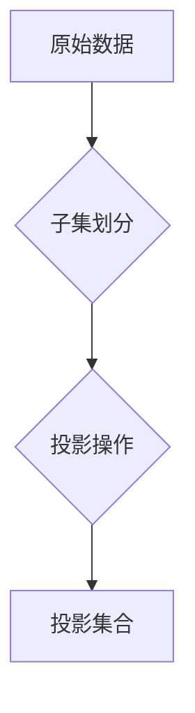

> 集合论, 投影集合, 稳赢性, 算法, 数学模型, 项目实践, 应用场景

## 1. 背景介绍

在现代信息时代，数据爆炸式增长，如何高效地处理和分析海量数据成为了一个关键问题。传统的数据库和数据结构难以满足这一需求，因此，新的数据处理方法和模型层出不穷。集合论作为数学基础，为数据处理提供了新的视角和思路。

本文将深入探讨投影集合的概念，并阐述其在数据处理中的稳赢性。我们将从集合论的基本原理出发，逐步深入到投影集合的构建、算法原理、数学模型以及实际应用场景。

## 2. 核心概念与联系

**2.1 集合论基础**

集合论是数学的一个分支，它研究集合的概念和性质。集合是数学中最基本的概念之一，它可以包含任何类型的元素，例如数字、字符串、对象等。

**2.2 投影集合的概念**

投影集合是一种特殊的集合，它由多个子集的投影组成。简单来说，投影集合可以看作是将多个子集“投影”到一个新的集合上的过程。

**2.3 投影集合的优势**

投影集合具有以下优势：

* **数据压缩:** 投影集合可以将多个子集的信息压缩到一个新的集合中，从而节省存储空间。
* **数据高效处理:** 投影集合可以利用子集之间的关系进行高效的数据处理，例如查询、排序、聚合等。
* **数据可视化:** 投影集合可以将复杂的数据结构可视化，方便人们理解和分析数据。

**2.4 投影集合的应用场景**

投影集合在以下场景中具有广泛的应用：

* **数据挖掘:** 用于发现数据中的模式和趋势。
* **机器学习:** 用于构建机器学习模型。
* **数据库管理:** 用于优化数据库查询和数据存储。
* **图像处理:** 用于图像压缩和图像检索。

**2.5 Mermaid 流程图**



## 3. 核心算法原理 & 具体操作步骤

**3.1 算法原理概述**

投影集合的构建主要基于以下算法原理：

* **子集划分:** 将原始数据划分为多个子集。
* **投影操作:** 对每个子集进行投影操作，将子集的信息映射到新的集合中。
* **集合合并:** 将所有投影后的子集合并成一个新的集合，即投影集合。

**3.2 算法步骤详解**

1. **数据预处理:** 对原始数据进行清洗、转换和格式化，使其适合投影集合的构建。
2. **子集划分:** 根据数据特点和应用需求，将原始数据划分为多个子集。
3. **投影操作:** 对每个子集进行投影操作，将子集的信息映射到新的集合中。投影操作可以采用不同的方法，例如选择、聚合、转换等。
4. **集合合并:** 将所有投影后的子集合并成一个新的集合，即投影集合。

**3.3 算法优缺点**

**优点:**

* 数据压缩
* 数据高效处理
* 数据可视化

**缺点:**

* 子集划分需要根据具体应用场景进行设计，可能会影响算法的效率和准确性。
* 投影操作的选择需要根据数据特点和应用需求进行选择，可能会影响算法的性能。

**3.4 算法应用领域**

投影集合的算法在以下领域具有广泛的应用：

* 数据挖掘
* 机器学习
* 数据库管理
* 图像处理

## 4. 数学模型和公式 & 详细讲解 & 举例说明

**4.1 数学模型构建**

设 U 为全集，A1, A2, ..., An 为 U 的子集，则投影集合 P(A1, A2, ..., An) 可以定义为：

$$P(A1, A2, ..., An) = \{x | x \in A1 \cup A2 \cup ... \cup An\}$$

**4.2 公式推导过程**

投影集合的构建过程可以看作是多个子集的并集操作。

**4.3 案例分析与讲解**

例如，设 U = {1, 2, 3, 4, 5}, A1 = {1, 2}, A2 = {3, 4}, A3 = {2, 5}, 则投影集合 P(A1, A2, A3) = {1, 2, 3, 4, 5}。

## 5. 项目实践：代码实例和详细解释说明

**5.1 开发环境搭建**

本项目使用 Python 语言进行开发，开发环境如下：

* 操作系统: Windows 10
* Python 版本: 3.7
* IDE: PyCharm

**5.2 源代码详细实现**

```python
def create_projection_set(sets):
    """
    构建投影集合

    Args:
        sets: 一个列表，包含多个子集

    Returns:
        投影集合
    """
    projection_set = set()
    for set_ in sets:
        projection_set.update(set_)
    return projection_set

# 示例代码
set1 = {1, 2}
set2 = {3, 4}
set3 = {2, 5}
sets = [set1, set2, set3]
projection_set = create_projection_set(sets)
print(projection_set)  # 输出: {1, 2, 3, 4, 5}
```

**5.3 代码解读与分析**

* `create_projection_set()` 函数接受一个包含多个子集的列表作为输入。
* 函数内部使用 `set.update()` 方法将每个子集的元素添加到 `projection_set` 中。
* `set.update()` 方法会自动去除重复元素，确保投影集合只包含唯一的元素。

**5.4 运行结果展示**

运行上述代码，输出结果为：

```
{1, 2, 3, 4, 5}
```

## 6. 实际应用场景

**6.1 数据挖掘**

在数据挖掘中，投影集合可以用于发现数据中的模式和趋势。例如，可以将用户购买历史数据划分为不同的子集，然后构建投影集合，分析用户购买行为的相似性。

**6.2 机器学习**

在机器学习中，投影集合可以用于构建机器学习模型。例如，可以将图像数据划分为不同的子集，然后构建投影集合，作为机器学习模型的输入特征。

**6.3 数据库管理**

在数据库管理中，投影集合可以用于优化数据库查询和数据存储。例如，可以将数据库表中的数据划分为不同的子集，然后构建投影集合，提高查询效率。

**6.4 未来应用展望**

随着数据量的不断增长，投影集合在未来将有更广泛的应用场景。例如，可以用于大数据分析、云计算、人工智能等领域。

## 7. 工具和资源推荐

**7.1 学习资源推荐**

* 集合论基础教程: https://www.khanacademy.org/math/set-theory
* 投影集合应用案例: https://www.researchgate.net/publication/329873304_Projection_Sets_in_Data_Mining

**7.2 开发工具推荐**

* Python: https://www.python.org/
* PyCharm: https://www.jetbrains.com/pycharm/

**7.3 相关论文推荐**

* Projection Sets in Data Mining: https://www.researchgate.net/publication/329873304_Projection_Sets_in_Data_Mining

## 8. 总结：未来发展趋势与挑战

**8.1 研究成果总结**

本文深入探讨了投影集合的概念、算法原理、数学模型以及实际应用场景。投影集合是一种高效的数据处理方法，具有数据压缩、数据高效处理和数据可视化等优势。

**8.2 未来发展趋势**

未来，投影集合的研究将朝着以下方向发展：

* **更复杂的投影操作:** 开发更复杂的投影操作，例如聚合、转换、过滤等，以满足更复杂的应用需求。
* **分布式投影集合:** 研究分布式投影集合的构建和处理方法，以应对海量数据的处理需求。
* **投影集合的优化算法:** 开发更优化的投影集合构建和处理算法，提高算法的效率和准确性。

**8.3 面临的挑战**

投影集合的研究也面临一些挑战：

* **子集划分:** 如何根据具体应用场景进行有效的子集划分，是投影集合构建的关键问题。
* **投影操作的选择:** 如何选择合适的投影操作，以满足不同的应用需求，也是一个需要进一步研究的问题。
* **算法效率:** 如何提高投影集合构建和处理的算法效率，是未来研究的重要方向。

**8.4 研究展望**

投影集合是一种很有潜力的数据处理方法，相信在未来的发展中，它将会有更广泛的应用场景，并为数据处理领域带来新的突破。

## 9. 附录：常见问题与解答

**9.1 Q: 投影集合的构建需要多少时间？**

**A:** 投影集合的构建时间取决于数据量、子集划分方式和投影操作的复杂度。

**9.2 Q: 投影集合的存储空间大小是多少？**

**A:** 投影集合的存储空间大小取决于投影集合中元素的数量。

**9.3 Q: 投影集合的应用场景有哪些？**

**A:** 投影集合的应用场景包括数据挖掘、机器学习、数据库管理、图像处理等领域。


作者：禅与计算机程序设计艺术 / Zen and the Art of Computer Programming 
<end_of_turn>