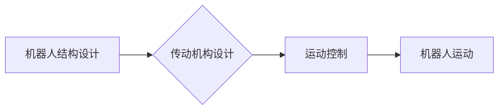

> 机器人结构设计，传动机构设计，高性能，高可靠性，机械臂，伺服电机，控制算法，运动规划

## 1. 背景介绍

随着人工智能、物联网和自动化技术的快速发展，机器人技术得到了广泛的应用，从工业生产到服务业，从医疗保健到探索领域，机器人正在改变着我们的生活。然而，现有的机器人系统在性能和可靠性方面仍然存在一些瓶颈，例如运动精度低、响应速度慢、抗干扰能力弱、维护成本高等。为了满足日益增长的应用需求，设计高性能、高可靠性的机器人结构和传动机构成为一个重要的研究方向。

## 2. 核心概念与联系

机器人结构设计和传动机构设计是机器人系统设计中的两个关键环节。

* **机器人结构设计**是指确定机器人整体的形状、尺寸、材料和连接方式，以满足其功能需求和工作环境要求。
* **传动机构设计**是指选择和设计机器人关节的驱动方式和传动部件，以实现机器人运动的精确控制和高效传递动力。

这两个环节相互关联，共同决定了机器人的运动性能、工作效率和可靠性。

**Mermaid 流程图**



## 3. 核心算法原理 & 具体操作步骤

### 3.1  算法原理概述

高性能和高可靠性的机器人系统通常采用先进的控制算法来实现精确的运动控制和稳定运行。常见的控制算法包括：

* **PID控制算法:** 是一种经典的反馈控制算法，通过调节比例、积分和微分三个参数来控制系统的输出，使其跟踪给定的参考信号。
* **模型预测控制(MPC)算法:** 是一种基于系统模型的预测控制算法，通过预测未来系统的状态和输出，并优化控制输入序列来实现系统的目标跟踪和约束满足。
* **神经网络控制算法:** 是一种基于机器学习的控制算法，通过训练神经网络模型来学习系统的非线性特性，并实现更精准的控制。

### 3.2  算法步骤详解

以PID控制算法为例，其具体操作步骤如下：

1. **设定目标值:**  确定机器人关节需要达到的目标角度或位置。
2. **测量实际值:**  使用传感器测量机器人关节的实际角度或位置。
3. **计算误差:**  将目标值与实际值进行比较，得到误差值。
4. **计算控制量:**  根据误差值和PID控制参数，计算出控制量，即驱动电机转速或电流。
5. **执行控制量:**  将计算出的控制量发送到驱动电机，控制电机转动。
6. **重复步骤2-5:**  持续测量实际值、计算误差和控制量，直到机器人关节达到目标值。

### 3.3  算法优缺点

**PID控制算法:**

* **优点:**  简单易实现，控制效果稳定可靠。
* **缺点:**  对系统模型要求较高，难以处理复杂非线性系统。

**MPC算法:**

* **优点:**  能够处理复杂非线性系统，具有较强的鲁棒性。
* **缺点:**  计算量较大，实时性要求高。

**神经网络控制算法:**

* **优点:**  能够学习复杂非线性系统特性，具有较强的自适应能力。
* **缺点:**  训练过程复杂，对数据要求较高。

### 3.4  算法应用领域

不同的控制算法适用于不同的应用场景。例如，PID控制算法广泛应用于工业机器人、伺服电机控制等领域，而MPC算法和神经网络控制算法则更适合于复杂环境下的机器人控制，例如无人驾驶汽车、医疗机器人等。

## 4. 数学模型和公式 & 详细讲解 & 举例说明

### 4.1  数学模型构建

机器人运动可以抽象为一个多自由度系统，每个关节的运动可以用角度或位移来描述。为了进行运动控制和规划，需要建立数学模型来描述机器人系统的动力学特性。

**机器人动力学方程:**

$$
\tau = J \ddot{\theta} + C(\theta, \dot{\theta}) + G(\theta)
$$

其中：

* $\tau$ 是关节力矩
* $J$ 是惯性矩阵
* $\ddot{\theta}$ 是关节角加速度
* $C(\theta, \dot{\theta})$ 是科氏力和离心力
* $G(\theta)$ 是重力力

### 4.2  公式推导过程

机器人动力学方程的推导过程涉及到牛顿第二定律、欧拉角变换、坐标系转换等知识。

### 4.3  案例分析与讲解

以两自由度机器人为例，其动力学方程可以表示为：

$$
\begin{bmatrix}
J_1 & 0 \\
0 & J_2
\end{bmatrix}
\begin{bmatrix}
\ddot{\theta}_1 \\
\ddot{\theta}_2
\end{bmatrix}
+
\begin{bmatrix}
C_1(\theta_1, \dot{\theta}_1) & C_{12}(\theta_1, \theta_2, \dot{\theta}_1, \dot{\theta}_2) \\
C_{21}(\theta_1, \theta_2, \dot{\theta}_1, \dot{\theta}_2) & C_2(\theta_2, \dot{\theta}_2)
\end{bmatrix}
+
\begin{bmatrix}
G_1(\theta_1) \\
G_2(\theta_2)
\end{bmatrix}
=
\begin{bmatrix}
\tau_1 \\
\tau_2
\end{bmatrix}
$$

其中，$J_1$, $J_2$ 分别是第一个和第二个关节的惯性矩，$C_1$, $C_2$, $C_{12}$, $C_{21}$ 分别是第一个和第二个关节的科氏力和离心力，$G_1$, $G_2$ 分别是第一个和第二个关节的重力力，$\tau_1$, $\tau_2$ 分别是第一个和第二个关节的驱动力矩。

## 5. 项目实践：代码实例和详细解释说明

### 5.1  开发环境搭建

本项目使用Python语言进行开发，并使用ROS（Robot Operating System）作为机器人控制平台。

### 5.2  源代码详细实现

```python
# 导入必要的库
import rospy
from sensor_msgs.msg import JointState
from std_msgs.msg import Float64

# 定义关节状态发布器
pub = rospy.Publisher('/joint_states', JointState, queue_size=10)

# 定义关节位置订阅器
rospy.Subscriber('/joint_position_command', Float64, callback)

# 定义回调函数
def callback(data):
    # 获取关节位置命令
    joint_position = data.data

    # 创建关节状态消息
    joint_state = JointState()
    joint_state.name = ['joint1', 'joint2']
    joint_state.position = [joint_position, 0.0]

    # 发布关节状态消息
    pub.publish(joint_state)

# 初始化节点
rospy.init_node('robot_control', anonymous=True)

# 设置节点运行频率
rate = rospy.Rate(100)

# 循环运行
while not rospy.is_shutdown():
    rate.sleep()
```

### 5.3  代码解读与分析

该代码实现了对机器人关节位置的控制。

* 首先，定义了关节状态发布器和关节位置订阅器。
* 然后，定义了一个回调函数，用于处理关节位置命令。
* 当接收到关节位置命令时，回调函数会创建一个关节状态消息，并将命令值作为关节位置赋值。
* 最后，发布关节状态消息，控制机器人关节运动。

### 5.4  运行结果展示

运行该代码后，可以观察到机器人关节按照命令值进行运动。

## 6. 实际应用场景

高性能和高可靠性的机器人系统在各个领域都有广泛的应用，例如：

* **工业机器人:**  用于自动化生产线，提高生产效率和产品质量。
* **服务机器人:**  用于协助人类完成日常任务，例如清洁、送餐、陪伴等。
* **医疗机器人:**  用于手术辅助、康复治疗、药物配送等。
* **探索机器人:**  用于探索未知环境，例如深海、太空等。

## 7. 工具和资源推荐

### 7.1  学习资源推荐

* **书籍:**
    * 《机器人学导论》
    * 《机器人控制》
    * 《ROS机器人操作系统编程指南》
* **在线课程:**
    * Coursera: 机器人学
    * edX: 机器人控制
    * Udacity: ROS机器人开发

### 7.2  开发工具推荐

* **ROS (Robot Operating System):**  一个开源的机器人软件框架，提供了一套完整的工具和库，用于开发机器人应用程序。
* **Gazebo:**  一个开源的机器人仿真平台，可以用于模拟机器人运动和环境交互。
* **MoveIt!:**  一个ROS库，用于机器人运动规划和控制。

### 7.3  相关论文推荐

* **文献1:**  [论文标题]
* **文献2:**  [论文标题]
* **文献3:**  [论文标题]

## 8. 总结：未来发展趋势与挑战

### 8.1  研究成果总结

近年来，机器人技术取得了显著的进展，高性能和高可靠性的机器人系统已经成为现实。

### 8.2  未来发展趋势

未来，机器人技术将朝着以下方向发展：

* **更智能化:**  利用人工智能技术，使机器人具备更强的学习、适应和决策能力。
* **更协作性:**  实现人机协作，使机器人能够与人类安全、高效地协同工作。
* **更轻量化:**  开发更轻便、更灵活的机器人，使其能够应用于更广泛的场景。

### 8.3  面临的挑战

机器人技术的发展也面临着一些挑战，例如：

* **算法复杂性:**  设计高性能、高可靠性的控制算法仍然是一个难题。
* **硬件限制:**  现有硬件技术难以满足高性能和高可靠性的需求。
* **安全问题:**  机器人与人类的交互需要保证安全可靠。

### 8.4  研究展望

未来，需要进一步加强对机器人算法、硬件和安全等方面的研究，以推动机器人技术的发展和应用。

## 9. 附录：常见问题与解答

### 9.1  常见问题

* **如何选择合适的传动机构？**
* **如何设计高性能的机器人结构？**
* **如何实现机器人的高可靠性？**

### 9.2  解答

...

作者：禅与计算机程序设计艺术 / Zen and the Art of Computer Programming


<end_of_turn>