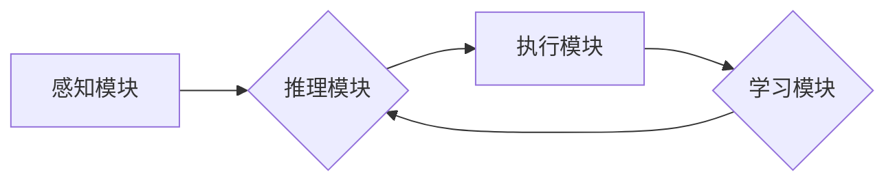

> AI Agent, 大模型, 强化学习, 决策推理, 智能自动化, 知识图谱, 

## 1. 背景介绍

人工智能（AI）技术近年来发展迅速，从语音识别、图像识别到自然语言处理等领域取得了突破性进展。其中，大模型作为AI发展的重要趋势，凭借其强大的学习能力和泛化能力，在多个领域展现出巨大的应用潜力。然而，单纯的大模型往往缺乏自主性和适应性，难以应对复杂、动态的环境。

AI Agent作为一种更高级的AI形态，旨在赋予AI自主决策、学习和交互的能力，使其能够在真实世界中执行任务、解决问题，并与人类进行更自然的交互。

## 2. 核心概念与联系

**2.1 AI Agent 的定义**

AI Agent是指能够感知环境、做出决策并执行行动的智能体。它是一个独立的软件系统，能够根据自身的目标和环境信息，自主地规划和执行任务。

**2.2 AI Agent 与大模型的关系**

大模型为AI Agent提供了强大的基础能力，例如：

* **知识表示:** 大模型可以学习和理解大量的文本数据，构建丰富的知识图谱，为AI Agent提供知识基础。
* **语言理解和生成:** 大模型可以理解和生成自然语言，使AI Agent能够与人类进行自然流畅的交互。
* **决策推理:** 大模型可以学习复杂的决策规则，帮助AI Agent做出更合理的决策。

**2.3 AI Agent 的架构**

AI Agent通常由以下几个核心模块组成：

* **感知模块:** 收集环境信息，例如传感器数据、文本数据、图像数据等。
* **推理模块:** 对感知到的信息进行分析和推理，生成决策方案。
* **执行模块:** 执行决策方案，与环境进行交互。
* **学习模块:** 通过经验学习，不断优化决策策略。

**2.4 Mermaid 流程图**



## 3. 核心算法原理 & 具体操作步骤

**3.1 算法原理概述**

AI Agent 的核心算法通常基于强化学习（Reinforcement Learning，RL）原理。强化学习是一种机器学习方法，通过奖励和惩罚机制，训练智能体在特定环境中学习最优策略。

**3.2 算法步骤详解**

1. **环境建模:** 建立一个数学模型来描述AI Agent所处的环境，包括状态空间、动作空间和奖励函数。
2. **策略学习:** 使用强化学习算法，例如Q-learning或Deep Q-Network（DQN），训练AI Agent学习最优策略。
3. **策略执行:** AI Agent根据学习到的策略，在环境中执行动作，并根据环境反馈获得奖励。
4. **策略更新:** 根据获得的奖励，更新AI Agent的策略，使其在未来能够做出更优的决策。

**3.3 算法优缺点**

* **优点:** 能够学习复杂、动态的环境，并找到最优策略。
* **缺点:** 训练过程可能需要大量的数据和计算资源，并且难以保证算法收敛到全局最优解。

**3.4 算法应用领域**

* **机器人控制:** 训练机器人自主导航、避障、抓取等行为。
* **游戏 AI:** 训练游戏中的AI对手，使其能够做出更智能的决策。
* **金融交易:** 训练AI系统进行股票交易、风险管理等。

## 4. 数学模型和公式 & 详细讲解 & 举例说明

**4.1 数学模型构建**

AI Agent 的行为可以建模为马尔可夫决策过程（Markov Decision Process，MDP）。MDP 由以下几个要素组成：

* **状态空间 (S):** 环境可能存在的各种状态。
* **动作空间 (A):** AI Agent可以执行的动作。
* **转移概率 (P):** 从一个状态到另一个状态的概率。
* **奖励函数 (R):** 在某个状态执行某个动作后获得的奖励。
* **折扣因子 (γ):** 未来奖励的权重。

**4.2 公式推导过程**

强化学习的目标是找到一个策略 π，使得在该策略下，AI Agent获得的总奖励最大化。

Bellman 方程是强化学习的核心公式，用于计算状态价值函数：

$$
V^{\pi}(s) = \max_{a \in A} \left[ R(s, a) + \gamma \sum_{s' \in S} P(s' | s, a) V^{\pi}(s') \right]
$$

其中：

* $V^{\pi}(s)$ 是状态 $s$ 在策略 $\pi$ 下的价值函数。
* $R(s, a)$ 是在状态 $s$ 执行动作 $a$ 后获得的奖励。
* $P(s' | s, a)$ 是从状态 $s$ 执行动作 $a$ 到状态 $s'$ 的转移概率。
* $\gamma$ 是折扣因子。

**4.3 案例分析与讲解**

例如，训练一个AI Agent玩游戏，我们可以将游戏状态表示为游戏画面，动作表示为游戏按键，奖励表示为游戏分数。通过强化学习算法，AI Agent可以学习到最优策略，从而获得更高的游戏分数。

## 5. 项目实践：代码实例和详细解释说明

**5.1 开发环境搭建**

* Python 3.x
* TensorFlow 或 PyTorch
* OpenAI Gym

**5.2 源代码详细实现**

```python
import gym
import tensorflow as tf

# 定义环境
env = gym.make('CartPole-v1')

# 定义模型
model = tf.keras.Sequential([
    tf.keras.layers.Dense(128, activation='relu'),
    tf.keras.layers.Dense(env.action_space.n)
])

# 定义损失函数和优化器
optimizer = tf.keras.optimizers.Adam()
loss_fn = tf.keras.losses.SparseCategoricalCrossentropy()

# 训练循环
for episode in range(1000):
    state = env.reset()
    done = False
    total_reward = 0

    while not done:
        # 选择动作
        action = model.predict(state[None, :])[0]
        action = tf.argmax(action).numpy()

        # 执行动作
        next_state, reward, done, _ = env.step(action)

        # 更新模型
        with tf.GradientTape() as tape:
            prediction = model(state[None, :])
            loss = loss_fn(tf.one_hot(action, depth=env.action_space.n), prediction)
        gradients = tape.gradient(loss, model.trainable_variables)
        optimizer.apply_gradients(zip(gradients, model.trainable_variables))

        # 更新状态
        state = next_state

        # 更新总奖励
        total_reward += reward

    print(f"Episode {episode+1}, Total Reward: {total_reward}")

# 保存模型
model.save('cartpole_model.h5')
```

**5.3 代码解读与分析**

* 代码首先定义了环境和模型，并选择合适的损失函数和优化器。
* 训练循环中，AI Agent会根据当前状态选择动作，执行动作后获得奖励和下一个状态。
* 根据奖励和下一个状态，更新模型参数，使其能够更好地预测未来状态和动作。
* 训练完成后，保存模型，以便后续使用。

**5.4 运行结果展示**

训练完成后，AI Agent能够在CartPole环境中保持平衡杆的稳定时间更长。

## 6. 实际应用场景

**6.1 智能客服:** AI Agent可以作为智能客服，通过自然语言理解和生成，与用户进行对话，解答问题，提供服务。

**6.2 自动化办公:** AI Agent可以自动化办公任务，例如邮件处理、日程安排、文档生成等，提高工作效率。

**6.3 个性化推荐:** AI Agent可以根据用户的行为和偏好，提供个性化的商品推荐、内容推荐等。

**6.4 医疗诊断:** AI Agent可以辅助医生进行医疗诊断，例如分析病历、影像数据，提供诊断建议。

**6.5 未来应用展望**

AI Agent在未来将应用于更广泛的领域，例如：

* **自动驾驶:** AI Agent可以作为自动驾驶系统的核心，控制车辆行驶，避障，决策。
* **工业自动化:** AI Agent可以控制工业机器人，提高生产效率，降低成本。
* **教育:** AI Agent可以作为个性化学习助手，根据学生的学习进度和能力，提供定制化的学习内容和辅导。

## 7. 工具和资源推荐

**7.1 学习资源推荐**

* **书籍:**
    * Reinforcement Learning: An Introduction by Sutton and Barto
    * Deep Reinforcement Learning Hands-On by Maxim Lapan
* **在线课程:**
    * Deep Reinforcement Learning Specialization by DeepLearning.AI
    * Reinforcement Learning by David Silver (University of DeepMind)

**7.2 开发工具推荐**

* **TensorFlow:** 开源深度学习框架，支持强化学习算法。
* **PyTorch:** 开源深度学习框架，支持强化学习算法。
* **OpenAI Gym:** 强化学习环境库，提供各种标准的强化学习环境。

**7.3 相关论文推荐**

* Deep Q-Network (DQN)
* Proximal Policy Optimization (PPO)
* Trust Region Policy Optimization (TRPO)

## 8. 总结：未来发展趋势与挑战

**8.1 研究成果总结**

近年来，AI Agent领域取得了显著进展，例如：

* 强化学习算法取得了突破性进展，能够训练出更智能的AI Agent。
* 大模型的应用为AI Agent提供了强大的基础能力。
* 各种新的AI Agent架构和应用场景不断涌现。

**8.2 未来发展趋势**

* **更强大的模型:** 训练更强大、更智能的AI Agent，例如通用AI。
* **更复杂的场景:** 将AI Agent应用于更复杂、更现实的场景，例如自动驾驶、医疗诊断等。
* **更安全的AI:** 研究如何确保AI Agent的安全性和可靠性，避免其被恶意利用。

**8.3 面临的挑战**

* **数据获取和标注:** 训练AI Agent需要大量的数据，获取和标注这些数据成本高昂。
* **算法效率:** 训练大型AI Agent需要大量的计算资源，算法效率是一个重要的挑战。
* **伦理问题:** AI Agent的应用可能会带来一些伦理问题，例如隐私保护、责任归属等。

**8.4 研究展望**

未来，AI Agent领域将继续朝着更智能、更安全、更普适的方向发展。研究者们将继续探索新的算法、新的架构、新的应用场景，推动AI技术的发展，为人类社会带来更多福祉。

## 9. 附录：常见问题与解答

**9.1 如何选择合适的强化学习算法？**

选择合适的强化学习算法取决于具体的应用场景和任务需求。例如，对于离散动作空间的任务，可以使用Q-learning或SARSA算法；对于连续动作空间的任务，可以使用DQN或Actor-Critic算法。

**9.2 如何解决数据获取和标注问题？**

可以考虑使用模拟环境、迁移学习等方法来解决数据获取和标注问题。

**9.3 如何评估AI Agent的性能？**

常用的评估指标包括奖励总和、平均奖励、成功率等。

**9.4 如何确保AI Agent的安全性和可靠性？**

可以采用安全强化学习、对抗训练等方法来提高AI Agent的安全性和可靠性。


作者：禅与计算机程序设计艺术 / Zen and the Art of Computer Programming 
<end_of_turn>