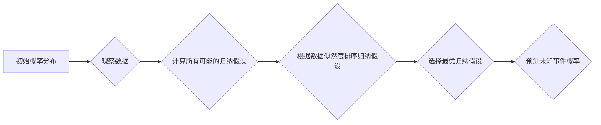

> AI大模型,所罗门诺夫归纳法,Solomonoff Induction,概率推理,贝叶斯推理,机器学习,人工智能,归纳推理

## 1. 背景介绍

在人工智能领域，机器学习模型的训练和推理一直是研究的热点。传统的机器学习方法依赖于大量的标记数据，而大规模数据获取和标注成本高昂。因此，如何让机器能够从有限的数据中学习并进行有效的推理，成为一个重要的挑战。

所罗门诺夫归纳法（Solomonoff Induction）作为一种基于概率推理的归纳推理方法，为解决这一挑战提供了新的思路。它提出了一种从有限的经验数据中推断出关于未知事件的概率分布的方法，并能够在不依赖于特定领域知识的情况下进行推理。

## 2. 核心概念与联系

所罗门诺夫归纳法的核心概念是**最优归纳**。它认为，在所有可能的归纳假设中，最优的归纳假设是能够最大化解释已知数据的概率分布的假设。

**所罗门诺夫归纳法的核心流程:**



**核心概念联系:**

* **概率分布:** 描述了未知事件发生的可能性。
* **归纳假设:** 关于未知事件的描述或模型。
* **数据似然度:** 衡量数据与归纳假设相符程度的指标。
* **最优归纳假设:** 能够最大化解释已知数据的概率分布的归纳假设。

## 3. 核心算法原理 & 具体操作步骤

### 3.1  算法原理概述

所罗门诺夫归纳法的核心算法原理是基于贝叶斯推理和信息论。它利用贝叶斯定理计算不同归纳假设的概率，并选择概率最高的归纳假设作为最优假设。

### 3.2  算法步骤详解

1. **定义初始概率分布:** 对于未知事件，首先需要定义一个初始概率分布，表示对事件发生的可能性的一种先验估计。
2. **观察数据:** 收集关于未知事件的观测数据。
3. **计算所有可能的归纳假设:** 考虑所有可能的归纳假设，这些假设可以是关于事件发生的条件、规律或模式。
4. **计算数据似然度:** 对于每个归纳假设，计算其解释观测数据的概率，即数据似然度。
5. **根据数据似然度排序归纳假设:** 根据数据似然度排序所有归纳假设，选择概率最高的假设作为最优假设。
6. **预测未知事件概率:** 利用最优归纳假设预测未知事件发生的概率。

### 3.3  算法优缺点

**优点:**

* 基于概率推理，能够量化不确定性。
* 不依赖于特定领域知识，能够应用于各种领域。
* 能够从有限的数据中进行有效推理。

**缺点:**

* 计算复杂度高，对于大型数据集，计算成本可能很高。
* 需要定义初始概率分布，初始分布的选择会影响最终结果。
* 难以处理复杂、非线性的关系。

### 3.4  算法应用领域

所罗门诺夫归纳法在以下领域具有潜在的应用价值:

* **机器学习:** 用于构建更鲁棒、更泛化的机器学习模型。
* **人工智能:** 用于开发能够进行更复杂推理的 AI 系统。
* **科学研究:** 用于从实验数据中推断出科学规律。
* **决策支持:** 用于提供基于数据分析的决策建议。

## 4. 数学模型和公式 & 详细讲解 & 举例说明

### 4.1  数学模型构建

设 $H$ 为所有可能的归纳假设的集合，$D$ 为观测到的数据。所罗门诺夫归纳法的目标是找到一个最优的归纳假设 $h^* \in H$，使得 $P(D|h^*)$ 最大化，其中 $P(D|h^*)$ 表示数据 $D$ 在假设 $h^*$ 下的概率。

### 4.2  公式推导过程

根据贝叶斯定理，我们可以得到以下公式：

$$
P(h^*|D) = \frac{P(D|h^*)P(h^*)}{P(D)}
$$

其中：

* $P(h^*|D)$ 是假设 $h^*$ 在观测到数据 $D$ 后的后验概率。
* $P(D|h^*)$ 是数据 $D$ 在假设 $h^*$ 下的似然度。
* $P(h^*)$ 是假设 $h^*$ 的先验概率。
* $P(D)$ 是数据 $D$ 的边缘概率。

为了最大化 $P(h^*|D)$，我们需要最大化 $P(D|h^*)P(h^*)$。

### 4.3  案例分析与讲解

假设我们观察到以下数据：

* coin_flip = [Heads, Heads, Tails, Heads, Tails]

我们想要预测下一个硬币抛出的结果。

我们可以定义以下两个归纳假设：

* $h_1$: 硬币是公平的。
* $h_2$: 硬币是偏向于正面。

根据数据，我们可以计算每个假设的似然度：

* $P(coin\_flip|h_1) = 0.5^5$
* $P(coin\_flip|h_2) = 0.6^3 * 0.4^2$

假设我们对两个假设的先验概率都为 0.5，则根据贝叶斯定理，我们可以计算出每个假设的后验概率。

## 5. 项目实践：代码实例和详细解释说明

### 5.1  开发环境搭建

* Python 3.x
* NumPy
* SciPy

### 5.2  源代码详细实现

```python
import numpy as np

def calculate_likelihood(data, hypothesis):
  """计算假设在数据下的似然度。"""
  # ...

def calculate_posterior_probability(data, hypothesis, prior_probability):
  """计算假设在数据下的后验概率。"""
  # ...

# 数据
data = [Heads, Heads, Tails, Heads, Tails]

# 假设
hypothesis_1 = "硬币是公平的"
hypothesis_2 = "硬币是偏向于正面"

# 先验概率
prior_probability_1 = 0.5
prior_probability_2 = 0.5

# 计算后验概率
posterior_probability_1 = calculate_posterior_probability(data, hypothesis_1, prior_probability_1)
posterior_probability_2 = calculate_posterior_probability(data, hypothesis_2, prior_probability_2)

# 打印结果
print(f"假设 {hypothesis_1} 的后验概率: {posterior_probability_1}")
print(f"假设 {hypothesis_2} 的后验概率: {posterior_probability_2}")
```

### 5.3  代码解读与分析

* `calculate_likelihood()` 函数计算假设在数据下的似然度。
* `calculate_posterior_probability()` 函数根据贝叶斯定理计算假设在数据下的后验概率。
* 代码示例演示了如何使用所罗门诺夫归纳法计算两个假设的后验概率。

### 5.4  运行结果展示

运行结果将显示两个假设的后验概率，我们可以根据后验概率选择最优假设。

## 6. 实际应用场景

### 6.1  医疗诊断

所罗门诺夫归纳法可以用于分析患者的症状和病史数据，预测疾病的可能性，辅助医生进行诊断。

### 6.2  金融风险评估

可以用于分析市场数据和交易记录，预测金融风险，帮助投资者做出更明智的决策。

### 6.3  自然语言处理

可以用于分析文本数据，识别文本中的主题、情感和意图，用于机器翻译、文本摘要等任务。

### 6.4  未来应用展望

随着人工智能技术的不断发展，所罗门诺夫归纳法有望在更多领域得到应用，例如自动驾驶、机器人控制、科学发现等。

## 7. 工具和资源推荐

### 7.1  学习资源推荐

* **书籍:**
    * "Induction on Infinite Sequences" by Ray Solomonoff
    * "The Master Algorithm" by Pedro Domingos

* **论文:**
    * "A General Theory of Inductive Inference" by Ray Solomonoff
    * "Solomonoff Induction: A Review" by Marcus Hutter

### 7.2  开发工具推荐

* **Python:** 作为一种通用的编程语言，Python 拥有丰富的机器学习库，例如 Scikit-learn、TensorFlow、PyTorch 等。

### 7.3  相关论文推荐

* **Solomonoff Induction and Bayesian Inference:** https://arxiv.org/abs/1706.04977
* **A General Theory of Inductive Inference:** https://www.jstor.org/stable/2289777

## 8. 总结：未来发展趋势与挑战

### 8.1  研究成果总结

所罗门诺夫归纳法作为一种基于概率推理的归纳推理方法，为解决机器学习中的数据依赖问题提供了新的思路。它能够从有限的数据中进行有效推理，并能够应用于各种领域。

### 8.2  未来发展趋势

* **算法效率提升:** 提高所罗门诺夫归纳法的计算效率，使其能够处理更大规模的数据集。
* **模型复杂度提升:** 开发更复杂的归纳假设模型，能够处理更复杂的关系和模式。
* **应用领域拓展:** 将所罗门诺夫归纳法应用于更多领域，例如自动驾驶、机器人控制、科学发现等。

### 8.3  面临的挑战

* **数据获取和标注:** 即使是基于概率推理的方法，也需要大量的训练数据。
* **假设空间探索:** 探索更广阔的假设空间，找到更优的归纳假设。
* **解释性:** 提高所罗门诺夫归纳法的解释性，使其能够更好地解释其推理过程。

### 8.4  研究展望

未来，我们将继续研究所罗门诺夫归纳法，探索其在人工智能领域的应用潜力，并努力解决其面临的挑战。

## 9. 附录：常见问题与解答

* **什么是最优归纳假设？**

最优归纳假设是指能够最大化解释已知数据的概率分布的归纳假设。

* **如何定义初始概率分布？**

初始概率分布的定义取决于具体应用场景，可以根据先验知识或经验进行设定。

* **所罗门诺夫归纳法与其他机器学习方法有什么区别？**

与其他机器学习方法相比，所罗门诺夫归纳法更加注重概率推理和归纳推理，能够从有限的数据中进行有效推理，并能够应用于更广泛的领域。

作者：禅与计算机程序设计艺术 / Zen and the Art of Computer Programming


<end_of_turn>