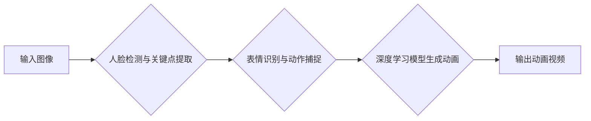

> AIGC, D-ID, 人脸动画, 深度学习, 生成式模型, 计算机视觉

## 1. 背景介绍

近年来，人工智能（AI）技术飞速发展，特别是生成式人工智能（AIGC）的兴起，为我们带来了前所未有的创作和体验。AIGC能够根据输入的文本或数据，生成新的文本、图像、音频等内容，打破了传统人工创作的局限性，为各个领域带来了革命性的变革。

其中，人脸动画技术作为AIGC的重要分支，能够赋予静态图像或视频中的人物以生动的表情和动作，使其仿佛“活”过来。D-ID便是其中一个代表性的应用，它利用深度学习技术，可以将照片中的脸部进行动画化，生成逼真的视频，为教育、娱乐、营销等领域提供了全新的可能性。

## 2. 核心概念与联系

### 2.1  AIGC 与 人脸动画

AIGC是指利用人工智能技术生成新内容的范畴，涵盖了文本生成、图像生成、音频生成等多个领域。人脸动画则是AIGC中的一种应用，它利用计算机视觉和深度学习技术，将静态图像或视频中的脸部进行动画化，使其表现出表情、动作等动态变化。

### 2.2  D-ID 的工作原理

D-ID 是一款基于深度学习的人脸动画生成平台，它利用以下核心技术：

* **人脸检测和关键点提取:** 首先，D-ID 会使用计算机视觉算法检测图像中的脸部区域，并提取关键点，例如眼睛、鼻子、嘴巴等。
* **表情识别和动作捕捉:** D-ID 会根据输入的文本或音频，识别出相应的表情和动作，并将其映射到提取的关键点上。
* **深度学习模型生成动画:** D-ID 会使用预训练的深度学习模型，将表情和动作信息与脸部关键点结合，生成逼真的动画效果。

### 2.3  Mermaid 流程图



## 3. 核心算法原理 & 具体操作步骤

### 3.1  算法原理概述

D-ID 的核心算法原理是基于深度学习的生成式对抗网络（GAN）。GAN 由两个网络组成：生成器和判别器。生成器负责生成新的图像数据，而判别器负责判断图像数据是真实数据还是生成数据。

通过不断的训练和对抗，生成器能够生成越来越逼真的图像数据，最终达到与真实数据难以区分的效果。

### 3.2  算法步骤详解

1. **数据准备:** 收集大量的人脸图像和对应的表情和动作标签数据。
2. **模型训练:** 使用深度学习框架，例如TensorFlow或PyTorch，训练GAN模型。
3. **人脸检测与关键点提取:** 使用计算机视觉算法检测图像中的脸部区域，并提取关键点。
4. **表情识别与动作捕捉:** 根据输入的文本或音频，识别出相应的表情和动作，并将其映射到提取的关键点上。
5. **动画生成:** 将表情和动作信息与脸部关键点结合，使用训练好的GAN模型生成动画效果。
6. **视频输出:** 将生成的动画效果合成到原始图像中，生成最终的动画视频。

### 3.3  算法优缺点

**优点:**

* 生成效果逼真，能够模拟真实的表达和动作。
* 可应用于多种场景，例如教育、娱乐、营销等。
* 操作简单，易于使用。

**缺点:**

* 训练数据量大，需要大量的计算资源。
* 算法复杂，需要专业的技术人员进行开发和维护。
* 存在伦理问题，例如深度伪造等。

### 3.4  算法应用领域

* **教育:** 创建互动式教学视频，使学习更加生动有趣。
* **娱乐:** 制作动画电影、游戏等，提升视觉效果。
* **营销:** 制作个性化广告，提高用户互动率。
* **医疗:** 模拟患者病情，帮助医生进行诊断和治疗。

## 4. 数学模型和公式 & 详细讲解 & 举例说明

### 4.1  数学模型构建

D-ID 的核心算法是基于深度学习的生成式对抗网络（GAN）。GAN 由两个网络组成：生成器（G）和判别器（D）。

* **生成器 (G):** 负责生成新的图像数据，输入为随机噪声，输出为合成图像。
* **判别器 (D):** 负责判断图像数据是真实数据还是生成数据，输入为图像数据，输出为一个概率值，表示图像为真实数据的概率。

### 4.2  公式推导过程

GAN 的训练目标是让生成器生成越来越逼真的图像数据，以至于判别器无法区分真实数据和生成数据。

* **生成器损失函数:**

$$
L_G(G, D) = -E_{z \sim p_z(z)}[log(D(G(z)))]
$$

* **判别器损失函数:**

$$
L_D(D, G) = -E_{x \sim p_{data}(x)}[log(D(x))] - E_{z \sim p_z(z)}[log(1 - D(G(z)))]
$$

其中：

* $z$ 是随机噪声
* $p_z(z)$ 是随机噪声的分布
* $x$ 是真实图像数据
* $p_{data}(x)$ 是真实图像数据的分布
* $D(x)$ 是判别器对图像 $x$ 的判断概率

### 4.3  案例分析与讲解

假设我们训练一个生成人脸图像的GAN模型。

* **生成器:** 输入随机噪声，输出合成人脸图像。
* **判别器:** 输入真实人脸图像和合成人脸图像，判断其真实性。

在训练过程中，生成器会不断尝试生成逼真的人脸图像，而判别器会不断学习识别真实和合成图像的差异。最终，生成器能够生成与真实人脸图像难以区分的合成图像。

## 5. 项目实践：代码实例和详细解释说明

### 5.1  开发环境搭建

* **操作系统:** Windows/macOS/Linux
* **编程语言:** Python
* **深度学习框架:** TensorFlow/PyTorch
* **其他依赖库:** OpenCV, NumPy, Matplotlib

### 5.2  源代码详细实现

由于篇幅限制，这里只提供代码框架，具体实现细节请参考相关开源项目或文档。

```python
# 导入必要的库
import tensorflow as tf
from tensorflow.keras.models import Model
from tensorflow.keras.layers import Input, Conv2D, MaxPooling2D, UpSampling2D, concatenate

# 定义生成器模型
def build_generator(input_shape):
    # ...

# 定义判别器模型
def build_discriminator(input_shape):
    # ...

# 定义GAN模型
def build_gan(generator, discriminator):
    # ...

# 训练GAN模型
def train_gan(generator, discriminator, dataset):
    # ...

# 生成动画视频
def generate_animation(image, text):
    # ...
```

### 5.3  代码解读与分析

* **生成器模型:** 负责生成人脸图像，通常采用卷积神经网络结构，输入随机噪声，输出合成人脸图像。
* **判别器模型:** 负责判断图像真实性，通常采用卷积神经网络结构，输入图像数据，输出判断概率。
* **GAN模型:** 将生成器和判别器组合在一起，通过对抗训练的方式，使生成器生成越来越逼真的图像数据。
* **训练GAN模型:** 使用训练数据，通过反向传播算法，更新生成器和判别器的参数。
* **生成动画视频:** 使用训练好的生成器模型，根据输入的文本或音频，生成相应的表情和动作，并将其应用到原始图像中，生成最终的动画视频。

### 5.4  运行结果展示

运行代码后，可以生成逼真的动画视频，例如将静态照片中的人物赋予表情和动作，使其仿佛“活”过来。

## 6. 实际应用场景

### 6.1  教育领域

* **互动式教学视频:** 将静态图像或视频中的老师或讲解者赋予表情和动作，使教学内容更加生动有趣，提高学生的学习兴趣和理解能力。
* **虚拟角色教学:** 创建虚拟角色，通过动画化，与学生进行互动式学习，例如模拟历史人物或科学实验场景。

### 6.2  娱乐领域

* **动画电影:** 使用人脸动画技术，为动画电影中的角色赋予更加逼真的表情和动作，提升电影的视觉效果和情感表达。
* **游戏:** 为游戏角色赋予更加生动的表情和动作，增强玩家的代入感和游戏体验。

### 6.3  营销领域

* **个性化广告:** 根据用户的画像信息，生成个性化的动画广告，提高广告的吸引力和转化率。
* **虚拟代言人:** 使用人脸动画技术，创建虚拟代言人，进行产品宣传和品牌推广。

### 6.4  未来应用展望

随着人工智能技术的不断发展，人脸动画技术将有更广泛的应用场景，例如：

* **医疗领域:** 模拟患者病情，帮助医生进行诊断和治疗。
* **法律领域:** 用于法庭审判，还原犯罪现场或事故场景。
* **艺术领域:** 用于创作新的艺术作品，例如动画短片、虚拟现实体验等。

## 7. 工具和资源推荐

### 7.1  学习资源推荐

* **书籍:**
    * 《深度学习》
    * 《生成对抗网络》
* **在线课程:**
    * Coursera: 深度学习
    * Udacity: 生成对抗网络
* **博客和论坛:**
    * TensorFlow Blog
    * PyTorch Blog
    * Kaggle

### 7.2  开发工具推荐

* **深度学习框架:** TensorFlow, PyTorch
* **计算机视觉库:** OpenCV
* **数据处理库:** NumPy
* **可视化库:** Matplotlib

### 7.3  相关论文推荐

* **Generative Adversarial Networks**
* **DeepFaceLab**
* **D-ID: Bringing Still Images to Life**

## 8. 总结：未来发展趋势与挑战

### 8.1  研究成果总结

D-ID 等人脸动画技术取得了显著的进展，能够生成逼真的动画效果，为各个领域带来了新的可能性。

### 8.2  未来发展趋势

* **更逼真的动画效果:** 通过改进算法和训练数据，生成更加逼真的动画效果，例如更自然的肢体动作和表情变化。
* **更广泛的应用场景:** 人脸动画技术将应用于更多领域，例如医疗、法律、艺术等。
* **更易于使用的工具:** 开发更易于使用的工具和平台，让更多人能够使用人脸动画技术。

### 8.3  面临的挑战

* **伦理问题:** 人脸动画技术可能被用于深度伪造等恶意目的，需要制定相应的伦理规范和法律法规。
* **数据隐私问题:** 人脸动画技术需要大量的人脸数据，需要保护用户的隐私安全。
* **计算资源需求:** 训练和运行人脸动画模型需要大量的计算资源，需要开发更有效的算法和硬件架构。

### 8.4  研究展望

未来，人脸动画技术将继续朝着更逼真、更智能、更安全的方向发展，为我们带来更多创新和惊喜。

## 9. 附录：常见问题与解答

* **Q: 如何使用D-ID生成动画视频？**

A: D-ID 提供了在线平台和API，用户可以通过上传图像和输入文本或音频，生成动画视频。

* **Q: D-ID生成的动画视频质量如何？**

A: D-ID生成的动画视频质量较高，能够生成逼真的表情和动作，但仍存在