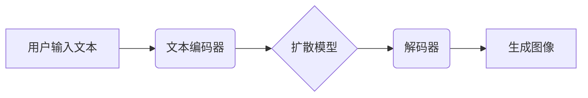

> AIGC, Midjourney, 文生图, AI艺术, 创作工具, 算法原理, 实践应用

## 1. 背景介绍

近年来，人工智能（AI）技术飞速发展，特别是生成式AI模型的涌现，为创意行业带来了革命性的变革。其中，文生图模型以其能够根据文本描述生成图像的能力，引发了广泛的关注和热议。

Midjourney 作为一款领先的文生图AI工具，凭借其出色的图像生成质量和易于使用的界面，迅速成为了艺术家、设计师和创意工作者们的新宠。它不仅可以帮助人们快速创作出高质量的艺术作品，还可以用于设计、广告、游戏等多个领域。

本篇文章将带领读者深入了解 Midjourney 的工作原理，并通过具体的实践案例，帮助读者掌握其使用技巧，从而开启AI艺术创作的新篇章。

## 2. 核心概念与联系

### 2.1 文生图模型

文生图模型是一种能够根据文本描述生成图像的深度学习模型。它通过学习大量的文本-图像对数据，建立起文本和图像之间的映射关系。当用户输入文本描述时，模型会根据其学习到的知识，生成与文本描述相匹配的图像。

### 2.2 Diffusion模型

Midjourney 基于 Diffusion模型，这种模型是一种近年来发展迅速的文本到图像生成模型。Diffusion模型的工作原理是通过逐步添加噪声来破坏图像，然后通过训练模型学习逆向过程，将噪声逐渐去除，最终生成图像。

### 2.3 核心架构

Midjourney 的核心架构包括以下几个部分：

* **文本编码器:** 将用户输入的文本描述编码成向量表示。
* **扩散模型:** 根据文本编码向量，逐步添加噪声到图像，并学习逆向过程。
* **解码器:** 将扩散模型生成的图像解码成可视化的图像。

## 3. 核心算法原理 & 具体操作步骤

### 3.1 算法原理概述

Diffusion模型的核心思想是通过逐步添加噪声来破坏图像，然后通过训练模型学习逆向过程，将噪声逐渐去除，最终生成图像。

具体来说，Diffusion模型包含两个部分：

* **前向过程 (Forward Diffusion):** 从一个干净的图像开始，逐步添加噪声，直到图像完全变成噪点。
* **反向过程 (Reverse Diffusion):** 从纯噪点开始，通过训练模型学习逐步去除噪声，最终恢复出原始图像。

### 3.2 算法步骤详解

1. **数据预处理:** 将图像数据预处理，例如调整大小、归一化等。
2. **前向扩散:** 
    * 从一个干净的图像开始，随机添加噪声。
    * 重复添加噪声步骤，直到图像完全变成噪点。
    * 将每个步骤的图像和对应的噪声作为训练数据。
3. **反向扩散训练:**
    * 使用训练数据，训练一个神经网络模型，学习从噪点中去除噪声，恢复出原始图像。
    * 模型的输入是噪点图像和对应的噪声信息，输出是去除噪声后的图像。
4. **图像生成:**
    * 将用户输入的文本描述编码成向量表示。
    * 将编码向量作为模型的输入，引导模型从纯噪点开始，逐步去除噪声，最终生成与文本描述相匹配的图像。

### 3.3 算法优缺点

**优点:**

* 生成图像质量高，细节丰富。
* 可以生成多种风格的图像。
* 训练数据量相对较少。

**缺点:**

* 训练过程复杂，需要大量的计算资源。
* 生成图像速度相对较慢。

### 3.4 算法应用领域

Diffusion模型在图像生成领域有着广泛的应用，例如：

* **艺术创作:** 生成绘画、插画、漫画等艺术作品。
* **设计领域:** 生成产品设计、UI设计、logo设计等。
* **游戏开发:** 生成游戏场景、角色、道具等。
* **医学图像处理:** 生成医学图像、辅助诊断。

## 4. 数学模型和公式 & 详细讲解 & 举例说明

### 4.1 数学模型构建

Diffusion模型的核心是学习一个概率分布，该分布描述了图像在扩散过程中噪声的增加。

假设图像为 $x \in \mathbb{R}^{H \times W \times C}$，其中 $H$、$W$、$C$ 分别表示图像的高度、宽度和通道数。

扩散过程可以表示为：

$$
x_t = \sqrt{1-\beta_t}x_{t-1} + \sqrt{\beta_t} \epsilon_t
$$

其中：

* $x_t$ 表示在时间步 $t$ 的图像。
* $\beta_t$ 是一个时间步相关的噪声强度参数。
* $\epsilon_t$ 是服从标准正态分布的噪声。

反向扩散过程则试图学习一个函数 $f_\theta$，该函数可以将 $x_t$ 和 $\epsilon_t$ 作为输入，输出 $x_{t-1}$：

$$
x_{t-1} = f_\theta(x_t, \epsilon_t)
$$

### 4.2 公式推导过程

Diffusion模型的训练目标是最大化以下似然函数：

$$
\mathcal{L} = \log p(x_0) = \log \prod_{t=1}^{T} p(x_t | x_{t-1}, \epsilon_t)
$$

其中 $x_0$ 是原始图像，$T$ 是扩散过程的总时间步数。

通过使用变分自编码器 (VAE) 或其他优化方法，可以训练模型 $f_\theta$，使其能够有效地学习反向扩散过程。

### 4.3 案例分析与讲解

假设我们想要生成一张猫咪的图像。

1. 我们首先将文本描述 "一只可爱的猫咪" 编码成一个向量表示。
2. 然后，我们将这个向量作为模型的输入，引导模型从纯噪点开始，逐步去除噪声。
3. 在每个时间步，模型会根据输入向量和噪声信息，生成一个新的图像。
4. 随着时间步的增加，图像逐渐变得清晰，最终生成出一张与文本描述相匹配的猫咪图像。

## 5. 项目实践：代码实例和详细解释说明

### 5.1 开发环境搭建

为了使用 Midjourney，需要先注册一个账号并订阅其服务。

Midjourney 主要通过 Discord 平台进行操作，因此需要安装 Discord 应用程序。

### 5.2 源代码详细实现

Midjourney 的源代码是闭源的，因此无法直接获取和修改。

但是，我们可以通过使用 Midjourney 的 API 接口，来调用其生成图像的功能。

### 5.3 代码解读与分析

Midjourney 的 API 接口提供了多种参数，可以控制图像的生成过程，例如：

* `prompt`: 文本描述
* `n`: 生成图像的数量
* `size`: 图像的大小
* `style`: 图像的风格

通过调整这些参数，我们可以生成不同风格和大小的图像。

### 5.4 运行结果展示

使用 Midjourney API 生成图像的结果，会以图像形式返回。

我们可以将这些图像保存到本地，或者将其嵌入到我们的应用程序中。

## 6. 实际应用场景

### 6.1 艺术创作

Midjourney 可以帮助艺术家快速创作出高质量的艺术作品，例如绘画、插画、漫画等。

艺术家可以利用 Midjourney 的多种风格选项，来探索不同的艺术风格，并创作出独一无二的作品。

### 6.2 设计领域

Midjourney 可以用于设计产品、UI、logo等。

设计师可以利用 Midjourney 生成不同的设计方案，并从中选择最合适的方案。

### 6.3 游戏开发

Midjourney 可以用于生成游戏场景、角色、道具等。

游戏开发人员可以使用 Midjourney 生成逼真的游戏资产，从而节省开发时间和成本。

### 6.4 未来应用展望

随着 AI 技术的不断发展，Midjourney 的应用场景将会更加广泛。

例如，它可以用于生成个性化的商品、定制化的服装、虚拟现实场景等。

## 7. 工具和资源推荐

### 7.1 学习资源推荐

* **Midjourney 官方文档:** https://docs.midjourney.com/
* **AIGC 学习平台:** https://www.aigc.com/

### 7.2 开发工具推荐

* **Discord:** https://discord.com/

### 7.3 相关论文推荐

* **Denoising Diffusion Probabilistic Models:** https://arxiv.org/abs/2006.11239

## 8. 总结：未来发展趋势与挑战

### 8.1 研究成果总结

Midjourney 的出现，标志着文生图模型在实际应用中的突破。

它为创意行业带来了新的可能性，并推动了 AI 技术的快速发展。

### 8.2 未来发展趋势

未来，文生图模型将会更加智能化、个性化和多样化。

例如，模型将能够理解更复杂的文本描述，生成更逼真的图像，并支持多种语言和文化。

### 8.3 面临的挑战

文生图模型还面临着一些挑战，例如：

* **数据偏见:** 训练数据可能存在偏见，导致生成的图像也存在偏见。
* **版权问题:** 文生图模型生成的图像是否属于原创，以及如何保护其版权，是一个需要进一步探讨的问题。
* **伦理问题:** 文生图模型的应用可能会带来一些伦理问题，例如：

生成虚假信息、侵犯隐私等。

### 8.4 研究展望

未来，我们需要更加关注文生图模型的伦理问题，并制定相应的规范和制度，确保其健康发展。

同时，我们还需要继续探索新的算法和技术，提高模型的生成质量和多样性，使其更好地服务于人类社会。

## 9. 附录：常见问题与解答

### 9.1 如何注册 Midjourney 账号？

访问 Midjourney 官方网站，点击“Sign Up”按钮，填写注册信息即可。

### 9.2 Midjourney 的价格是多少？

Midjourney 提供多种订阅方案，价格根据功能和使用时长有所不同。

### 9.3 Midjourney 的 API 接口有哪些？

Midjourney 的 API 接口提供了多种参数，可以控制图像的生成过程，例如：

* `prompt`: 文本描述
* `n`: 生成图像的数量
* `size`: 图像的大小
* `style`: 图像的风格

### 9.4 Midjourney 的使用教程在哪里？

Midjourney 官方网站提供了详细的教程和文档，可以帮助用户快速上手。

作者：禅与计算机程序设计艺术 / Zen and the Art of Computer Programming

<end_of_turn>