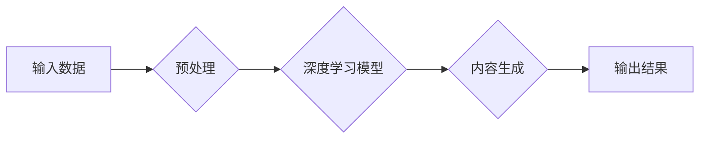

> AIGC, 硬件部署, 运行工程, 源码, 深度学习, 自然语言处理, 图像生成, 模型优化, 性能调优

## 1. 背景介绍

近年来，人工智能（AI）技术取得了飞速发展，特别是生成式人工智能（AIGC）的兴起，为人们带来了前所未有的创作和体验。AIGC能够根据输入的文本、图像或其他数据生成新的内容，例如文本、代码、图像、音频等，在各个领域展现出巨大的应用潜力。

然而，AIGC模型通常体积庞大，对硬件资源要求较高，部署和运行AIGC模型需要克服诸多技术挑战。本文将深入探讨AIGC从入门到实战的各个环节，重点关注硬件部署和运行工程源码，帮助读者理解AIGC的底层原理和实践方法。

## 2. 核心概念与联系

AIGC的核心概念包括：

* **深度学习:** AIGC模型通常基于深度学习算法，例如Transformer、GAN等，通过多层神经网络学习数据特征，实现内容生成。
* **自然语言处理 (NLP):**  AIGC模型在处理文本数据方面依赖NLP技术，例如词嵌入、句法分析、语义理解等。
* **图像生成:** 一些AIGC模型能够生成图像，例如DALL-E 2、Stable Diffusion等，需要结合计算机视觉和图像处理技术。

**Mermaid 流程图:**



## 3. 核心算法原理 & 具体操作步骤

### 3.1  算法原理概述

AIGC模型通常采用生成式对抗网络 (GAN) 或Transformer等算法。

* **GAN:** 由生成器和判别器两部分组成，生成器生成数据，判别器判断数据真实性，两者相互对抗，最终生成器能够生成逼真的数据。
* **Transformer:**  利用注意力机制学习文本序列之间的关系，能够捕捉长距离依赖，在文本生成任务中表现出色。

### 3.2  算法步骤详解

**GAN:**

1. 生成器初始化，随机生成数据样本。
2. 判别器对真实数据和生成器生成的样本进行分类。
3. 根据判别器的反馈，更新生成器的参数，使其生成更逼真的样本。
4. 重复步骤2和3，直到生成器生成的样本难以区分真实数据。

**Transformer:**

1. 将输入文本序列编码成向量表示。
2. 利用多头注意力机制学习文本序列之间的关系。
3. 通过前馈神经网络进一步处理信息。
4. 将处理后的信息解码成输出文本序列。

### 3.3  算法优缺点

**GAN:**

* **优点:** 可以生成逼真的数据，应用广泛。
* **缺点:** 训练过程复杂，容易陷入局部最优，生成结果可能存在模式重复等问题。

**Transformer:**

* **优点:**  能够捕捉长距离依赖，在文本生成任务中表现出色。
* **缺点:**  计算量大，参数量多，对硬件资源要求高。

### 3.4  算法应用领域

AIGC算法广泛应用于：

* 文本生成：自动写作、机器翻译、对话系统等。
* 图像生成：图像合成、图像修复、风格迁移等。
* 代码生成：自动代码补全、代码生成器等。
* 音频生成：语音合成、音乐创作等。

## 4. 数学模型和公式 & 详细讲解 & 举例说明

### 4.1  数学模型构建

AIGC模型通常采用神经网络作为数学模型，例如多层感知机 (MLP)、卷积神经网络 (CNN)、循环神经网络 (RNN) 等。

**MLP:**

MLP由多个全连接层组成，每个层的神经元都与上一层的每个神经元连接。

**CNN:**

CNN利用卷积核提取图像特征，能够有效地学习图像的局部和全局结构。

**RNN:**

RNN能够处理序列数据，例如文本和音频，其隐藏状态能够记忆过去的输入信息，从而捕捉序列之间的依赖关系。

### 4.2  公式推导过程

AIGC模型的训练过程通常基于反向传播算法，其核心公式为：

$$
\Delta w = -\eta \frac{\partial L}{\partial w}
$$

其中：

* $\Delta w$ 是权重的更新量。
* $\eta$ 是学习率。
* $L$ 是损失函数。
* $w$ 是模型参数。

### 4.3  案例分析与讲解

**DALL-E 2:**

DALL-E 2 是一个基于Transformer的图像生成模型，其训练目标是将文本描述映射到相应的图像。

DALL-E 2 的训练过程包括：

1. 使用预训练的语言模型对文本描述进行编码。
2. 使用预训练的图像生成模型根据文本编码生成图像。
3. 使用损失函数计算文本描述和生成的图像之间的差异。
4. 根据损失函数的梯度更新模型参数。

## 5. 项目实践：代码实例和详细解释说明

### 5.1  开发环境搭建

AIGC模型的开发环境通常需要包含以下软件：

* Python 编程语言
* 深度学习框架 (例如 TensorFlow、PyTorch)
* 数据处理工具 (例如 Pandas、NumPy)
* GPU 硬件加速器

### 5.2  源代码详细实现

以下是一个简单的文本生成模型的代码示例，使用 TensorFlow 框架实现：

```python
import tensorflow as tf

# 定义模型结构
model = tf.keras.Sequential([
    tf.keras.layers.Embedding(input_dim=10000, output_dim=128),
    tf.keras.layers.LSTM(units=128),
    tf.keras.layers.Dense(units=10000, activation='softmax')
])

# 编译模型
model.compile(optimizer='adam', loss='sparse_categorical_crossentropy', metrics=['accuracy'])

# 训练模型
model.fit(x_train, y_train, epochs=10)

# 生成文本
text = model.predict(x_test)
```

### 5.3  代码解读与分析

* **Embedding 层:** 将单词映射到向量表示。
* **LSTM 层:** 学习文本序列之间的关系。
* **Dense 层:** 将 LSTM 输出映射到单词概率分布。
* **编译模型:** 设置优化器、损失函数和评价指标。
* **训练模型:** 使用训练数据训练模型。
* **生成文本:** 使用训练好的模型生成新的文本。

### 5.4  运行结果展示

训练后的模型能够生成与训练数据相似的文本。

## 6. 实际应用场景

AIGC技术在各个领域都有着广泛的应用场景：

### 6.1  内容创作

* 自动写作：生成新闻报道、广告文案、小说等。
* 图像生成：生成艺术作品、产品设计、场景模拟等。
* 音频生成：合成语音、创作音乐、制作音效等。

### 6.2  教育培训

* 个性化学习：根据学生的学习进度和需求生成个性化的学习内容。
* 智能辅导：提供智能化的学习辅导和答疑服务。

### 6.3  企业服务

* 客户服务：构建智能客服系统，自动回复客户咨询。
* 市场营销：生成个性化的营销文案和广告。
* 产品开发：辅助产品设计和开发。

### 6.4  未来应用展望

AIGC技术未来将更加智能化、个性化和泛化，应用场景将更加广泛，例如：

* 更逼真的虚拟现实和增强现实体验。
* 更智能的机器人和智能家居。
* 更个性化的医疗诊断和治疗方案。

## 7. 工具和资源推荐

### 7.1  学习资源推荐

* **书籍:**
    * 《深度学习》
    * 《自然语言处理》
    * 《生成对抗网络》
* **在线课程:**
    * Coursera
    * edX
    * Udacity

### 7.2  开发工具推荐

* **深度学习框架:** TensorFlow、PyTorch、JAX
* **数据处理工具:** Pandas、NumPy
* **版本控制工具:** Git

### 7.3  相关论文推荐

* 《Attention Is All You Need》
* 《Generative Adversarial Networks》
* 《DALL-E 2: Hierarchical Text-Conditional Image Generation with CLIP Latents》

## 8. 总结：未来发展趋势与挑战

### 8.1  研究成果总结

AIGC技术取得了显著的进展，能够生成逼真的文本、图像、音频等内容，在各个领域展现出巨大的应用潜力。

### 8.2  未来发展趋势

* **模型规模和性能提升:** 随着硬件资源的不断发展，AIGC模型的规模和性能将进一步提升，能够生成更加逼真、多样化的内容。
* **多模态生成:** AIGC模型将能够处理多种模态数据，例如文本、图像、音频、视频等，实现跨模态的生成任务。
* **个性化定制:** AIGC模型将能够根据用户的个性化需求生成定制化的内容。

### 8.3  面临的挑战

* **数据安全和隐私保护:** AIGC模型的训练需要大量数据，如何保证数据安全和隐私保护是一个重要的挑战。
* **模型可解释性和信任度:** AIGC模型的决策过程往往难以理解，如何提高模型的可解释性和信任度是一个重要的研究方向。
* **伦理和社会影响:** AIGC技术可能带来一些伦理和社会问题，例如内容虚假、版权侵权等，需要引起社会广泛关注和讨论。

### 8.4  研究展望

未来，AIGC技术将继续朝着更加智能化、个性化和泛化的方向发展，为人类社会带来更多便利和福祉。


## 9. 附录：常见问题与解答

**Q1: 如何选择合适的AIGC模型？**

**A1:** 选择合适的AIGC模型需要根据具体的应用场景和需求进行考虑，例如：

* 文本生成任务可以选择Transformer模型，例如GPT-3、BERT等。
* 图像生成任务可以选择GAN模型，例如DALL-E 2、Stable Diffusion等。

**Q2: 如何部署AIGC模型？**

**A2:** AIGC模型的部署方式多种多样，例如：

* 云端部署：利用云计算平台部署模型，方便访问和扩展。
* 边缘部署：将模型部署到边缘设备上，实现本地化处理。
* 嵌入式部署：将模型嵌入到硬件设备中，实现实时生成。

**Q3: 如何优化AIGC模型的性能？**

**A3:** 优化AIGC模型的性能可以从以下几个方面入手：

* 提高模型的规模和深度。
* 使用更有效的训练算法和优化策略。
* 利用硬件加速器，例如GPU，加速模型训练和推理。


作者：禅与计算机程序设计艺术 / Zen and the Art of Computer Programming 
<end_of_turn>