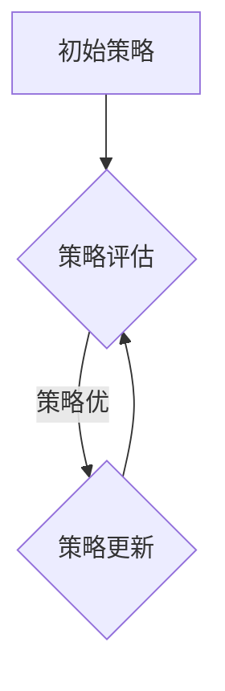

> 智能体，策略迭代，强化学习，Q-learning，价值函数，状态空间，动作空间，奖励函数

## 1. 背景介绍

在人工智能领域，智能体（Agent）扮演着至关重要的角色。智能体是指能够感知环境、做出决策并与环境交互的系统。其目标通常是通过与环境的交互最大化累积的奖励。策略迭代是智能体学习和优化策略的一种重要方法，它通过不断地评估和更新策略，使智能体在环境中取得更好的表现。

近年来，强化学习（Reinforcement Learning，RL）作为一种学习智能体策略的有效方法，取得了显著的进展。策略迭代算法是RL领域的核心算法之一，它在许多应用场景中表现出色，例如游戏、机器人控制、推荐系统等。

## 2. 核心概念与联系

**2.1 智能体**

智能体是一个能够感知环境、做出决策并与环境交互的系统。它拥有以下几个关键特征：

* **感知能力:** 智能体能够感知环境中的状态信息。
* **决策能力:** 智能体能够根据感知到的状态信息做出决策。
* **行动能力:** 智能体能够执行决策，从而改变环境状态。
* **奖励机制:** 智能体通过奖励信号来评估其行为的好坏。

**2.2 策略**

策略是指智能体在不同状态下采取行动的规则。策略可以表示为一个映射关系，将状态映射到动作。

**2.3 价值函数**

价值函数用来评估智能体在特定状态下采取特定策略的长期回报。价值函数越高，表示该策略在该状态下越优。

**2.4 强化学习**

强化学习是一种机器学习方法，它通过智能体与环境的交互来学习策略。智能体在与环境交互的过程中，会获得奖励信号，并根据奖励信号更新其策略，最终学习到一个能够最大化累积奖励的策略。

**2.5 策略迭代**

策略迭代是一种学习策略的算法，它通过不断地评估和更新策略，使智能体在环境中取得更好的表现。策略迭代算法的基本步骤如下：

1. 初始化策略
2. 评估策略
3. 更新策略
4. 重复步骤2和3，直到策略收敛

**2.6 Mermaid 流程图**



## 3. 核心算法原理 & 具体操作步骤

### 3.1 算法原理概述

策略迭代算法的核心思想是通过不断地评估和更新策略，使智能体在环境中取得更好的表现。

策略评估是指评估当前策略在环境中的表现，通常通过价值函数来衡量。策略更新是指根据策略评估的结果，对策略进行调整，使其更加优良。

策略迭代算法的迭代过程可以看作是一个不断优化的循环，直到策略收敛，即策略不再发生显著变化为止。

### 3.2 算法步骤详解

1. **初始化策略:** 首先，需要对智能体初始化一个策略，这个策略可以是随机策略，也可以是基于先验知识的策略。

2. **策略评估:** 使用价值函数评估当前策略在环境中的表现。价值函数可以采用蒙特卡罗方法、TD学习等方法来估计。

3. **策略更新:** 根据策略评估的结果，对策略进行更新。策略更新的目标是提高价值函数的值，即使智能体在环境中取得更好的表现。常用的策略更新方法包括策略梯度法、SARSA算法等。

4. **重复步骤2和3:** 重复步骤2和3，直到策略收敛，即策略不再发生显著变化为止。

### 3.3 算法优缺点

**优点:**

* 理论上可以找到最优策略。
* 能够处理复杂的环境。

**缺点:**

* 计算复杂度较高。
* 收敛速度可能较慢。

### 3.4 算法应用领域

策略迭代算法在许多领域都有应用，例如：

* **游戏:** 策略迭代算法可以用于训练游戏AI，使其能够在游戏中取得更好的表现。
* **机器人控制:** 策略迭代算法可以用于训练机器人控制策略，使其能够在复杂的环境中完成任务。
* **推荐系统:** 策略迭代算法可以用于训练推荐系统，使其能够推荐更符合用户偏好的物品。

## 4. 数学模型和公式 & 详细讲解 & 举例说明

### 4.1 数学模型构建

**状态空间:** 智能体所处的环境状态的集合，记为 S。

**动作空间:** 智能体可以采取的动作的集合，记为 A。

**策略:** 从状态空间到动作空间的映射，记为 π(s)。

**价值函数:** 在状态 s 下采取策略 π 的长期回报的期望，记为 Vπ(s)。

**奖励函数:** 智能体在状态 s 执行动作 a 后获得的奖励，记为 r(s, a)。

**折扣因子:** 用于权衡未来奖励的价值，记为 γ (0 < γ < 1)。

### 4.2 公式推导过程

策略迭代算法的核心公式是价值函数的更新公式：

$$V^{\pi'}(s) = \max_{a \in A} \left[ r(s, a) + \gamma \sum_{s' \in S} P(s' | s, a) V^{\pi'}(s') \right]$$

其中:

* Vπ'(s) 是策略 π' 在状态 s 下的价值函数。
* r(s, a) 是在状态 s 执行动作 a 后获得的奖励。
* P(s' | s, a) 是从状态 s 执行动作 a 到状态 s' 的转移概率。
* γ 是折扣因子。

### 4.3 案例分析与讲解

假设有一个简单的环境，智能体可以采取两种动作：向上和向下。环境的状态由智能体的当前位置决定。智能体的目标是到达环境的顶端。

我们可以使用策略迭代算法来训练智能体。首先，我们可以初始化一个随机策略，然后使用价值函数来评估策略的表现。根据策略评估的结果，我们可以更新策略，使其更加接近最优策略。

通过不断地迭代，智能体最终可以学习到一个能够到达环境顶端的策略。

## 5. 项目实践：代码实例和详细解释说明

### 5.1 开发环境搭建

* Python 3.x
* TensorFlow 或 PyTorch

### 5.2 源代码详细实现

```python
import numpy as np

# 定义状态空间和动作空间
states = [0, 1, 2, 3, 4]
actions = [0, 1]

# 定义奖励函数
def reward_function(state, action):
    if state == 4:
        return 10
    else:
        return -1

# 定义价值函数
def value_function(state, policy):
    # 使用蒙特卡罗方法或TD学习方法估计价值函数
    pass

# 定义策略更新函数
def policy_update(state, value_function):
    # 使用策略梯度法或SARSA算法更新策略
    pass

# 策略迭代算法
def policy_iteration(num_iterations):
    policy = np.random.choice(actions, size=len(states))
    for _ in range(num_iterations):
        # 策略评估
        values = value_function(states, policy)
        # 策略更新
        policy = policy_update(states, values)
    return policy

# 主程序
if __name__ == "__main__":
    policy = policy_iteration(num_iterations=100)
    print("最终策略:", policy)
```

### 5.3 代码解读与分析

* 代码首先定义了状态空间、动作空间、奖励函数和价值函数。
* 然后，代码实现了策略迭代算法，包括策略评估和策略更新步骤。
* 最后，代码执行了策略迭代算法，并打印出最终的策略。

### 5.4 运行结果展示

运行代码后，会输出最终的策略。策略表示在每个状态下应该采取的动作。

## 6. 实际应用场景

策略迭代算法在许多实际应用场景中都有应用，例如：

* **游戏AI:** 策略迭代算法可以用于训练游戏AI，使其能够在游戏中取得更好的表现。例如，AlphaGo 使用策略迭代算法战胜了世界围棋冠军。
* **机器人控制:** 策略迭代算法可以用于训练机器人控制策略，使其能够在复杂的环境中完成任务。例如，机器人可以利用策略迭代算法学习如何导航、抓取物体等。
* **推荐系统:** 策略迭代算法可以用于训练推荐系统，使其能够推荐更符合用户偏好的物品。例如，电商平台可以利用策略迭代算法学习用户喜好，并推荐更相关的商品。

### 6.4 未来应用展望

随着人工智能技术的不断发展，策略迭代算法的应用场景将会更加广泛。例如，策略迭代算法可以用于训练自动驾驶汽车、医疗诊断系统等。

## 7. 工具和资源推荐

### 7.1 学习资源推荐

* **书籍:**
    * Reinforcement Learning: An Introduction by Richard S. Sutton and Andrew G. Barto
    * Deep Reinforcement Learning Hands-On by Maxim Lapan
* **在线课程:**
    * Coursera: Reinforcement Learning Specialization by David Silver
    * Udacity: Deep Reinforcement Learning Nanodegree

### 7.2 开发工具推荐

* **TensorFlow:** 一个开源的机器学习框架，支持策略迭代算法的实现。
* **PyTorch:** 另一个开源的机器学习框架，也支持策略迭代算法的实现。

### 7.3 相关论文推荐

* **Deep Q-Network (DQN):** https://arxiv.org/abs/1312.5602
* **Proximal Policy Optimization (PPO):** https://arxiv.org/abs/1707.06347

## 8. 总结：未来发展趋势与挑战

### 8.1 研究成果总结

策略迭代算法是一种有效的学习智能体策略的方法，它在许多领域取得了显著的进展。

### 8.2 未来发展趋势

* **深度强化学习:** 将深度神经网络与策略迭代算法结合，提高智能体的学习能力和泛化能力。
* **多智能体强化学习:** 研究多个智能体在同一个环境中交互学习的策略。
* **安全强化学习:** 研究如何在保证系统安全性的前提下学习策略。

### 8.3 面临的挑战

* **样本效率:** 强化学习算法通常需要大量的样本数据才能学习到有效的策略。
* **探索与利用的平衡:** 智能体需要在探索新策略和利用已知策略之间找到平衡。
* **可解释性:** 强化学习模型的决策过程通常难以解释，这限制了其在一些应用场景中的应用。

### 8.4 研究展望

未来，策略迭代算法的研究将继续朝着更有效、更安全、更可解释的方向发展。


## 9. 附录：常见问题与解答

**Q1: 策略迭代算法的收敛性如何保证？**

**A1:** 策略迭代算法的收敛性取决于价值函数的更新方法和策略更新方法。通常情况下，如果价值函数的更新方法是收敛的，并且策略更新方法能够保证策略朝着最优方向更新，那么策略迭代算法可以收敛到一个局部最优策略。

**Q2: 策略迭代算法的计算复杂度如何？**

**A2:** 策略迭代算法的计算复杂度取决于状态空间和动作空间的大小，以及价值函数的更新方法。一般来说，策略迭代算法的计算复杂度较高，尤其是在状态空间和动作空间很大的情况下。

**Q3: 策略迭代算法有哪些变种？**

**A3:** 策略迭代算法有很多变种，例如：

* **Q-learning:** 是一种基于Q值的策略迭代算法。
* **SARSA:** 是一种基于状态-动作-奖励的策略迭代算法。
* **Policy Gradient:** 是一种基于策略梯度的策略迭代算法。


作者：禅与计算机程序设计艺术 / Zen and the Art of Computer Programming 
<end_of_turn>