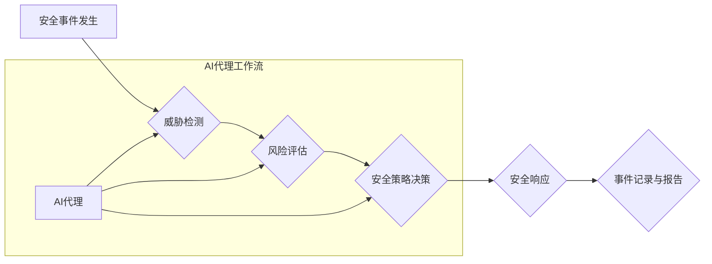

> AI代理工作流，网络安全，自动化安全，威胁检测，响应自动化，机器学习，深度学习

## 1. 背景介绍

随着数字化转型和云计算的蓬勃发展，网络安全面临着前所未有的挑战。传统的安全防御机制难以应对日益复杂的攻击手段和不断演变的威胁环境。为了提高网络安全的效率和灵活性，人工智能（AI）技术逐渐成为网络安全领域的重要驱动力。

AI代理工作流（AI Agent WorkFlow）作为一种基于人工智能的自动化安全解决方案，正在改变网络安全领域的面貌。它利用机器学习、深度学习等人工智能技术，构建智能代理，自动执行安全任务，提高安全响应速度和准确性。

## 2. 核心概念与联系

**2.1 AI代理工作流的概念**

AI代理工作流是指利用人工智能技术构建智能代理，自动执行安全任务的自动化工作流程。

**2.2 核心概念**

* **AI代理（AI Agent）：** 具备自主学习、决策和执行能力的智能实体，能够根据预设规则或学习到的知识，自动执行安全任务。
* **工作流（Workflow）：** 一系列相互关联的步骤或任务，用于完成特定的目标。
* **自动化安全（Automated Security）：** 利用自动化技术，提高安全操作的效率和准确性，减少人为错误。

**2.3 架构图**



**2.4 联系**

AI代理工作流将AI代理与安全工作流程相结合，实现自动化安全。AI代理可以自动执行威胁检测、风险评估、安全策略决策和安全响应等任务，提高网络安全的效率和准确性。

## 3. 核心算法原理 & 具体操作步骤

**3.1 算法原理概述**

AI代理工作流的核心算法原理基于机器学习和深度学习。

* **机器学习（Machine Learning）：** 通过训练模型，使AI代理能够从数据中学习，识别威胁模式和安全事件。
* **深度学习（Deep Learning）：** 利用多层神经网络，实现更复杂的特征提取和模式识别，提高威胁检测的准确性。

**3.2 算法步骤详解**

1. **数据收集和预处理：** 收集网络安全相关数据，例如日志、流量、威胁情报等，并进行预处理，例如清洗、格式化、特征提取等。
2. **模型训练：** 利用机器学习或深度学习算法，训练AI代理模型，使其能够识别威胁模式和安全事件。
3. **威胁检测：** AI代理根据训练好的模型，对网络流量、系统日志等数据进行分析，识别潜在的威胁。
4. **风险评估：** AI代理对检测到的威胁进行风险评估，判断其严重程度和潜在影响。
5. **安全策略决策：** AI代理根据风险评估结果，选择合适的安全策略，例如隔离受感染主机、阻止恶意流量等。
6. **安全响应：** AI代理自动执行安全响应策略，例如封锁恶意IP地址、删除恶意文件等。
7. **事件记录与报告：** AI代理记录安全事件和响应操作，并生成报告，供安全人员进行分析和调查。

**3.3 算法优缺点**

* **优点：**
    * 自动化安全操作，提高效率和准确性。
    * 能够识别复杂的威胁模式，提高威胁检测能力。
    * 能够快速响应安全事件，降低安全风险。
* **缺点：**
    * 需要大量安全数据进行训练，训练成本较高。
    * 模型需要定期更新，以适应不断变化的威胁环境。
    * 存在误报风险，需要安全人员进行监控和验证。

**3.4 算法应用领域**

AI代理工作流在网络安全领域具有广泛的应用场景，例如：

* **威胁检测和响应：** 自动检测和响应网络攻击，例如恶意软件感染、勒索软件攻击、DDoS攻击等。
* **安全事件分析：** 自动分析安全事件，识别攻击模式和攻击者行为。
* **漏洞管理：** 自动识别和修复系统漏洞，降低安全风险。
* **安全合规性：** 自动执行安全合规性检查，确保企业符合相关安全标准。

## 4. 数学模型和公式 & 详细讲解 & 举例说明

**4.1 数学模型构建**

AI代理工作流的数学模型可以基于概率论和统计学构建，例如：

* **贝叶斯网络：** 用于表示事件之间的依赖关系，并计算事件发生的概率。
* **决策树：** 用于表示决策规则，并根据输入数据进行决策。
* **支持向量机（SVM）：** 用于分类和识别威胁模式。

**4.2 公式推导过程**

例如，使用贝叶斯网络模型进行威胁检测，可以推导出以下公式：

$$P(Threat|Evidence) = \frac{P(Evidence|Threat) * P(Threat)}{P(Evidence)}$$

其中：

* $P(Threat|Evidence)$：给定证据的情况下，威胁发生的概率。
* $P(Evidence|Threat)$：给定威胁的情况下，证据出现的概率。
* $P(Threat)$：威胁发生的概率。
* $P(Evidence)$：证据出现的概率。

**4.3 案例分析与讲解**

假设我们有一个AI代理，用于检测恶意软件感染。

* $Evidence$：系统日志中出现可疑的进程或文件操作。
* $Threat$：系统被恶意软件感染。

如果我们收集到大量的数据，并训练了AI代理模型，可以得到以下概率：

* $P(Evidence|Threat) = 0.9$（给定系统被感染，出现可疑操作的概率）
* $P(Threat) = 0.01$（系统被感染的概率）
* $P(Evidence) = 0.05$（出现可疑操作的概率）

根据贝叶斯公式，我们可以计算出：

$$P(Threat|Evidence) = \frac{0.9 * 0.01}{0.05} = 0.18$$

这意味着，给定系统日志中出现可疑操作，系统被恶意软件感染的概率为18%。

## 5. 项目实践：代码实例和详细解释说明

**5.1 开发环境搭建**

* 操作系统：Ubuntu 20.04
* Python 版本：3.8
* 必要的库：TensorFlow、PyTorch、Scikit-learn等

**5.2 源代码详细实现**

```python
# 威胁检测模型
from sklearn.ensemble import RandomForestClassifier

# 加载训练数据
X_train, y_train = load_data()

# 训练模型
model = RandomForestClassifier()
model.fit(X_train, y_train)

# 预测威胁
X_test = load_test_data()
predictions = model.predict(X_test)

# 输出预测结果
print(predictions)
```

**5.3 代码解读与分析**

* 该代码示例使用随机森林模型进行威胁检测。
* 首先加载训练数据和测试数据。
* 然后训练随机森林模型。
* 最后使用训练好的模型预测测试数据，并输出预测结果。

**5.4 运行结果展示**

运行代码后，会输出预测结果，例如：

```
[0 1 0 1 0]
```

其中，0表示非威胁，1表示威胁。

## 6. 实际应用场景

**6.1 威胁检测与响应**

AI代理工作流可以自动检测和响应网络攻击，例如：

* **恶意软件感染：** AI代理可以识别恶意软件的特征，并自动隔离受感染主机。
* **勒索软件攻击：** AI代理可以检测勒索软件的活动，并自动备份重要数据。
* **DDoS攻击：** AI代理可以识别DDoS攻击的流量模式，并自动阻止攻击流量。

**6.2 安全事件分析**

AI代理工作流可以自动分析安全事件，识别攻击模式和攻击者行为，例如：

* **攻击路径分析：** AI代理可以分析攻击者入侵网络的路径，识别漏洞和弱点。
* **攻击者行为分析：** AI代理可以分析攻击者的行为模式，识别攻击者的身份和动机。

**6.3 漏洞管理**

AI代理工作流可以自动识别和修复系统漏洞，降低安全风险，例如：

* **漏洞扫描：** AI代理可以自动扫描系统漏洞，并生成漏洞报告。
* **漏洞修复：** AI代理可以自动修复已知的漏洞，并应用补丁。

**6.4 未来应用展望**

AI代理工作流在未来将有更广泛的应用场景，例如：

* **安全态势感知：** AI代理可以收集和分析来自不同安全源的信息，提供全面的安全态势感知。
* **主动防御：** AI代理可以主动识别和防御新的威胁，例如零日漏洞。
* **安全自动化：** AI代理可以自动化更多的安全任务，例如安全配置管理、安全审计等。

## 7. 工具和资源推荐

**7.1 学习资源推荐**

* **书籍：**
    * 《人工智能：一种现代方法》
    * 《深度学习》
* **在线课程：**
    * Coursera：机器学习、深度学习
    * edX：人工智能导论

**7.2 开发工具推荐**

* **Python：** 广泛用于AI开发，拥有丰富的库和框架。
* **TensorFlow：** Google开发的开源深度学习框架。
* **PyTorch：** Facebook开发的开源深度学习框架。
* **Scikit-learn：** Python机器学习库。

**7.3 相关论文推荐**

* **论文标题：** AI-Powered Security Operations: A Survey
* **论文链接：** https://arxiv.org/abs/2006.09737

## 8. 总结：未来发展趋势与挑战

**8.1 研究成果总结**

AI代理工作流在网络安全领域取得了显著的成果，例如：

* 自动化安全操作，提高效率和准确性。
* 识别复杂的威胁模式，提高威胁检测能力。
* 快速响应安全事件，降低安全风险。

**8.2 未来发展趋势**

* **更智能的AI代理：** 利用更先进的AI算法，构建更智能的AI代理，能够自主学习和决策。
* **更全面的安全覆盖：** 将AI代理工作流应用到更广泛的安全场景，例如云安全、移动安全等。
* **更强的协作能力：** 构建AI代理之间的协作机制，实现更有效的安全防御。

**8.3 面临的挑战**

* **数据安全和隐私保护：** AI代理工作流需要大量安全数据进行训练，如何保证数据安全和隐私保护是一个重要挑战。
* **模型可解释性和信任度：** AI代理的决策过程往往是复杂的，如何提高模型的可解释性和信任度是一个关键问题。
* **技术标准和规范：** 缺乏统一的技术标准和规范，导致AI代理工作流的互操作性和可移植性问题。

**8.4 研究展望**

未来，我们将继续研究AI代理工作流，探索更智能、更安全、更有效的AI安全解决方案。


## 9. 附录：常见问题与解答

**9.1 如何选择合适的AI代理工作流平台？**

选择合适的AI代理工作流平台需要考虑以下因素：

* 平台的功能和特性：平台是否支持您需要的安全功能，例如威胁检测、安全事件分析、漏洞管理等。
* 平台的易用性和可扩展性：平台是否易于使用和扩展，是否能够满足您的未来需求。
* 平台的安全性：平台是否能够保证数据的安全性和隐私保护。

**9.2 如何训练AI代理模型？**

训练AI