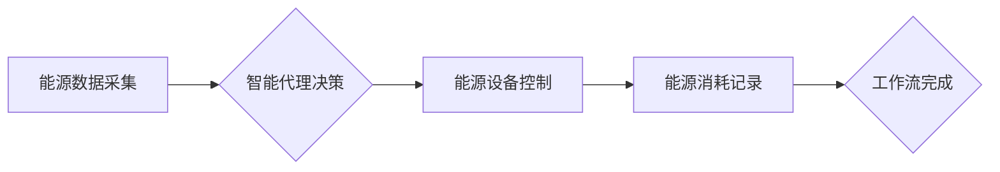

> 智能代理，能源管理系统，AI人工智能，工作流自动化，机器学习，优化算法，预测模型

## 1. 背景介绍

随着全球对可持续发展目标的日益重视，能源管理系统 (EMS) 作为实现能源效率和减少碳排放的关键环节，正迎来前所未有的发展机遇。传统EMS通常依赖于预设规则和人工干预，难以适应不断变化的能源需求和市场环境。而人工智能 (AI) 技术的快速发展为EMS的智能化转型提供了强有力的支撑。

智能代理 (AI Agent) 作为AI技术的核心应用之一，能够自主学习、决策和执行任务，在EMS领域展现出巨大的潜力。智能代理可以根据实时数据和预设目标，自动调节能源设备运行状态，优化能源分配，并预测未来能源需求，从而实现能源管理的智能化、自动化和高效化。

## 2. 核心概念与联系

### 2.1 智能代理

智能代理是一种能够感知环境、做出决策并执行行动的软件实体。它通常具有以下特征：

* **自主性:** 智能代理能够独立完成任务，无需人工干预。
* **学习能力:** 智能代理能够从经验中学习，不断改进其决策策略。
* **适应性:** 智能代理能够适应不断变化的环境，调整其行为策略。
* **目标导向:** 智能代理的目标是实现预设的目标，并最大化其效用。

### 2.2 工作流自动化

工作流自动化是指通过软件工具自动执行一系列预定义的任务，提高工作效率和准确性。在EMS领域，工作流自动化可以用于管理能源设备的运行状态、调度能源分配、记录能源消耗等多个环节。

### 2.3 核心概念联系

智能代理与工作流自动化相结合，可以构建智能代理工作流 (AI Agent WorkFlow)，实现EMS的智能化管理。智能代理可以作为工作流中的执行者，根据实时数据和预设规则，自动执行工作流中的任务，并根据学习和反馈，不断优化工作流程。

**Mermaid 流程图**



## 3. 核心算法原理 & 具体操作步骤

### 3.1 算法原理概述

智能代理工作流的核心算法通常基于机器学习和优化算法。

* **机器学习:** 用于训练智能代理，使其能够从历史数据中学习能源需求模式、设备运行规律等知识，并根据学习到的知识进行预测和决策。
* **优化算法:** 用于优化能源分配方案，例如遗传算法、模拟退火算法等，能够找到最优的能源分配方案，最大化能源利用效率。

### 3.2 算法步骤详解

1. **数据采集:** 收集能源设备运行数据、能源消耗数据、天气数据等相关信息。
2. **数据预处理:** 对采集到的数据进行清洗、转换、特征提取等预处理操作，使其能够被机器学习算法使用。
3. **模型训练:** 使用机器学习算法训练智能代理模型，例如预测未来能源需求、识别设备故障等。
4. **决策执行:** 智能代理根据训练好的模型，对能源设备进行控制，例如调节设备运行状态、调度能源分配等。
5. **结果评估:** 对智能代理的决策结果进行评估，并根据评估结果进行模型调整和优化。

### 3.3 算法优缺点

**优点:**

* **智能化:** 智能代理能够自主学习和决策，提高能源管理的智能化水平。
* **自动化:** 智能代理能够自动执行任务，减少人工干预，提高工作效率。
* **优化性:** 智能代理能够优化能源分配方案，提高能源利用效率。

**缺点:**

* **数据依赖:** 智能代理的性能依赖于训练数据的质量和数量。
* **复杂性:** 智能代理的开发和维护需要专业技术人员。
* **安全性:** 智能代理的安全性和可靠性需要得到保障。

### 3.4 算法应用领域

智能代理工作流在能源管理系统中的应用领域非常广泛，例如:

* **智能电网:** 智能代理可以用于预测电力需求、调度电力资源、控制电力设备运行等。
* **建筑能源管理:** 智能代理可以用于优化建筑的供暖、制冷、照明等能源消耗。
* **工业能源管理:** 智能代理可以用于优化工业生产过程中的能源消耗。

## 4. 数学模型和公式 & 详细讲解 & 举例说明

### 4.1 数学模型构建

在智能代理工作流中，常用的数学模型包括：

* **预测模型:** 用于预测未来能源需求，例如ARIMA模型、神经网络模型等。
* **优化模型:** 用于优化能源分配方案，例如线性规划模型、整数规划模型等。

### 4.2 公式推导过程

**预测模型:**

假设我们使用ARIMA模型预测未来能源需求，其数学公式如下:

$$
y_t = c + \sum_{i=1}^p \phi_i y_{t-i} + \sum_{j=1}^q \theta_j \epsilon_{t-j} + \epsilon_t
$$

其中:

* $y_t$ 是时间t的能源需求
* $c$ 是截距项
* $\phi_i$ 是自回归系数
* $\theta_j$ 是移动平均系数
* $\epsilon_t$ 是随机误差项

**优化模型:**

假设我们使用线性规划模型优化能源分配方案，其数学公式如下:

$$
\begin{aligned}
\text{目标函数: } & \text{最大化 } \sum_{i=1}^n w_i x_i \\
\text{约束条件: } & \sum_{i=1}^n a_{ij} x_i \leq b_j, j = 1, 2, ..., m
\end{aligned}
$$

其中:

* $x_i$ 是能源分配变量
* $w_i$ 是能源分配权重
* $a_{ij}$ 是约束条件系数
* $b_j$ 是约束条件值

### 4.3 案例分析与讲解

**案例:**

假设我们有一个智能电网系统，需要预测未来电力需求并优化电力分配方案。

**预测模型:**

我们可以使用ARIMA模型预测未来电力需求，并根据预测结果调整电力设备的运行状态。

**优化模型:**

我们可以使用线性规划模型优化电力分配方案，例如根据不同用户的电力需求和价格，分配电力资源。

## 5. 项目实践：代码实例和详细解释说明

### 5.1 开发环境搭建

* 操作系统: Ubuntu 20.04
* Python 版本: 3.8
* 必要的库: pandas, numpy, scikit-learn, matplotlib, tensorflow

### 5.2 源代码详细实现

```python
# 导入必要的库
import pandas as pd
from sklearn.model_selection import train_test_split
from sklearn.linear_model import LinearRegression

# 加载数据
data = pd.read_csv('energy_data.csv')

# 数据预处理
X = data[['temperature', 'humidity', 'wind_speed']]
y = data['energy_consumption']

# 将数据分成训练集和测试集
X_train, X_test, y_train, y_test = train_test_split(X, y, test_size=0.2, random_state=42)

# 训练线性回归模型
model = LinearRegression()
model.fit(X_train, y_train)

# 预测测试集数据
y_pred = model.predict(X_test)

# 评估模型性能
from sklearn.metrics import mean_squared_error
mse = mean_squared_error(y_test, y_pred)
print(f'Mean Squared Error: {mse}')
```

### 5.3 代码解读与分析

* 代码首先导入必要的库，然后加载能源数据。
* 数据预处理步骤包括特征选择和数据分割。
* 训练线性回归模型并评估模型性能。

### 5.4 运行结果展示

运行代码后，会输出模型的均方误差 (MSE) 值，用于评估模型的预测精度。

## 6. 实际应用场景

### 6.1 智能电网

智能代理可以用于预测电力需求、调度电力资源、控制电力设备运行等，提高电网的运行效率和可靠性。

### 6.2 建筑能源管理

智能代理可以根据建筑的能源消耗数据和环境条件，优化建筑的供暖、制冷、照明等能源消耗，降低建筑的能耗。

### 6.3 工业能源管理

智能代理可以根据工业生产过程中的能源消耗数据，优化生产过程中的能源使用，降低工业企业的能耗。

### 6.4 未来应用展望

随着AI技术的不断发展，智能代理工作流在能源管理系统中的应用场景将更加广泛，例如:

* **微电网管理:** 智能代理可以帮助微电网实现自主运行和能源互补。
* **虚拟电厂:** 智能代理可以帮助虚拟电厂优化能源资源调度和电力交易。
* **分布式能源管理:** 智能代理可以帮助分布式能源系统实现智能化管理和优化。

## 7. 工具和资源推荐

### 7.1 学习资源推荐

* **书籍:**
    * "Reinforcement Learning: An Introduction" by Richard S. Sutton and Andrew G. Barto
    * "Deep Learning" by Ian Goodfellow, Yoshua Bengio, and Aaron Courville
* **在线课程:**
    * Coursera: Machine Learning by Andrew Ng
    * Udacity: Artificial Intelligence Nanodegree

### 7.2 开发工具推荐

* **Python:** 作为AI开发的常用语言，Python拥有丰富的库和框架，例如TensorFlow、PyTorch、Scikit-learn等。
* **Jupyter Notebook:** 用于交互式编程和数据可视化。
* **Docker:** 用于容器化部署和环境管理。

### 7.3 相关论文推荐

* "Deep Reinforcement Learning for Energy Management in Smart Grids"
* "A Survey on Intelligent Agents for Energy Management"
* "Smart Grids: An Overview"

## 8. 总结：未来发展趋势与挑战

### 8.1 研究成果总结

智能代理工作流在能源管理系统中的应用取得了显著成果，能够提高能源管理的智能化、自动化和高效化。

### 8.2 未来发展趋势

* **模型复杂度提升:** 未来将开发更复杂、更智能的预测和优化模型，例如深度学习模型、强化学习模型等。
* **数据融合:** 将更多类型的数据融合到智能代理工作流中，例如天气数据、用户行为数据等，提高预测和决策的准确性。
* **边缘计算:** 将智能代理工作流部署到边缘设备上，实现更快速的决策和响应。

### 8.3 面临的挑战

* **数据安全:** 智能代理工作流需要处理大量敏感数据，数据安全是一个重要的挑战。
* **算法解释性:** 许多AI算法的决策过程难以解释，这可能会导致信任问题。
* **标准化:** 目前智能代理工作流缺乏统一的标准和规范，这可能会阻碍其广泛应用。

### 8.4 研究展望

未来研究将重点关注以下几个方面:

* **开发更安全、更可靠的智能代理工作流。**
* **提高智能代理工作流的解释性，增强用户信任。**
* **推动智能代理工作流的标准化，促进其产业化发展。**

## 9. 附录：常见问题与解答

**常见问题:**

* **智能代理工作流的成本如何?**

**解答:** 智能代理工作流的成本取决于具体应用场景、模型复杂度和数据量等因素。

* **智能代理工作流的安全性如何保证?**

**解答:** 智能代理工作流的安全性可以通过数据加密、身份验证、访问控制等措施保障。

* **智能代理工作流的维护成本如何?**

**解答:** 智能代理工作流的维护成本取决于