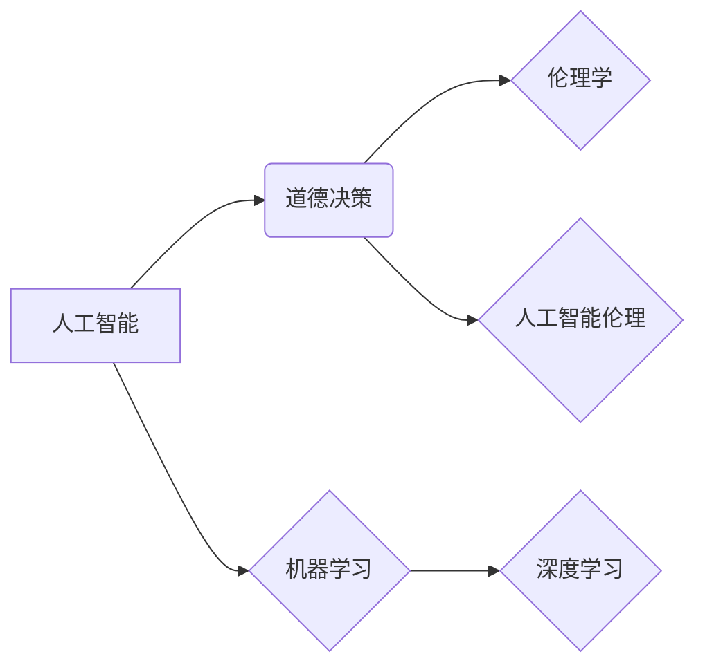

> AI, 人工智能, 算法, 道德决策, 伦理, 机器学习, 深度学习, 代码实例

## 1. 背景介绍

人工智能（AI）正以惊人的速度发展，渗透到我们生活的方方面面。从自动驾驶汽车到医疗诊断，从个性化推荐到金融风险评估，AI正在改变着世界。然而，随着AI技术的进步，一个至关重要的议题也日益凸显：AI的道德决策。

传统算法通常基于明确的规则和逻辑，而AI算法则依赖于海量数据进行学习和推理。这使得AI系统在面对复杂、模糊、多变的现实世界时，更容易产生不可预知的决策结果，甚至可能带来伦理和社会问题。例如，自动驾驶汽车在遇到紧急情况时如何做出选择？医疗AI系统在诊断疾病时如何平衡准确性和患者隐私？这些问题都需要我们认真思考和探讨。

## 2. 核心概念与联系

**2.1 道德决策**

道德决策是指在面临各种选择时，根据道德原则和价值观做出符合伦理规范的判断和行动。它涉及到对善恶、对错、正义、公平等概念的理解和应用。

**2.2 人工智能与道德决策**

将道德决策融入AI系统的设计和开发，使其能够做出符合人类道德规范的决策，是当前AI研究领域的重要课题。这需要解决以下几个关键问题：

* 如何定义和量化AI系统的道德原则？
* 如何将道德原则融入AI算法的设计和训练过程中？
* 如何评估AI系统的道德决策能力？
* 如何确保AI系统的道德决策能够被人类理解和接受？

**2.3 相关概念**

* **伦理学:** 研究人类行为的道德规范和价值观。
* **人工智能伦理:** 研究人工智能技术对人类社会的影响，以及如何确保AI技术的发展和应用符合伦理规范。
* **机器学习:** 一种人工智能技术，通过学习数据来构建预测模型。
* **深度学习:** 一种机器学习的子领域，使用多层神经网络来模拟人类大脑的学习过程。

**2.4 核心概念关系图**



## 3. 核心算法原理 & 具体操作步骤

### 3.1 算法原理概述

在AI领域，有多种算法可以用于实现道德决策，例如：

* **规则ベースシステム:** 基于预先定义的规则和逻辑进行决策。
* **案例ベースシステム:** 根据历史案例进行决策。
* **机器学习算法:** 通过学习数据来构建决策模型。

其中，机器学习算法由于其强大的学习能力和适应性，在道德决策领域具有广阔的应用前景。

### 3.2 算法步骤详解

以机器学习算法为例，其道德决策步骤可以概括为以下几个阶段：

1. **数据收集和预处理:** 收集包含道德相关信息的训练数据，并进行清洗、转换和特征工程等预处理工作。
2. **模型选择和训练:** 选择合适的机器学习算法，并根据训练数据进行模型训练。
3. **模型评估和优化:** 使用测试数据评估模型的性能，并根据评估结果进行模型优化。
4. **部署和监控:** 将训练好的模型部署到实际应用场景中，并持续监控模型的性能和行为，及时进行调整和更新。

### 3.3 算法优缺点

**优点:**

* 能够学习和适应复杂的道德场景。
* 可以处理大量数据，发现隐藏的模式和关系。
* 具有较强的泛化能力，能够应用于不同的领域和场景。

**缺点:**

* 需要大量高质量的训练数据。
* 模型训练过程可能存在偏差和误差。
* 模型的决策过程难以解释和理解。

### 3.4 算法应用领域

* **自动驾驶:** 帮助自动驾驶汽车在复杂路况下做出安全和合乎道德的决策。
* **医疗诊断:** 辅助医生进行疾病诊断，并提供个性化的治疗方案。
* **金融风险评估:** 识别和评估金融风险，帮助金融机构做出更明智的决策。
* **法律判决:** 辅助法官进行法律判决，提高判决的公平性和准确性。

## 4. 数学模型和公式 & 详细讲解 & 举例说明

### 4.1 数学模型构建

在AI道德决策中，常用的数学模型包括：

* **效用函数:** 用于量化决策结果的价值或效用。
* **决策树:** 用于表示决策过程的树形结构。
* **贝叶斯网络:** 用于表示变量之间的概率关系。

### 4.2 公式推导过程

以效用函数为例，假设一个AI系统需要做出两个选择，A和B，其对应的效用分别为U(A)和U(B)。则AI系统可以选择效用最大的选项：

$$
\text{选择} = \begin{cases}
A, & \text{if } U(A) > U(B) \\
B, & \text{if } U(B) \geq U(A)
\end{cases}
$$

### 4.3 案例分析与讲解

例如，一个自动驾驶汽车需要在遇到行人时做出决策，可以选择减速避让或继续行驶。我们可以将这两个选项分别作为A和B，并将行人的安全和汽车的安全性作为效用函数的指标。通过收集数据并训练模型，可以得到每个选项对应的效用值，从而帮助AI系统做出最优决策。

## 5. 项目实践：代码实例和详细解释说明

### 5.1 开发环境搭建

* Python 3.x
* TensorFlow 或 PyTorch 等深度学习框架
* Jupyter Notebook 或其他代码编辑器

### 5.2 源代码详细实现

```python
import tensorflow as tf

# 定义模型结构
model = tf.keras.models.Sequential([
    tf.keras.layers.Dense(64, activation='relu', input_shape=(10,)),
    tf.keras.layers.Dense(32, activation='relu'),
    tf.keras.layers.Dense(1, activation='sigmoid')
])

# 编译模型
model.compile(optimizer='adam', loss='binary_crossentropy', metrics=['accuracy'])

# 训练模型
model.fit(X_train, y_train, epochs=10)

# 评估模型
loss, accuracy = model.evaluate(X_test, y_test)
print('Loss:', loss)
print('Accuracy:', accuracy)
```

### 5.3 代码解读与分析

这段代码展示了使用TensorFlow框架构建一个简单的深度学习模型进行道德决策的示例。

* 模型结构：使用两层全连接神经网络，输入层有10个特征，输出层只有一个神经元，用于预测决策结果（0或1）。
* 编译模型：使用Adam优化器、二分类交叉熵损失函数和准确率作为评估指标。
* 训练模型：使用训练数据训练模型10个epochs。
* 评估模型：使用测试数据评估模型的性能。

### 5.4 运行结果展示

运行结果会显示模型的损失值和准确率，可以根据这些指标评估模型的性能。

## 6. 实际应用场景

### 6.1 自动驾驶汽车

自动驾驶汽车需要在复杂路况下做出安全和合乎道德的决策，例如：

* 在遇到行人时，是否减速避让？
* 在遇到交通事故时，如何选择最佳路线？
* 在遇到紧急情况时，如何保护乘客的安全？

AI道德决策算法可以帮助自动驾驶汽车做出更安全、更可靠的决策。

### 6.2 医疗诊断

医疗AI系统可以辅助医生进行疾病诊断，并提供个性化的治疗方案。

* 在诊断疾病时，如何平衡准确性和患者隐私？
* 在推荐治疗方案时，如何考虑患者的个人情况和风险因素？
* 在提供医疗建议时，如何确保信息准确性和可靠性？

AI道德决策算法可以帮助医疗AI系统做出更安全、更可靠的决策。

### 6.3 其他应用场景

* 金融风险评估
* 法律判决
* 军事决策
* 人工智能监管

## 7. 工具和资源推荐

### 7.1 学习资源推荐

* **书籍:**

    * 《人工智能：一种现代方法》
    * 《深度学习》
    * 《人工智能伦理》

* **在线课程:**

    * Coursera
    * edX
    * Udacity

### 7.2 开发工具推荐

* **Python:** 广泛用于AI开发的编程语言。
* **TensorFlow:** 开源深度学习框架。
* **PyTorch:** 开源深度学习框架。
* **Jupyter Notebook:** 用于代码编写和可视化分析的工具。

### 7.3 相关论文推荐

* **《On the Dangers of Stochastic Parrots: Can Language Models Be Too Big?》**
* **《Ethical Considerations for Artificial Intelligence》**
* **《AI Ethics: A Guide for Developers》**

## 8. 总结：未来发展趋势与挑战

### 8.1 研究成果总结

近年来，AI道德决策领域取得了显著进展，涌现出许多新的算法和方法。

* **强化学习:** 可以训练AI系统在复杂环境中做出更智能的决策。
* **联邦学习:** 可以保护数据隐私，同时实现模型训练。
* **可解释AI:** 可以帮助人类理解AI系统的决策过程。

### 8.2 未来发展趋势

* **更加注重伦理规范:** AI道德决策算法的设计和开发将更加注重伦理规范和社会价值观。
* **更加注重可解释性:** AI系统的决策过程将更加透明和可解释，以便人类能够更好地理解和信任AI系统。
* **更加注重公平性和不偏见:** AI系统将更加注重公平性和不偏见，避免产生歧视和偏见。

### 8.3 面临的挑战

* **数据偏差:** 训练数据可能存在偏差，导致AI系统产生不公平或不准确的决策。
* **黑盒问题:** 许多AI算法的决策过程难以解释，这使得人们难以理解AI系统的决策依据。
* **责任归属:** 当AI系统做出错误决策时，责任应该归属谁？

### 8.4 研究展望

未来，AI道德决策领域将继续面临许多挑战，但也充满了机遇。我们需要不断探索新的算法和方法，并与社会各界共同努力，确保AI技术的发展和应用符合人类的利益和价值观。

## 9. 附录：常见问题与解答

**Q1: 如何确保AI系统的道德决策能力？**

A1: 通过以下方式可以提高AI系统的道德决策能力：

* 使用高质量的训练数据，并进行数据清洗和偏差检测。
* 设计合理的算法架构，并融入伦理原则和价值观。
* 使用可解释AI技术，使AI系统的决策过程更加透明和可理解。
* 进行持续的评估和监控，及时发现和解决问题。

**Q2: 当AI系统做出错误决策时，责任应该归属谁？**

A2: 当AI系统做出错误决策时，责任归属是一个复杂的问题，需要综合考虑多个因素，例如：

* AI系统的设计者和开发人员
* AI系统的使用者
* AI系统的训练数据提供者

需要制定明确的责任机制，明确各方的责任和义务。

**Q3: AI道德决策是否会取代人类的道德判断？**

A3: AI道德决策算法可以辅助人类做出更明智的决策，但不会取代人类的道德判断。人类的道德判断需要考虑复杂的社会、文化和情感因素，而AI系统目前还无法完全模拟这些因素。


作者：禅与计算机程序设计艺术 / Zen and the Art of Computer Programming 
<end_of_turn>