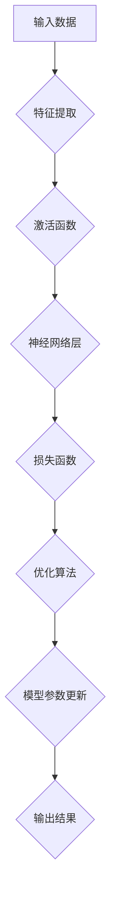

> 深度学习、神经网络、机器学习、算法框架、学习与适应、人工智能

## 1. 背景介绍

人工智能（AI）正以惊人的速度发展，深度学习作为其核心驱动力，在图像识别、自然语言处理、语音识别等领域取得了突破性进展。深度学习算法的成功离不开其强大的学习和适应能力，能够从海量数据中自动提取特征，并不断优化模型参数，从而实现对复杂问题的解决。

然而，深度学习算法的复杂性和黑盒属性也带来了许多挑战。如何更好地理解和控制深度学习算法的学习过程，如何提高算法的泛化能力和鲁棒性，这些问题仍然是人工智能领域的研究热点。

本文将深入探讨深度学习算法的学习与适应机制，分析其核心概念、算法原理、数学模型以及实际应用场景，并展望其未来发展趋势。

## 2. 核心概念与联系

深度学习的核心概念包括神经网络、激活函数、损失函数、优化算法等。

**2.1 神经网络**

神经网络是一种模仿人脑神经元结构的计算模型，由多个层级的神经元组成。每个神经元接收来自上一层的输入信号，经过激活函数处理后，将输出信号传递给下一层神经元。

**2.2 激活函数**

激活函数是神经网络中一个重要的组成部分，它决定了神经元的输出信号是否被传递到下一层。常见的激活函数包括 sigmoid 函数、ReLU 函数、tanh 函数等。

**2.3 损失函数**

损失函数用于衡量模型预测结果与真实值的差异。深度学习算法的目标是通过优化损失函数，找到最优的模型参数。常见的损失函数包括均方误差、交叉熵等。

**2.4 优化算法**

优化算法用于更新模型参数，使其能够最小化损失函数。常见的优化算法包括梯度下降、Adam 算法、RMSprop 算法等。

**2.5 学习与适应**

深度学习算法通过不断调整模型参数，使其能够更好地拟合训练数据，从而实现学习和适应。

**2.6 Mermaid 流程图**



## 3. 核心算法原理 & 具体操作步骤

### 3.1 算法原理概述

深度学习算法的核心原理是利用多层神经网络，通过逐层学习特征，最终实现对复杂问题的解决。

**3.1.1 多层神经网络**

深度学习算法通常使用多层神经网络，每个神经元连接多个上一层的输出神经元，形成多层结构。

**3.1.2 逐层学习特征**

每一层神经网络都学习不同的特征。浅层神经网络学习低层次的特征，例如边缘、纹理等；深层神经网络可以学习更高层次的抽象特征，例如物体、场景等。

**3.1.3 参数优化**

深度学习算法通过优化算法，不断调整模型参数，使其能够最小化损失函数，从而提高模型的预测精度。

### 3.2 算法步骤详解

**3.2.1 数据预处理**

首先需要对输入数据进行预处理，例如归一化、标准化、特征提取等。

**3.2.2 网络结构设计**

根据具体任务需求，设计合适的网络结构，包括神经网络的层数、神经元数量、激活函数等。

**3.2.3 训练模型**

使用训练数据训练模型，通过反向传播算法，更新模型参数，使其能够最小化损失函数。

**3.2.4 模型评估**

使用测试数据评估模型的性能，例如准确率、召回率、F1 值等。

**3.2.5 模型部署**

将训练好的模型部署到实际应用场景中，例如图像识别、语音识别等。

### 3.3 算法优缺点

**3.3.1 优点**

* 强大的学习能力，能够从海量数据中自动提取特征。
* 能够解决复杂问题，例如图像识别、自然语言处理等。
* 性能不断提升，取得了突破性进展。

**3.3.2 缺点**

* 算法复杂，难以理解和解释。
* 需要大量的训练数据，训练成本高。
* 容易过拟合，泛化能力差。

### 3.4 算法应用领域

深度学习算法广泛应用于各个领域，例如：

* **计算机视觉:** 图像识别、目标检测、图像分割、人脸识别等。
* **自然语言处理:** 文本分类、情感分析、机器翻译、对话系统等。
* **语音识别:** 语音转文本、语音合成等。
* **医疗诊断:** 病理图像分析、疾病预测等。
* **金融分析:** 风险评估、欺诈检测等。

## 4. 数学模型和公式 & 详细讲解 & 举例说明

### 4.1 数学模型构建

深度学习算法的数学模型主要包括神经网络的结构和激活函数、损失函数和优化算法等。

**4.1.1 神经网络结构**

神经网络可以表示为一个多层感知机，其中每一层包含多个神经元。每个神经元接收来自上一层的输入信号，经过激活函数处理后，将输出信号传递给下一层神经元。

**4.1.2 激活函数**

激活函数用于引入非线性，使神经网络能够学习复杂的映射关系。常见的激活函数包括 sigmoid 函数、ReLU 函数、tanh 函数等。

**4.1.3 损失函数**

损失函数用于衡量模型预测结果与真实值的差异。常见的损失函数包括均方误差、交叉熵等。

**4.1.4 优化算法**

优化算法用于更新模型参数，使其能够最小化损失函数。常见的优化算法包括梯度下降、Adam 算法、RMSprop 算法等。

### 4.2 公式推导过程

**4.2.1 激活函数**

sigmoid 函数的公式为：

$$
f(x) = \frac{1}{1 + e^{-x}}
$$

**4.2.2 损失函数**

均方误差的公式为：

$$
L = \frac{1}{n} \sum_{i=1}^{n} (y_i - \hat{y}_i)^2
$$

其中，$y_i$ 是真实值，$\hat{y}_i$ 是模型预测值，$n$ 是样本数量。

**4.2.3 梯度下降**

梯度下降算法的更新公式为：

$$
\theta = \theta - \alpha \nabla L(\theta)
$$

其中，$\theta$ 是模型参数，$\alpha$ 是学习率，$\nabla L(\theta)$ 是损失函数对参数的梯度。

### 4.3 案例分析与讲解

**4.3.1 图像分类**

使用深度学习算法进行图像分类，例如识别猫和狗的图片。

**4.3.2 文本生成**

使用深度学习算法进行文本生成，例如生成新闻文章、诗歌等。

## 5. 项目实践：代码实例和详细解释说明

### 5.1 开发环境搭建

使用 Python 语言和 TensorFlow 或 PyTorch 深度学习框架进行开发。

### 5.2 源代码详细实现

```python
import tensorflow as tf

# 定义模型结构
model = tf.keras.models.Sequential([
    tf.keras.layers.Conv2D(32, (3, 3), activation='relu', input_shape=(28, 28, 1)),
    tf.keras.layers.MaxPooling2D((2, 2)),
    tf.keras.layers.Conv2D(64, (3, 3), activation='relu'),
    tf.keras.layers.MaxPooling2D((2, 2)),
    tf.keras.layers.Flatten(),
    tf.keras.layers.Dense(10, activation='softmax')
])

# 编译模型
model.compile(optimizer='adam',
              loss='sparse_categorical_crossentropy',
              metrics=['accuracy'])

# 训练模型
model.fit(x_train, y_train, epochs=5)

# 评估模型
loss, accuracy = model.evaluate(x_test, y_test)
print('Test loss:', loss)
print('Test accuracy:', accuracy)
```

### 5.3 代码解读与分析

* 定义了卷积神经网络模型结构，包括卷积层、池化层、全连接层等。
* 使用 Adam 优化算法、交叉熵损失函数和准确率作为评估指标。
* 使用训练数据训练模型，并使用测试数据评估模型性能。

### 5.4 运行结果展示

训练完成后，可以查看模型的训练损失和准确率曲线，以及测试集上的准确率。

## 6. 实际应用场景

### 6.1 图像识别

深度学习算法在图像识别领域取得了突破性进展，例如人脸识别、物体检测、场景识别等。

### 6.2 自然语言处理

深度学习算法在自然语言处理领域也取得了显著成果，例如文本分类、情感分析、机器翻译等。

### 6.3 语音识别

深度学习算法在语音识别领域也取得了快速发展，例如语音转文本、语音合成等。

### 6.4 未来应用展望

深度学习算法的应用前景广阔，未来将应用于更多领域，例如医疗诊断、金融分析、自动驾驶等。

## 7. 工具和资源推荐

### 7.1 学习资源推荐

* **书籍:**
    * 深度学习
    * 深度学习实战
    * 
* **在线课程:**
    * Coursera 深度学习课程
    * Udacity 深度学习课程
    * fast.ai 深度学习课程

### 7.2 开发工具推荐

* **TensorFlow:** Google 开发的开源深度学习框架。
* **PyTorch:** Facebook 开发的开源深度学习框架。
* **Keras:** TensorFlow 上的深度学习 API。

### 7.3 相关论文推荐

* **ImageNet Classification with Deep Convolutional Neural Networks**
* **Attention Is All You Need**
* **BERT: Pre-training of Deep Bidirectional Transformers for Language Understanding**

## 8. 总结：未来发展趋势与挑战

### 8.1 研究成果总结

深度学习算法取得了显著成果，在图像识别、自然语言处理、语音识别等领域取得了突破性进展。

### 8.2 未来发展趋势

* **模型规模和复杂度提升:** 训练更大规模、更复杂的神经网络模型。
* **算法效率提升:** 开发更有效的训练算法，降低训练时间和资源消耗。
* **解释性和可解释性增强:** 研究深度学习算法的内部机制，提高模型的可解释性。
* **跨模态学习:** 研究跨图像、文本、语音等不同模态的学习方法。

### 8.3 面临的挑战

* **数据获取和标注:** 深度学习算法需要大量的训练数据，数据获取和标注成本高。
* **模型泛化能力:** 深度学习模型容易过拟合，泛化能力差。
* **伦理和安全问题:** 深度学习算法可能存在伦理和安全问题，例如算法偏见、隐私泄露等。

### 8.4 研究展望

未来将继续研究深度学习算法的理论基础、算法原理、应用场景等，推动深度学习技术的发展和应用。

## 9. 附录：常见问题与解答

**9.1 什么是深度学习？**

深度学习是一种机器学习的子领域，它使用多层神经网络来学习数据特征。

**9.2 深度学习算法有哪些？**

常见的深度学习算法包括卷积神经网络（CNN）、循环神经网络（RNN）、生成对抗网络（GAN）等。

**9.3 深度学习算法的应用场景有哪些？**

深度学习算法广泛应用于图像识别、自然语言处理、语音识别、医疗诊断、金融分析等领域。


作者：禅与计算机程序设计艺术 / Zen