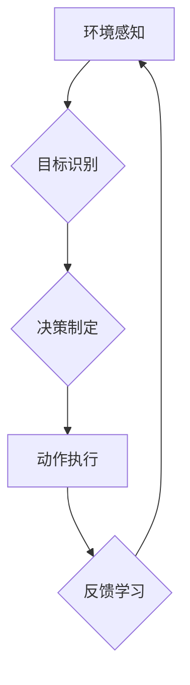

> 深度学习、智能代理、任务处理流程、算法原理、数学模型、代码实现、实际应用

## 1. 背景介绍

在人工智能领域，深度学习算法作为一种强大的机器学习方法，在图像识别、自然语言处理、语音识别等领域取得了显著的成就。智能深度学习代理是指能够自主学习、决策和执行任务的智能系统，它将深度学习算法与智能代理技术相结合，具有更强的适应性和自主性。

随着人工智能技术的不断发展，智能深度学习代理在各个领域都展现出巨大的应用潜力。例如，在机器人领域，智能深度学习代理可以帮助机器人自主导航、识别物体、完成复杂的任务；在医疗领域，智能深度学习代理可以辅助医生诊断疾病、制定治疗方案；在金融领域，智能深度学习代理可以进行风险评估、投资决策等。

## 2. 核心概念与联系

**2.1 智能代理**

智能代理是一个能够感知环境、做出决策并执行动作的系统。它通常具有以下特征：

* **自主性:** 智能代理能够自主地感知环境、制定决策并执行动作，无需人工干预。
* **目标导向性:** 智能代理具有明确的目标，并努力通过其行动来实现目标。
* **学习能力:** 智能代理能够从经验中学习，不断改进其决策和行为。

**2.2 深度学习**

深度学习是一种机器学习方法，它利用多层神经网络来模拟人类大脑的学习过程。深度学习算法能够从海量数据中学习复杂的特征和模式，从而实现对各种任务的智能化处理。

**2.3 智能深度学习代理**

智能深度学习代理将智能代理和深度学习技术相结合，构建了一种能够自主学习、决策和执行任务的智能系统。它利用深度学习算法学习环境信息和任务目标，并根据学习到的知识制定决策并执行动作。

**2.4 任务处理流程**

智能深度学习代理的任务处理流程通常包括以下几个步骤：

1. **环境感知:** 智能代理通过传感器获取环境信息，例如图像、文本、音频等。
2. **目标识别:** 智能代理识别任务目标，例如识别物体、理解文本含义、预测未来事件等。
3. **决策制定:** 智能代理根据环境信息和任务目标，利用深度学习算法制定最优决策。
4. **动作执行:** 智能代理执行决策，例如移动机器人、生成文本、控制设备等。
5. **反馈学习:** 智能代理根据执行结果获得反馈信息，并利用反馈信息更新其知识和决策策略。

**2.5 Mermaid 流程图**



## 3. 核心算法原理 & 具体操作步骤

### 3.1 算法原理概述

智能深度学习代理的任务处理流程通常基于以下核心算法：

* **卷积神经网络 (CNN):** 用于处理图像和视频数据，能够提取图像特征和进行图像分类、目标检测等任务。
* **循环神经网络 (RNN):** 用于处理序列数据，例如文本和语音，能够捕捉序列中的时间依赖关系，用于文本生成、机器翻译、语音识别等任务。
* **强化学习 (RL):** 用于训练智能代理，通过奖励机制引导代理学习最优策略，用于机器人控制、游戏 AI 等任务。

### 3.2 算法步骤详解

**3.2.1 卷积神经网络 (CNN)**

1. **输入层:** 将图像数据输入到网络的第一层。
2. **卷积层:** 使用卷积核对图像数据进行卷积运算，提取图像特征。
3. **池化层:** 对卷积层的输出进行池化操作，减少数据维度，提高网络鲁棒性。
4. **全连接层:** 将池化层的输出连接到全连接层，进行分类或回归。

**3.2.2 循环神经网络 (RNN)**

1. **输入层:** 将序列数据输入到网络的第一层。
2. **隐藏层:** 使用循环单元处理序列数据，捕捉序列中的时间依赖关系。
3. **输出层:** 将隐藏层的输出连接到输出层，进行分类或生成。

**3.2.3 强化学习 (RL)**

1. **环境:** 智能代理与环境交互，环境提供状态和奖励信息。
2. **策略:** 智能代理根据当前状态选择动作，策略决定了代理的行为。
3. **奖励:** 环境根据代理的动作提供奖励信息，奖励信号引导代理学习最优策略。
4. **学习:** 代理利用强化学习算法更新策略，使其能够获得更高的奖励。

### 3.3 算法优缺点

**3.3.1 卷积神经网络 (CNN)**

* **优点:** 能够有效地提取图像特征，在图像识别、目标检测等任务中表现出色。
* **缺点:** 对数据量要求较高，训练时间较长。

**3.3.2 循环神经网络 (RNN)**

* **优点:** 能够捕捉序列中的时间依赖关系，在文本生成、机器翻译等任务中表现出色。
* **缺点:** 训练难度较高，容易出现梯度消失问题。

**3.3.3 强化学习 (RL)**

* **优点:** 可以训练智能代理学习最优策略，适用于复杂的任务场景。
* **缺点:** 训练过程需要大量的数据和计算资源，收敛速度较慢。

### 3.4 算法应用领域

* **图像识别:** 人脸识别、物体检测、图像分类
* **自然语言处理:** 文本分类、机器翻译、文本生成
* **语音识别:** 语音转文本、语音助手
* **机器人控制:** 机器人导航、物体抓取、自主驾驶
* **游戏 AI:** 游戏策略制定、游戏角色控制

## 4. 数学模型和公式 & 详细讲解 & 举例说明

### 4.1 数学模型构建

**4.1.1 卷积神经网络 (CNN)**

CNN 的数学模型主要包括卷积运算、池化运算和激活函数。

* **卷积运算:** 使用卷积核对图像数据进行卷积运算，提取图像特征。卷积运算的数学公式如下：

$$
y_{i,j} = \sum_{m=0}^{M-1} \sum_{n=0}^{N-1} x_{i+m,j+n} * w_{m,n}
$$

其中，$x_{i,j}$ 是图像数据中的像素值，$w_{m,n}$ 是卷积核中的权重值，$y_{i,j}$ 是卷积运算后的输出值。

* **池化运算:** 对卷积层的输出进行池化操作，减少数据维度，提高网络鲁棒性。常见的池化操作包括最大池化和平均池化。

* **激活函数:** 用于引入非线性，提高网络的表达能力。常见的激活函数包括ReLU、Sigmoid和Tanh。

**4.1.2 循环神经网络 (RNN)**

RNN 的数学模型主要包括隐藏状态的更新公式和输出层的计算公式。

* **隐藏状态更新公式:**

$$
h_t = f(W_{xh}x_t + W_{hh}h_{t-1} + b_h)
$$

其中，$h_t$ 是隐藏状态，$x_t$ 是输入数据，$W_{xh}$ 和 $W_{hh}$ 是权重矩阵，$b_h$ 是偏置项，$f$ 是激活函数。

* **输出层计算公式:**

$$
y_t = g(W_{hy}h_t + b_y)
$$

其中，$y_t$ 是输出数据，$W_{hy}$ 是权重矩阵，$b_y$ 是偏置项，$g$ 是激活函数。

**4.1.3 强化学习 (RL)**

RL 的数学模型主要包括价值函数和策略函数。

* **价值函数:** 用于估计状态或状态-动作对的期望回报。

$$
V(s) = E[\sum_{t=0}^{\infty} \gamma^t r_{t+1}|s]
$$

其中，$V(s)$ 是状态 $s$ 的价值，$r_{t+1}$ 是时间步 $t+1$ 的奖励，$\gamma$ 是折扣因子。

* **策略函数:** 用于决定智能代理在给定状态下采取的动作。

$$
\pi(a|s) = P(a|s)
$$

其中，$\pi(a|s)$ 是在状态 $s$ 下采取动作 $a$ 的概率。

### 4.2 公式推导过程

公式推导过程涉及到深度学习算法的数学原理，例如梯度下降算法、反向传播算法等。

### 4.3 案例分析与讲解

通过具体的案例分析，可以更好地理解深度学习算法的原理和应用。例如，可以分析图像分类任务中CNN 的训练过程，或者分析文本生成任务中RNN 的工作机制。

## 5. 项目实践：代码实例和详细解释说明

### 5.1 开发环境搭建

智能深度学习代理的开发环境通常需要包含以下软件：

* Python 编程语言
* 深度学习框架 (例如 TensorFlow、PyTorch)
* 数据处理工具 (例如 NumPy、Pandas)
* 可视化工具 (例如 Matplotlib、Seaborn)

### 5.2 源代码详细实现

以下是一个简单的智能深度学习代理的代码示例，用于图像分类任务：

```python
import tensorflow as tf

# 定义模型
model = tf.keras.models.Sequential([
    tf.keras.layers.Conv2D(32, (3, 3), activation='relu', input_shape=(28, 28, 1)),
    tf.keras.layers.MaxPooling2D((2, 2)),
    tf.keras.layers.Conv2D(64, (3, 3), activation='relu'),
    tf.keras.layers.MaxPooling2D((2, 2)),
    tf.keras.layers.Flatten(),
    tf.keras.layers.Dense(10, activation='softmax')
])

# 编译模型
model.compile(optimizer='adam',
              loss='sparse_categorical_crossentropy',
              metrics=['accuracy'])

# 训练模型
model.fit(x_train, y_train, epochs=10)

# 评估模型
loss, accuracy = model.evaluate(x_test, y_test)
print('Test loss:', loss)
print('Test accuracy:', accuracy)
```

### 5.3 代码解读与分析

这段代码定义了一个简单的 CNN 模型，用于图像分类任务。模型包含两层卷积层、两层最大池化层、一层全连接层和一层 softmax 输出层。模型使用 Adam 优化器、交叉熵损失函数和准确率作为评估指标。

### 5.4 运行结果展示

训练完成后，可以评估模型的性能，例如计算测试集上的准确率。

## 6. 实际应用场景

### 6.1 智能机器人

智能深度学习代理可以用于控制机器人，使其能够自主导航、识别物体、完成复杂的任务。例如，在仓库环境中，智能机器人可以利用深度学习算法识别物品，并根据任务指令进行搬运和分类。

### 6.2 医疗诊断

智能深度学习代理可以辅助医生进行疾病诊断，例如通过分析医学图像识别肿瘤、预测患者的风险。

### 6.3 金融风险评估

智能深度学习代理可以用于评估金融风险，例如识别欺诈交易、预测股票价格波动。

### 6.4 未来应用展望

随着人工智能技术的不断发展，智能深度学习代理将在更多领域得到应用，例如自动驾驶、个性化教育、智能家居等。

## 7. 工具和资源推荐

### 7.1 学习资源推荐

* **书籍:**
    * 深度学习 (Deep Learning) - Ian Goodfellow, Yoshua Bengio, Aaron Courville
    * 构建深度学习模型 (Hands-On Machine Learning with Scikit-Learn, Keras & TensorFlow) - Aurélien Géron
* **在线课程:**
    * 深度学习 Specialization - Andrew Ng (Coursera)
    * fast.