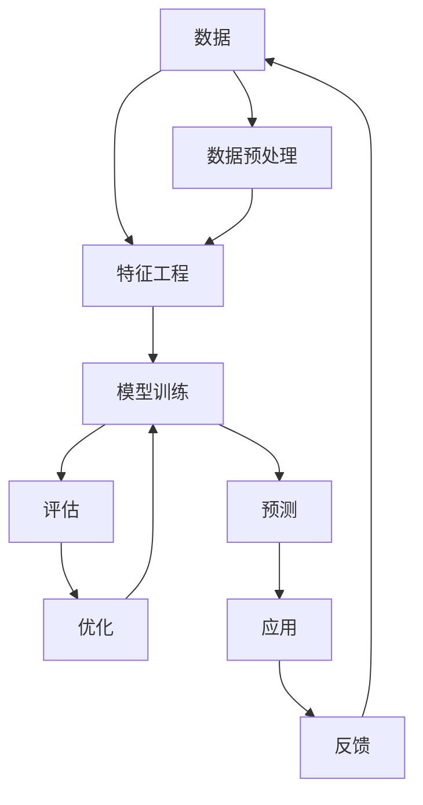
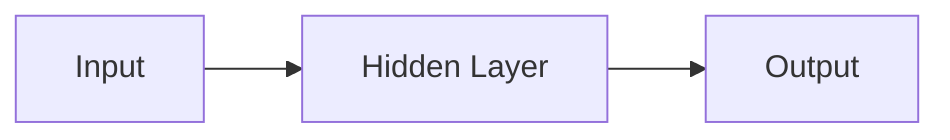

                 

**AI 2.0 时代的未来**

**作者：禅与计算机程序设计艺术 / Zen and the Art of Computer Programming**

## 1. 背景介绍

在人工智能（AI）领域，我们正处于一个转折点。第一代人工智能（AI 1.0）以规则为基础，依赖于专家系统和符号处理。然而，随着深度学习和神经网络的兴起，我们进入了第二代人工智能（AI 2.0）时代，其特点是学习能力和数据驱动。本文将探讨AI 2.0的核心概念、算法原理、数学模型，并提供项目实践和工具推荐，最后展望未来发展趋势。

## 2. 核心概念与联系

AI 2.0的核心概念包括深度学习、神经网络、数据驱动和学习能力。这些概念是相互联系的，共同构成了AI 2.0的基础。下图是这些概念的关系图：



## 3. 核心算法原理 & 具体操作步骤

### 3.1 算法原理概述

AI 2.0的核心算法是深度学习，它是一种机器学习方法，使用神经网络模拟人类大脑的结构和功能。深度学习算法包括卷积神经网络（CNN）、循环神经网络（RNN）和长短期记忆网络（LSTM）等。

### 3.2 算法步骤详解

1. **数据收集**：收集大量的、相关的数据。
2. **数据预处理**：清洗、标记和格式化数据。
3. **特征工程**：提取数据中的特征，如图像特征或文本特征。
4. **模型选择**：选择适合任务的模型，如CNN、RNN或LSTM。
5. **模型训练**：使用训练数据调整模型的权重和偏置，以最小化预测误差。
6. **评估**：使用验证数据评估模型的性能。
7. **优化**：根据评估结果调整模型参数，如学习率或正则化参数。
8. **预测**：使用训练好的模型对新数据进行预测。

### 3.3 算法优缺点

**优点**：深度学习算法可以自动学习特征，无需人工特征工程。它们可以处理大规模数据，并具有高度的泛化能力。

**缺点**：深度学习算法需要大量的数据和计算资源。它们也易受过拟合和模型解释性差的影响。

### 3.4 算法应用领域

深度学习算法广泛应用于图像识别、自然语言处理、语音识别和推荐系统等领域。

## 4. 数学模型和公式 & 详细讲解 & 举例说明

### 4.1 数学模型构建

深度学习模型是由多个神经元组成的层次结构。每个神经元接收输入，进行加权求和，然后通过激活函数输出结果。下图是一个简单的全连接神经网络的示例：



### 4.2 公式推导过程

给定输入向量**x**和权重矩阵**W**，神经元的输出**y**可以表示为：

$$y = f(Wx + b)$$

其中**b**是偏置向量，f是激活函数，如ReLU（Rectified Linear Unit）或sigmoid。

### 4.3 案例分析与讲解

例如，在图像分类任务中，输入向量**x**是图像的像素值，输出向量**y**是类别概率。模型的目标是最小化交叉熵损失：

$$L = -\sum_{c=1}^{C}y_{c}\log(\hat{y}_{c})$$

其中**C**是类别数，$\hat{y}_{c}$是模型预测的类别概率。

## 5. 项目实践：代码实例和详细解释说明

### 5.1 开发环境搭建

使用Python和TensorFlow构建深度学习模型。安装必要的库：

```bash
pip install tensorflow numpy matplotlib
```

### 5.2 源代码详细实现

以下是一个简单的全连接神经网络的实现：

```python
import tensorflow as tf
import numpy as np

# 定义输入和输出维度
input_dim = 10
output_dim = 2

# 定义模型参数
W = tf.Variable(tf.random.normal([input_dim, output_dim]))
b = tf.Variable(tf.zeros([output_dim]))

# 定义激活函数
def relu(x):
    return tf.maximum(0., x)

# 定义前向传播
def forward(x):
    return relu(tf.matmul(x, W) + b)

# 定义损失函数
def loss(y_true, y_pred):
    return tf.reduce_mean(tf.nn.softmax_cross_entropy_with_logits(y_true, y_pred))

# 定义优化器
optimizer = tf.optimizers.Adam()

# 定义训练步骤
@tf.function
def train_step(x, y):
    with tf.GradientTape() as tape:
        y_pred = forward(x)
        loss_value = loss(y, y_pred)
    gradients = tape.gradient(loss_value, [W, b])
    optimizer.apply_gradients(zip(gradients, [W, b]))
    return loss_value
```

### 5.3 代码解读与分析

代码首先定义了模型参数**W**和**b**。然后定义了激活函数ReLU和前向传播函数。损失函数使用交叉熵，优化器使用Adam。最后定义了训练步骤，计算梯度并更新模型参数。

### 5.4 运行结果展示

在训练数据上运行训练步骤，模型的损失值会随着训练步数的增加而减小。

## 6. 实际应用场景

### 6.1 当前应用

AI 2.0已经广泛应用于各种领域，如自动驾驶、医疗影像分析和语音助手等。

### 6.2 未来应用展望

未来，AI 2.0将继续发展，并扩展到更多领域。例如，它将帮助解决气候变化、开发新药物和改善教育等挑战。

## 7. 工具和资源推荐

### 7.1 学习资源推荐

- 书籍：《深度学习》作者：Ian Goodfellow、Yoshua Bengio、Aaron Courville
- 课程：斯坦福大学的深度学习课程（CS231n）

### 7.2 开发工具推荐

- TensorFlow
- PyTorch
- Keras

### 7.3 相关论文推荐

- LeCun, Y., Bengio, Y., & Hinton, G. (2015). Deep learning. Nature, 521(7553), 436-444.

## 8. 总结：未来发展趋势与挑战

### 8.1 研究成果总结

AI 2.0取得了显著的成就，在各种领域取得了突破。

### 8.2 未来发展趋势

未来，AI 2.0将继续发展，并出现新的架构和算法。它也将与其他技术结合，如量子计算和边缘计算。

### 8.3 面临的挑战

AI 2.0面临的挑战包括数据隐私、模型解释性差和计算资源需求等。

### 8.4 研究展望

未来的研究将关注模型解释性、少样本学习和自监督学习等领域。

## 9. 附录：常见问题与解答

**Q：AI 2.0与AI 1.0有何不同？**

**A：AI 1.0以规则为基础，依赖于专家系统和符号处理。AI 2.0则是数据驱动和学习能力为基础。**

**Q：如何选择适合任务的模型？**

**A：这取决于任务的性质。例如，图像分类任务通常使用CNN，而序列数据则使用RNN或LSTM。**

**Q：如何避免过拟合？**

**A：常用的方法包括正则化、 dropout和数据增强等。**

**作者：禅与计算机程序设计艺术 / Zen and the Art of Computer Programming**

