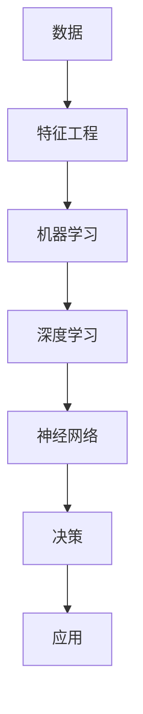

                 

**AI 2.0 时代的机遇**

**作者：禅与计算机程序设计艺术 / Zen and the Art of Computer Programming**

## 1. 背景介绍

在人工智能（AI）领域，我们正处于一个转折点。第一代人工智能（AI 1.0）以规则为基础，依赖于专家系统和符号处理。然而，随着深度学习和神经网络的兴起，我们进入了第二代人工智能（AI 2.0）时代，其特点是学习能力和数据驱动。本文将探讨AI 2.0的核心概念、算法原理，并提供项目实践和工具推荐，最后展望未来发展趋势。

## 2. 核心概念与联系

AI 2.0的核心概念包括深度学习、神经网络、机器学习，以及数据驱动决策。这些概念是相互关联的，共同构成了AI 2.0的基础。



## 3. 核心算法原理 & 具体操作步骤

### 3.1 算法原理概述

AI 2.0的核心算法是深度学习，它是一种机器学习方法，使用神经网络模型从数据中学习表示和决策。

### 3.2 算法步骤详解

1. **数据预处理**：收集、清洗、标记和标准化数据。
2. **特征工程**：提取数据中的特征，用于训练模型。
3. **模型选择**：选择适合任务的深度学习模型（如卷积神经网络、循环神经网络或转换器）。
4. **训练**：使用训练数据调整模型的权重和偏置，以最小化损失函数。
5. **评估**：使用验证数据评估模型的性能。
6. **部署**：将模型部署到生产环境中，用于预测和决策。

### 3.3 算法优缺点

**优点**：自动学习表示、高准确性、适用于各种任务。

**缺点**：数据饥渴、黑箱模型、计算资源需求高。

### 3.4 算法应用领域

AI 2.0在图像识别、自然语言处理、推荐系统、自动驾驶和医疗诊断等领域有广泛应用。

## 4. 数学模型和公式 & 详细讲解 & 举例说明

### 4.1 数学模型构建

深度学习模型可以表示为：

$$y = f(x; \theta) = \sigma(z) = \frac{1}{1 + e^{-z}}$$

其中，$x$是输入，$\theta$是模型参数，$z$是线性函数，$y$是输出，$\sigma$是sigmoid激活函数。

### 4.2 公式推导过程

损失函数（如交叉熵）用于衡量模型的性能：

$$L(\theta) = -\frac{1}{m}\sum_{i=1}^{m}[y^{(i)}\log((f(x^{(i)};\theta)) + (1 - y^{(i)})\log(1 - f(x^{(i)};\theta))]$$

梯度下降用于优化模型参数：

$$\theta := \theta - \alpha \nabla L(\theta)$$

### 4.3 案例分析与讲解

例如，在图像分类任务中，输入$x$是图像特征，输出$y$是类别标签。模型学习表示，将输入映射到输出。

## 5. 项目实践：代码实例和详细解释说明

### 5.1 开发环境搭建

使用Python、TensorFlow和Keras搭建开发环境。

### 5.2 源代码详细实现

```python
import tensorflow as tf
from tensorflow.keras import layers

# 定义模型
model = tf.keras.Sequential([
    layers.Dense(64, activation='relu', input_shape=(input_dim,)),
    layers.Dense(64, activation='relu'),
    layers.Dense(num_classes, activation='softmax')
])

# 编译模型
model.compile(optimizer='adam',
              loss='categorical_crossentropy',
              metrics=['accuracy'])

# 训练模型
model.fit(x_train, y_train, epochs=10, batch_size=32)
```

### 5.3 代码解读与分析

该代码定义了一个简单的全连接神经网络模型，并使用Adam优化器和交叉熵损失函数编译模型。然后，它使用训练数据训练模型。

### 5.4 运行结果展示

模型的准确性和损失函数值在训练过程中会不断改进。

## 6. 实际应用场景

### 6.1 当前应用

AI 2.0在各种行业中得到广泛应用，如搜索引擎、社交媒体、金融和医疗保健。

### 6.2 未来应用展望

未来，AI 2.0将继续渗透到更多领域，如自动驾驶、人机交互和物联网。

## 7. 工具和资源推荐

### 7.1 学习资源推荐

- 书籍：《深度学习》作者：Ian Goodfellow、Yoshua Bengio、Aaron Courville
- 课程：斯坦福大学深度学习课程（CS231n）

### 7.2 开发工具推荐

- TensorFlow
- PyTorch
- Keras

### 7.3 相关论文推荐

- LeCun, Y., Bengio, Y., & Hinton, G. (2015). Deep learning. Nature, 521(7553), 436-444.

## 8. 总结：未来发展趋势与挑战

### 8.1 研究成果总结

AI 2.0取得了显著的成就，在各种任务上超越了人类水平。

### 8.2 未来发展趋势

AI 2.0将继续发展，出现新的架构和技术，如注意力机制和transformer模型。

### 8.3 面临的挑战

AI 2.0面临的挑战包括数据隐私、解释性、计算资源需求和安全。

### 8.4 研究展望

未来的研究将关注自监督学习、多模式学习和跨模式学习。

## 9. 附录：常见问题与解答

**Q：AI 2.0是否会取代人类？**

**A：**AI 2.0将改变人类工作方式，但不会取代人类。它将创造新的就业机会，并帮助人类解决复杂的问题。

**Q：AI 2.0是否需要大量数据？**

**A：**是的，AI 2.0模型需要大量数据进行训练。数据是模型学习的关键。

**Q：AI 2.0是否是黑箱模型？**

**A：**是的，AI 2.0模型通常是黑箱模型，难以解释其决策过程。然而，研究人员正在开发新的技术来解释模型决策。

**作者署名：**
作者：禅与计算机程序设计艺术 / Zen and the Art of Computer Programming

