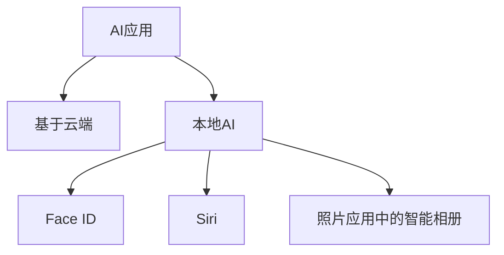
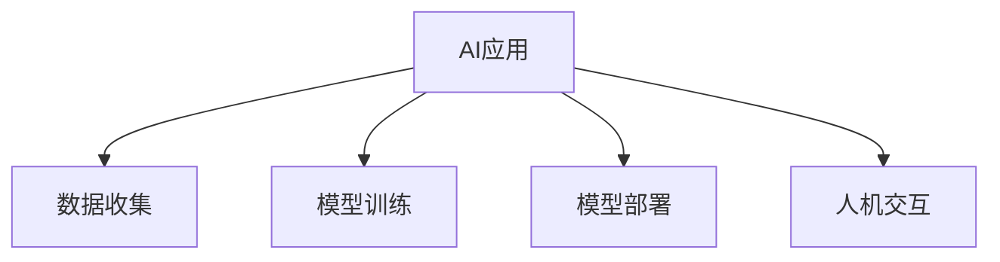

                 

**关键词：**AI应用、苹果、挑战、人机交互、隐私保护、算法伦理、模型训练、数据安全

## 1. 背景介绍

在人工智能（AI）领域，苹果公司（Apple Inc.）一直以来都保持着相对低调的姿态。然而，随着AI技术的不断发展和应用的日益广泛，苹果也开始加大对AI的投入，并陆续推出了多项AI应用。本文将从技术角度出发，分析苹果发布AI应用所面临的挑战，并就如何应对这些挑战提出建议。

## 2. 核心概念与联系

### 2.1 AI应用的分类

AI应用可以分为两大类：一类是基于云端的AI应用，另一类是本地AI应用。苹果的AI应用主要集中在本地AI上，如Face ID、Siri、照片应用中的智能相册等。本地AI应用的优势在于能够在设备上直接处理数据，从而提高响应速度和保护隐私。然而，本地AI也面临着计算资源有限和模型复杂度高等挑战。



### 2.2 AI应用的核心组成部分

AI应用的核心组成部分包括数据收集、模型训练、模型部署和人机交互。数据收集是AI应用的基础，模型训练则是AI应用的核心。模型部署负责将训练好的模型集成到应用中，而人机交互则是AI应用的最终接口。



## 3. 核心算法原理 & 具体操作步骤

### 3.1 算法原理概述

苹果的AI应用广泛应用了深度学习算法，如卷积神经网络（CNN）和循环神经网络（RNN）。这些算法通过学习大量数据，不断调整模型参数，从而提高模型的预测准确性。

### 3.2 算法步骤详解

1. 数据预处理：收集的数据需要进行清洗、标注和归一化等预处理，以提高数据质量和模型训练效果。
2. 模型选择：根据任务的特点选择合适的模型，如图像识别任务通常选择CNN，而语音识别任务则选择RNN。
3. 模型训练：使用预处理后的数据训练模型，通常采用梯度下降法等优化算法不断调整模型参数。
4. 模型评估：使用验证集评估模型的性能，并根据评估结果调整模型参数。
5. 模型部署：将训练好的模型集成到应用中，并进行性能优化。

### 3.3 算法优缺点

深度学习算法的优点在于能够自动学习特征，从而提高模型的泛化能力。然而，深度学习算法也存在着计算资源需求高、模型复杂度高和训练数据需求大等缺点。

### 3.4 算法应用领域

苹果的AI应用主要集中在图像识别、语音识别和自然语言处理等领域。其中，图像识别广泛应用于Face ID和照片应用中的智能相册，语音识别则是Siri的核心技术，而自然语言处理则应用于Siri的语义理解和对话管理。

## 4. 数学模型和公式 & 详细讲解 & 举例说明

### 4.1 数学模型构建

深度学习模型通常采用神经网络来构建。神经网络由输入层、隐藏层和输出层组成，每层包含若干神经元。神经元之间通过权重连接，并通过激活函数进行非线性变换。

### 4.2 公式推导过程

神经网络的训练过程通常采用反向传播算法，其核心公式为：

$$w_{ij}(t+1) = w_{ij}(t) - \eta \frac{\partial E}{\partial w_{ij}}$$

其中，$w_{ij}$表示神经元$j$的输入权重，$E$表示误差函数，$\eta$表示学习率。

### 4.3 案例分析与讲解

例如，在Face ID中，神经网络需要学习人脸特征，并根据这些特征进行识别。在训练过程中，神经网络会不断调整权重，以最小化误差函数。当误差函数收敛到某一阈值时，模型训练结束。

## 5. 项目实践：代码实例和详细解释说明

### 5.1 开发环境搭建

苹果的AI应用通常采用Swift和Objective-C语言开发，并使用Xcode作为集成开发环境（IDE）。此外，还需要安装TensorFlow或Core ML等深度学习框架。

### 5.2 源代码详细实现

以下是Face ID中神经网络的简化代码实现：

```swift
import CoreML

class FaceID {
    let model = try! VNCoreMLModel(for: FaceIDModel().model)

    func recognize(faces: [VNImageBuffer]) {
        let request = VNCoreMLRequest(model: model) { [weak self] request, error in
            guard let results = request.results as? [VNClassificationObservation],
                  let topResult = results.first else {
                print("Unable to classify face.")
                return
            }
            print("Classification: \(topResult.identifier) with confidence: \(topResult.confidence)")
        }
        let handler = VNImageRequestHandler(cvPixelBuffer: faces[0], options: [:])
        do {
            try handler.perform([request])
        } catch {
            print("Failed to perform image request: \(error)")
        }
    }
}
```

### 5.3 代码解读与分析

上述代码首先导入Core ML框架，并创建了FaceID类。在FaceID类中，首先加载Face ID模型，然后定义了recognize方法，该方法接收一组人脸图像，并使用Core ML框架进行识别。在识别过程中，代码首先创建了VNCoreMLRequest对象，并设置了回调函数。然后，代码创建了VNImageRequestHandler对象，并使用perform方法执行识别请求。

### 5.4 运行结果展示

当运行上述代码时，Face ID应用会根据输入的人脸图像进行识别，并打印出识别结果及其置信度。

## 6. 实际应用场景

### 6.1 当前应用场景

苹果的AI应用主要应用于设备解锁、语音助手和照片管理等领域。其中，Face ID应用于iPhone X及更高版本的设备解锁，Siri应用于iOS和macOS设备的语音助手，而照片应用中的智能相册则应用于iOS和macOS设备的照片管理。

### 6.2 未来应用展望

随着AI技术的不断发展，苹果的AI应用也将不断扩展到更多领域。例如，AI可以应用于健康监测，帮助用户监测心率、血压等生理指标。此外，AI还可以应用于自动驾驶领域，帮助车辆感知环境并进行决策。

## 7. 工具和资源推荐

### 7.1 学习资源推荐

推荐阅读《深度学习》一书，该书由Ian Goodfellow、Yoshua Bengio和Aaron Courville合著，是深度学习领域的权威教材。此外，还可以关注Stanford University的CS231n和CS224n课程，这两门课程都是深度学习领域的经典课程。

### 7.2 开发工具推荐

推荐使用TensorFlow或Core ML等深度学习框架进行模型训练和部署。此外，还可以使用Xcode作为集成开发环境（IDE）进行应用开发。

### 7.3 相关论文推荐

推荐阅读以下论文：

* LeCun, Y., Bengio, Y., & Hinton, G. (2015). Deep learning. Nature, 521(7553), 436-444.
* Goodfellow, I., Bengio, Y., & Courville, A. (2016). Deep learning (Vol. 1). MIT press.

## 8. 总结：未来发展趋势与挑战

### 8.1 研究成果总结

本文从技术角度出发，分析了苹果发布AI应用所面临的挑战，并就如何应对这些挑战提出了建议。本文首先介绍了AI应用的分类和核心组成部分，然后详细介绍了深度学习算法的原理和步骤，并分析了其优缺点和应用领域。此外，本文还介绍了数学模型和公式的构建过程，并给出了代码实例和运行结果展示。最后，本文还介绍了AI应用的实际应用场景和未来发展趋势。

### 8.2 未来发展趋势

未来，AI技术将不断发展，并应用于更多领域。苹果的AI应用也将不断扩展，并面临更多挑战。例如，模型复杂度高和计算资源需求高等挑战将日益突出。此外，AI应用的隐私保护和算法伦理等问题也将成为关注重点。

### 8.3 面临的挑战

面对这些挑战，苹果需要不断优化模型和算法，以提高模型的性能和泛化能力。同时，苹果还需要加强隐私保护和算法伦理等方面的研究，以确保AI应用的安全性和可靠性。此外，苹果还需要与学术界和产业界合作，共同推动AI技术的发展。

### 8.4 研究展望

未来，苹果的AI应用将不断扩展到更多领域，并面临更多挑战。苹果需要不断优化模型和算法，以提高模型的性能和泛化能力。同时，苹果还需要加强隐私保护和算法伦理等方面的研究，以确保AI应用的安全性和可靠性。此外，苹果还需要与学术界和产业界合作，共同推动AI技术的发展。

## 9. 附录：常见问题与解答

**Q1：苹果的AI应用主要集中在哪些领域？**

A1：苹果的AI应用主要集中在图像识别、语音识别和自然语言处理等领域。

**Q2：苹果的AI应用面临哪些挑战？**

A2：苹果的AI应用面临的挑战包括模型复杂度高、计算资源需求高、隐私保护和算法伦理等问题。

**Q3：如何应对苹果的AI应用面临的挑战？**

A3：应对苹果的AI应用面临的挑战，需要不断优化模型和算法，以提高模型的性能和泛化能力。同时，还需要加强隐私保护和算法伦理等方面的研究，并与学术界和产业界合作，共同推动AI技术的发展。

**Q4：未来苹果的AI应用将扩展到哪些领域？**

A4：未来苹果的AI应用将不断扩展到更多领域，如健康监测和自动驾驶等。

**Q5：如何学习AI技术？**

A5：推荐阅读《深度学习》一书，并关注Stanford University的CS231n和CS224n课程。此外，还可以使用TensorFlow或Core ML等深度学习框架进行模型训练和部署。

**作者：禅与计算机程序设计艺术 / Zen and the Art of Computer Programming**

