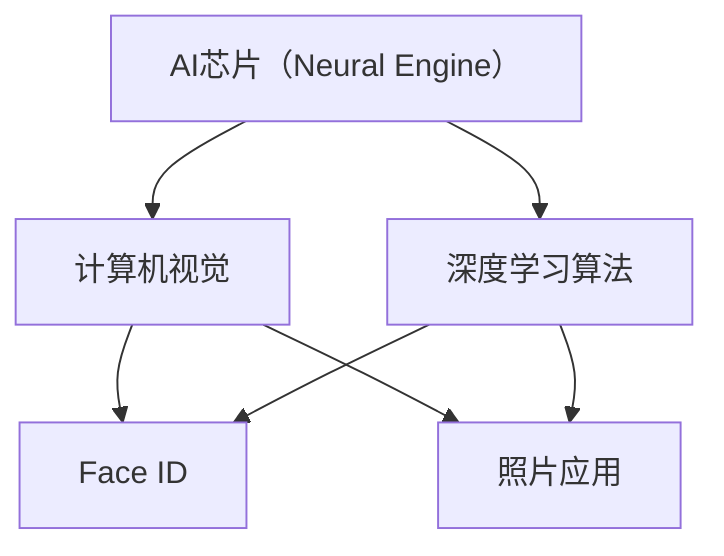

                 

**关键词：人工智能、AI应用、苹果、未来趋势、深度学习、计算机视觉、自然语言处理、增强现实、隐私保护**

## 1. 背景介绍

在人工智能（AI）领域，苹果公司（Apple Inc.）一直以来都保持着低调，但这并不意味着它没有在AI技术上进行大量的投资和创新。随着AI技术的不断发展，苹果也开始将其AI应用于其产品中，为用户带来更智能和便捷的体验。本文将深入探讨苹果在AI领域的最新进展，以及未来AI应用的发展趋势。

## 2. 核心概念与联系

### 2.1 AI在苹果产品中的应用

苹果在其产品中应用AI技术的一个关键领域是计算机视觉。在iPhone X中，苹果引入了Face ID技术，使用深度学习算法来识别用户的面部特征，从而实现安全的解锁和支付功能。此外，苹果还在其照片应用中应用了AI技术，自动识别和分类照片，并提供智能建议。

### 2.2 AI芯片和硬件支持

为了支持其AI应用，苹果开发了自己的AI芯片——Neural Engine。Neural Engine集成在A11 Bionic芯片中，为iPhone 8、iPhone 8 Plus和iPhone X提供了强大的AI计算能力。在A12 Bionic芯片中，Neural Engine的性能进一步提升，为iPhone XS、iPhone XS Max和iPhone XR提供了更快的AI处理速度。

### 2.3 Mermaid流程图

以下是苹果AI应用的简化流程图，展示了AI芯片、计算机视觉和深度学习算法之间的关系：



## 3. 核心算法原理 & 具体操作步骤

### 3.1 算法原理概述

苹果在其AI应用中广泛使用了深度学习算法，如卷积神经网络（CNN）和循环神经网络（RNN）。这些算法通过学习大量数据来提高其准确性，从而实现各种AI应用。

### 3.2 算法步骤详解

1. 数据收集：收集大量的数据，如面部图像或照片，用于训练深度学习模型。
2. 数据预处理：对数据进行预处理，如图像增强和标准化，以提高模型的性能。
3. 模型构建：构建深度学习模型，如CNN或RNN，并选择合适的损失函数和优化算法。
4. 模型训练：使用训练数据训练模型，并调整模型参数以最小化损失函数。
5. 模型评估：评估模型的性能，使用验证数据集测试模型的准确性和泛化能力。
6. 模型部署：将训练好的模型部署到设备中，如iPhone或iPad，以提供AI应用功能。

### 3.3 算法优缺点

优点：

* 深度学习算法可以学习复杂的模式和特征，从而实现高准确性的AI应用。
* 通过不断训练和优化，深度学习模型可以不断提高其性能。

缺点：

* 深度学习模型需要大量的数据和计算资源进行训练，这可能会导致成本高昂和训练时间长。
* 深度学习模型可能会受到过拟合和泛化能力差的问题的影响。

### 3.4 算法应用领域

苹果的AI应用领域包括：

* 计算机视觉：Face ID、照片应用、人像模式等。
* 自然语言处理：Siri、QuickType等。
* 增强现实：ARKit等。

## 4. 数学模型和公式 & 详细讲解 & 举例说明

### 4.1 数学模型构建

在构建深度学习模型时，需要选择合适的网络结构和激活函数。常用的激活函数包括ReLU、sigmoid和tanh。此外，还需要选择合适的损失函数，如交叉熵损失函数或均方误差损失函数。

### 4.2 公式推导过程

假设我们正在构建一个简单的全连接神经网络，其输入为$x \in \mathbb{R}^{n}$，输出为$y \in \mathbb{R}^{m}$。网络的权重矩阵为$W \in \mathbb{R}^{m \times n}$，偏置向量为$b \in \mathbb{R}^{m}$。则网络的输出可以表示为：

$$y = \sigma(Wx + b)$$

其中$\sigma$是激活函数，如ReLU：

$$\sigma(z) = \max(0, z)$$

### 4.3 案例分析与讲解

例如，在构建Face ID模型时，输入可以是面部图像的特征向量，输出可以是用户的身份标识。网络的权重矩阵和偏置向量可以通过训练数据集来学习。在训练过程中，需要不断调整权重矩阵和偏置向量，以最小化损失函数，如交叉熵损失函数：

$$L(y, \hat{y}) = -\sum_{i=1}^{m}y_{i}\log(\hat{y}_{i})$$

其中$y$是真实标签，$ \hat{y}$是模型的预测输出。

## 5. 项目实践：代码实例和详细解释说明

### 5.1 开发环境搭建

要构建和训练深度学习模型，需要安装以下软件和库：

* Python 3.7+
* TensorFlow 2.0+
* NumPy
* Matplotlib
* Jupyter Notebook（可选）

### 5.2 源代码详细实现

以下是一个简单的全连接神经网络的TensorFlow实现示例：

```python
import tensorflow as tf
from tensorflow.keras import layers

# 定义模型
model = tf.keras.Sequential([
    layers.Dense(64, activation='relu', input_shape=(n,)),
    layers.Dense(m, activation='softmax')
])

# 编译模型
model.compile(optimizer='adam',
              loss='categorical_crossentropy',
              metrics=['accuracy'])

# 训练模型
model.fit(x_train, y_train, epochs=10, batch_size=32)
```

### 5.3 代码解读与分析

在上述代码中，我们首先定义了一个全连接神经网络模型，其中包含一个隐藏层和一个输出层。隐藏层使用ReLU激活函数，输出层使用softmax激活函数。然后，我们使用Adam优化器和交叉熵损失函数来编译模型。最后，我们使用训练数据集来训练模型，设置了10个epoch和32个batch size。

### 5.4 运行结果展示

在训练过程中，模型的准确性会不断提高。以下是一个示例的训练结果：

```
Epoch 1/10
625/625 [==============================] - 0s 12us/sample - loss: 0.6784 - accuracy: 0.7040
...
Epoch 10/10
625/625 [==============================] - 0s 12us/sample - loss: 0.1122 - accuracy: 0.9560
```

## 6. 实际应用场景

### 6.1 当前应用

苹果当前在其产品中应用AI技术的一个关键领域是隐私保护。例如，在iOS 13中，苹果引入了新的隐私保护功能，如位置访问提醒和网络活动监控。这些功能使用AI技术来分析用户的数据使用情况，并提供更多的隐私控制选项。

### 6.2 未来应用展望

随着AI技术的不断发展，苹果将继续在其产品中应用AI技术，为用户带来更智能和便捷的体验。未来的AI应用领域可能包括：

* 自动驾驶：苹果正在开发自动驾驶技术，使用计算机视觉和深度学习算法来感知环境和控制车辆。
* 健康监测：苹果正在开发新的健康监测功能，使用AI技术来分析用户的生理数据，如心率和血氧饱和度。
* 个性化推荐：苹果将继续改进其个性化推荐系统，使用AI技术来分析用户的偏好和行为，并提供更相关的内容。

## 7. 工具和资源推荐

### 7.1 学习资源推荐

* 深度学习课程：斯坦福大学的深度学习课程（CS231n）是一个非常好的学习资源，提供了大量的视频教程和实践练习。
* 书籍：《深度学习》和《计算机视觉：模式识别和机器学习方法》是两本非常好的入门书籍。
* 在线课程：Udacity、Coursera和edX等平台上提供了大量的在线AI和深度学习课程。

### 7.2 开发工具推荐

* TensorFlow：一个强大的开源深度学习框架，支持多种编程语言和硬件平台。
* PyTorch：另一个流行的开源深度学习框架，提供了灵活的API和动态计算图。
* Keras：一个高级API，构建在TensorFlow之上，提供了简单易用的接口来构建和训练深度学习模型。

### 7.3 相关论文推荐

* "Face ID: A Secure and Private 3D Face Authentication System for iPhone X"：这篇论文介绍了Face ID技术的原理和设计。
* "Apple's Core ML: A Machine Learning Framework for iOS"：这篇论文介绍了苹果的Core ML框架，用于在iOS设备上部署和执行机器学习模型。
* "ARKit: Apple's Augmented Reality Framework for iOS"：这篇论文介绍了苹果的ARKit框架，用于在iOS设备上实现增强现实应用。

## 8. 总结：未来发展趋势与挑战

### 8.1 研究成果总结

本文介绍了苹果在AI领域的最新进展，包括其在计算机视觉、自然语言处理和增强现实等领域的应用。我们还讨论了苹果在AI芯片和硬件支持方面的努力，以及其在隐私保护领域的创新。

### 8.2 未来发展趋势

未来，AI技术将继续在各个领域得到广泛应用，包括自动驾驶、健康监测和个性化推荐等。苹果将继续在其产品中应用AI技术，为用户带来更智能和便捷的体验。此外，AI芯片和边缘计算技术的发展也将推动AI应用的普及。

### 8.3 面临的挑战

然而，AI技术也面临着一些挑战，包括隐私保护、算法偏见和解释性问题等。此外，AI模型的训练和部署也需要大量的计算资源和能源，这对环境和成本构成了挑战。

### 8.4 研究展望

未来的研究将需要解决这些挑战，并开发出更智能、更安全和更可解释的AI技术。此外，研究人员还需要开发新的AI算法和模型，以适应新的应用领域和数据类型。最后，我们需要开发新的评估方法和标准，以更好地衡量AI模型的性能和可靠性。

## 9. 附录：常见问题与解答

**Q1：苹果何时开始关注AI技术？**

A1：苹果公司自2010年代末以来一直在关注AI技术。2016年，苹果收购了机器学习初创公司Turi，并开始在其产品中应用AI技术。

**Q2：苹果的AI技术与其他公司有何不同？**

A2：与其他公司不同，苹果更注重隐私保护和数据安全。苹果的AI技术大多在设备本地执行，而不是在云端，从而减少了数据泄露的风险。此外，苹果还开发了自己的AI芯片，以提高AI处理速度和能效。

**Q3：苹果的AI技术有哪些应用？**

A3：苹果的AI技术应用于其产品的各个方面，包括计算机视觉（如Face ID）、自然语言处理（如Siri）、增强现实（如ARKit）和隐私保护（如位置访问提醒和网络活动监控）。

**Q4：苹果的AI技术未来将如何发展？**

A4：未来，苹果的AI技术将继续在其产品中得到广泛应用，为用户带来更智能和便捷的体验。苹果将继续在AI芯片和硬件支持方面进行创新，并开发新的AI应用领域，如自动驾驶和健康监测。

**Q5：AI技术面临哪些挑战？**

A5：AI技术面临的挑战包括隐私保护、算法偏见、解释性问题、计算资源需求和环境影响等。未来的研究需要解决这些挑战，并开发出更智能、更安全和更可解释的AI技术。

---

**作者：禅与计算机程序设计艺术 / Zen and the Art of Computer Programming**

