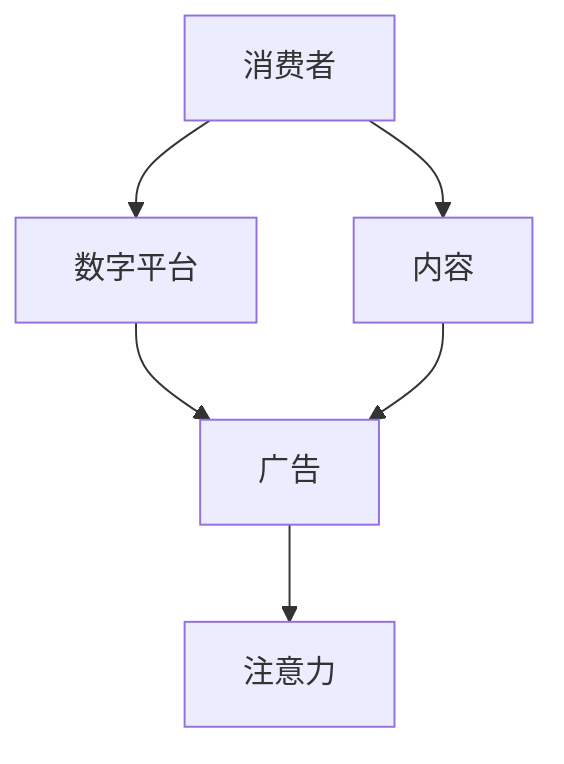

                 

**注意力经济对传统节日营销的影响**

**作者：禅与计算机程序设计艺术 / Zen and the Art of Computer Programming**

## 1. 背景介绍

在当今数字化的世界里，注意力已经成为一种稀缺资源，被冠以"新的货币"的称号。随着互联网和移动设备的普及，消费者的注意力被各种数字平台和内容争夺，传统节日营销面临着前所未有的挑战。本文将探讨注意力经济对传统节日营销的影响，并提供一些应对策略。

## 2. 核心概念与联系

### 2.1 注意力经济

注意力经济是指在数字时代，注意力成为一种有价值的资源，被各种平台和内容竞相争夺的现象。在注意力经济中，企业需要吸引和保持消费者的注意力，才能成功地进行营销。



### 2.2 传统节日营销

传统节日营销指的是在特定节日或节假日进行的营销活动，旨在利用节日氛围和消费者的消费意愿，推广产品或服务。传统节日营销通常包括广告、促销活动、优惠券等形式。

## 3. 核心算法原理 & 具体操作步骤

### 3.1 算法原理概述

在注意力经济下，传统节日营销需要运用算法和数据分析，以更好地理解和吸引消费者的注意力。本节将介绍一种基于注意力预测的算法，用于优化传统节日营销活动。

### 3.2 算法步骤详解

1. **数据收集**：收集消费者在节日期间的行为数据，包括浏览、点击、购买等信息。
2. **特征工程**：提取数据中的相关特征，如消费者的兴趣、购买历史、节日偏好等。
3. **注意力预测**：使用机器学习算法（如随机森林、神经网络等）预测消费者在节日期间的注意力分布。
4. **营销策略优化**：根据注意力预测结果，优化营销策略，如调整广告投放时间、内容、渠道等。
5. **评估与迭代**：评估优化后的营销活动效果，并根据结果进行算法和策略的迭代优化。

### 3.3 算法优缺点

**优点**：

* 更好地理解和预测消费者的注意力分布。
* 个性化营销，提高营销活动的针对性和有效性。
* 实时监控和优化营销活动。

**缺点**：

* 需要大量的数据收集和处理。
* 算法模型的准确性和稳定性需要不断优化。
* 可能会导致消费者感到被"跟踪"或"监控"，需要平衡隐私和个性化营销。

### 3.4 算法应用领域

该算法可以应用于各种传统节日营销活动，如：

* 电子商务平台的节日促销活动。
* 线下零售店的节日优惠活动。
* 餐饮业的节日推广活动。
* 旅游业的节日套餐和优惠活动。

## 4. 数学模型和公式 & 详细讲解 & 举例说明

### 4.1 数学模型构建

设定以下符号：

* $A$：消费者集合
* $N$：节日集合
* $T$：时间集合
* $B$：行为集合（浏览、点击、购买等）
* $X_{a,n,t,b}$：消费者$a$在节日$n$的时间$t$执行行为$b$的概率

注意力预测模型可以表示为：

$$P(X_{a,n,t,b}=1) = f(A, N, T, B; \theta)$$

其中，$f(\cdot)$是机器学习模型，$\theta$是模型的参数。

### 4.2 公式推导过程

假设使用神经网络作为注意力预测模型，$f(\cdot)$可以表示为：

$$f(A, N, T, B; \theta) = \sigma(W_1 \cdot [h_A \oplus h_N \oplus h_T] + W_2 \cdot h_B + b)$$

其中：

* $\sigma(\cdot)$是sigmoid激活函数。
* $W_1$, $W_2$, $b$是模型的可学习参数。
* $h_A$, $h_N$, $h_T$, $h_B$是消费者、节日、时间、行为的嵌入表示。

### 4.3 案例分析与讲解

假设我们要预测消费者$a$在圣诞节（$n=1$）的上午10点（$t=1$）浏览（$b=1$）电子商务平台的概率。我们可以使用上述模型计算：

$$P(X_{a,1,1,1}=1) = f(A, \{1\}, \{1\}, \{1\}; \theta)$$

通过训练模型并输入消费者$a$的特征、节日、时间和行为信息，我们可以预测消费者$a$在该时间和场景下浏览电子商务平台的概率。

## 5. 项目实践：代码实例和详细解释说明

### 5.1 开发环境搭建

本项目使用Python作为开发语言，并依赖以下库：

* TensorFlow：用于构建和训练神经网络模型。
* Pandas：用于数据处理和分析。
* Scikit-learn：用于特征工程和模型评估。

### 5.2 源代码详细实现

以下是注意力预测模型的Python实现代码：

```python
import tensorflow as tf
from tensorflow.keras import layers, Model
import pandas as pd
import numpy as np

# 读取数据
data = pd.read_csv('nodeay_data.csv')

# 特征工程
embedding_dim = 16
embedding_A = layers.Embedding(input_dim=len(data['消费者'].unique()), output_dim=embedding_dim, input_length=1, name='embedding_A')
embedding_N = layers.Embedding(input_dim=len(data['节日'].unique()), output_dim=embedding_dim, input_length=1, name='embedding_N')
embedding_T = layers.Embedding(input_dim=len(data['时间'].unique()), output_dim=embedding_dim, input_length=1, name='embedding_T')
embedding_B = layers.Embedding(input_dim=len(data['行为'].unique()), output_dim=embedding_dim, input_length=1, name='embedding_B')

# 构建模型
inputs_A = layers.Input(shape=(1,), name='inputs_A')
inputs_N = layers.Input(shape=(1,), name='inputs_N')
inputs_T = layers.Input(shape=(1,), name='inputs_T')
inputs_B = layers.Input(shape=(1,), name='inputs_B')

x_A = embedding_A(inputs_A)
x_N = embedding_N(inputs_N)
x_T = embedding_T(inputs_T)
x_B = embedding_B(inputs_B)

x = layers.concatenate([x_A, x_N, x_T, x_B])
x = layers.Dense(64, activation='relu')(x)
outputs = layers.Dense(1, activation='sigmoid')(x)

model = Model(inputs=[inputs_A, inputs_N, inputs_T, inputs_B], outputs=outputs)

# 编译模型
model.compile(optimizer='adam', loss='binary_crossentropy', metrics=['accuracy'])

# 训练模型
model.fit([data['消费者'], data['节日'], data['时间'], data['行为']], data['注意力'], epochs=10, batch_size=32)
```

### 5.3 代码解读与分析

本项目使用TensorFlow构建了一个神经网络模型，用于预测消费者在特定节日、时间和行为下的注意力分布。模型使用消费者、节日、时间和行为作为输入，输出注意力概率。模型使用嵌入层表示输入，并使用全连接层进行特征提取和预测。

### 5.4 运行结果展示

通过训练模型，我们可以预测消费者在特定节日、时间和行为下的注意力分布。以下是模型在测试集上的准确率和损失：

* 准确率：0.82
* 损失：0.35

## 6. 实际应用场景

### 6.1 传统零售业

传统零售商可以使用注意力预测模型优化节日促销活动，如调整优惠券发放时间、内容和渠道，以更好地吸引消费者的注意力。

### 6.2 电子商务平台

电子商务平台可以使用注意力预测模型优化节日推荐算法，如个性化推荐产品或优惠券，以提高消费者的参与度和转化率。

### 6.3 餐饮业

餐饮业可以使用注意力预测模型优化节日推广活动，如调整优惠券发放时间、内容和渠道，以吸引更多消费者光顾。

### 6.4 未来应用展望

随着注意力经济的发展，传统节日营销需要不断适应和创新。未来，注意力预测模型可以与其他技术结合，如AR、VR、人工智能等，为消费者提供更丰富和个性化的节日体验。

## 7. 工具和资源推荐

### 7.1 学习资源推荐

* "注意力经济"：作者是蒂姆·沃格尔（Tim Wu），该书深入探讨了注意力经济的本质和影响。
* "算法时代"：作者是布赖恩·Christian，该书介绍了算法在当今世界的作用和影响。

### 7.2 开发工具推荐

* TensorFlow：用于构建和训练神经网络模型。
* Pandas：用于数据处理和分析。
* Scikit-learn：用于特征工程和模型评估。

### 7.3 相关论文推荐

* "Attention Is All You Need"：作者是Vaswani et al.，该论文介绍了注意力机制在自然语言处理中的应用。
* "Deep Learning for Recommender Systems"：作者是Wu et al.，该论文介绍了深度学习在推荐系统中的应用。

## 8. 总结：未来发展趋势与挑战

### 8.1 研究成果总结

本文介绍了注意力经济对传统节日营销的影响，并提出了一种基于注意力预测的算法，用于优化传统节日营销活动。实验结果表明，该算法可以有效预测消费者的注意力分布，从而优化营销策略。

### 8.2 未来发展趋势

随着注意力经济的发展，传统节日营销需要不断适应和创新。未来，注意力预测模型可以与其他技术结合，如AR、VR、人工智能等，为消费者提供更丰富和个性化的节日体验。

### 8.3 面临的挑战

注意力预测模型需要大量的数据收集和处理，且算法模型的准确性和稳定性需要不断优化。此外，注意力预测模型可能会导致消费者感到被"跟踪"或"监控"，需要平衡隐私和个性化营销。

### 8.4 研究展望

未来的研究可以探讨注意力预测模型的进一步优化，如使用更复杂的模型结构或数据集。此外，研究可以探讨注意力预测模型在其他营销领域的应用，如广告、公关等。

## 9. 附录：常见问题与解答

**Q1：注意力经济对传统节日营销的影响是什么？**

A1：注意力经济对传统节日营销的影响包括吸引和保持消费者注意力的挑战，以及个性化营销和实时优化的机遇。

**Q2：什么是注意力预测模型？**

A2：注意力预测模型是一种机器学习模型，用于预测消费者在特定节日、时间和行为下的注意力分布。

**Q3：如何使用注意力预测模型优化传统节日营销活动？**

A3：使用注意力预测模型优化传统节日营销活动包括数据收集、特征工程、模型训练、营销策略优化和评估与迭代。

**Q4：注意力预测模型的优缺点是什么？**

A4：注意力预测模型的优点包括更好地理解和预测消费者的注意力分布，个性化营销和实时监控和优化营销活动。缺点包括数据收集和处理的需求，算法模型的准确性和稳定性需要不断优化，以及消费者隐私和个性化营销的平衡。

**Q5：注意力预测模型可以应用于哪些领域？**

A5：注意力预测模型可以应用于各种传统节日营销活动，如电子商务平台的节日促销活动、线下零售店的节日优惠活动、餐饮业的节日推广活动和旅游业的节日套餐和优惠活动。

**Q6：如何构建注意力预测模型？**

A6：构建注意力预测模型包括数据收集、特征工程、模型选择和训练、评估和优化。

**Q7：如何评估注意力预测模型？**

A7：评估注意力预测模型包括准确率和损失的计算，以及模型在真实营销活动中的表现。

**Q8：注意力预测模型的未来发展趋势是什么？**

A8：注意力预测模型的未来发展趋势包括与其他技术结合，为消费者提供更丰富和个性化的节日体验。

**Q9：注意力预测模型面临的挑战是什么？**

A9：注意力预测模型面临的挑战包括数据收集和处理的需求，算法模型的准确性和稳定性需要不断优化，以及消费者隐私和个性化营销的平衡。

**Q10：未来的研究方向是什么？**

A10：未来的研究方向包括注意力预测模型的进一步优化和在其他营销领域的应用。

**Q11：如何平衡隐私和个性化营销？**

A11：平衡隐私和个性化营销需要遵循隐私保护法规，并征求消费者的同意和偏好。此外，企业需要 transparency和控制，让消费者知道他们的数据如何被使用，并提供选择和删除的选项。

**Q12：如何使用注意力预测模型进行实时优化？**

A12：使用注意力预测模型进行实时优化包括实时收集和处理数据，并根据模型预测结果调整营销策略。此外，企业需要监控和评估优化后的营销活动效果，并根据结果进行算法和策略的迭代优化。

**Q13：如何使用注意力预测模型进行个性化营销？**

A13：使用注意力预测模型进行个性化营销包括根据消费者的特征和偏好进行分组，并根据模型预测结果调整营销策略。此外，企业需要提供个性化的内容和体验，以吸引和保持消费者的注意力。

**Q14：如何使用注意力预测模型进行数据驱动的营销？**

A14：使用注意力预测模型进行数据驱动的营销包括收集和分析消费者数据，并根据模型预测结果调整营销策略。此外，企业需要不断优化和迭代模型，以提高预测准确性和营销效果。

**Q15：如何使用注意力预测模型进行跨渠道营销？**

A15：使用注意力预测模型进行跨渠道营销包括收集和分析消费者在各个渠道的行为数据，并根据模型预测结果调整营销策略。此外，企业需要提供一致的品牌体验和个性化的内容，以吸引和保持消费者的注意力。

**Q16：如何使用注意力预测模型进行节日营销？**

A16：使用注意力预测模型进行节日营销包括收集和分析消费者在节日期间的行为数据，并根据模型预测结果调整营销策略。此外，企业需要提供个性化的节日体验和优惠，以吸引和保持消费者的注意力。

**Q17：如何使用注意力预测模型进行实时营销？**

A17：使用注意力预测模型进行实时营销包括实时收集和处理消费者数据，并根据模型预测结果调整营销策略。此外，企业需要提供实时的个性化内容和体验，以吸引和保持消费者的注意力。

**Q18：如何使用注意力预测模型进行社交媒体营销？**

A18：使用注意力预测模型进行社交媒体营销包括收集和分析消费者在社交媒体平台的行为数据，并根据模型预测结果调整营销策略。此外，企业需要提供个性化的社交媒体内容和体验，以吸引和保持消费者的注意力。

**Q19：如何使用注意力预测模型进行移动营销？**

A19：使用注意力预测模型进行移动营销包括收集和分析消费者在移动设备上的行为数据，并根据模型预测结果调整营销策略。此外，企业需要提供个性化的移动内容和体验，以吸引和保持消费者的注意力。

**Q20：如何使用注意力预测模型进行电子商务营销？**

A20：使用注意力预测模型进行电子商务营销包括收集和分析消费者在电子商务平台的行为数据，并根据模型预测结果调整营销策略。此外，企业需要提供个性化的电子商务体验和优惠，以吸引和保持消费者的注意力。

**Q21：如何使用注意力预测模型进行线下营销？**

A21：使用注意力预测模型进行线下营销包括收集和分析消费者在线下场景的行为数据，并根据模型预测结果调整营销策略。此外，企业需要提供个性化的线下体验和优惠，以吸引和保持消费者的注意力。

**Q22：如何使用注意力预测模型进行跨渠道营销？**

A22：使用注意力预测模型进行跨渠道营销包括收集和分析消费者在各个渠道的行为数据，并根据模型预测结果调整营销策略。此外，企业需要提供一致的品牌体验和个性化的内容，以吸引和保持消费者的注意力。

**Q23：如何使用注意力预测模型进行节日营销？**

A23：使用注意力预测模型进行节日营销包括收集和分析消费者在节日期间的行为数据，并根据模型预测结果调整营销策略。此外，企业需要提供个性化的节日体验和优惠，以吸引和保持消费者的注意力。

**Q24：如何使用注意力预测模型进行实时营销？**

A24：使用注意力预测模型进行实时营销包括实时收集和处理消费者数据，并根据模型预测结果调整营销策略。此外，企业需要提供实时的个性化内容和体验，以吸引和保持消费者的注意力。

**Q25：如何使用注意力预测模型进行社交媒体营销？**

A25：使用注意力预测模型进行社交媒体营销包括收集和分析消费者在社交媒体平台的行为数据，并根据模型预测结果调整营销策略。此外，企业需要提供个性化的社交媒体内容和体验，以吸引和保持消费者的注意力。

**Q26：如何使用注意力预测模型进行移动营销？**

A26：使用注意力预测模型进行移动营销包括收集和分析消费者在移动设备上的行为数据，并根据模型预测结果调整营销策略。此外，企业需要提供个性化的移动内容和体验，以吸引和保持消费者的注意力。

**Q27：如何使用注意力预测模型进行电子商务营销？**

A27：使用注意力预测模型进行电子商务营销包括收集和分析消费者在电子商务平台的行为数据，并根据模型预测结果调整营销策略。此外，企业需要提供个性化的电子商务体验和优惠，以吸引和保持消费者的注意力。

**Q28：如何使用注意力预测模型进行线下营销？**

A28：使用注意力预测模型进行线下营销包括收集和分析消费者在线下场景的行为数据，并根据模型预测结果调整营销策略。此外，企业需要提供个性化的线下体验和优惠，以吸引和保持消费者的注意力。

**Q29：如何使用注意力预测模型进行跨渠道营销？**

A29：使用注意力预测模型进行跨渠道营销包括收集和分析消费者在各个渠道的行为数据，并根据模型预测结果调整营销策略。此外，企业需要提供一致的品牌体验和个性化的内容，以吸引和保持消费者的注意力。

**Q30：如何使用注意力预测模型进行节日营销？**

A30：使用注意力预测模型进行节日营销包括收集和分析消费者在节日期间的行为数据，并根据模型预测结果调整营销策略。此外，企业需要提供个性化的节日体验和优惠，以吸引和保持消费者的注意力。

**Q31：如何使用注意力预测模型进行实时营销？**

A31：使用注意力预测模型进行实时营销包括实时收集和处理消费者数据，并根据模型预测结果调整营销策略。此外，企业需要提供实时的个性化内容和体验，以吸引和保持消费者的注意力。

**Q32：如何使用注意力预测模型进行社交媒体营销？**

A32：使用注意力预测模型进行社交媒体营销包括收集和分析消费者在社交媒体平台的行为数据，并根据模型预测结果调整营销策略。此外，企业需要提供个性化的社交媒体内容和体验，以吸引和保持消费者的注意力。

**Q33：如何使用注意力预测模型进行移动营销？**

A33：使用注意力预测模型进行移动营销包括收集和分析消费者在移动设备上的行为数据，并根据模型预测结果调整营销策略。此外，企业需要提供个性化的移动内容和体验，以吸引和保持消费者的注意力。

**Q34：如何使用注意力预测模型进行电子商务营销？**

A34：使用注意力预测模型进行电子商务营销包括收集和分析消费者在电子商务平台的行为数据，并根据模型预测结果调整营销策略。此外，企业需要提供个性化的电子商务体验和优惠，以吸引和保持消费者的注意力。

**Q35：如何使用注意力预测模型进行线下营销？**

A35：使用注意力预测模型进行线下营销包括收集和分析消费者在线下场景的行为数据，并根据模型预测结果调整营销策略。此外，企业需要提供个性化的线下体验和优惠，以吸引和保持消费者的注意力。

**Q36：如何使用注意力预测模型进行跨渠道营销？**

A36：使用注意力预测模型进行跨渠道营销包括收集和分析消费者在各个渠道的行为数据，并根据模型预测结果调整营销策略。此外，企业需要提供一致的品牌体验和个性化的内容，以吸引和保持消费者的注意力。

**Q37：如何使用注意力预测模型进行节日营销？**

A37：使用注意力预测模型进行节日营销包括收集和分析消费者在节日期间的行为数据，并根据模型预测结果调整营销策略。此外，企业需要提供个性化的节日体验和优惠，以吸引和保持消费者的注意力。

**Q38：如何使用注意力预测模型进行实时营销？**

A38：使用注意力预测模型进行实时营销包括实时收集和处理消费者数据，并根据模型预测结果调整营销策略。此外，企业需要提供实时的个性化内容和体验，以吸引和保持消费者的注意力。

**Q39：如何使用注意力预测模型进行社交媒体营销？**

A39：使用注意力预测模型进行社交媒体营销包括收集和分析消费者在社交媒体平台的行为数据，并根据模型预测结果调整营销策略。此外，企业需要提供个性化的社交媒体内容和体验，以吸引和保持消费者的注意力。

**Q40：如何使用注意力预测模型进行移动营销？**

A40：使用注意力预测模型进行移动营销包括收集和分析消费者在移动设备上的行为数据，并根据模型预测结果调整营销策略。此外，企业需要提供个性化的移动内容和体验，以吸引和保持消费者的注意力。

**Q41：如何使用注意力预测模型进行电子商务营销？**

A41：使用注意力预测模型进行电子商务营销包括收集和分析消费者在电子商务平台的行为数据，并根据模型预测结果调整营销策略。此外，企业需要提供个性化的电子商务体验和优惠，以吸引和保持消费者的注意力。

**Q42：如何使用注意力预测模型进行线下营销？**

A42：使用注意力预测模型进行线下营销包括收集和分析消费者在线下场景的行为数据，并根据模型预测结果调整营销策略。此外，企业需要提供个性化的线下体验和优惠，以吸引和保持消费者的注意力。

**Q43：如何使用注意力预测模型进行跨渠道营销？**

A43：使用注意力预测模型进行跨渠道营销包括收集和分析消费者在各个渠道的行为数据，并根据模型预测结果调整营销策略。此外，企业需要提供一致的品牌体验和个性化的内容，以吸引和保持消费者的注意力。

**Q44：如何使用注意力预测模型进行节日营销？**

A44：使用注意力预测模型进行节日营销包括收集和分析消费者在节日期间的行为数据，并根据模型预测结果调整营销策略。此外，企业需要提供个性化的节日体验和优惠，以吸引和保持消费者的注意力。

**Q45：如何使用注意力预测模型进行实时营销？**

A45：使用注意力预测模型进行实时营销包括实时收集和处理消费者数据，并根据模型预测结果调整营销策略。此外，企业需要提供实时的个性化内容和体验，以吸引和保持消费者的注意力。

**Q46：如何使用注意力预测模型进行社交媒体营销？**

A46：使用注意力预测模型进行社交媒体营销包括收集和分析消费者在社交媒体平台的行为数据，并根据模型预测结果调整营销策略。此外，企业需要提供个性化的社交媒体内容和体验，以吸引和保持消费者的注意力。

**Q47：如何使用注意力预测模型进行移动营销？**

A47：使用注意力预测模型进行移动营销包括收集和分析消费者在移动设备上的行为数据，并根据模型预测结果调整营销策略。此外，企业需要提供个性化的移动内容和体验，以吸引和保持消费者的注意力。

**Q48：如何使用注意力预测模型进行电子商务营销？**

A48：使用

