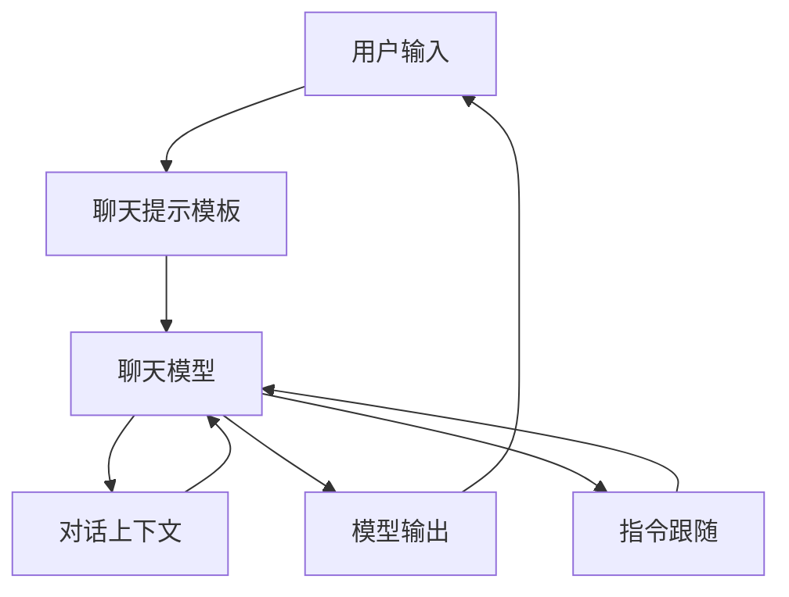

                 

## 1. 背景介绍

在当今人工智能（AI）飞速发展的时代，聊天模型（Chat Model）和聊天提示模板（Chat Prompt Template）已成为自然语言处理（NLP）领域的热门话题。聊天模型是一种能够理解和生成人类语言的AI模型，而聊天提示模板则是一种帮助用户与聊天模型交互的工具。本文将深入探讨聊天模型和聊天提示模板的核心概念、算法原理、数学模型，并提供项目实践和实际应用场景的分析。

## 2. 核心概念与联系

### 2.1 关键概念

- **聊天模型（Chat Model）**：一种能够理解和生成人类语言的AI模型，旨在模拟人类对话，提供有用、相关和连贯的回复。
- **聊天提示模板（Chat Prompt Template）**：一种帮助用户与聊天模型交互的工具，它定义了用户输入的格式和结构，以便模型能够正确理解和响应。
- **对话上下文（Dialog Context）**：聊天模型在生成回复时考虑的上下文信息，包括之前的对话历史、用户输入和模型的内部状态。
- **指令跟随（Instruction Following）**：聊天模型理解和执行用户指令的能力，是聊天提示模板的关键组成部分。

### 2.2 核心概念联系 Mermaid 流程图



## 3. 核心算法原理 & 具体操作步骤

### 3.1 算法原理概述

聊天模型通常基于 transformer 等注意力机制模型构建，并使用大规模语料库进行预训练和微调。聊天提示模板则利用指令跟随技术，通过提供明确的指令来引导模型生成期望的输出。

### 3.2 算法步骤详解

1. **预处理**：用户输入通过聊天提示模板进行预处理，生成模型可以理解的格式。
2. **对话上下文更新**：模型更新对话上下文，考虑之前的对话历史和用户输入。
3. **生成回复**：模型根据对话上下文和用户输入生成回复。
4. **指令跟随**：模型理解和执行用户指令，如果有指令，则优先生成相应的输出。
5. **后处理**：模型输出通过后处理（如去除特殊标记）生成最终的回复。

### 3.3 算法优缺点

**优点**：

- 灵活性：聊天模型可以处理各种类型的对话，从问答到创意写作。
- 可扩展性：聊天提示模板可以轻松扩展到新的任务和领域。

**缺点**：

- 理解限制：模型可能无法理解复杂或模棱两可的用户输入。
- 计算资源：大型聊天模型需要大量计算资源进行训练和推理。

### 3.4 算法应用领域

- 客户服务：提供24/7客户支持和帮助。
- 教育：创建交互式学习平台和虚拟教师。
- 创意写作：协助用户创作小说、诗歌和其他文本内容。

## 4. 数学模型和公式 & 详细讲解 & 举例说明

### 4.1 数学模型构建

聊天模型通常基于 transformer 等注意力机制模型构建。给定输入序列 $X = (x_1, x_2,..., x_n)$，模型生成输出序列 $Y = (y_1, y_2,..., y_m)$。注意力机制可以表示为：

$$ \text{Attention}(Q, K, V) = \text{softmax}\left(\frac{QK^T}{\sqrt{d_k}}\right)V $$

其中，$Q$, $K$, $V$ 分别是查询、键和值矩阵，而 $d_k$ 是键维度。

### 4.2 公式推导过程

 transformer 模型由多个自注意力（self-attention）层和 Feed-Forward 网络组成。自注意力层的输出可以表示为：

$$ \text{Self-Attention}(X) = \text{Attention}(XW^Q, XW^K, XW^V) $$

其中，$W^Q$, $W^K$, $W^V$ 是学习的权重矩阵。

### 4.3 案例分析与讲解

考虑以下对话：

用户：你好！你能告诉我今天的天气吗？

模型：你好！今天是晴天，气温约为25摄氏度。

在生成回复时，模型考虑了对话上下文（用户问好和提出问题）和指令跟随（提供天气信息），并生成了相应的输出。

## 5. 项目实践：代码实例和详细解释说明

### 5.1 开发环境搭建

- Python 3.8+
- Transformers library（https://huggingface.co/transformers/）
- Datasets library（https://huggingface.co/datasets）

### 5.2 源代码详细实现

```python
from transformers import AutoModelForSeq2SeqLM, AutoTokenizer
import torch

# 加载预训练模型和分词器
model = AutoModelForSeq2SeqLM.from_pretrained("t5-base")
tokenizer = AutoTokenizer.from_pretrained("t5-base")

# 准备输入
input_text = "Translate to French: Hello, world!"
input_ids = tokenizer.encode(input_text, return_tensors="pt")

# 生成输出
outputs = model.generate(input_ids)
output_text = tokenizer.decode(outputs[0])

print(output_text)  # "Bonjour, monde!"
```

### 5.3 代码解读与分析

我们使用 Hugging Face 的 transformers library 加载预训练的 T5 模型，并使用分词器对输入文本进行编码。然后，我们使用模型的 `generate` 方法生成输出，并解码输出文本。

### 5.4 运行结果展示

运行上述代码将生成 "Bonjour, monde!"，表示模型成功将 "Hello, world!" 翻译为法语。

## 6. 实际应用场景

### 6.1 客户服务

聊天模型可以提供24/7客户支持，处理常见问题并指引用户解决复杂问题。

### 6.2 教育

聊天模型可以创建交互式学习平台，帮助学生学习新概念并提供个性化反馈。

### 6.3 未来应用展望

未来，聊天模型和聊天提示模板将进一步发展，支持更复杂的对话和任务，并无缝集成到更多应用中。

## 7. 工具和资源推荐

### 7.1 学习资源推荐

- "Natural Language Processing with Python" by Steven Bird, Ewan Klein, and Edward Loper
- Stanford's CS224n Natural Language Processing with Deep Learning course (https://online.stanford.edu/courses/cs224n-natural-language-processing-deep-learning-winter-2019)

### 7.2 开发工具推荐

- Hugging Face's transformers library（https://huggingface.co/transformers/）
- Datasets library（https://huggingface.co/datasets）
- Google's Colab（https://colab.research.google.com/）

### 7.3 相关论文推荐

- "Attention is All You Need" by Vaswani et al. (https://arxiv.org/abs/1706.03762)
- "T5: Text-to-Text Transfer Transformer" by Collobert et al. (https://arxiv.org/abs/1910.10683)

## 8. 总结：未来发展趋势与挑战

### 8.1 研究成果总结

本文介绍了聊天模型和聊天提示模板的核心概念、算法原理、数学模型，并提供了项目实践和实际应用场景的分析。

### 8.2 未来发展趋势

未来，聊天模型和聊天提示模板将进一步发展，支持更复杂的对话和任务，并无缝集成到更多应用中。

### 8.3 面临的挑战

- **理解限制**：模型可能无法理解复杂或模棱两可的用户输入。
- **计算资源**：大型聊天模型需要大量计算资源进行训练和推理。

### 8.4 研究展望

未来的研究将关注提高模型理解能力、降低计算资源需求，并开发新的应用领域和任务。

## 9. 附录：常见问题与解答

**Q：聊天模型是如何理解用户输入的？**

A：聊天模型使用注意力机制等技术来理解用户输入，考虑对话上下文和指令跟随。

**Q：如何评估聊天模型的性能？**

A：评估指标包括BLEU、ROUGE等，旨在衡量模型生成回复的质量和相关性。

**Q：聊天提示模板有哪些优点？**

A：聊天提示模板提供了灵活性和可扩展性，帮助用户与模型交互并引导模型生成期望的输出。

## 作者：禅与计算机程序设计艺术 / Zen and the Art of Computer Programming

