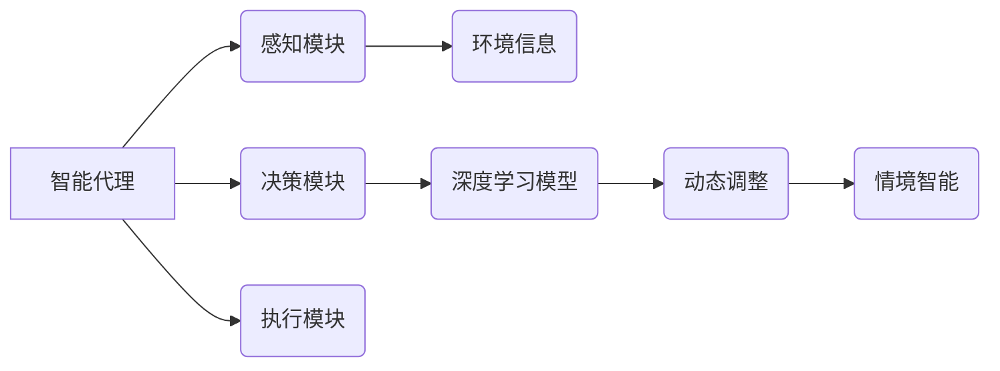

> 深度学习、智能代理、动态调整、情境智能、强化学习、神经网络、迁移学习

## 1. 背景介绍

人工智能（AI）正以惊人的速度发展，深度学习作为其核心技术，在图像识别、自然语言处理、语音识别等领域取得了突破性进展。然而，现有的深度学习模型往往缺乏适应性，难以应对复杂、多变的现实世界场景。智能深度学习代理的动态调整与情境智能成为解决这一问题的关键方向。

智能深度学习代理是指能够自主学习、决策、行动的智能体，其核心是深度学习算法。动态调整是指代理能够根据环境变化和任务需求，实时调整自身模型参数和策略，以保持最佳性能。情境智能是指代理能够理解和适应不同的环境情境，并做出相应的决策。

## 2. 核心概念与联系

**2.1 智能代理**

智能代理是一个能够感知环境、做出决策并执行行动的软件系统。它通常由以下几个部分组成：

* **感知模块:** 收集环境信息，例如传感器数据、用户输入等。
* **决策模块:** 根据感知到的信息，选择最优行动策略。
* **执行模块:** 将决策转化为实际行动，例如控制机器人运动、生成文本等。

**2.2 深度学习**

深度学习是一种机器学习方法，它利用多层神经网络来模拟人类大脑的学习过程。深度学习模型能够从海量数据中学习复杂的特征表示，从而实现高精度的人工智能应用。

**2.3 动态调整**

动态调整是指代理能够根据环境变化和任务需求，实时调整自身模型参数和策略，以保持最佳性能。常见的动态调整方法包括：

* **在线学习:** 在代理运行过程中不断更新模型参数，以适应不断变化的环境。
* **元学习:** 学习如何学习，能够快速适应新的任务和环境。
* **自适应学习:** 根据任务需求自动调整学习策略和模型结构。

**2.4 情境智能**

情境智能是指代理能够理解和适应不同的环境情境，并做出相应的决策。实现情境智能的关键是：

* **环境建模:** 建立对环境的抽象模型，以便代理能够理解环境状态和变化。
* **情境识别:** 识别当前的环境情境，例如时间、地点、人物等。
* **策略选择:** 根据识别出的情境，选择最合适的行动策略。

**2.5 核心概念关系图**



## 3. 核心算法原理 & 具体操作步骤

### 3.1 算法原理概述

智能深度学习代理的动态调整与情境智能通常基于强化学习（RL）算法。强化学习是一种监督学习方法，代理通过与环境交互，获得奖励信号，并根据奖励信号调整行为策略，以最大化长期奖励。

### 3.2 算法步骤详解

1. **环境建模:** 建立对环境的抽象模型，以便代理能够理解环境状态和变化。
2. **状态空间定义:** 定义代理所能感知到的所有环境状态，并将其表示为状态空间。
3. **动作空间定义:** 定义代理可以执行的所有动作，并将其表示为动作空间。
4. **奖励函数设计:** 设计一个奖励函数，用于评估代理的行为是否符合预期目标。
5. **策略学习:** 使用强化学习算法，例如Q学习、SARSA等，学习一个策略，该策略能够最大化代理的长期奖励。
6. **动态调整:** 根据环境变化和任务需求，实时调整策略参数，以保持最佳性能。
7. **情境识别:** 使用深度学习模型，识别当前的环境情境，例如时间、地点、人物等。
8. **策略选择:** 根据识别出的情境，选择最合适的行动策略。

### 3.3 算法优缺点

**优点:**

* 能够学习复杂的行为策略。
* 能够适应动态变化的环境。
* 能够实现情境智能。

**缺点:**

* 训练过程可能需要大量数据和计算资源。
* 奖励函数的设计至关重要，设计不当会导致代理学习到不期望的行为。
* 难以解释代理的行为决策过程。

### 3.4 算法应用领域

智能深度学习代理的动态调整与情境智能在以下领域具有广泛的应用前景：

* **机器人控制:** 使机器人能够自主学习和适应不同的环境，执行复杂的任务。
* **自动驾驶:** 使自动驾驶汽车能够更好地感知环境，做出更安全的决策。
* **个性化推荐:** 根据用户的行为和偏好，提供个性化的产品和服务推荐。
* **医疗诊断:** 辅助医生进行疾病诊断，提高诊断准确率。

## 4. 数学模型和公式 & 详细讲解 & 举例说明

### 4.1 数学模型构建

强化学习的数学模型主要包括状态空间、动作空间、奖励函数和策略函数。

* **状态空间:**  S = {s1, s2, ..., sn}，表示代理所能感知到的所有环境状态。
* **动作空间:** A = {a1, a2, ..., am}，表示代理可以执行的所有动作。
* **奖励函数:** R(s, a)，表示代理在状态s执行动作a后获得的奖励。
* **策略函数:** π(s)，表示代理在状态s下选择动作的概率分布。

### 4.2 公式推导过程

强化学习的目标是学习一个策略函数π(s)，使得代理在与环境交互的过程中获得最大的长期奖励。常用的强化学习算法，例如Q学习，通过迭代更新Q值来学习策略。

Q值表示代理在状态s执行动作a后获得的期望奖励。Q值更新公式如下：

$$Q(s, a) = Q(s, a) + \alpha [R(s, a) + \gamma \max_{a'} Q(s', a') - Q(s, a)]$$

其中：

* α 是学习率，控制着Q值更新的步长。
* γ 是折扣因子，控制着未来奖励的权重。
* s' 是执行动作a后进入的下一个状态。

### 4.3 案例分析与讲解

例如，训练一个智能代理玩游戏，我们可以将游戏状态表示为游戏画面，动作表示为游戏按键操作，奖励函数为获得分数或完成关卡。通过Q学习算法，代理可以学习到在不同游戏状态下执行不同动作的最佳策略，从而提高游戏得分。

## 5. 项目实践：代码实例和详细解释说明

### 5.1 开发环境搭建

* Python 3.x
* TensorFlow 或 PyTorch 深度学习框架
* OpenAI Gym 游戏环境

### 5.2 源代码详细实现

```python
import gym
import tensorflow as tf

# 定义Q网络
class QNetwork(tf.keras.Model):
    def __init__(self):
        super(QNetwork, self).__init__()
        self.dense1 = tf.keras.layers.Dense(64, activation='relu')
        self.dense2 = tf.keras.layers.Dense(64, activation='relu')
        self.output = tf.keras.layers.Dense(num_actions)

    def call(self, state):
        x = self.dense1(state)
        x = self.dense2(x)
        return self.output(x)

# 定义Q学习算法
def q_learning(env, q_network, learning_rate, discount_factor, episodes):
    for episode in range(episodes):
        state = env.reset()
        done = False
        while not done:
            # 选择动作
            action = tf.argmax(q_network(state)).numpy()
            # 执行动作
            next_state, reward, done, _ = env.step(action)
            # 更新Q值
            target = reward + discount_factor * tf.reduce_max(q_network(next_state))
            with tf.GradientTape() as tape:
                q_value = q_network(state)
                loss = tf.keras.losses.MSE(target, q_value[0, action])
            gradients = tape.gradient(loss, q_network.trainable_variables)
            optimizer.apply_gradients(zip(gradients, q_network.trainable_variables))
            state = next_state

# 训练Q网络
env = gym.make('CartPole-v1')
q_network = QNetwork()
optimizer = tf.keras.optimizers.Adam(learning_rate=0.001)
q_learning(env, q_network, learning_rate=0.001, discount_factor=0.99, episodes=1000)

# 测试训练好的Q网络
state = env.reset()
done = False
while not done:
    action = tf.argmax(q_network(state)).numpy()
    state, reward, done, _ = env.step(action)
    env.render()
```

### 5.3 代码解读与分析

这段代码实现了Q学习算法，训练了一个智能代理玩CartPole游戏。

* 首先定义了Q网络，这是一个简单的多层神经网络，用于估计在每个状态下执行每个动作的Q值。
* 然后定义了Q学习算法，它迭代地更新Q值，以最大化代理的长期奖励。
* 最后，训练了Q网络，并测试了训练好的网络。

### 5.4 运行结果展示

运行代码后，代理将能够在CartPole游戏中保持平衡，并获得高分。

## 6. 实际应用场景

### 6.1 智能机器人控制

智能深度学习代理可以用于控制机器人，使其能够自主学习和适应不同的环境，执行复杂的任务，例如：

* **工业机器人:** 自动化生产线上的机器人，能够根据不同的产品和生产流程进行调整。
* **服务机器人:** 在酒店、医院等场所提供服务，例如送餐、清洁、导览等。
* **探索机器人:** 在危险或难以到达的区域进行探索，例如深海、太空等。

### 6.2 自动驾驶

智能深度学习代理可以用于自动驾驶汽车，使其能够更好地感知环境，做出更安全的决策，例如：

* **环境感知:** 利用摄像头、雷达等传感器，感知周围车辆、行人、道路等信息。
* **路径规划:** 根据环境信息，规划最优行驶路径。
* **决策控制:** 根据规划的路径，控制车辆的加速、减速、转向等动作。

### 6.3 个性化推荐

智能深度学习代理可以用于个性化推荐，根据用户的行为和偏好，提供个性化的产品和服务推荐，例如：

* **电商平台:** 推荐用户可能感兴趣的商品。
* **视频网站:** 推荐用户可能想观看的视频。
* **音乐平台:** 推荐用户可能想听的音乐。

### 6.4 未来应用展望

智能深度学习代理的动态调整与情境智能在未来将有更广泛的应用前景，例如：

* **医疗诊断:** 辅助医生进行疾病诊断，提高诊断准确率。
* **教育教学:** 提供个性化的学习方案，提高学习效率。
* **金融投资:** 进行风险管理和投资决策。

## 7. 工具和资源推荐

### 7.1 学习资源推荐

* **书籍:**
    * 深度学习
    * 强化学习
* **在线课程:**
    * Coursera: 深度学习
    * Udacity: 强化学习
* **博客:**
    * OpenAI Blog
    * DeepMind Blog

### 7.2 开发工具推荐

* **Python:** 
* **TensorFlow:** 深度学习框架
* **PyTorch:** 深度学习框架
* **OpenAI Gym:** 游戏环境

### 7.3 相关论文推荐

* **Deep Reinforcement Learning: An Overview**
* **DQN: Deep Q-Network**
* **Policy Gradient Methods for Reinforcement Learning**

## 8. 总结：未来发展趋势与挑战

### 