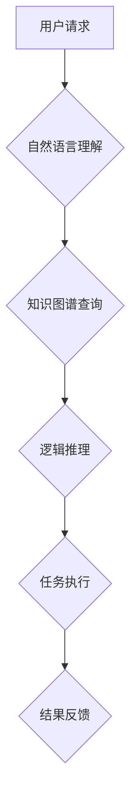

> AI助理、企业变革、自动化、流程优化、数据驱动、智能决策、人才发展、伦理规范

## 1. 背景介绍

人工智能（AI）技术近年来发展迅速，并开始深刻地改变着各行各业。其中，AI助理作为一种新型的智能应用，凭借其强大的智能处理能力和个性化服务特性，正在逐渐成为企业数字化转型的重要驱动力。

传统的企业运营模式往往依赖于人工操作和流程，效率低下、成本高昂，难以适应快速变化的市场环境。而AI助理的出现，为企业提供了全新的解决方案，能够自动化完成许多重复性任务，提高工作效率，降低运营成本，并释放人力资源，用于更具创造性和战略性的工作。

## 2. 核心概念与联系

**2.1 AI助理的概念**

AI助理是指利用人工智能技术，能够理解和响应人类指令，并提供智能化服务的软件系统。它可以根据用户的需求，提供个性化的信息查询、数据分析、任务执行等服务。

**2.2 AI助理与企业变革的关系**

AI助理的应用能够推动企业在多个方面进行变革，包括：

* **自动化流程：** AI助理可以自动化完成许多重复性、规则性任务，例如数据录入、报表生成、客户服务等，释放人力资源，提高工作效率。
* **数据驱动决策：** AI助理可以对海量数据进行分析，提取关键信息，为企业决策提供数据支持，帮助企业做出更准确、更有效的决策。
* **个性化服务：** AI助理可以根据用户的需求和喜好，提供个性化的服务，例如推荐产品、提供定制化解决方案等，提升客户体验。
* **创新驱动发展：** AI助理可以帮助企业探索新的业务模式、开发新的产品和服务，推动企业创新发展。

**2.3 AI助理的架构**



## 3. 核心算法原理 & 具体操作步骤

**3.1 算法原理概述**

AI助理的核心算法包括自然语言处理（NLP）、机器学习（ML）、深度学习（DL）等。

* **自然语言处理（NLP）：** 用于理解和处理人类语言，包括文本分析、语音识别、机器翻译等。
* **机器学习（ML）：** 算法能够从数据中学习，并根据学习到的知识进行预测或分类。
* **深度学习（DL）：** 基于多层神经网络的机器学习算法，能够处理更复杂的数据，并取得更优的性能。

**3.2 算法步骤详解**

1. **用户请求接收：** AI助理首先接收用户的请求，无论是文本输入还是语音输入。
2. **自然语言理解：** 利用NLP算法对用户的请求进行理解，提取关键信息，例如用户意图、实体、关系等。
3. **知识图谱查询：** 根据提取的关键信息，查询知识图谱，获取相关知识和信息。
4. **逻辑推理：** 利用逻辑推理算法，根据知识图谱中的信息，推断出用户的需求，并确定相应的执行步骤。
5. **任务执行：** 根据推理结果，执行相应的任务，例如搜索信息、生成文本、控制设备等。
6. **结果反馈：** 将执行结果反馈给用户，并根据用户的反馈进行学习和改进。

**3.3 算法优缺点**

* **优点：**
    * 自动化能力强，能够完成许多重复性任务。
    * 数据驱动决策，能够提供更准确、更有效的决策支持。
    * 个性化服务，能够根据用户的需求提供定制化服务。
* **缺点：**
    * 算法复杂，需要大量的训练数据和计算资源。
    * 缺乏通用性，难以应对复杂、多变的场景。
    * 存在伦理风险，例如数据隐私泄露、算法偏见等。

**3.4 算法应用领域**

AI助理的应用领域非常广泛，包括：

* **客户服务：** 自动化处理客户咨询、投诉等问题。
* **人力资源：** 自动化招聘、培训、绩效评估等流程。
* **财务管理：** 自动化记账、报税、财务分析等工作。
* **营销推广：** 个性化推荐产品、服务，提高营销效果。
* **教育培训：** 提供个性化学习辅导、智能答疑等服务。

## 4. 数学模型和公式 & 详细讲解 & 举例说明

**4.1 数学模型构建**

AI助理的构建需要建立数学模型来描述其行为和决策过程。常用的数学模型包括：

* **贝叶斯网络：** 用于表示随机变量之间的概率关系，可以用于文本分类、情感分析等任务。
* **决策树：** 用于表示决策过程，可以用于分类、回归等任务。
* **支持向量机（SVM）：** 用于分类和回归任务，可以有效地处理高维数据。

**4.2 公式推导过程**

例如，在文本分类任务中，可以使用贝叶斯网络来构建数学模型。贝叶斯网络的概率公式如下：

$$P(C|D) = \frac{P(D|C)P(C)}{P(D)}$$

其中：

* $P(C|D)$ 是给定证据 $D$ 下类别 $C$ 的概率。
* $P(D|C)$ 是给定类别 $C$ 下证据 $D$ 的概率。
* $P(C)$ 是类别 $C$ 的先验概率。
* $P(D)$ 是证据 $D$ 的概率。

**4.3 案例分析与讲解**

假设我们想要构建一个文本分类模型，用于将邮件分类为“垃圾邮件”或“正常邮件”。我们可以使用贝叶斯网络来构建模型，其中：

* $C$ 为类别变量，取值为“垃圾邮件”或“正常邮件”。
* $D$ 为邮件内容，包含单词、词性等特征。

我们可以根据训练数据，计算出 $P(D|C)$、$P(C)$ 和 $P(D)$ 的值，然后使用贝叶斯公式计算出给定邮件内容 $D$ 下，邮件属于“垃圾邮件”或“正常邮件”的概率。

## 5. 项目实践：代码实例和详细解释说明

**5.1 开发环境搭建**

* 操作系统：Windows/macOS/Linux
* Python 版本：3.6+
* 必要的库：NLTK、spaCy、scikit-learn、TensorFlow/PyTorch

**5.2 源代码详细实现**

```python
# 导入必要的库
import nltk
from nltk.corpus import stopwords
from sklearn.feature_extraction.text import TfidfVectorizer
from sklearn.naive_bayes import MultinomialNB

# 下载停用词列表
nltk.download('stopwords')

# 加载训练数据
train_data = [
    ("This is a spam email.", "spam"),
    ("I am writing to you about a special offer.", "spam"),
    ("Hello, how are you doing?", "ham"),
    ("Can you please help me with this issue?", "ham"),
]

# 预处理文本数据
def preprocess_text(text):
    # 将文本转换为小写
    text = text.lower()
    # 去除停用词
    stop_words = set(stopwords.words('english'))
    words = [word for word in text.split() if word not in stop_words]
    # 返回处理后的文本
    return " ".join(words)

# 预处理训练数据
processed_train_data = [
    preprocess_text(text) for text, label in train_data
]

# 使用TF-IDF向量化文本数据
vectorizer = TfidfVectorizer()
train_features = vectorizer.fit_transform(processed_train_data)

# 训练Naive Bayes分类器
classifier = MultinomialNB()
classifier.fit(train_features, [label for text, label in train_data])

# 测试新邮件
new_email = "This is a great deal you should not miss!"
processed_new_email = preprocess_text(new_email)
new_email_features = vectorizer.transform([processed_new_email])
prediction = classifier.predict(new_email_features)

# 输出预测结果
print(f"预测结果: {prediction[0]}")
```

**5.3 代码解读与分析**

这段代码演示了如何使用Python语言构建一个简单的邮件分类器。

* 首先，导入必要的库，并下载停用词列表。
* 然后，加载训练数据，并使用预处理函数将文本数据转换为小写，去除停用词。
* 接着，使用TF-IDF向量化技术将文本数据转换为数字特征。
* 然后，训练Naive Bayes分类器，并使用训练好的模型对新邮件进行预测。

**5.4 运行结果展示**

运行这段代码后，会输出预测结果，例如：

```
预测结果: spam
```

## 6. 实际应用场景

**6.1 客户服务自动化**

AI助理可以接管客户服务热线，自动回答常见问题，例如产品信息、订单状态、退换货政策等。

**6.2 人力资源管理**

AI助理可以协助招聘人员筛选简历，进行初筛面试，并为招聘经理提供候选人推荐。

**6.3 财务管理自动化**

AI助理可以自动处理账单、发票、报销等财务事务，提高财务效率。

**6.4 市场营销个性化**

AI助理可以根据用户的行为数据，提供个性化的产品推荐、广告推送，提高营销效果。

**6.5 教育培训智能化**

AI助理可以提供个性化的学习辅导、智能答疑，帮助学生提高学习效率。

**6.6 未来应用展望**

随着AI技术的不断发展，AI助理的应用场景将更加广泛，例如：

* **医疗保健：** AI助理可以辅助医生诊断疾病、制定治疗方案。
* **金融服务：** AI助理可以协助金融分析师进行风险评估、投资决策。
* **智能家居：** AI助理可以控制家居设备，提供个性化的生活体验。

## 7. 工具和资源推荐

**7.1 学习资源推荐**

* **在线课程：** Coursera、edX、Udacity 等平台提供丰富的AI课程。
* **书籍：** 《深度学习》、《机器学习实战》等书籍是学习AI的基础教材。
* **开源项目：** TensorFlow、PyTorch 等开源项目可以帮助你实践AI算法。

**7.2 开发工具推荐**

* **Python：** 作为AI开发的主要语言，Python拥有丰富的库和工具。
* **Jupyter Notebook：** 用于编写和运行Python代码，并可视化数据。
* **IDE：** PyCharm、VS Code 等IDE可以提高开发效率。

**7.3 相关论文推荐**

* **Attention Is All You Need：** 提出Transformer模型， revolutionized natural language processing.
* **BERT：** 预训练语言模型，在许多自然语言处理任务中取得了优异的性能。
* **GPT-3：** 强大的文本生成模型，能够生成高质量的文本内容。

## 8. 总结：未来发展趋势与挑战

**8.1 研究成果总结**

近年来，AI技术取得了长足的进步，AI助理的应用也越来越广泛。

**8.2 未来发展趋势**

* **更强大的计算能力：** 随着计算能力的提升，AI模型将更加复杂，能够处理更复杂的任务。
* **更丰富的传感器数据：** 随着传感器技术的进步，AI助理将能够获取更多环境信息，提供更智能的服务。
* **更强的解释性：** 研究人员将致力于提高AI模型的解释性，使AI决策更加透明可信。

**8.3 面临的挑战**

* **数据安全和隐私保护：** AI助理需要处理大量用户数据，因此数据安全和隐私保护是一个重要的挑战。
* **算法偏见：** AI模型的训练数据可能存在偏见，导致AI助理产生不公平的决策。
* **伦理规范：** AI助理的应用需要遵循伦理规范，避免造成负面影响。

**8.4 研究展望**

未来