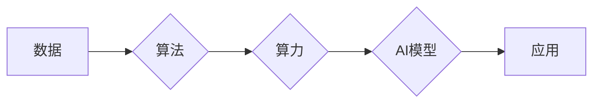

> 人工智能 (AI)
> 算法
> 算力
> 数据
> 深度学习
> 机器学习
> 计算机视觉

## 1. 背景介绍

人工智能 (AI) 作为科技发展的重要方向，近年来取得了令人瞩目的进展。从语音识别到图像识别，从自动驾驶到医疗诊断，AI技术正在深刻地改变着我们的生活。然而，AI的发展并非一蹴而就，它依赖于三大支柱：算法、算力和数据。这三大支柱相互依存，缺一不可，共同推动着AI技术的进步。

## 2. 核心概念与联系

**2.1 算法**

算法是AI的核心，它指解决特定问题的步骤或规则。不同的算法适用于不同的任务，例如，用于图像识别的卷积神经网络算法，用于自然语言处理的循环神经网络算法，等等。

**2.2 算力**

算力是指计算机处理信息的速率，它决定了AI模型的训练速度和推理效率。随着AI模型规模的不断扩大，对算力的需求也越来越高。

**2.3 数据**

数据是AI模型的燃料，它用于训练和评估AI模型。高质量的数据能够帮助AI模型更好地学习和理解世界。

**2.4 三大支柱的联系**

算法、算力和数据相互依存，共同构成了AI发展的基石。

* 数据为算法提供训练素材，算法通过学习数据，不断优化自身，提高性能。
* 算力为算法的训练和推理提供支持，强大的算力能够加速算法的训练速度，提高推理效率。
* 算法的进步能够更好地利用数据，提取更丰富的特征，从而推动数据分析和挖掘。

**Mermaid 流程图**



## 3. 核心算法原理 & 具体操作步骤

### 3.1  算法原理概述

深度学习是目前AI领域最热门的算法之一，它能够模拟人类大脑的神经网络结构，通过多层神经网络进行特征提取和学习。深度学习算法的核心是神经网络，它由多个神经元组成，每个神经元接收输入信号，经过激活函数处理后输出信号。神经网络通过连接不同神经元，形成复杂的网络结构，能够学习到数据中的复杂模式和关系。

### 3.2  算法步骤详解

1. **数据预处理:** 将原始数据进行清洗、转换和格式化，使其适合深度学习算法的训练。
2. **网络结构设计:** 根据任务需求设计神经网络的结构，包括神经元的数量、连接方式和激活函数等。
3. **参数初始化:** 为神经网络中的参数进行随机初始化。
4. **前向传播:** 将输入数据通过神经网络进行传递，计算输出结果。
5. **反向传播:** 计算输出结果与真实值的误差，并根据误差反向传播，更新神经网络的参数。
6. **训练迭代:** 重复前向传播和反向传播的过程，直到模型的性能达到预期的水平。
7. **模型评估:** 使用测试数据评估模型的性能，例如准确率、召回率等。
8. **模型部署:** 将训练好的模型部署到实际应用场景中。

### 3.3  算法优缺点

**优点:**

* 能够学习到数据中的复杂模式和关系。
* 性能优异，在图像识别、自然语言处理等领域取得了突破性进展。

**缺点:**

* 训练数据量大，对算力和存储资源要求高。
* 训练过程复杂，需要专业的知识和经验。
* 模型解释性差，难以理解模型的决策过程。

### 3.4  算法应用领域

深度学习算法广泛应用于各个领域，例如：

* **计算机视觉:** 图像识别、目标检测、图像分割、人脸识别等。
* **自然语言处理:** 文本分类、情感分析、机器翻译、对话系统等。
* **语音识别:** 语音转文本、语音助手等。
* **医疗诊断:** 病理图像分析、疾病预测等。
* **金融分析:** 风险评估、欺诈检测等。

## 4. 数学模型和公式 & 详细讲解 & 举例说明

### 4.1  数学模型构建

深度学习算法的核心是神经网络，它可以看作是一个复杂的数学模型。神经网络的数学模型可以表示为：

$$
y = f(W^L x^L + b^L)
$$

其中：

* $y$ 是输出结果。
* $x^L$ 是第 $L$ 层的输入。
* $W^L$ 是第 $L$ 层的权重矩阵。
* $b^L$ 是第 $L$ 层的偏置向量。
* $f$ 是激活函数。

### 4.2  公式推导过程

神经网络的训练过程是通过优化权重矩阵和偏置向量来实现的。常用的优化算法包括梯度下降法和其变种。梯度下降法的核心思想是通过计算损失函数的梯度，不断更新权重和偏置，使得损失函数最小化。

损失函数通常定义为预测结果与真实值的差值。例如，对于分类任务，常用的损失函数是交叉熵损失函数。

### 4.3  案例分析与讲解

假设我们有一个简单的线性回归问题，目标是预测房价。我们可以使用一个单层神经网络来解决这个问题。

* 输入特征：房屋面积。
* 输出结果：房价。

我们可以使用梯度下降法来训练这个神经网络。

1. 初始化权重和偏置。
2. 将房屋面积作为输入，计算输出房价。
3. 计算损失函数，例如均方误差。
4. 计算梯度，更新权重和偏置。
5. 重复步骤2-4，直到损失函数最小化。

## 5. 项目实践：代码实例和详细解释说明

### 5.1  开发环境搭建

* Python 3.x
* TensorFlow 或 PyTorch

### 5.2  源代码详细实现

```python
import tensorflow as tf

# 定义模型
model = tf.keras.models.Sequential([
    tf.keras.layers.Dense(units=1, input_shape=[1])
])

# 编译模型
model.compile(optimizer='sgd', loss='mean_squared_error')

# 训练模型
model.fit(x_train, y_train, epochs=100)

# 评估模型
loss = model.evaluate(x_test, y_test)
print('Loss:', loss)
```

### 5.3  代码解读与分析

* `tf.keras.models.Sequential` 创建一个顺序模型，即层级结构。
* `tf.keras.layers.Dense` 创建一个全连接层，输入维度为1，输出维度为1。
* `model.compile` 编译模型，指定优化器、损失函数等。
* `model.fit` 训练模型，输入训练数据和训练轮数。
* `model.evaluate` 评估模型，输入测试数据，计算损失值。

### 5.4  运行结果展示

训练完成后，我们可以使用测试数据评估模型的性能，例如计算均方误差。

## 6. 实际应用场景

### 6.1  图像识别

深度学习算法在图像识别领域取得了突破性进展，例如：

* **人脸识别:** 用于身份验证、安全监控等。
* **物体检测:** 用于自动驾驶、安防监控等。
* **图像分类:** 用于医疗诊断、产品分类等。

### 6.2  自然语言处理

深度学习算法在自然语言处理领域也取得了显著成果，例如：

* **机器翻译:** 将一种语言翻译成另一种语言。
* **文本摘要:** 自动生成文本的摘要。
* **情感分析:** 分析文本的情感倾向。

### 6.3  语音识别

深度学习算法在语音识别领域也取得了重要进展，例如：

* **语音转文本:** 将语音转换为文本。
* **语音助手:** 例如 Siri、Alexa 等。

### 6.4  未来应用展望

随着AI技术的不断发展，深度学习算法将在更多领域得到应用，例如：

* **个性化推荐:** 根据用户的喜好推荐产品或服务。
* **医疗诊断:** 辅助医生进行疾病诊断。
* **自动驾驶:** 实现无人驾驶汽车。

## 7. 工具和资源推荐

### 7.1  学习资源推荐

* **书籍:**
    * 深度学习
    * 构建深度学习模型
* **在线课程:**
    * Coursera 深度学习课程
    * Udacity 深度学习工程师 Nanodegree

### 7.2  开发工具推荐

* **TensorFlow:** 开源深度学习框架。
* **PyTorch:** 开源深度学习框架。
* **Keras:** 高级深度学习API，可以运行在TensorFlow或Theano之上。

### 7.3  相关论文推荐

* **ImageNet Classification with Deep Convolutional Neural Networks**
* **Attention Is All You Need**
* **BERT: Pre-training of Deep Bidirectional Transformers for Language Understanding**

## 8. 总结：未来发展趋势与挑战

### 8.1  研究成果总结

深度学习算法取得了令人瞩目的进展，在图像识别、自然语言处理、语音识别等领域取得了突破性成果。

### 8.2  未来发展趋势

* **模型规模的扩大:** 随着算力的提升，模型规模将继续扩大，从而提升模型的性能。
* **模型效率的提升:** 研究更轻量级的模型，提高模型的推理效率。
* **模型解释性的增强:** 研究更易于理解的模型，提高模型的可解释性。
* **跨模态学习:** 研究能够处理多种模态数据的模型，例如图像、文本、音频等。

### 8.3  面临的挑战

* **数据获取和标注:** 深度学习算法对大量高质量数据的依赖，数据获取和标注仍然是一个挑战。
* **模型训练成本:** 训练大型深度学习模型需要大量的算力和时间，成本较高。
* **模型安全性:** 深度学习模型容易受到攻击，需要研究更安全的模型。

### 8.4  研究展望

未来，深度学习算法将继续发展，在更多领域发挥重要作用。研究人员将继续探索更有效的算法、更强大的算力和更丰富的资源，推动AI技术的进步。

## 9. 附录：常见问题与解答

**Q1: 深度学习算法的训练过程需要多长时间？**

A1: 深度学习算法的训练时间取决于模型的规模、数据的规模和硬件资源等因素。一般来说，训练一个小型模型可能只需要几小时，而训练一个大型模型可能需要几天甚至几周。

**Q2: 如何评估深度学习模型的性能？**

A2: 深度学习模型的性能可以通过多种指标来评估，例如准确率、召回率、F1-score等。具体的指标选择取决于具体的任务需求。

**Q3: 如何选择合适的深度学习框架？**

A3: TensorFlow 和 PyTorch 是目前最流行的深度学习框架。TensorFlow 更适合于生产环境，而 PyTorch 更适合于研究。

**作者：禅与计算机程序设计艺术 / Zen and the Art of Computer Programming**<end_of_turn>