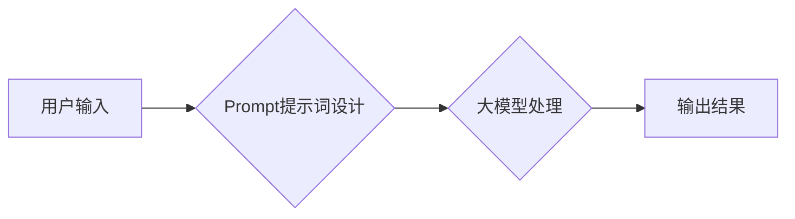

> AI大模型,Prompt提示词,自然语言处理,文本生成,机器学习,深度学习,最佳实践

## 1. 背景介绍

在人工智能领域，大模型的兴起掀起了前所未有的浪潮。这些庞大的模型，例如GPT-3、LaMDA和BERT，展现出惊人的能力，能够理解和生成人类语言，完成各种复杂的任务，从写作和翻译到代码生成和问答。然而，让这些模型发挥最佳性能的关键在于精心设计的**Prompt提示词**。

Prompt提示词就像给大模型的指令，它决定了模型将如何理解和响应用户的请求。一个好的Prompt提示词能够引导模型生成更准确、更相关、更符合用户意图的输出。反之，一个糟糕的Prompt提示词可能会导致模型产生混乱、无关或错误的回复。

## 2. 核心概念与联系

**2.1  大模型与Prompt提示词的关系**

大模型通常是一个复杂的深度学习模型，拥有数亿甚至数十亿个参数。这些参数通过训练数据学习语言的模式和结构。然而，大模型本身并不能理解人类语言的含义，它需要通过Prompt提示词来获取任务信息和用户意图。

**2.2  Prompt提示词的类型**

Prompt提示词可以分为多种类型，例如：

* **文本填充:** 要求模型填充缺失的文本内容。例如：“The cat sat on the ____。”
* **文本生成:** 要求模型生成一段新的文本内容。例如：“写一篇关于人工智能的文章。”
* **问答:** 要求模型回答一个问题。例如：“什么是人工智能？”
* **代码生成:** 要求模型生成一段代码。例如：“用Python编写一个打印'Hello World'的程序。”

**2.3  Prompt提示词的设计原则**

设计一个好的Prompt提示词需要遵循以下原则：

* **明确:** 提示词应该清晰地表达用户的意图，避免歧义。
* **具体:** 提示词应该提供足够的上下文信息，帮助模型理解任务要求。
* **简洁:** 提示词应该尽量简短，避免冗余信息。
* **相关:** 提示词应该与模型的训练数据相关，提高模型的准确率。

**Mermaid 流程图**



## 3. 核心算法原理 & 具体操作步骤

**3.1  算法原理概述**

大模型通常基于**Transformer**架构，它利用**自注意力机制**来捕捉文本序列中的长距离依赖关系。在处理Prompt提示词时，模型会将提示词和输入文本作为序列进行编码，并利用自注意力机制学习它们之间的关系。

**3.2  算法步骤详解**

1. **词嵌入:** 将Prompt提示词和输入文本中的每个词转换为向量表示。
2. **编码:** 使用Transformer编码器将词向量序列编码成隐藏状态向量。
3. **解码:** 使用Transformer解码器根据隐藏状态向量生成输出文本序列。
4. **输出:** 将输出文本序列解码成人类可读的文本。

**3.3  算法优缺点**

**优点:**

* 能够捕捉文本序列中的长距离依赖关系。
* 性能优异，在各种自然语言处理任务中取得了突破性进展。

**缺点:**

* 计算量大，训练和推理成本高。
* 对训练数据要求高，需要大量的文本数据进行训练。

**3.4  算法应用领域**

* 文本生成
* 机器翻译
* 问答系统
* 代码生成
* 文本摘要
* 情感分析

## 4. 数学模型和公式 & 详细讲解 & 举例说明

**4.1  数学模型构建**

Transformer模型的核心是**自注意力机制**。自注意力机制允许模型在处理文本序列时，关注不同词之间的关系，并赋予它们不同的权重。

**4.2  公式推导过程**

自注意力机制的计算过程可以概括为以下公式：

$$
Attention(Q, K, V) = softmax(\frac{QK^T}{\sqrt{d_k}})V
$$

其中：

* $Q$：查询矩阵
* $K$：键矩阵
* $V$：值矩阵
* $d_k$：键向量的维度
* $softmax$：softmax函数

**4.3  案例分析与讲解**

假设我们有一个句子：“The cat sat on the mat。”

* $Q$：查询矩阵，表示每个词对其他词的关注程度。
* $K$：键矩阵，表示每个词的特征信息。
* $V$：值矩阵，表示每个词的语义信息。

通过计算$QK^T$，我们可以得到每个词对其他词的注意力权重。然后，通过softmax函数将权重归一化，得到每个词对其他词的关注程度。最后，将注意力权重与值矩阵相乘，得到每个词的上下文信息。

## 5. 项目实践：代码实例和详细解释说明

**5.1  开发环境搭建**

* Python 3.7+
* TensorFlow/PyTorch
* CUDA (可选)

**5.2  源代码详细实现**

```python
import tensorflow as tf

# 定义Transformer模型
class Transformer(tf.keras.Model):
    def __init__(self, vocab_size, embedding_dim, num_heads, num_layers):
        super(Transformer, self).__init__()
        self.embedding = tf.keras.layers.Embedding(vocab_size, embedding_dim)
        self.transformer_layers = [
            tf.keras.layers.MultiHeadAttention(num_heads=num_heads, key_dim=embedding_dim)
            for _ in range(num_layers)
        ]
        self.decoder = tf.keras.layers.Dense(vocab_size)

    def call(self, inputs):
        # ... (代码实现)

# 训练模型
model = Transformer(vocab_size=..., embedding_dim=..., num_heads=..., num_layers=...)
model.compile(optimizer='adam', loss='sparse_categorical_crossentropy', metrics=['accuracy'])
model.fit(train_data, train_labels, epochs=10)

```

**5.3  代码解读与分析**

* `Transformer`类定义了Transformer模型的结构。
* `embedding`层将词转换为向量表示。
* `transformer_layers`列表包含多个`MultiHeadAttention`层，用于捕捉文本序列中的长距离依赖关系。
* `decoder`层用于生成输出文本序列。

**5.4  运行结果展示**

训练完成后，可以使用模型对新的文本进行处理，例如生成文本、翻译文本或回答问题。

## 6. 实际应用场景

**6.1  聊天机器人**

Prompt提示词可以引导聊天机器人理解用户的意图，并生成更自然、更符合语境的回复。

**6.2  文本摘要**

Prompt提示词可以指示模型提取文本的关键信息，生成简洁的文本摘要。

**6.3  代码生成**

Prompt提示词可以描述代码的功能需求，引导模型生成相应的代码。

**6.4  未来应用展望**

随着大模型技术的不断发展，Prompt提示词将在更多领域得到应用，例如教育、医疗、金融等。

## 7. 工具和资源推荐

**7.1  学习资源推荐**

* **论文:**
    * Attention Is All You Need (Vaswani et al., 2017)
    * BERT: Pre-training of Deep Bidirectional Transformers for Language Understanding (Devlin et al., 2018)
* **博客:**
    * The Illustrated Transformer (Jay Alammar)
    * OpenAI Blog

**7.2  开发工具推荐**

* **Hugging Face Transformers:** 一个开源库，提供各种预训练的大模型和Prompt提示词生成工具。
* **TensorFlow/PyTorch:** 深度学习框架，用于训练和部署大模型。

**7.3  相关论文推荐**

* Prompt Engineering for Large Language Models (Liu et al., 2021)
* Exploring the Limits of Transfer Learning with a Unified Text-to-Text Transformer (Brown et al., 2020)

## 8. 总结：未来发展趋势与挑战

**8.1  研究成果总结**

近年来，大模型和Prompt提示词技术取得了显著进展，在自然语言处理领域取得了突破性成果。

**8.2  未来发展趋势**

* **更强大的模型:** 模型规模将继续扩大，性能将进一步提升。
* **更智能的Prompt提示词:** 将探索更智能、更自动化的Prompt提示词生成方法。
* **多模态大模型:** 将融合文本、图像、音频等多模态数据，构建更全面的认知模型。

**8.3  面临的挑战**

* **数据安全和隐私:** 大模型的训练需要大量数据，如何保证数据安全和隐私是一个重要挑战。
* **模型可解释性:** 大模型的决策过程往往难以理解，如何提高模型的可解释性是一个关键问题。
* **伦理问题:** 大模型的应用可能带来一些伦理问题，例如信息操纵和偏见放大，需要引起重视。

**8.4  研究展望**

未来，我们将继续探索大模型和Prompt提示词技术的潜力，推动人工智能技术向更智能、更安全、更可持续的方向发展。

## 9. 附录：常见问题与解答

**9.1  如何设计一个好的Prompt提示词？**

* 明确表达用户的意图
* 提供足够的上下文信息
* 简洁明了，避免冗余信息
* 与模型的训练数据相关

**9.2  如何评估Prompt提示词的质量？**

* 通过评估模型的性能，例如准确率、流畅度等指标。
* 通过人工评估，例如阅读生成的文本，判断其质量和相关性。

**9.3  有哪些工具可以帮助我生成Prompt提示词？**

* Hugging Face Transformers
* OpenAI Playground

作者：禅与计算机程序设计艺术 / Zen and the Art of Computer Programming


<end_of_turn>