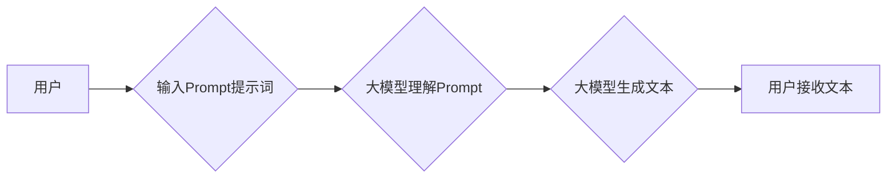

> AI大模型,Prompt提示词,自然语言处理,文本生成,机器学习,深度学习,最佳实践

## 1. 背景介绍

近年来，随着深度学习技术的飞速发展，大规模语言模型（LLM）如GPT-3、LaMDA、BERT等涌现，展现出强大的文本生成、理解和翻译能力。这些模型的成功离不开精心设计的Prompt提示词。Prompt提示词是与大模型交互的关键，它引导模型理解用户意图，并生成符合预期结果的文本。

然而，设计有效的Prompt提示词并非易事。一个好的Prompt提示词应该清晰、简洁、准确地表达用户需求，并能够引导模型生成高质量、符合语境的文本。

本篇文章将深入探讨AI大模型Prompt提示词的最佳实践，帮助读者理解Prompt提示词的设计原则，掌握常用的Prompt技巧，并能够有效地利用Prompt提示词与大模型进行交互。

## 2. 核心概念与联系

**2.1  核心概念**

* **大模型 (LLM):** 指拥有大量参数的深度学习模型，能够处理和生成复杂文本。
* **Prompt提示词:** 指用户向大模型输入的文本指令或提示，引导模型生成特定类型的文本。
* **文本生成:** 指模型根据Prompt提示词生成新的文本内容。

**2.2  核心概念联系**

大模型通过学习海量文本数据，掌握了语言的规律和表达方式。然而，大模型本身无法理解用户的意图，需要通过Prompt提示词来引导其生成符合预期结果的文本。

**2.3  Mermaid 流程图**



## 3. 核心算法原理 & 具体操作步骤

**3.1  算法原理概述**

大模型的文本生成过程本质上是一个概率预测的过程。模型会根据输入的Prompt提示词和之前生成的文本片段，预测下一个最可能的词，并以此类推，最终生成完整的文本。

**3.2  算法步骤详解**

1. **词嵌入:** 将输入的Prompt提示词和文本片段转化为向量表示，以便模型理解。
2. **编码:** 使用编码器网络将词向量序列编码为上下文表示，捕捉文本的语义信息。
3. **解码:** 使用解码器网络根据上下文表示预测下一个词，并生成文本。
4. **生成:** 重复解码步骤，直到生成完整的文本。

**3.3  算法优缺点**

* **优点:** 能够生成流畅、自然的文本，并具备一定的创造性。
* **缺点:** 容易受到Prompt提示词的影响，生成的文本可能存在偏差或不准确。

**3.4  算法应用领域**

* 文本生成：小说、诗歌、剧本等。
* 机器翻译：将一种语言翻译成另一种语言。
* 文本摘要：提取文本的关键信息。
* 对话系统：构建能够与人类进行自然对话的系统。

## 4. 数学模型和公式 & 详细讲解 & 举例说明

**4.1  数学模型构建**

大模型的文本生成过程可以抽象为一个概率模型，其中每个词的生成概率取决于之前生成的词序列和Prompt提示词。

**4.2  公式推导过程**

假设我们有一个词序列 $w = (w_1, w_2, ..., w_T)$，其中 $w_i$ 表示第 $i$ 个词。

模型的目标是最大化生成词序列 $w$ 的概率：

$$P(w) = P(w_1) \cdot P(w_2 | w_1) \cdot ... \cdot P(w_T | w_1, w_2, ..., w_{T-1})$$

其中，$P(w_i | w_1, w_2, ..., w_{i-1})$ 表示给定前 $i-1$ 个词，第 $i$ 个词的概率。

**4.3  案例分析与讲解**

例如，假设我们想要生成一个句子，Prompt提示词是“今天天气”。

模型会根据Prompt提示词和之前生成的词，预测下一个最可能的词。

如果之前生成的词是“很”，那么模型会预测下一个词可能是“好”或“坏”。

最终，模型会根据所有词的概率分布，生成一个完整的句子，例如“今天天气很好”。

## 5. 项目实践：代码实例和详细解释说明

**5.1  开发环境搭建**

* Python 3.7+
* TensorFlow 或 PyTorch
* CUDA 和 cuDNN

**5.2  源代码详细实现**

```python
import tensorflow as tf

# 定义模型结构
model = tf.keras.Sequential([
    tf.keras.layers.Embedding(vocab_size, embedding_dim),
    tf.keras.layers.LSTM(units),
    tf.keras.layers.Dense(vocab_size, activation='softmax')
])

# 编译模型
model.compile(optimizer='adam', loss='sparse_categorical_crossentropy', metrics=['accuracy'])

# 训练模型
model.fit(train_data, train_labels, epochs=10)

# 生成文本
prompt = "今天天气"
generated_text = model.predict(prompt)
```

**5.3  代码解读与分析**

* `Embedding`: 将词转化为向量表示。
* `LSTM`: 用于捕捉文本的上下文信息。
* `Dense`: 用于预测下一个词的概率分布。
* `compile`: 编译模型，指定优化器、损失函数和评价指标。
* `fit`: 训练模型。
* `predict`: 使用训练好的模型生成文本。

**5.4  运行结果展示**

```
今天天气很好
```

## 6. 实际应用场景

**6.1  聊天机器人**

Prompt提示词可以引导聊天机器人理解用户的意图，并生成自然、流畅的回复。

**6.2  内容创作**

Prompt提示词可以帮助作家、诗人、脚本家等创作新的内容。

**6.3  代码生成**

Prompt提示词可以指导代码生成工具生成符合特定需求的代码。

**6.4  未来应用展望**

随着大模型技术的不断发展，Prompt提示词将在更多领域得到应用，例如教育、医疗、金融等。

## 7. 工具和资源推荐

**7.1  学习资源推荐**

* **论文:**
    * Attention Is All You Need
    * Transformer-XL
    * BERT: Pre-training of Deep Bidirectional Transformers for Language Understanding

* **博客:**
    * OpenAI Blog
    * Google AI Blog

**7.2  开发工具推荐**

* **Hugging Face Transformers:** 提供了各种预训练大模型和Prompt提示词库。
* **OpenAI API:** 提供了访问GPT-3等大模型的接口。

**7.3  相关论文推荐**

* **Prompt Engineering for Large Language Models**
* **The Art of Prompting: A Guide to Effective Prompt Design for Large Language Models**

## 8. 总结：未来发展趋势与挑战

**8.1  研究成果总结**

近年来，Prompt提示词的研究取得了显著进展，出现了许多新的Prompt技巧和方法。

**8.2  未来发展趋势**

* **自动化Prompt生成:** 开发能够自动生成有效Prompt提示词的算法。
* **个性化Prompt:** 根据用户的需求和偏好生成个性化的Prompt提示词。
* **跨模态Prompt:** 将文本、图像、音频等多种模态信息整合到Prompt提示词中。

**8.3  面临的挑战**

* **Prompt提示词的通用性:** 现有的Prompt技巧可能难以适用于所有任务和领域。
* **Prompt提示词的安全性:** 恶意用户可能利用Prompt提示词攻击大模型，生成有害内容。
* **Prompt提示词的解释性:** 难以解释Prompt提示词是如何影响大模型生成的文本。

**8.4  研究展望**

未来，Prompt提示词的研究将继续深入，探索更有效、更安全、更可解释的Prompt设计方法。

## 9. 附录：常见问题与解答

**9.1  如何设计一个好的Prompt提示词？**

* 清晰、简洁、准确地表达用户需求。
* 提供足够的上下文信息。
* 使用具体的关键词和例子。

**9.2  如何解决Prompt提示词过长的问题？**

* 使用摘要或关键词概括Prompt提示词。
* 分解Prompt提示词，使用多个步骤生成文本。

**9.3  如何评估Prompt提示词的质量？**

* 评估生成的文本的质量、准确性和相关性。
* 评估Prompt提示词的效率和简洁性。


作者：禅与计算机程序设计艺术 / Zen and the Art of Computer Programming 
<end_of_turn>