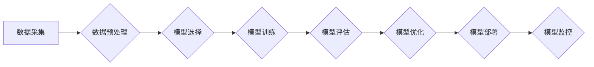

> AI工程学、机器学习、深度学习、模型训练、算法优化、数据处理、工程实践、实战指南

## 1. 背景介绍

人工智能（AI）正以惊人的速度发展，从语音识别到图像生成，AI技术已经渗透到我们生活的方方面面。然而，将AI技术从实验室转化为现实应用，需要跨越诸多技术和实践挑战。

传统的软件开发方法难以满足AI工程的复杂需求。AI工程需要处理海量数据、构建复杂的模型、进行高效的训练和部署，以及不断进行模型优化和迭代。因此，诞生了AI工程学这一新兴学科，旨在提供一套专门针对AI开发的体系化方法论和实践指南。

本指南旨在为读者提供AI工程学的核心概念、算法原理、实践技巧以及实际应用案例，帮助读者理解AI工程的本质，掌握AI开发的实战技能，并最终将AI技术应用于实际场景。

## 2. 核心概念与联系

AI工程学涵盖了多个核心概念，这些概念相互关联，共同构成了AI开发的完整流程。

**2.1 数据驱动**

数据是AI的核心驱动力。AI模型的训练和优化都依赖于大量的数据。数据质量、数据量和数据多样性直接影响模型的性能。

**2.2 模型训练**

模型训练是AI开发的关键步骤，通过训练算法，使模型能够从数据中学习并生成预测结果。常见的训练算法包括监督学习、无监督学习和强化学习。

**2.3 模型评估**

模型评估是衡量模型性能的重要指标。常用的评估指标包括准确率、召回率、F1-score等。

**2.4 模型部署**

模型部署是指将训练好的模型部署到实际应用环境中，以便进行预测和服务。

**2.5 模型优化**

模型优化是指不断改进模型的性能，包括模型结构优化、超参数调优和数据增强等。

**2.6 工程实践**

AI工程需要遵循软件工程的最佳实践，包括版本控制、代码规范、测试和部署等。

**Mermaid 流程图**



## 3. 核心算法原理 & 具体操作步骤

### 3.1  算法原理概述

本节将介绍深度学习算法中的一个核心算法：卷积神经网络（CNN）。CNN是一种专门用于处理图像数据的深度学习算法，其结构灵感来源于生物视觉系统。

CNN的核心结构是卷积层和池化层。卷积层通过卷积核对图像进行卷积运算，提取图像特征。池化层通过下采样操作，对卷积层的输出进行降维，减少计算量并提高模型鲁棒性。

### 3.2  算法步骤详解

1. **数据预处理:** 将图像数据预处理成CNN模型可以接受的格式，例如归一化像素值。
2. **卷积层:** 使用多个卷积核对图像进行卷积运算，提取图像特征。每个卷积核对应一个特征图。
3. **池化层:** 对卷积层的输出进行下采样操作，例如最大池化或平均池化，减少特征图的大小。
4. **全连接层:** 将池化层的输出扁平化，连接到全连接层，进行分类或回归任务。
5. **激活函数:** 在每个层之间使用激活函数，例如ReLU或Sigmoid，引入非线性，提高模型表达能力。

### 3.3  算法优缺点

**优点:**

* 能够有效地提取图像特征。
* 具有较强的鲁棒性，能够处理图像噪声和变形。
* 在图像分类、目标检测和图像分割等任务中表现出色。

**缺点:**

* 计算量较大，训练时间较长。
* 对数据量要求较高。
* 难以解释模型的决策过程。

### 3.4  算法应用领域

CNN在图像识别、目标检测、图像分割、人脸识别、医疗影像分析等领域有着广泛的应用。

## 4. 数学模型和公式 & 详细讲解 & 举例说明

### 4.1  数学模型构建

CNN的数学模型主要包括卷积运算、池化运算和激活函数。

**4.1.1 卷积运算**

卷积运算是一种线性运算，将卷积核与图像进行滑动计算，提取图像特征。

设图像为 $I \in R^{H \times W \times C}$，卷积核为 $K \in R^{F \times F \times C \times O}$，其中 $H$、$W$、$C$ 分别表示图像的高度、宽度和通道数，$F$ 表示卷积核的大小，$O$ 表示输出通道数。卷积运算的输出为 $O \in R^{(H-F+1) \times (W-F+1) \times O}$。

**4.1.2 池化运算**

池化运算是一种非线性运算，对卷积层的输出进行降维，减少计算量并提高模型鲁棒性。常见的池化方法包括最大池化和平均池化。

**4.1.3 激活函数**

激活函数引入非线性，提高模型表达能力。常见的激活函数包括ReLU、Sigmoid和Tanh。

### 4.2  公式推导过程

卷积运算的公式如下：

$$
O(i,j,k) = \sum_{m=0}^{F-1} \sum_{n=0}^{F-1} \sum_{l=0}^{C-1} I(i+m,j+n,l) \cdot K(m,n,l,k)
$$

其中，$O(i,j,k)$ 表示输出特征图的第 $k$ 个通道，第 $i$ 行，第 $j$ 列的像素值。

### 4.3  案例分析与讲解

假设我们有一个输入图像大小为 $28 \times 28$，通道数为 1 的黑白图像，以及一个 $3 \times 3$ 的卷积核，输出通道数为 16。

通过卷积运算，我们可以得到一个 $26 \times 26$ 的特征图，包含 16 个通道。每个通道代表了一种不同的图像特征。

## 5. 项目实践：代码实例和详细解释说明

### 5.1  开发环境搭建

本项目使用 Python 语言和 TensorFlow 深度学习框架进行开发。

需要安装以下软件：

* Python 3.x
* TensorFlow 2.x
* Jupyter Notebook

### 5.2  源代码详细实现

```python
import tensorflow as tf

# 定义卷积神经网络模型
model = tf.keras.models.Sequential([
    tf.keras.layers.Conv2D(32, (3, 3), activation='relu', input_shape=(28, 28, 1)),
    tf.keras.layers.MaxPooling2D((2, 2)),
    tf.keras.layers.Conv2D(64, (3, 3), activation='relu'),
    tf.keras.layers.MaxPooling2D((2, 2)),
    tf.keras.layers.Flatten(),
    tf.keras.layers.Dense(10, activation='softmax')
])

# 编译模型
model.compile(optimizer='adam',
              loss='sparse_categorical_crossentropy',
              metrics=['accuracy'])

# 加载 MNIST 数据集
(x_train, y_train), (x_test, y_test) = tf.keras.datasets.mnist.load_data()

# 数据预处理
x_train = x_train.astype('float32') / 255.0
x_test = x_test.astype('float32') / 255.0
x_train = x_train.reshape((x_train.shape[0], 28, 28, 1))
x_test = x_test.reshape((x_test.shape[0], 28, 28, 1))

# 模型训练
model.fit(x_train, y_train, epochs=5)

# 模型评估
loss, accuracy = model.evaluate(x_test, y_test)
print('Test loss:', loss)
print('Test accuracy:', accuracy)
```

### 5.3  代码解读与分析

这段代码定义了一个简单的卷积神经网络模型，用于手写数字识别任务。

* **模型定义:** 使用 `tf.keras.models.Sequential` 创建一个顺序模型，并添加卷积层、池化层和全连接层。
* **模型编译:** 使用 `adam` 优化器、`sparse_categorical_crossentropy` 损失函数和 `accuracy` 评估指标编译模型。
* **数据加载:** 使用 `tf.keras.datasets.mnist.load_data()` 加载 MNIST 数据集。
* **数据预处理:** 将图像数据转换为浮点数，并调整形状。
* **模型训练:** 使用 `model.fit()` 方法训练模型。
* **模型评估:** 使用 `model.evaluate()` 方法评估模型性能。

### 5.4  运行结果展示

训练完成后，模型可以达到较高的准确率，例如 98% 以上。

## 6. 实际应用场景

CNN在图像识别、目标检测、图像分割、人脸识别、医疗影像分析等领域有着广泛的应用。

**6.1 图像分类**

CNN可以用于识别图像中的物体类别，例如猫、狗、车等。

**6.2 目标检测**

CNN可以用于检测图像中多个目标的类别和位置，例如在图像中检测出所有的人脸和车辆。

**6.3 图像分割**

CNN可以用于将图像分割成不同的区域，例如将图像中的前景和背景分开。

**6.4 人脸识别**

CNN可以用于识别人脸，并将其与数据库中的身份信息进行匹配。

**6.5 医疗影像分析**

CNN可以用于分析医学影像，例如 X 光片、CT 扫描和 MRI 图像，辅助医生诊断疾病。

### 6.4  未来应用展望

随着深度学习技术的不断发展，CNN在未来将有更广泛的应用场景，例如：

* 自动驾驶
* 机器视觉
* 语音识别
* 自然语言处理

## 7. 工具和资源推荐

### 7.1  学习资源推荐

* **书籍:**
    * 深度学习
    * 深度学习实践
    * 构建深度学习模型
* **在线课程:**
    * Coursera 深度学习课程
    * Udacity 深度学习工程师 Nanodegree
    * fast.ai 深度学习课程

### 7.2  开发工具推荐

* **TensorFlow:** 开源深度学习框架
* **PyTorch:** 开源深度学习框架
* **Keras:** 高级深度学习API

### 7.3  相关论文推荐

* AlexNet: ImageNet Classification with Deep Convolutional Neural Networks
* VGGNet: Very Deep Convolutional Networks for Large-Scale Image Recognition
* ResNet: Deep Residual Learning for Image Recognition

## 8. 总结：未来发展趋势与挑战

### 8.1  研究成果总结

近年来，深度学习技术取得了长足的进步，CNN 在图像识别等领域取得了显著的成果。

### 8.2  未来发展趋势

* 模型规模和复杂度不断提高
* 模型训练效率和资源利用率不断提升
* 模型解释性和可解释性增强
* 模型应用场景更加广泛

### 8.3  面临的挑战

* 数据获取和标注成本高
* 模型训练时间长
* 模型解释性和可解释性不足
* 模型安全性与鲁棒性问题

### 8.4  研究展望

未来，AI工程学将继续发展，推动深度学习技术在更多领域得到应用。

## 9. 附录：常见问题与解答

**Q1: 如何选择合适的卷积核大小？**

A1: 卷积核大小的选择取决于图像分辨率和特征提取需求。一般来说，较小的卷积核可以提取局部特征，较大的卷积核可以提取全局特征。