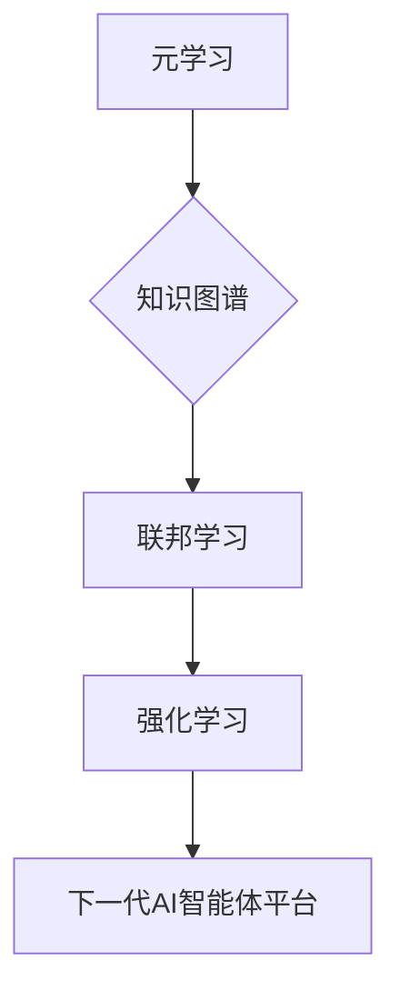

> AI智能体,下一代平台,深度学习,强化学习,神经网络,自然语言处理,计算机视觉,机器人控制

## 1. 背景介绍

人工智能（AI）技术近年来取得了飞速发展，从语音识别、图像识别到自然语言处理等领域取得了突破性进展。这些进展离不开深度学习、强化学习等算法的不断进步，以及海量数据和强大的计算能力的支持。然而，现有的AI系统仍然存在一些局限性，例如：

* **缺乏通用性:** 现有的AI系统大多是针对特定任务设计的，难以迁移到其他领域。
* **可解释性差:** AI系统的决策过程往往是黑盒，难以理解其背后的逻辑。
* **数据依赖性强:** AI系统的性能很大程度上依赖于训练数据的质量和数量。

为了克服这些局限性，构建下一代AI智能体平台成为一个重要的研究方向。下一代AI智能体平台应具备以下特点：

* **通用性:** 能够适应各种不同的任务和环境。
* **可解释性:** 能够解释其决策过程，提高用户信任度。
* **数据效率:** 能够有效利用有限的数据进行训练。
* **安全可靠:** 能够保证AI系统的安全性和可靠性。

## 2. 核心概念与联系

下一代AI智能体平台的核心概念包括：

* **元学习:**  元学习旨在学习如何学习，能够快速适应新的任务和环境。
* **知识图谱:**  知识图谱是一种结构化的知识表示形式，能够存储和推理各种知识。
* **联邦学习:**  联邦学习是一种分布式机器学习方法，能够在不共享原始数据的情况下进行模型训练。
* **强化学习:**  强化学习是一种基于奖励机制的学习方法，能够使AI智能体在复杂环境中学习最优策略。

这些核心概念相互关联，共同构成了下一代AI智能体平台的框架。



## 3. 核心算法原理 & 具体操作步骤

### 3.1  算法原理概述

元学习是一种机器学习的范式，旨在学习如何学习。它通过训练一个“学习者”模型，来学习如何从少量数据中快速适应新的任务。

元学习算法通常分为两部分：

* **内循环:** 在内循环中，学习者模型针对特定任务进行训练，并根据任务的反馈更新模型参数。
* **外循环:** 在外循环中，学习者模型针对多个任务进行训练，并根据所有任务的反馈更新模型参数。

通过这种双层训练机制，元学习算法能够学习到通用的学习策略，从而提高对新任务的适应能力。

### 3.2  算法步骤详解

以下是元学习算法的一个典型步骤：

1. **初始化:** 初始化学习者模型的参数。
2. **内循环训练:**
    * 从任务集 T 中随机选择一个任务 t。
    * 使用学习者模型在任务 t 上进行训练，并根据任务的反馈更新模型参数。
3. **外循环训练:**
    * 对所有任务 t 进行内循环训练。
    * 使用所有任务的训练结果更新学习者模型的参数。
4. **评估:** 在新的任务上评估学习者模型的性能。

### 3.3  算法优缺点

**优点:**

* **快速适应新任务:** 元学习算法能够快速适应新的任务，无需大量的数据进行训练。
* **泛化能力强:** 元学习算法能够学习到通用的学习策略，从而提高对新任务的泛化能力。

**缺点:**

* **训练复杂:** 元学习算法的训练过程比较复杂，需要更多的计算资源。
* **数据需求:** 元学习算法仍然需要一定的训练数据，虽然比传统机器学习算法少。

### 3.4  算法应用领域

元学习算法在以下领域具有广泛的应用前景：

* **机器人控制:** 元学习算法可以帮助机器人快速学习新的运动技能。
* **自然语言处理:** 元学习算法可以帮助语言模型快速适应新的语言任务。
* **药物发现:** 元学习算法可以帮助科学家快速发现新的药物候选物。

## 4. 数学模型和公式 & 详细讲解 & 举例说明

### 4.1  数学模型构建

元学习算法的数学模型通常基于优化问题。假设我们有一个学习者模型 f(θ; τ)，其中 θ 是模型参数，τ 是任务参数。我们的目标是找到一个最优的 θ，使得模型在所有任务上都能取得最好的性能。

我们可以使用以下公式来表示元学习算法的目标函数：

$$
J(\theta) = \sum_{t \in T} L_t(f(\theta; \tau_t))
$$

其中：

* J(θ) 是目标函数，表示模型在所有任务上的平均损失。
* T 是任务集。
* L_t(f(θ; τ_t)) 是任务 t 上的损失函数。

### 4.2  公式推导过程

为了找到最优的 θ，我们可以使用梯度下降算法进行优化。梯度下降算法的更新规则如下：

$$
\theta = \theta - \alpha \nabla J(\theta)
$$

其中：

* α 是学习率。
* ∇J(θ) 是目标函数 J(θ) 的梯度。

### 4.3  案例分析与讲解

假设我们有一个元学习算法用于训练一个图像分类模型。我们使用 ImageNet 数据集进行训练，并将数据集划分为多个子集作为任务。

在内循环中，模型在每个子集上进行训练，并根据子集的损失更新模型参数。在外循环中，模型使用所有子集的训练结果更新模型参数。

通过这种双层训练机制，元学习算法能够学习到通用的图像分类策略，从而提高对新图像的分类能力。

## 5. 项目实践：代码实例和详细解释说明

### 5.1  开发环境搭建

为了实现元学习算法，我们可以使用 Python 语言和 TensorFlow 或 PyTorch 等深度学习框架。

需要安装以下软件包：

* Python 3.x
* TensorFlow 或 PyTorch
* NumPy
* Matplotlib

### 5.2  源代码详细实现

以下是一个使用 TensorFlow 实现元学习算法的简单代码示例：

```python
import tensorflow as tf

# 定义学习者模型
class Learner(tf.keras.Model):
    def __init__(self):
        super(Learner, self).__init__()
        self.dense1 = tf.keras.layers.Dense(128, activation='relu')
        self.dense2 = tf.keras.layers.Dense(10)

    def call(self, inputs):
        x = self.dense1(inputs)
        return self.dense2(x)

# 初始化学习者模型
learner = Learner()

# 定义损失函数和优化器
loss_fn = tf.keras.losses.CategoricalCrossentropy()
optimizer = tf.keras.optimizers.Adam()

# 定义元学习算法
def meta_train(learner, tasks, epochs):
    for epoch in range(epochs):
        for task in tasks:
            # 内循环训练
            for step in range(10):
                # 获取任务数据
                x_train, y_train = task.get_data()
                # 计算损失
                with tf.GradientTape() as tape:
                    predictions = learner(x_train)
                    loss = loss_fn(y_train, predictions)
                # 更新模型参数
                gradients = tape.gradient(loss, learner.trainable_variables)
                optimizer.apply_gradients(zip(gradients, learner.trainable_variables))

# ...

```

### 5.3  代码解读与分析

这段代码定义了一个简单的元学习算法，用于训练一个图像分类模型。

* `Learner` 类定义了学习者模型的结构。
* `meta_train` 函数实现了元学习算法的训练过程。
* 内循环训练用于在每个任务上进行训练，并根据任务的反馈更新模型参数。
* 外循环训练用于使用所有任务的训练结果更新模型参数。

### 5.4  运行结果展示

运行这段代码后，可以观察到模型在不同任务上的性能提升。

## 6. 实际应用场景

### 6.1  机器人控制

元学习算法可以帮助机器人快速学习新的运动技能，例如抓取、行走和导航。

### 6.2  自然语言处理

元学习算法可以帮助语言模型快速适应新的语言任务，例如机器翻译、文本摘要和对话系统。

### 6.3  药物发现

元学习算法可以帮助科学家快速发现新的药物候选物，并预测药物的有效性和安全性。

### 6.4  未来应用展望

元学习算法在未来将有更广泛的应用前景，例如：

* **个性化教育:** 元学习算法可以根据学生的学习风格和进度个性化定制学习内容。
* **医疗诊断:** 元学习算法可以帮助医生更快、更准确地诊断疾病。
* **金融预测:** 元学习算法可以帮助金融机构更准确地预测市场趋势。

## 7. 工具和资源推荐

### 7.1  学习资源推荐

* **书籍:**
    * 《Deep Reinforcement Learning Hands-On》
    * 《Meta-Learning with Neural Networks》
* **在线课程:**
    * Coursera: Meta-Learning
    * Udacity: Reinforcement Learning Nanodegree

### 7.2  开发工具推荐

* **TensorFlow:** https://www.tensorflow.org/
* **PyTorch:** https://pytorch.org/

### 7.3  相关论文推荐

* **《Model-Agnostic Meta-Learning for Fast Adaptation of Deep Networks》**
* **《Prototypical Networks for Few-Shot Learning》**

## 8. 总结：未来发展趋势与挑战

### 8.1  研究成果总结

近年来，元学习算法取得了显著的进展，在许多领域展现出巨大的潜力。

### 8.2  未来发展趋势

未来，元学习算法将朝着以下方向发展：

* **更有效的算法:** 研究更有效的元学习算法，提高其学习效率和泛化能力。
* **更广泛的应用:** 将元学习算法应用到更多领域，例如个性化教育、医疗诊断和金融预测。
* **更强的可解释性:** 研究元学习算法的可解释性，提高用户对模型决策的理解。

### 8.3  面临的挑战

元学习算法仍然面临一些挑战：

* **数据需求:** 元学习算法仍然需要一定的训练数据，如何降低数据需求是一个重要的研究方向。
* **计算复杂度:** 元学习算法的训练过程比较复杂，需要更多的计算资源。
* **可解释性:** 元学习算法的决策过程往往是黑盒，难以理解其背后的逻辑。

### 8.4  研究展望

未来，元学习算法将继续是一个重要的研究方向，有望推动人工智能技术的发展。

## 9. 附录：常见问题与解答

### 9.1  什么是元学习？

元学习是一种机器学习的范式，旨在学习如何学习。它通过训练一个“学习者”模型，来学习如何从少量数据中快速适应新的任务。

### 9.2  元学习算法有哪些？

常见的元学习算法包括：

* **MAML (Model-Agnostic Meta-Learning)**
* **Prototypical Networks**
* ** Reptile**

### 9.3  元学习算法的应用场景有哪些？

元学习算法在以下领域具有广泛的应用前景：

* **机器人控制**
* **自然语言处理**
* **药物发现**
* **个性化教育**
* **医疗诊断**
* **金融预测**

作者：禅与计算机程序设计艺术 / Zen and the Art of Computer Programming


<end_of_turn>