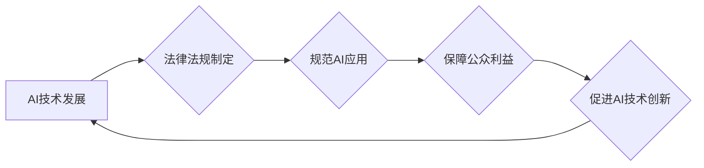

>人工智能，法律法规，伦理规范，代码实战，案例分析，法律风险，数据隐私，算法透明度，可解释性，监管政策

## 1. 背景介绍

人工智能（AI）技术近年来发展迅速，已渗透到各个领域，为社会带来了巨大变革。然而，AI技术的快速发展也引发了诸多伦理、法律和社会问题。如何规范AI技术的发展和应用，保障公众利益，成为全球范围内亟待解决的难题。

本篇文章将从AI相关法律法规的原理出发，结合实际案例，深入探讨AI技术在法律法规中的应用，并通过代码实战，展示如何将法律法规融入AI系统的设计和开发过程中。

## 2. 核心概念与联系

**2.1 AI相关法律法规**

AI相关法律法规是指针对人工智能技术及其应用而制定的法律法规，旨在规范AI技术的研发、应用和监管，保障公众利益和社会安全。

**2.2 核心概念**

* **人工智能（AI）：** 指能够模拟人类智能行为的计算机系统，例如学习、推理、决策、感知等。
* **法律法规：** 指国家或地区制定并实施的规范社会行为的规则和制度。
* **伦理规范：** 指指导人们行为的道德准则和价值观。
* **算法透明度：** 指AI算法的决策过程能够被理解和解释。
* **可解释性：** 指AI算法能够为其决策提供清晰的理由和依据。

**2.3 核心概念联系**

AI技术的发展与法律法规的制定存在着密切的联系。法律法规为AI技术的应用提供规范和保障，而AI技术的发展也推动着法律法规的更新和完善。

**Mermaid 流程图**



## 3. 核心算法原理 & 具体操作步骤

**3.1 算法原理概述**

本节将介绍一种常用的AI算法——支持向量机（SVM），并阐述其在法律法规应用中的原理。

支持向量机是一种监督学习算法，用于分类和回归问题。其核心思想是找到一个最佳的分隔超平面，将不同类别的数据点分开。

**3.2 算法步骤详解**

1. **数据预处理：** 将原始数据进行清洗、转换和特征提取，以便于算法训练。
2. **核函数选择：** 选择合适的核函数，将数据映射到高维空间，以便更好地进行分类。
3. **参数优化：** 通过优化算法参数，例如惩罚参数和核函数参数，找到最佳的分隔超平面。
4. **模型训练：** 使用训练数据训练SVM模型，学习数据之间的关系。
5. **模型预测：** 将训练好的模型应用于新的数据，进行分类或回归预测。

**3.3 算法优缺点**

* **优点：**
    * 能够处理高维数据。
    * 对非线性数据具有较好的分类能力。
    * 具有较好的泛化能力。
* **缺点：**
    * 训练时间较长。
    * 对参数选择敏感。

**3.4 算法应用领域**

SVM在法律法规领域具有广泛的应用，例如：

* **法律文本分类：** 将法律文本分类到不同的类别，例如合同、诉讼、法规等。
* **法律案例预测：** 根据案件信息预测案件的判决结果。
* **法律风险评估：** 评估法律风险，帮助企业规避法律风险。

## 4. 数学模型和公式 & 详细讲解 & 举例说明

**4.1 数学模型构建**

SVM的数学模型可以表示为：

$$
f(x) = \text{sign}(\sum_{i=1}^{n} \alpha_i y_i K(x_i, x) + b)
$$

其中：

* $x$ 是输入数据。
* $y_i$ 是第 $i$ 个训练样本的标签。
* $K(x_i, x)$ 是核函数。
* $\alpha_i$ 是拉格朗日乘子。
* $b$ 是偏置项。

**4.2 公式推导过程**

SVM的目标是找到一个最佳的分隔超平面，使得不同类别的数据点被正确分类，同时最大化分类间隔。

**4.3 案例分析与讲解**

假设我们有一个法律文本分类问题，需要将法律文本分类为合同类和诉讼类。我们可以使用SVM算法进行分类。

首先，我们需要将法律文本进行预处理，提取文本特征。然后，选择合适的核函数，例如线性核函数或高斯核函数。

接下来，我们需要训练SVM模型，并使用训练好的模型对新的法律文本进行分类。

## 5. 项目实践：代码实例和详细解释说明

**5.1 开发环境搭建**

本项目使用Python语言进行开发，需要安装以下软件包：

* scikit-learn
* pandas
* numpy

**5.2 源代码详细实现**

```python
from sklearn import svm
from sklearn.model_selection import train_test_split
from sklearn.metrics import accuracy_score

# 加载数据
data = pd.read_csv('legal_text_data.csv')

# 分割数据
X = data[['feature1', 'feature2', ...]]
y = data['label']
X_train, X_test, y_train, y_test = train_test_split(X, y, test_size=0.2)

# 创建SVM模型
model = svm.SVC(kernel='linear')

# 训练模型
model.fit(X_train, y_train)

# 预测结果
y_pred = model.predict(X_test)

# 计算准确率
accuracy = accuracy_score(y_test, y_pred)
print('准确率:', accuracy)
```

**5.3 代码解读与分析**

* 代码首先加载法律文本数据，并提取文本特征。
* 然后，将数据分割为训练集和测试集。
* 创建SVM模型，并使用训练集训练模型。
* 使用训练好的模型对测试集进行预测，并计算准确率。

**5.4 运行结果展示**

运行代码后，会输出模型的准确率。

## 6. 实际应用场景

**6.1 法律文本分类**

SVM可以用于将法律文本分类到不同的类别，例如合同、诉讼、法规等。

**6.2 法律案例预测**

SVM可以根据案件信息预测案件的判决结果。

**6.3 法律风险评估**

SVM可以评估法律风险，帮助企业规避法律风险。

**6.4 未来应用展望**

随着AI技术的不断发展，SVM在法律法规领域的应用将更加广泛。例如，可以用于自动生成法律文件、提供法律咨询服务等。

## 7. 工具和资源推荐

**7.1 学习资源推荐**

* 《机器学习》 by 周志华
* 《支持向量机》 by Christopher Bishop

**7.2 开发工具推荐**

* Python
* scikit-learn

**7.3 相关论文推荐**

* Vapnik, V. N. (1995). The nature of statistical learning theory. Springer.
* Cortes, C., & Vapnik, V. (1995). Support-vector networks. Machine learning, 20(3), 273-297.

## 8. 总结：未来发展趋势与挑战

**8.1 研究成果总结**

本篇文章介绍了AI相关法律法规的原理，并结合实际案例，探讨了SVM算法在法律法规应用中的原理和实践。

**8.2 未来发展趋势**

未来，AI技术将更加深入地融入法律法规领域，例如：

* 自动化法律服务
* 智能法律分析
* 法律风险预测

**8.3 面临的挑战**

AI技术在法律法规领域的应用也面临着一些挑战，例如：

* 数据隐私保护
* 算法透明度和可解释性
* 法律法规的更新和完善

**8.4 研究展望**

未来，需要加强AI技术与法律法规的融合研究，探索AI技术在法律法规领域的应用场景，并制定相应的法律法规和伦理规范，确保AI技术安全、可控、可持续发展。

## 9. 附录：常见问题与解答

**9.1 如何选择合适的核函数？**

核函数的选择取决于数据的特征和分类任务。常用的核函数包括线性核函数、高斯核函数、多项式核函数等。

**9.2 如何评估SVM模型的性能？**

常用的评估指标包括准确率、召回率、F1-score等。

**9.3 如何解决SVM模型过拟合问题？**

可以使用正则化技术、交叉验证等方法来解决SVM模型过拟合问题。


作者：禅与计算机程序设计艺术 / Zen and the Art of Computer Programming 
<end_of_turn>