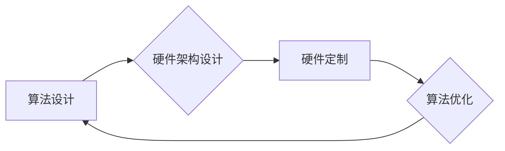

> 人工智能、算法、硬件、协同进化、深度学习、神经网络、摩尔定律、计算资源、效率优化

## 1. 背景介绍

人工智能（AI）正以惊人的速度发展，其核心在于算法和硬件的协同进化。从早期规则型AI到如今的深度学习，算法的不断进步推动了硬件的创新，而硬件的性能提升又反过来加速了算法的发展。这种相互促进的关系构成了AI发展的强大驱动力。

然而，随着AI模型规模的不断扩大，算法和硬件之间的协同进化面临着新的挑战。传统硬件架构难以满足大规模模型的训练和推理需求，而算法的复杂性也使得硬件设计更加困难。因此，探索新的算法和硬件协同进化模式，以实现更高效、更智能的AI系统，成为当前研究的热点。

## 2. 核心概念与联系

**2.1 算法与硬件的相互作用**

AI算法和硬件之间存在着密切的相互作用关系。

* **算法驱动硬件创新:** 复杂的AI算法，例如深度学习，对计算资源和内存带宽提出了更高的要求。为了满足这些需求，硬件工程师不断开发新的处理器架构、内存技术和加速器，例如GPU、TPU和FPGA。

* **硬件促进算法发展:** 硬件的性能提升为算法的复杂度和规模提供了支持。例如，GPU的并行计算能力加速了深度学习模型的训练速度，而TPU的专门设计则提高了模型的推理效率。

**2.2 协同进化模式**

AI算法和硬件的协同进化可以理解为一种相互促进、共同进步的过程。

* **算法优化:** 针对特定硬件架构，算法可以进行优化，以提高其在该硬件上的运行效率。例如，针对GPU的并行计算能力，可以设计并行化的深度学习算法。
* **硬件定制:** 针对特定的算法需求，硬件可以进行定制化设计，以提高算法的性能。例如，针对深度学习模型的特征提取需求，可以设计专门的硬件加速器。

**2.3 Mermaid 流程图**



## 3. 核心算法原理 & 具体操作步骤

**3.1 算法原理概述**

深度学习算法是目前AI领域最成功的算法之一，其核心是多层神经网络。神经网络模仿了人脑的神经元结构，通过连接多个神经元层，学习数据中的复杂模式。

**3.2 算法步骤详解**

1. **数据预处理:** 将原始数据转换为模型可以理解的格式，例如归一化、编码等。
2. **网络结构设计:** 根据任务需求设计神经网络的层数、节点数和激活函数等参数。
3. **参数初始化:** 为神经网络中的权重和偏置赋予初始值。
4. **前向传播:** 将输入数据通过神经网络层层传递，最终得到输出结果。
5. **损失函数计算:** 计算模型输出与真实值的差异，即损失值。
6. **反向传播:** 根据损失值，反向计算各层神经元的梯度。
7. **参数更新:** 使用梯度下降算法更新神经网络的参数，以减小损失值。
8. **迭代训练:** 重复步骤4-7，直到模型达到预设的性能指标。

**3.3 算法优缺点**

* **优点:** 能够学习复杂数据模式，具有强大的泛化能力。
* **缺点:** 需要大量的训练数据和计算资源，训练过程耗时较长，容易陷入局部最优解。

**3.4 算法应用领域**

* **图像识别:** 人脸识别、物体检测、图像分类等。
* **自然语言处理:** 机器翻译、文本摘要、情感分析等。
* **语音识别:** 语音转文本、语音助手等。
* **推荐系统:** 商品推荐、内容推荐等。

## 4. 数学模型和公式 & 详细讲解 & 举例说明

**4.1 数学模型构建**

深度学习模型可以看作是一个复杂的函数映射，其输入是数据样本，输出是预测结果。

* **激活函数:** 用于引入非线性，使模型能够学习复杂的数据模式。常见的激活函数包括ReLU、Sigmoid和Tanh等。
* **损失函数:** 用于衡量模型预测结果与真实值的差异。常见的损失函数包括均方误差、交叉熵等。
* **优化算法:** 用于更新模型参数，以减小损失值。常见的优化算法包括梯度下降、Adam等。

**4.2 公式推导过程**

* **前向传播:**

$$
y = f(W^L x^L + b^L)
$$

其中，$y$ 是输出结果，$f$ 是激活函数，$W^L$ 是第L层的权重矩阵，$x^L$ 是第L层的输入，$b^L$ 是第L层的偏置向量。

* **损失函数:**

$$
L = \frac{1}{N} \sum_{i=1}^{N} loss(y_i, \hat{y}_i)
$$

其中，$L$ 是损失值，$N$ 是样本数量，$loss$ 是单个样本的损失函数，$y_i$ 是真实值，$\hat{y}_i$ 是预测值。

* **梯度下降:**

$$
\theta = \theta - \alpha \nabla L(\theta)
$$

其中，$\theta$ 是模型参数，$\alpha$ 是学习率，$\nabla L(\theta)$ 是损失函数对参数的梯度。

**4.3 案例分析与讲解**

以图像分类为例，假设我们使用一个包含多个卷积层和全连接层的深度学习模型进行训练。

* **卷积层:** 用于提取图像特征，例如边缘、纹理等。
* **全连接层:** 用于将提取的特征进行分类。

训练过程中，模型会不断调整权重和偏置，以最小化损失值。最终，模型能够将输入图像分类到不同的类别。

## 5. 项目实践：代码实例和详细解释说明

**5.1 开发环境搭建**

* **操作系统:** Ubuntu 20.04
* **编程语言:** Python 3.8
* **深度学习框架:** TensorFlow 2.0
* **硬件:** NVIDIA GeForce RTX 3080 GPU

**5.2 源代码详细实现**

```python
import tensorflow as tf

# 定义模型结构
model = tf.keras.models.Sequential([
    tf.keras.layers.Conv2D(32, (3, 3), activation='relu', input_shape=(28, 28, 1)),
    tf.keras.layers.MaxPooling2D((2, 2)),
    tf.keras.layers.Conv2D(64, (3, 3), activation='relu'),
    tf.keras.layers.MaxPooling2D((2, 2)),
    tf.keras.layers.Flatten(),
    tf.keras.layers.Dense(10, activation='softmax')
])

# 编译模型
model.compile(optimizer='adam',
              loss='sparse_categorical_crossentropy',
              metrics=['accuracy'])

# 加载数据集
(x_train, y_train), (x_test, y_test) = tf.keras.datasets.mnist.load_data()

# 数据预处理
x_train = x_train.astype('float32') / 255.0
x_test = x_test.astype('float32') / 255.0
x_train = x_train.reshape((x_train.shape[0], 28, 28, 1))
x_test = x_test.reshape((x_test.shape[0], 28, 28, 1))

# 训练模型
model.fit(x_train, y_train, epochs=5)

# 评估模型
loss, accuracy = model.evaluate(x_test, y_test)
print('Test loss:', loss)
print('Test accuracy:', accuracy)
```

**5.3 代码解读与分析**

* **模型结构:** 代码定义了一个包含卷积层和全连接层的深度学习模型。卷积层用于提取图像特征，全连接层用于分类。
* **模型编译:** 使用Adam优化器、交叉熵损失函数和准确率指标编译模型。
* **数据加载和预处理:** 加载MNIST数据集，并对数据进行归一化和形状转换。
* **模型训练:** 使用训练数据训练模型，设置训练轮数为5。
* **模型评估:** 使用测试数据评估模型的性能，输出测试损失和准确率。

**5.4 运行结果展示**

训练完成后，模型能够达到较高的准确率，例如在MNIST数据集上，准确率可以达到98%以上。

## 6. 实际应用场景

**6.1 图像识别**

* **人脸识别:** 用于解锁手机、验证身份等。
* **物体检测:** 用于自动驾驶、安防监控等。
* **图像分类:** 用于医学影像诊断、产品识别等。

**6.2 自然语言处理**

* **机器翻译:** 将文本从一种语言翻译成另一种语言。
* **文本摘要:** 自动生成文本的简短摘要。
* **情感分析:** 分析文本中的情感倾向，例如正面、负面或中性。

**6.3 语音识别**

* **语音转文本:** 将语音转换为文本，用于语音助手、听写软件等。
* **语音识别:** 用于识别语音指令，例如智能家居控制、语音搜索等。

**6.4 其他应用场景**

* **推荐系统:** 根据用户的历史行为推荐商品、内容等。
* **金融风险控制:** 用于识别欺诈交易、评估信用风险等。
* **医疗诊断辅助:** 用于辅助医生诊断疾病、预测患者病情等。

**6.5 未来应用展望**

随着AI技术的不断发展，其应用场景将更加广泛，例如：

* **个性化教育:** 根据学生的学习情况提供个性化的学习方案。
* **智能医疗:** 提供更精准的医疗诊断和治疗方案。
* **自动驾驶:** 实现真正意义上的自动驾驶汽车。

## 7. 工具和资源推荐

**7.1 学习资源推荐**

* **书籍:**
    * 深度学习 (Deep Learning) - Ian Goodfellow, Yoshua Bengio, Aaron Courville
    * 人工智能：一种现代方法 (Artificial Intelligence: A Modern Approach) - Stuart Russell, Peter Norvig
* **在线课程:**
    * Coursera: 深度学习 Specialization
    * Udacity: 
    * fast.ai: Practical Deep Learning for Coders

**7.2 开发工具推荐**

* **深度学习框架:** TensorFlow, PyTorch, Keras
* **编程语言:** Python
* **云计算平台:** Google Cloud Platform, Amazon Web Services, Microsoft Azure

**7.3 相关论文推荐**

* **ImageNet Classification with Deep Convolutional Neural Networks** - Alex Krizhevsky, Ilya Sutskever, Geoffrey E. Hinton
* **Attention Is All You Need** - Ashish Vaswani, Noam Shazeer, Niki Parmar, Jakob Uszkoreit, Llion Jones, Aidan N. Gomez, Łukasz Kaiser, Illia Polosukhin
* **BERT: Pre-training of Deep Bidirectional Transformers for Language Understanding** - Jacob Devlin, Ming-Wei Chang, Kenton Lee, Kristina Toutanova

## 8. 总结：未来发展趋势与挑战

**8.1 研究成果总结**

近年来，AI算法和硬件的协同进化取得了显著成果，推动了AI技术的快速发展。深度学习算法在图像识别、自然语言处理等领域取得了突破性进展，而硬件的性能提升为算法的复杂度和规模提供了支持。

**8.2 未来发展趋势**

* **模型规模和复杂度提升:** 未来，AI模型的规模和复杂度将继续提升，例如Transformer模型的规模不断扩大。
* **硬件架构创新:** 为了满足大规模模型的训练和推理需求，硬件架构将继续创新，例如异构计算、神经形态计算等。
* **算法效率优化:** 研究人员将继续探索更有效的算法，以降低模型训练和推理的成本。