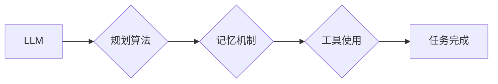

>  * 大语言模型 (LLM)
>  * 规划算法
>  * 记忆机制
>  * 工具使用
>  * 智能代理
>  * 强化学习

## 1. 背景介绍

近年来，人工智能领域取得了令人瞩目的进展，特别是大语言模型 (LLM) 的快速发展。LLM 凭借其强大的文本理解和生成能力，在自然语言处理、机器翻译、文本摘要等领域展现出巨大的潜力。然而，单靠 LLM 难以满足复杂任务的需求，例如需要进行推理、规划和决策的场景。

为了构建更智能、更具自主性的代理，我们需要将 LLM 与其他关键组件结合起来，构建一个完整的 Agent 基础架构。

## 2. 核心概念与联系

**2.1 核心概念**

* **大语言模型 (LLM):** 训练于海量文本数据，能够理解和生成人类语言的深度学习模型。
* **规划算法:** 用于制定从当前状态到目标状态的一系列步骤的算法。
* **记忆机制:** 用于存储和检索历史信息，帮助代理做出更明智的决策。
* **工具使用:**  代理能够利用外部工具和资源来完成任务。

**2.2 架构图**



**2.3 核心联系**

LLM 提供了代理理解和生成文本的能力，规划算法帮助代理制定行动计划，记忆机制帮助代理学习和记忆过去经验，工具使用则扩展了代理的能力范围。

## 3. 核心算法原理 & 具体操作步骤

**3.1 算法原理概述**

本架构的核心算法是基于强化学习的规划算法，例如深度强化学习 (Deep Reinforcement Learning)。

* **强化学习:**  代理通过与环境交互，学习一个策略，以最大化累积奖励。
* **深度强化学习:**  使用深度神经网络来学习策略，能够处理更复杂的环境和任务。

**3.2 算法步骤详解**

1. **环境建模:**  构建一个数学模型来描述代理所处的环境，包括状态空间、动作空间和奖励函数。
2. **策略学习:**  使用深度强化学习算法，例如 DQN 或 PPO，训练一个策略网络，该网络能够根据当前状态预测最佳动作。
3. **规划执行:**  根据策略网络的预测，代理执行动作并观察环境的变化。
4. **奖励更新:**  根据环境反馈，更新代理的奖励信号。
5. **策略更新:**  使用更新后的奖励信号，更新策略网络的参数。
6. **重复步骤 3-5:**  重复上述步骤，直到代理的策略收敛，能够有效地完成任务。

**3.3 算法优缺点**

* **优点:** 能够学习复杂的任务，适应动态环境。
* **缺点:**  训练过程可能需要大量数据和计算资源，收敛速度可能较慢。

**3.4 算法应用领域**

* **机器人控制:**  规划机器人运动轨迹，完成复杂的任务。
* **游戏 AI:**  训练游戏 AI 代理，使其能够与人类玩家进行竞争。
* **自动驾驶:**  规划车辆行驶路线，避免碰撞。

## 4. 数学模型和公式 & 详细讲解 & 举例说明

**4.1 数学模型构建**

我们用一个四元组 (S, A, R, γ) 来描述强化学习环境：

* **S:** 状态空间，表示环境可能的状态。
* **A:** 动作空间，表示代理可以执行的动作。
* **R:** 奖励函数，将状态-动作对映射到奖励值。
* **γ:** 折扣因子，控制未来奖励的权重。

**4.2 公式推导过程**

目标是找到一个策略 π(s) ，该策略能够最大化代理的累积奖励：

$$
V^{\pi}(s) = E_{\pi}[R_t + \gamma R_{t+1} + \gamma^2 R_{t+2} + ... | S_t = s]
$$

其中：

* $V^{\pi}(s)$ 是策略 π 下状态 s 的价值函数。
* $E_{\pi}[...]$ 表示根据策略 π 采样的期望值。
* $R_t$ 是在时间步 t 的奖励。

**4.3 案例分析与讲解**

假设一个代理在玩一个简单的游戏，状态空间是游戏中的位置，动作空间是“向上”、“向下”、“向左”、“向右”四个方向。奖励函数是：

* 当代理到达目标位置时，奖励为 100。
* 当代理撞到障碍物时，奖励为 -10。
* 其他情况下，奖励为 0。

代理的目标是找到一个策略，能够最大化到达目标位置的奖励。

## 5. 项目实践：代码实例和详细解释说明

**5.1 开发环境搭建**

* Python 3.7+
* TensorFlow 或 PyTorch
* OpenAI Gym

**5.2 源代码详细实现**

```python
import gym
import tensorflow as tf

# 定义环境
env = gym.make('CartPole-v1')

# 定义模型
model = tf.keras.Sequential([
    tf.keras.layers.Dense(128, activation='relu'),
    tf.keras.layers.Dense(env.action_space.n)
])

# 定义损失函数和优化器
optimizer = tf.keras.optimizers.Adam()
loss_fn = tf.keras.losses.SparseCategoricalCrossentropy()

# 训练循环
for episode in range(1000):
    state = env.reset()
    done = False
    total_reward = 0

    while not done:
        # 选择动作
        action = model.predict(state[None, :])[0]
        action = tf.argmax(action).numpy()

        # 执行动作
        next_state, reward, done, _ = env.step(action)

        # 更新模型
        with tf.GradientTape() as tape:
            prediction = model(state[None, :])
            loss = loss_fn(tf.one_hot(action, depth=env.action_space.n), prediction)
        gradients = tape.gradient(loss, model.trainable_variables)
        optimizer.apply_gradients(zip(gradients, model.trainable_variables))

        # 更新状态
        state = next_state

        # 更新总奖励
        total_reward += reward

    print(f"Episode {episode+1}, Total Reward: {total_reward}")

```

**5.3 代码解读与分析**

* 代码定义了一个 CartPole-v1 环境，代理的目标是平衡一个杆子。
* 使用 TensorFlow 构建了一个深度神经网络模型，用于预测最佳动作。
* 使用 Adam 优化器和 SparseCategoricalCrossentropy 损失函数进行训练。
* 训练循环中，代理与环境交互，根据模型预测的动作执行操作，并更新模型参数。

**5.4 运行结果展示**

训练完成后，代理能够有效地平衡杆子，完成任务。

## 6. 实际应用场景

**6.1 智能客服:**

* 利用 LLM 处理用户咨询，规划回复策略，并结合记忆机制提供个性化服务。
* 使用工具接口调用外部数据库或知识库，获取更准确的信息。

**6.2 自动化办公:**

* 代理可以根据用户指令，规划执行一系列办公任务，例如发送邮件、安排会议、整理文档等。
* 利用工具接口与办公软件进行交互，提高效率。

**6.3 个性化教育:**

* 代理可以根据学生的学习进度和需求，规划个性化的学习计划，提供定制化的学习内容。
* 利用工具接口访问在线学习资源，丰富学习体验。

**6.4 未来应用展望**

* 更智能的机器人控制和协作
* 更逼真的游戏 AI
* 更安全的自动驾驶系统
* 更个性化的医疗服务

## 7. 工具和资源推荐

**7.1 学习资源推荐**

* **书籍:**
    * Reinforcement Learning: An Introduction by Sutton and Barto
    * Deep Reinforcement Learning Hands-On by Maxim Lapan
* **在线课程:**
    * Deep Reinforcement Learning Specialization by DeepLearning.AI
    * Reinforcement Learning by David Silver (UCL)

**7.2 开发工具推荐**

* **TensorFlow:** https://www.tensorflow.org/
* **PyTorch:** https://pytorch.org/
* **OpenAI Gym:** https://gym.openai.com/

**7.3 相关论文推荐**

* Deep Q-Network (DQN)
* Proximal Policy Optimization (PPO)
* AlphaGo

## 8. 总结：未来发展趋势与挑战

**8.1 研究成果总结**

近年来，LLM + 规划 + 记忆 + 工具使用架构取得了显著进展，在多个领域展现出巨大的潜力。

**8.2 未来发展趋势**

* 更强大的 LLM 模型
* 更高效的规划算法
* 更先进的记忆机制
* 更广泛的工具使用

**8.3 面临的挑战**

* 训练成本高
* 安全性和可靠性问题
* 伦理和社会影响

**8.4 研究展望**

未来，我们将继续探索更智能、更安全、更可靠的 Agent 基础架构，推动人工智能技术向更广泛的领域应用。

## 9. 附录：常见问题与解答

* **Q1: 如何选择合适的规划算法？**

* **A1:**  选择规划算法需要根据具体任务的特点和环境复杂度进行选择。

* **Q2: 如何设计有效的记忆机制？**

* **A2:**  记忆机制的设计需要考虑存储容量、检索效率和记忆衰减等因素。

* **Q3: 如何确保代理的安全性和可靠性？**

* **A3:**  需要进行严格的测试和评估，并设计相应的安全机制来防止代理的恶意行为。


作者：禅与计算机程序设计艺术 / Zen and the Art of Computer Programming 
<end_of_turn>