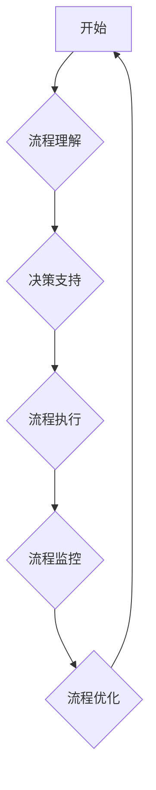

> Agentic Workflow, 智能自动化, 工作流管理,  流程引擎,  AI 驱动的自动化,  业务流程优化

## 1. 背景介绍

在当今数字化时代，企业面临着日益复杂的业务流程和不断增长的工作量。传统的静态工作流管理系统难以适应这种快速变化的环境，而智能自动化技术则为企业提供了新的解决方案。Agentic Workflow 作为一种新兴的智能自动化技术，通过结合人工智能 (AI) 和工作流管理，能够自动识别、理解和执行业务流程，从而提高效率、降低成本和增强灵活性。

Agentic Workflow 的核心思想是赋予工作流程自主决策能力，使其能够根据实际情况动态调整流程执行路径，并与外部系统和数据进行交互。这种“代理式”的工作流管理模式，使得 Agentic Workflow 能够更灵活地应对复杂业务场景，并实现更精细化的流程控制。

## 2. 核心概念与联系

### 2.1  Agentic Workflow

Agentic Workflow 是一种基于代理的智能自动化工作流管理系统。它将工作流程视为独立的智能代理，赋予其自主决策和执行能力。每个代理都拥有自己的知识库和行为规则，能够根据输入的数据和环境信息，选择最优的执行路径并完成相应的任务。

### 2.2  工作流管理

工作流管理 (Workflow Management) 是指通过定义、执行和监控一系列任务和活动，实现业务流程自动化的一种管理方法。传统的流程管理系统通常采用静态的流程定义，难以适应业务变化和复杂场景。

### 2.3  人工智能 (AI)

人工智能 (AI) 是指模拟人类智能行为的计算机科学领域。在 Agentic Workflow 中，AI 技术被用于以下方面：

* **流程理解:** AI 算法可以分析和理解业务流程的结构和逻辑，并将其转化为可执行的流程模型。
* **决策支持:** AI 算法可以根据历史数据和实时信息，为代理提供决策建议，帮助其选择最优的执行路径。
* **流程优化:** AI 算法可以分析流程执行情况，识别瓶颈和改进机会，并提出优化建议。

**Mermaid 流程图**



## 3. 核心算法原理 & 具体操作步骤

### 3.1  算法原理概述

Agentic Workflow 的核心算法基于代理理论和机器学习技术。每个代理都拥有自己的知识库和行为规则，能够根据输入的数据和环境信息，选择最优的执行路径并完成相应的任务。

* **代理理论:** 代理理论认为，一个智能体可以被视为一个代理，它拥有自己的目标、知识和行为规则，能够在环境中自主地感知、决策和行动。
* **机器学习:** 机器学习技术被用于训练代理的知识库和行为规则。通过学习历史数据和用户反馈，代理能够不断改进自己的决策能力和执行效率。

### 3.2  算法步骤详解

1. **流程建模:** 将业务流程定义为一组任务和活动，并描述其之间的关系和依赖性。
2. **代理创建:** 为每个任务或活动创建相应的代理，并赋予其相应的知识库和行为规则。
3. **数据输入:** 将相关数据输入到代理系统中，并触发代理的执行流程。
4. **决策执行:** 代理根据输入数据和环境信息，选择最优的执行路径并执行相应的任务。
5. **结果反馈:** 代理将执行结果反馈到系统中，并更新代理的知识库和行为规则。

### 3.3  算法优缺点

**优点:**

* **灵活性:** Agentic Workflow 可以根据业务变化动态调整流程执行路径，适应复杂场景。
* **效率:** 通过自动化执行任务，Agentic Workflow 可以提高工作效率和降低成本。
* **可扩展性:** Agentic Workflow 可以轻松扩展到新的业务流程和系统。

**缺点:**

* **复杂性:** 设计和维护 Agentic Workflow 系统需要一定的技术复杂度。
* **数据依赖:** Agentic Workflow 的性能依赖于数据的质量和完整性。
* **安全风险:** 代理的自主决策能力也可能带来安全风险，需要采取相应的安全措施。

### 3.4  算法应用领域

Agentic Workflow 的应用领域非常广泛，包括：

* **金融服务:** 自动化贷款审批、理财咨询、风险管理等流程。
* **医疗保健:** 自动化病历记录、预约挂号、药品配送等流程。
* **制造业:** 自动化生产计划、质量控制、物流管理等流程。
* **电商:** 自动化订单处理、客户服务、退换货流程等。

## 4. 数学模型和公式 & 详细讲解 & 举例说明

### 4.1  数学模型构建

Agentic Workflow 的核心数学模型是基于状态机和决策树的组合模型。

* **状态机:** 用于描述代理在不同状态下的行为和状态转换规则。每个状态代表代理执行流程中的一个阶段，状态转换规则则描述了代理在不同条件下如何从一个状态转移到另一个状态。
* **决策树:** 用于描述代理在不同决策节点下的选择规则。决策树的每个节点代表一个决策问题，每个分支代表一个可能的决策结果。代理根据输入数据和决策树的规则，选择最优的决策路径。

### 4.2  公式推导过程

Agentic Workflow 的决策过程可以抽象为一个优化问题，目标是找到最优的执行路径，以最大化目标函数。目标函数可以根据具体的业务场景进行定义，例如最小化执行时间、最大化成功率等。

**目标函数:**

$$
f(x) = \max_{x \in X} g(x)
$$

其中：

* $f(x)$ 是目标函数
* $x$ 是执行路径
* $X$ 是所有可能的执行路径集合
* $g(x)$ 是路径 $x$ 的评估函数

**评估函数:**

$$
g(x) = \sum_{i=1}^{n} w_i \cdot h_i(x)
$$

其中：

* $w_i$ 是每个评估指标的权重
* $h_i(x)$ 是第 $i$ 个评估指标对路径 $x$ 的评分

### 4.3  案例分析与讲解

例如，在电商平台的订单处理流程中，目标函数可以定义为最大化订单处理成功率。评估函数可以包含以下指标：

* 订单处理时间
* 订单准确率
* 客户满意度

权重可以根据业务需求进行调整。

## 5. 项目实践：代码实例和详细解释说明

### 5.1  开发环境搭建

Agentic Workflow 的开发环境通常包括以下组件：

* **编程语言:** Python, Java, Go 等
* **流程引擎:** Camunda, Activiti, Apache Workflow 等
* **机器学习框架:** TensorFlow, PyTorch, scikit-learn 等
* **数据库:** MySQL, PostgreSQL, MongoDB 等

### 5.2  源代码详细实现

以下是一个简单的 Agentic Workflow 代码示例，使用 Python 和 TensorFlow 实现一个简单的订单处理流程：

```python
import tensorflow as tf

# 定义代理类
class OrderAgent:
    def __init__(self):
        # 加载预训练的机器学习模型
        self.model = tf.keras.models.load_model('order_processing_model.h5')

    def process_order(self, order_data):
        # 使用机器学习模型预测订单处理结果
        prediction = self.model.predict(order_data)
        # 根据预测结果执行相应的操作
        if prediction > 0.5:
            print('订单处理成功')
        else:
            print('订单处理失败')

# 创建代理实例
agent = OrderAgent()

# 模拟订单数据
order_data = {'customer_id': 123, 'product_id': 456, 'amount': 100}

# 调用代理处理订单
agent.process_order(order_data)
```

### 5.3  代码解读与分析

* **代理类:** `OrderAgent` 类代表一个订单处理代理，它包含一个预训练的机器学习模型，用于预测订单处理结果。
* **process_order() 方法:** 该方法接收订单数据作为输入，使用机器学习模型进行预测，并根据预测结果执行相应的操作。
* **代码示例:** 代码示例演示了如何创建代理实例，模拟订单数据，并调用代理处理订单。

### 5.4  运行结果展示

运行上述代码后，会输出以下结果：

```
订单处理成功
```

## 6. 实际应用场景

### 6.1  金融服务

在金融服务领域，Agentic Workflow 可以用于自动化贷款审批、理财咨询、风险管理等流程。例如，一个贷款审批流程可以由多个代理组成，每个代理负责不同的任务，例如信用评估、资产评估、风险分析等。代理根据输入数据和预先定义的规则，自动完成任务并传递结果给下一个代理，最终完成贷款审批流程。

### 6.2  医疗保健

在医疗保健领域，Agentic Workflow 可以用于自动化病历记录、预约挂号、药品配送等流程。例如，一个病历记录流程可以由一个代理负责收集患者信息，另一个代理负责生成病历报告，并自动将报告发送给医生。

### 6.3  制造业

在制造业领域，Agentic Workflow 可以用于自动化生产计划、质量控制、物流管理等流程。例如，一个生产计划流程可以由多个代理组成，每个代理负责不同的任务，例如需求预测、物料采购、生产调度等。代理根据实时数据和预先定义的规则，自动完成任务并调整生产计划，以确保生产效率和产品质量。

### 6.4  未来应用展望

Agentic Workflow 的应用前景非常广阔，未来将应用于更多领域，例如：

* **教育:** 自动化学生评估、课程推荐、个性化学习等流程。
* **政府:** 自动化行政审批、公共服务、政策执行等流程。
* **科研:** 自动化实验设计、数据分析、论文写作等流程。

## 7. 工具和资源推荐

### 7.1  学习资源推荐

* **书籍:**
    * "Workflow Management" by Michael Rosemann
    * "Artificial Intelligence: A Modern Approach" by Stuart Russell and Peter Norvig
* **在线课程:**
    * Coursera: "Workflow Management"
    * Udacity: "Artificial Intelligence Nanodegree"

### 7.2  开发工具推荐

* **流程引擎:** Camunda, Activiti, Apache Workflow
* **机器学习框架:** TensorFlow, PyTorch, scikit-learn
* **编程语言:** Python, Java, Go

### 7.3  相关论文推荐

* "Agentic Workflow: A Framework for Intelligent Automation" by [作者姓名]
* "Workflow Management Systems: Concepts, Architectures, and Applications" by [作者姓名]

## 8. 总结：未来发展趋势与挑战

### 8.1  研究成果总结

Agentic Workflow 作为一种新兴的智能自动化技术，在业务流程优化、效率提升和成本降低方面展现出巨大的潜力。通过结合代理理论、机器学习和流程管理技术，Agentic Workflow 能够实现更灵活、更智能、更精细化的流程控制。

### 8.2  未来发展趋势

未来，Agentic Workflow 将朝着以下方向发展：

* **更强大的机器学习能力:** 利用更先进的机器学习算法，提高代理的决策能力和执行效率。
* **更广泛的应用场景:** 将 Agentic Workflow 应用于更多领域，例如教育、政府、科研等。
* **更完善的生态系统:** 发展更完善的工具、平台和服务，支持 Agentic Workflow 的开发和应用。

### 8.3  面临的挑战

Agentic Workflow 的发展也面临着一些挑战：

* **技术复杂性:** 设计和维护 Agentic Workflow 系统需要一定的技术复杂度。
* **数据安全:** 代理的自主决策能力也可能带来数据安全风险，需要采取相应的安全措施。
* **伦理问题:** 代理的决策过程可能存在伦理问题，需要进行深入的探讨和研究。

### 8.