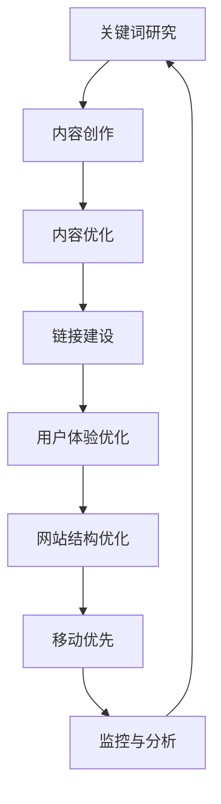

                 

**关键词：**内容SEO、知识付费、创业、关键词研究、内容优化、链接建设、用户体验、网站结构、移动优先

## 1. 背景介绍

随着互联网的发展，知识付费行业迅速崛起，成为创业者关注的热点。然而，如何在海量信息中脱颖而出，吸引用户，是所有创业者面临的共同挑战。内容SEO（Search Engine Optimization，搜索引擎优化）是一种有效的策略，帮助知识付费平台提高网站在搜索引擎中的排名，从而获取更多流量和用户。

## 2. 核心概念与联系

内容SEO的核心是提高网站内容的质量和相关性，以满足用户需求，并提高搜索引擎的评价。以下是内容SEO的核心概念及其联系的Mermaid流程图：



## 3. 核心算法原理 & 具体操作步骤

### 3.1 算法原理概述

搜索引擎使用复杂的算法评估网站内容的质量和相关性。这些算法考虑各种因素，包括关键词密度、内容质量、链接数量和质量、用户体验等。内容SEO的目标是优化这些因素，以提高网站在搜索结果中的排名。

### 3.2 算法步骤详解

1. **关键词研究：**使用关键词工具（如Google Keyword Planner、SEMrush、Ahrefs）找到与您的内容相关的高搜索量、低竞争力的关键词。
2. **内容创作：**创作高质量、相关性强的内容，并自然地包含关键词。
3. **内容优化：**优化页面标题（title）、描述（meta description）、URL、图片alt标签等，确保包含关键词。
4. **链接建设：**获取高质量的外部链接（backlinks），并内部链接（internal links）到相关内容。
5. **用户体验优化：**确保网站快速加载，易于导航，并提供良好的移动体验。
6. **网站结构优化：**使用清晰的目录结构，并确保重要内容易于搜索引擎抓取。
7. **移动优先：**由于移动搜索量远大于桌面搜索，优化移动体验至关重要。
8. **监控与分析：**使用分析工具（如Google Analytics）监控网站流量和用户行为，并根据需要调整策略。

### 3.3 算法优缺点

**优点：**内容SEO有助于提高网站流量，改善用户体验，并最终提高转化率。

**缺点：**内容SEO是一个持续的过程，需要大量时间和资源。搜索引擎算法不断变化，要求创业者不断适应和调整策略。

### 3.4 算法应用领域

内容SEO适用于所有类型的网站，包括知识付费平台。它有助于提高网站在搜索结果中的排名，从而获取更多流量和用户。

## 4. 数学模型和公式 & 详细讲解 & 举例说明

### 4.1 数学模型构建

内容SEO的数学模型可以表示为：

$$Rank = f(Content, Links, UX, Structure, Mobile)$$

其中，$Rank$表示网站在搜索结果中的排名，$Content$表示网站内容的质量和相关性，$Links$表示网站的链接数量和质量，$UX$表示用户体验，$Structure$表示网站结构，$Mobile$表示移动优化。

### 4.2 公式推导过程

搜索引擎算法的具体细节是保密的，但可以推导出上述模型。搜索引擎评估网站内容的质量和相关性，链接数量和质量，用户体验，网站结构，移动优化等因素，并根据这些因素排名网站。

### 4.3 案例分析与讲解

假设有两个知识付费平台，$A$和$B$，提供相同的内容。平台$A$优化了内容、链接、用户体验、网站结构和移动优化，而平台$B$没有。根据模型，平台$A$的排名将高于平台$B$：

$$Rank_A > Rank_B = f(Content_A, Links_A, UX_A, Structure_A, Mobile_A) > f(Content_B, Links_B, UX_B, Structure_B, Mobile_B)$$

## 5. 项目实践：代码实例和详细解释说明

### 5.1 开发环境搭建

在开始内容SEO优化之前，您需要一个网站。您可以使用WordPress等内容管理系统（CMS）快速搭建网站。确保您的主机支持PHP和MySQL。

### 5.2 源代码详细实现

以下是优化知识付费平台的示例代码片段：

**优化页面标题（title）：**

```php
<title>高质量知识付费内容 - 关键词研究</title>
```

**优化描述（meta description）：**

```php
<meta name="description" content="提供高质量知识付费内容，关键词研究，内容优化，链接建设，用户体验优化，网站结构优化，移动优先。">
```

**优化图片alt标签：**

```php

```

**内部链接：**

```php
<a href="https://example.com/内容优化">内容优化</a>
```

### 5.3 代码解读与分析

上述代码片段展示了如何优化页面标题、描述、图片alt标签和内部链接。这些都是内容SEO的关键部分。

### 5.4 运行结果展示

通过优化这些因素，您的网站在搜索结果中的排名将提高，从而获取更多流量和用户。

## 6. 实际应用场景

### 6.1 当前应用

内容SEO在所有类型的网站，包括知识付费平台，都有广泛应用。它帮助创业者提高网站流量，改善用户体验，并最终提高转化率。

### 6.2 未来应用展望

随着搜索引擎算法的不断变化，内容SEO将继续发展。未来，内容SEO将更加注重用户体验，内容质量和相关性，以及移动优化。

## 7. 工具和资源推荐

### 7.1 学习资源推荐

- Moz的开始指南：<https://moz.com/beginners-guide-to-seo>
- Search Engine Land的SEO指南：<https://searchengineland.com/guide/what-is-seo>
- Google的搜索指南：<https://support.google.com/webmasters/answer/7451184>

### 7.2 开发工具推荐

- Google Search Console：<https://search.google.com/search-console>
- Google Analytics：<https://analytics.google.com/>
- SEMrush：<https://www.semrush.com/>
- Ahrefs：<https://ahrefs.com/>

### 7.3 相关论文推荐

- Cutts, M. Z. (2006). [The Anatomy of a Large-Scale Hypertextual Web Search Engine](https://research.google/pubs/pub32215/). Computer Networks, 50(11), 1651-1662.
- Brin, S., & Page, L. (1998). [The Anatomy of a Large-Scale Hypertextual Web Search Engine](https://www.cs.cmu.edu/afs/cs/project/www/publications/papers/www/1998/www98-brin.pdf). Computer Networks and ISDN Systems, 30(1-7), 107-117.

## 8. 总结：未来发展趋势与挑战

### 8.1 研究成果总结

内容SEO是一种有效的策略，帮助知识付费平台提高网站在搜索引擎中的排名，从而获取更多流量和用户。它涉及关键词研究，内容创作和优化，链接建设，用户体验优化，网站结构优化，移动优先等。

### 8.2 未来发展趋势

未来，内容SEO将更加注重用户体验，内容质量和相关性，以及移动优化。搜索引擎将继续发展，要求创业者不断适应和调整策略。

### 8.3 面临的挑战

内容SEO是一个持续的过程，需要大量时间和资源。搜索引擎算法不断变化，要求创业者不断适应和调整策略。此外，竞争激烈，创业者需要不断创新以保持领先地位。

### 8.4 研究展望

未来的研究将关注搜索引擎算法的发展，用户体验的改善，内容质量和相关性的提高，以及移动优化的重要性。

## 9. 附录：常见问题与解答

**Q：内容SEO需要多长时间才能见效？**

A：内容SEO是一个持续的过程，见效时间因网站和竞争对手而异。通常，您需要等待几周到几个月才能看到明显的结果。

**Q：内容SEO是否会影响网站的用户体验？**

A：如果正确实施，内容SEO不会影响网站的用户体验。事实上，内容SEO的目标之一是改善用户体验。

**Q：我应该关注哪些关键词？**

A：您应该关注与您的内容相关，搜索量高，竞争力低的关键词。您可以使用关键词工具（如Google Keyword Planner、SEMrush、Ahrefs）找到这些关键词。

**作者：禅与计算机程序设计艺术 / Zen and the Art of Computer Programming**

