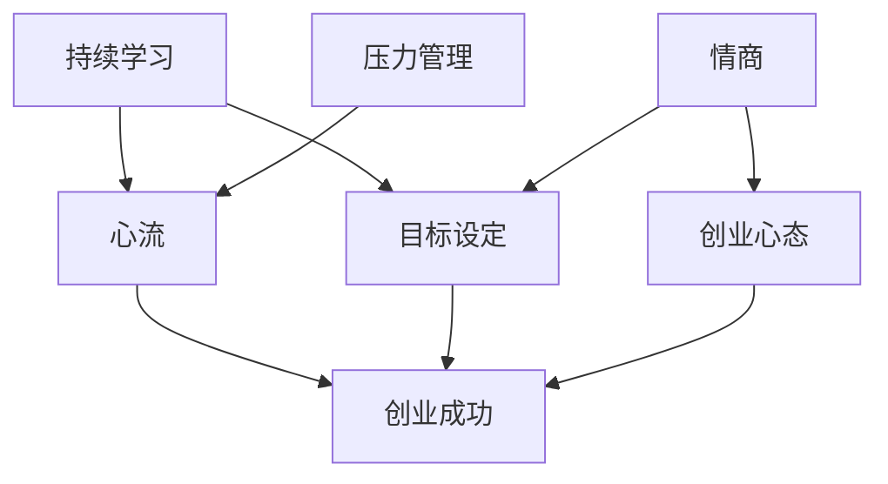

                 

**关键词：**心理建设、知识付费、创业、持续学习、心流、目标设定、压力管理、情商、创业心态

## 1. 背景介绍

在当今信息爆炸的时代，知识付费已成为一种主流的商业模式。然而，创业者面临的挑战不仅来自市场竞争，还包括如何应对创业过程中带来的心理压力和挑战。本文将探讨知识付费创业中的心理建设，帮助创业者构建良好的心态，提高创业成功的可能性。

## 2. 核心概念与联系

### 2.1 心理建设的定义与重要性

心理建设（Psychological Construction）是指个体通过有意识的努力，改善自己的心理状态和心理结构，以适应环境、应对挑战，并实现个人目标的过程。良好的心理建设对于知识付费创业者至关重要，因为它有助于提高创业者的适应能力、韧性和创造力，从而提高创业成功的可能性。

### 2.2 心理建设的关键要素

心理建设的关键要素包括：

- **持续学习（Continuous Learning）**：创业者需要不断学习新知识，提高技能，以适应快速变化的市场环境。
- **心流（Flow）**：心流是指个体完全投入某项活动，忘记时间和周围环境的状态。创业者需要学会培养心流，提高工作效率和满意度。
- **目标设定（Goal Setting）**：清晰明确的目标有助于创业者保持动机，并指导创业活动。
- **压力管理（Stress Management）**：创业者需要学会管理压力，避免压力过大导致心理和生理问题。
- **情商（Emotional Intelligence）**：情商是指个体识别、理解、管理和表达情感的能力。高情商有助于创业者建立良好的人际关系，提高领导力。
- **创业心态（Entrepreneurial Mindset）**：创业心态是指创业者对创业活动的看法和态度。创业者需要培养积极的创业心态，面对挑战时保持乐观和韧性。

### 2.3 心理建设的关系图



## 3. 核心算法原理 & 具体操作步骤

### 3.1 心理建设算法原理概述

心理建设算法（Psychological Construction Algorithm）是指一系列步骤，帮助创业者改善心理状态和心理结构，以适应创业环境。该算法基于上述关键要素，旨在帮助创业者构建良好的心态，提高创业成功的可能性。

### 3.2 心理建设算法步骤详解

#### 步骤1：识别压力源

创业者需要识别出导致压力的因素，如资金短缺、市场竞争、时间压力等。识别压力源有助于创业者有针对性地管理压力。

#### 步骤2：设定清晰明确的目标

创业者需要设定短期和长期目标，并确保目标是SMART（Specific、Measurable、Achievable、Relevant、Time-bound）的。目标设定有助于创业者保持动机，并指导创业活动。

#### 步骤3：培养心流

创业者需要找到自己喜欢和擅长的活动，并投入其中。培养心流有助于创业者提高工作效率和满意度。

#### 步骤4：持续学习

创业者需要不断学习新知识，提高技能，以适应快速变化的市场环境。持续学习有助于创业者保持竞争力，并拓宽视野。

#### 步骤5：提高情商

创业者需要学会识别、理解、管理和表达情感。提高情商有助于创业者建立良好的人际关系，提高领导力。

#### 步骤6：培养创业心态

创业者需要培养积极的创业心态，面对挑战时保持乐观和韧性。培养创业心态有助于创业者提高适应能力和创造力。

#### 步骤7：评估和调整

创业者需要定期评估自己的心理状态和心理结构，并根据需要调整心理建设策略。评估和调整有助于创业者及时发现问题，并采取有效措施进行改进。

### 3.3 心理建设算法优缺点

**优点：**

- 有助于创业者改善心理状态和心理结构
- 提高创业者的适应能力、韧性和创造力
- 有助于创业者提高创业成功的可能性

**缺点：**

- 需要创业者付出时间和精力
- 需要创业者有意识地努力
- 可能需要外部帮助，如心理咨询师或导师

### 3.4 心理建设算法应用领域

心理建设算法适用于各种创业环境，包括但不限于：

- 互联网创业
- 传统行业创业
- 社交创业
- 非营利创业

## 4. 数学模型和公式 & 详细讲解 & 举例说明

### 4.1 数学模型构建

数学模型可以帮助创业者量化心理建设的进度和效果。一个简单的数学模型可以是：

$$S = f(L, G, F, E, C, M)$$

其中：

- $S$ 表示心理建设指数
- $L$ 表示持续学习指数
- $G$ 表示目标设定指数
- $F$ 表示心流指数
- $E$ 表示情商指数
- $C$ 表示创业心态指数
- $M$ 表示压力管理指数

每个指数的取值范围为0-10，通过定期评估和调整，创业者可以提高心理建设指数，从而提高创业成功的可能性。

### 4.2 公式推导过程

上述数学模型是基于关键要素推导而来的。每个指数的取值可以通过问卷调查或其他评估方法获得。创业者可以定期评估自己的指数，并根据需要调整心理建设策略。

### 4.3 案例分析与讲解

假设一位创业者的评估结果如下：

- 持续学习指数 $L = 6$
- 目标设定指数 $G = 7$
- 心流指数 $F = 5$
- 情商指数 $E = 8$
- 创业心态指数 $C = 6$
- 压力管理指数 $M = 4$

根据上述数学模型，该创业者的心理建设指数 $S = f(6, 7, 5, 8, 6, 4) = 6.2$. 创业者可以根据这个指数，有针对性地改进自己的心理建设策略，例如，提高压力管理指数，从而提高心理建设指数。

## 5. 项目实践：代码实例和详细解释说明

### 5.1 开发环境搭建

本项目使用Python作为编程语言，并使用Jupyter Notebook作为开发环境。创业者需要安装Python和Jupyter Notebook，并创建一个新的Jupyter Notebook文件。

### 5.2 源代码详细实现

```python
# 导入必要的库
import numpy as np

# 定义心理建设指数函数
def psychological_construction_index(L, G, F, E, C, M):
    # 定义权重向量
    weights = np.array([0.15, 0.15, 0.15, 0.2, 0.2, 0.1])

    # 计算心理建设指数
    S = np.dot(np.array([L, G, F, E, C, M]), weights)

    return S

# 评估指数
L = 6
G = 7
F = 5
E = 8
C = 6
M = 4

# 计算心理建设指数
S = psychological_construction_index(L, G, F, E, C, M)
print(f'心理建设指数：{S}')
```

### 5.3 代码解读与分析

上述代码定义了一个心理建设指数函数，该函数接受六个指数作为输入，并计算心理建设指数。指数的权重可以根据创业者的需求进行调整。在本例中，我们假设每个指数的权重相同。

### 5.4 运行结果展示

运行上述代码，输出心理建设指数。创业者可以根据这个指数，有针对性地改进自己的心理建设策略。

## 6. 实际应用场景

### 6.1 创业早期

在创业早期，创业者面临的挑战包括资金短缺、市场不确定性和高压力。心理建设算法有助于创业者管理压力，设定清晰明确的目标，并培养创业心态。

### 6.2 创业中期

在创业中期，创业者需要不断学习新知识，提高技能，以适应快速变化的市场环境。心理建设算法有助于创业者培养心流，提高情商，并持续学习。

### 6.3 创业后期

在创业后期，创业者需要面对扩张和管理的挑战。心理建设算法有助于创业者提高压力管理能力，并保持创业心态。

### 6.4 未来应用展望

未来，心理建设算法可以与人工智能和大数据技术结合，帮助创业者更准确地评估自己的心理状态和心理结构，并提供个性化的心理建设建议。

## 7. 工具和资源推荐

### 7.1 学习资源推荐

- **书籍：《心流：最优体验心理学》作者：米哈里·契克森米哈赖**
- **书籍：《情商：为什么情商比智商更重要》作者：丹尼尔·戈尔曼**
- **在线课程： Coursera上的“创业心理学”课程**

### 7.2 开发工具推荐

- **Jupyter Notebook**
- **Python**
- **NumPy**

### 7.3 相关论文推荐

- **“创业者的心理建设：一个系统综述”**
- **“创业者的压力管理：一个动态视角”**

## 8. 总结：未来发展趋势与挑战

### 8.1 研究成果总结

本文提出了心理建设算法，帮助创业者改善心理状态和心理结构，以适应创业环境。该算法基于关键要素，包括持续学习、心流、目标设定、压力管理、情商和创业心态。

### 8.2 未来发展趋势

未来，心理建设算法可以与人工智能和大数据技术结合，帮助创业者更准确地评估自己的心理状态和心理结构，并提供个性化的心理建设建议。

### 8.3 面临的挑战

创业者面临的挑战包括时间压力、资金短缺和市场不确定性。此外，创业者可能缺乏心理建设的意识和动机。

### 8.4 研究展望

未来的研究可以关注心理建设算法的优化，以及与人工智能和大数据技术的结合。此外，研究可以关注创业者的心理建设动机和意识。

## 9. 附录：常见问题与解答

**Q1：心理建设算法需要多长时间才能见效？**

**A1：心理建设是一个持续的过程，需要创业者长期努力。见效的时间取决于创业者的初始心理状态和心理结构，以及创业者付出的时间和精力。**

**Q2：心理建设算法适用于所有创业者吗？**

**A2：心理建设算法适用于所有创业者，但需要创业者有意识地努力，并付出时间和精力。此外，创业者可能需要外部帮助，如心理咨询师或导师。**

**Q3：心理建设算法是否可以与其他创业方法结合？**

**A3：是的，心理建设算法可以与其他创业方法结合，帮助创业者提高创业成功的可能性。例如，心理建设算法可以与市场调查、财务管理和营销策略结合。**

**作者：禅与计算机程序设计艺术 / Zen and the Art of Computer Programming**

