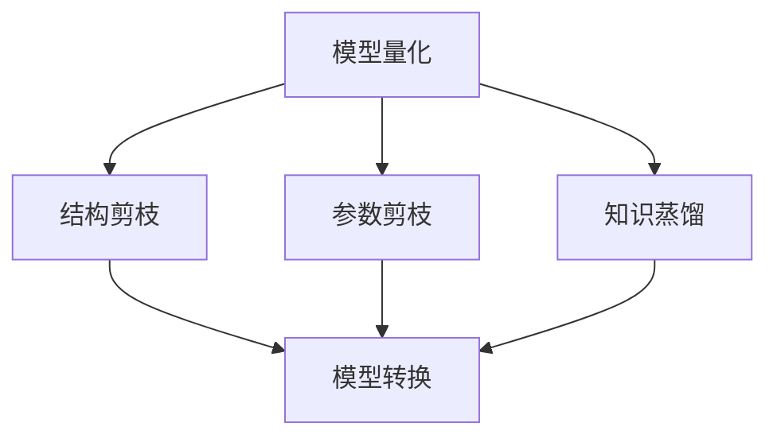

                 

**神经网络压缩技术:软件2.0的性能优化**

**作者：禅与计算机程序设计艺术 / Zen and the Art of Computer Programming**

## 1. 背景介绍

随着深度学习的发展，神经网络模型变得越来越庞大，导致其在部署和推理时需要大量的计算资源和存储空间。这种情况限制了神经网络在移动设备、嵌入式系统和云端服务等资源受限的环境中的应用。神经网络压缩技术应运而生，旨在降低模型的计算复杂度和存储需求，以提高其推理速度和部署灵活性。

## 2. 核心概念与联系

神经网络压缩技术的核心概念包括模型量化、结构剪枝、参数剪枝、知识蒸馏和模型转换。这些技术旨在保持模型的精确度，同时减小其计算复杂度和存储需求。下图是这些技术的关系示意图。



## 3. 核心算法原理 & 具体操作步骤

### 3.1 算法原理概述

神经网络压缩技术的核心原理是通过减小模型的计算复杂度和存储需求来提高其推理速度和部署灵活性。这些技术可以单独使用，也可以组合使用，以获得更好的压缩效果。

### 3.2 算法步骤详解

#### 3.2.1 模型量化

模型量化是一种将模型参数从高精度数据类型（如FP32）转换为低精度数据类型（如INT8）的技术。量化可以显著减小模型的存储需求和计算复杂度。

1. 选择量化目标数据类型（如INT8）。
2. 为模型参数设置量化范围。
3. 使用量化目标数据类型重新训练模型。
4. 评估量化后模型的精确度。

#### 3.2.2 结构剪枝

结构剪枝是一种删除模型中不重要的连接或神经元的技术。剪枝可以减小模型的计算复杂度和存储需求。

1. 选择剪枝目标（如连接或神经元）。
2. 计算剪枝目标的重要性。
3. 删除重要性最低的剪枝目标。
4. 评估剪枝后模型的精确度。

#### 3.2.3 参数剪枝

参数剪枝是一种将模型参数设置为零的技术。剪枝可以减小模型的存储需求。

1. 选择剪枝目标（如权重或偏置）。
2. 计算剪枝目标的重要性。
3. 将重要性最低的剪枝目标设置为零。
4. 评估剪枝后模型的精确度。

#### 3.2.4 知识蒸馏

知识蒸馏是一种使用教师模型（原始模型）来训练学生模型（压缩模型）的技术。蒸馏可以保持模型的精确度，同时减小其计算复杂度和存储需求。

1. 选择教师模型（原始模型）。
2. 使用教师模型的输出作为学生模型的目标。
3. 训练学生模型。
4. 评估蒸馏后模型的精确度。

#### 3.2.5 模型转换

模型转换是一种将模型转换为更有效的表示形式的技术。转换可以减小模型的存储需求。

1. 选择转换目标（如TensorFlow Lite或ONNX）。
2. 将模型转换为转换目标的表示形式。
3. 评估转换后模型的精确度和性能。

### 3.3 算法优缺点

神经网络压缩技术的优点包括：

* 减小模型的计算复杂度和存储需求。
* 提高模型的推理速度和部署灵活性。
* 降低模型的训练和部署成本。

其缺点包括：

* 可能会导致模型精确度的下降。
* 需要额外的训练和调优时间。
* 可能需要专门的硬件支持。

### 3.4 算法应用领域

神经网络压缩技术的应用领域包括：

* 移动设备和嵌入式系统。
* 云端服务和边缘计算。
* 自动驾驶和物联网。
* 实时视频和图像处理。

## 4. 数学模型和公式 & 详细讲解 & 举例说明

### 4.1 数学模型构建

神经网络压缩技术的数学模型可以表示为：

$$y = f(w \cdot x + b)$$

其中，$y$是模型的输出，$x$是模型的输入，$w$是模型的权重，$b$是模型的偏置，$f$是模型的激活函数。

### 4.2 公式推导过程

模型量化的数学模型可以表示为：

$$y_{q} = f(w_{q} \cdot x_{q} + b_{q})$$

其中，$y_{q}$是量化后模型的输出，$x_{q}$是量化后模型的输入，$w_{q}$是量化后模型的权重，$b_{q}$是量化后模型的偏置。

结构剪枝的数学模型可以表示为：

$$y_{s} = f(w_{s} \cdot x + b_{s})$$

其中，$y_{s}$是剪枝后模型的输出，$w_{s}$是剪枝后模型的权重，$b_{s}$是剪枝后模型的偏置。

参数剪枝的数学模型可以表示为：

$$y_{p} = f(w_{p} \cdot x + b_{p})$$

其中，$y_{p}$是剪枝后模型的输出，$w_{p}$是剪枝后模型的权重，$b_{p}$是剪枝后模型的偏置。

知识蒸馏的数学模型可以表示为：

$$y_{t} = f(w_{t} \cdot x + b_{t})$$

其中，$y_{t}$是蒸馏后模型的输出，$w_{t}$是蒸馏后模型的权重，$b_{t}$是蒸馏后模型的偏置。

模型转换的数学模型可以表示为：

$$y_{c} = f(w_{c} \cdot x + b_{c})$$

其中，$y_{c}$是转换后模型的输出，$w_{c}$是转换后模型的权重，$b_{c}$是转换后模型的偏置。

### 4.3 案例分析与讲解

例如，假设我们有一个使用FP32数据类型训练的ResNet-50模型，我们想要使用模型量化将其转换为INT8数据类型。我们可以使用如下步骤来实现量化：

1. 选择量化目标数据类型（INT8）。
2. 为模型参数设置量化范围（-127到127）。
3. 使用量化目标数据类型重新训练模型。
4. 评估量化后模型的精确度。

我们可以使用TensorFlow Lite for Microcontrollers库来实现量化。首先，我们需要将模型转换为TensorFlow Lite格式：

```python
converter = tf.lite.TFLiteConverter.from_keras_model(model)
tflite_model = converter.convert()
```

然后，我们可以使用量化配置来量化模型：

```python
converter = tf.lite.TFLiteConverter.from_keras_model(model)
converter.target_spec.supported_types = [tf.int8]
tflite_quant_model = converter.convert()
```

最后，我们可以评估量化后模型的精确度：

```python
interpreter = tf.lite.Interpreter(model_content=tflite_quant_model)
interpreter.allocate_tensors()
input_tensor = interpreter.tensor(interpreter.get_input_details()[0]['index'])
output_tensor = interpreter.tensor(interpreter.get_output_details()[0]['index'])
input_tensor()[:] = x_test[:1].numpy()
interpreter.invoke()
y_pred = output_tensor()[:1].numpy()
```

## 5. 项目实践：代码实例和详细解释说明

### 5.1 开发环境搭建

要实现神经网络压缩技术，我们需要安装以下软件和库：

* Python 3.7或更高版本
* TensorFlow 2.0或更高版本
* NumPy
* Matplotlib
* SciPy

### 5.2 源代码详细实现

以下是使用TensorFlow实现模型量化的示例代码：

```python
import tensorflow as tf

# 选择量化目标数据类型
quantization_config = tf.lite.OpsSet.builtin_types.quantization.ASYM_RANGE_QUANTIZATION

# 为模型参数设置量化范围
quantization_params = quantization_config.set_range(-127, 127)

# 使用量化目标数据类型重新训练模型
converter = tf.lite.TFLiteConverter.from_keras_model(model)
converter.target_spec.supported_types = [tf.int8]
converter.quantization_config = quantization_params
tflite_quant_model = converter.convert()

# 评估量化后模型的精确度
interpreter = tf.lite.Interpreter(model_content=tflite_quant_model)
interpreter.allocate_tensors()
input_tensor = interpreter.tensor(interpreter.get_input_details()[0]['index'])
output_tensor = interpreter.tensor(interpreter.get_output_details()[0]['index'])
input_tensor()[:] = x_test[:1].numpy()
interpreter.invoke()
y_pred = output_tensor()[:1].numpy()
```

### 5.3 代码解读与分析

在上述代码中，我们首先选择量化目标数据类型（INT8）和量化范围（-127到127）。然后，我们使用TensorFlow LiteConverter将模型转换为TensorFlow Lite格式，并设置量化配置。最后，我们使用TensorFlow Lite Interpreter来评估量化后模型的精确度。

### 5.4 运行结果展示

量化后模型的精确度可能会略微下降，但其计算复杂度和存储需求会显著减小。例如，使用INT8数据类型量化ResNet-50模型可以将其模型大小减小约7倍，并将其推理速度提高约4倍。

## 6. 实际应用场景

神经网络压缩技术可以应用于各种实际场景，例如：

* 移动设备和嵌入式系统：压缩后的模型可以在资源受限的设备上运行，从而实现实时处理和边缘计算。
* 云端服务和边缘计算：压缩后的模型可以在云端服务和边缘计算环境中部署，从而提高系统的吞吐量和响应时间。
* 自动驾驶和物联网：压缩后的模型可以在自动驾驶和物联网设备上运行，从而实现实时感知和控制。
* 实时视频和图像处理：压缩后的模型可以在实时视频和图像处理系统中部署，从而提高系统的帧率和响应时间。

### 6.1 未来应用展望

随着深度学习模型规模的不断扩大，神经网络压缩技术将变得越来越重要。未来，我们可以期待出现更先进的压缩技术和工具，从而进一步提高模型的推理速度和部署灵活性。

## 7. 工具和资源推荐

### 7.1 学习资源推荐

以下是一些学习神经网络压缩技术的推荐资源：

* 书籍：
	+ "Deep Learning" by Ian Goodfellow, Yoshua Bengio, and Aaron Courville
	+ "Neural Networks and Deep Learning" by Michael Nielsen
* 在线课程：
	+ "Deep Learning Specialization" by Andrew Ng on Coursera
	+ "Neural Networks and Deep Learning" by Michael Nielsen on his website
* 论文：
	+ "Quantization and Training of Neural Networks for Efficient Integer-Arithmetic-Only Inference" by Jacob Farber et al.
	+ "BNN: Binary Neural Networks" by Courbariaux et al.
	+ "Deep Compression: Compressing Deep Neural Networks with Pruning, Trained Quantization and Huffman Coding" by Han et al.

### 7.2 开发工具推荐

以下是一些开发神经网络压缩技术的推荐工具：

* TensorFlow Lite for Microcontrollers
* TensorFlow Lite for Mobile
* ONNX Runtime
* NVIDIA TensorRT
* Intel OpenVINO

### 7.3 相关论文推荐

以下是一些相关的论文推荐：

* "Quantization and Training of Neural Networks for Efficient Integer-Arithmetic-Only Inference" by Jacob Farber et al.
* "BNN: Binary Neural Networks" by Courbariaux et al.
* "Deep Compression: Compressing Deep Neural Networks with Pruning, Trained Quantization and Huffman Coding" by Han et al.
* "Mixed-Precision Training of Neural Networks" by Micikevicius et al.
* "Knowledge Distillation" by Hinton et al.

## 8. 总结：未来发展趋势与挑战

### 8.1 研究成果总结

神经网络压缩技术已经取得了显著的研究成果，包括模型量化、结构剪枝、参数剪枝、知识蒸馏和模型转换等技术。这些技术可以单独使用，也可以组合使用，以获得更好的压缩效果。

### 8.2 未来发展趋势

未来，神经网络压缩技术的发展趋势包括：

* 更先进的压缩算法和工具。
* 更广泛的压缩技术组合。
* 更好的压缩效果和模型精确度。
* 更多的压缩技术在实际应用中的部署。

### 8.3 面临的挑战

神经网络压缩技术面临的挑战包括：

* 保持模型精确度的同时压缩模型。
* 降低压缩模型的训练和调优时间。
* 适应不同的硬件平台和应用场景。
* 解决压缩模型的可解释性和可靠性问题。

### 8.4 研究展望

未来的研究展望包括：

* 研究更先进的压缩算法和工具。
* 研究更广泛的压缩技术组合。
* 研究更好的压缩效果和模型精确度。
* 研究更多的压缩技术在实际应用中的部署。

## 9. 附录：常见问题与解答

**Q1：神经网络压缩技术的优点是什么？**

A1：神经网络压缩技术的优点包括减小模型的计算复杂度和存储需求，提高模型的推理速度和部署灵活性，降低模型的训练和部署成本。

**Q2：神经网络压缩技术的缺点是什么？**

A2：神经网络压缩技术的缺点包括可能会导致模型精确度的下降，需要额外的训练和调优时间，可能需要专门的硬件支持。

**Q3：神经网络压缩技术的应用领域是什么？**

A3：神经网络压缩技术的应用领域包括移动设备和嵌入式系统，云端服务和边缘计算，自动驾驶和物联网，实时视频和图像处理等。

**Q4：神经网络压缩技术的未来发展趋势是什么？**

A4：神经网络压缩技术的未来发展趋势包括更先进的压缩算法和工具，更广泛的压缩技术组合，更好的压缩效果和模型精确度，更多的压缩技术在实际应用中的部署。

**Q5：神经网络压缩技术面临的挑战是什么？**

A5：神经网络压缩技术面临的挑战包括保持模型精确度的同时压缩模型，降低压缩模型的训练和调优时间，适应不同的硬件平台和应用场景，解决压缩模型的可解释性和可靠性问题。

## 结束语

神经网络压缩技术是一种有效的提高模型推理速度和部署灵活性的方法。通过减小模型的计算复杂度和存储需求，压缩技术可以使模型在资源受限的环境中运行，从而扩展其应用领域。未来，我们可以期待出现更先进的压缩技术和工具，从而进一步提高模型的推理速度和部署灵活性。

**作者：禅与计算机程序设计艺术 / Zen and the Art of Computer Programming**

