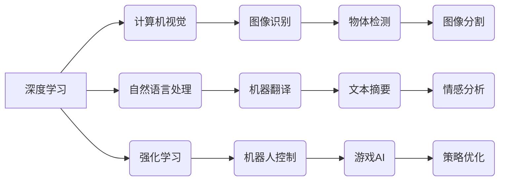

> 人工智能，深度学习，计算机视觉，自然语言处理，强化学习，模型压缩，可解释性，伦理

## 1. 背景介绍

人工智能（AI）正以惊人的速度发展，深刻地改变着我们生活和工作的方式。从自动驾驶汽车到智能语音助手，AI技术已渗透到各个领域，并展现出巨大的潜力。作为AI领域的领军人物之一，Andrej Karpathy 博士的贡献不可忽视。他不仅是一位杰出的研究者，也是一位优秀的工程师和传播者，他的研究成果和观点对AI的未来发展具有重要的启示意义。

## 2. 核心概念与联系

**2.1 深度学习**

深度学习是人工智能领域的一个重要分支，它利用多层神经网络来模拟人类大脑的学习过程。通过大量的训练数据，深度学习模型能够自动学习特征，并进行复杂的模式识别和预测。

**2.2 计算机视觉**

计算机视觉是让计算机“看”世界的一种技术，它旨在使计算机能够理解和解释图像和视频信息。深度学习在计算机视觉领域取得了突破性的进展，例如图像识别、物体检测、图像分割等。

**2.3 自然语言处理**

自然语言处理（NLP）是让计算机“理解”人类语言的技术，它旨在使计算机能够理解、生成和处理自然语言文本。深度学习在NLP领域也取得了显著的成果，例如机器翻译、文本摘要、情感分析等。

**2.4 强化学习**

强化学习是一种基于奖励机制的机器学习方法，它通过不断与环境交互，学习最优的策略来最大化奖励。强化学习在机器人控制、游戏 AI 等领域具有广泛的应用前景。

**2.5 模型压缩**

随着深度学习模型规模的不断增长，模型部署和推理效率成为一个瓶颈。模型压缩技术旨在通过各种方法减小模型大小，提高推理速度，同时保持模型性能。

**2.6 可解释性**

深度学习模型的决策过程通常是不可解释的，这使得其应用在一些关键领域受到限制。可解释性研究旨在提高深度学习模型的透明度，使人类能够理解模型的决策过程。

**2.7 伦理**

随着AI技术的快速发展，其伦理问题也日益凸显。例如，AI算法的偏见、隐私保护、责任归属等问题都需要认真思考和解决。

**2.8  核心概念关系图**



## 3. 核心算法原理 & 具体操作步骤

### 3.1  算法原理概述

深度学习算法的核心是多层神经网络，它由多个神经元组成的层级结构组成。每个神经元接收来自上一层的输入，并通过权重进行加权求和，然后经过激活函数处理，输出到下一层。通过训练，神经网络的权重会不断调整，使得网络能够学习到数据的特征和规律。

### 3.2  算法步骤详解

1. **数据预处理:** 将原始数据转换为深度学习模型可以理解的格式，例如归一化、编码等。
2. **网络结构设计:** 根据任务需求设计神经网络的层数、神经元数量、激活函数等参数。
3. **模型初始化:** 为神经网络的权重赋予初始值。
4. **前向传播:** 将输入数据通过神经网络进行一次传播，得到输出结果。
5. **损失函数计算:** 计算模型输出与真实值的差异，即损失值。
6. **反向传播:** 根据损失值，反向传播误差信号，更新神经网络的权重。
7. **迭代训练:** 重复前向传播、损失函数计算和反向传播的过程，直到模型性能达到预期的水平。

### 3.3  算法优缺点

**优点:**

* 能够自动学习特征，无需人工特征工程。
* 能够处理大规模数据，并取得较高的准确率。
* 在图像识别、自然语言处理等领域取得了突破性进展。

**缺点:**

* 训练时间长，需要大量的计算资源。
* 模型解释性差，难以理解模型的决策过程。
* 容易受到数据偏差的影响，可能产生不公平的结果。

### 3.4  算法应用领域

深度学习算法已广泛应用于各个领域，例如：

* **计算机视觉:** 图像识别、物体检测、图像分割、人脸识别等。
* **自然语言处理:** 机器翻译、文本摘要、情感分析、聊天机器人等。
* **语音识别:** 语音转文本、语音助手等。
* **推荐系统:** 商品推荐、内容推荐等。
* **医疗诊断:** 疾病诊断、影像分析等。

## 4. 数学模型和公式 & 详细讲解 & 举例说明

### 4.1  数学模型构建

深度学习模型通常由多个神经网络层组成，每个层包含多个神经元。每个神经元接收来自上一层的输入，并通过权重进行加权求和，然后经过激活函数处理，输出到下一层。

**4.1.1  神经元模型**

一个神经元的数学模型可以表示为：

$$
y = f(w^T x + b)
$$

其中：

* $x$ 是输入向量
* $w$ 是权重向量
* $b$ 是偏置项
* $f$ 是激活函数
* $y$ 是神经元的输出

**4.1.2  多层神经网络模型**

多层神经网络模型由多个神经元层组成，每个层的神经元之间通过权重连接。

### 4.2  公式推导过程

深度学习模型的训练过程是通过反向传播算法来实现的。反向传播算法的核心思想是通过计算损失函数对模型参数的梯度，并利用梯度下降法更新模型参数。

**4.2.1  损失函数**

损失函数用于衡量模型预测结果与真实值的差异。常用的损失函数包括均方误差（MSE）、交叉熵损失等。

**4.2.2  梯度下降法**

梯度下降法是一种迭代优化算法，它通过不断更新模型参数，使得损失函数的值逐渐减小。

### 4.3  案例分析与讲解

**4.3.1  图像分类**

在图像分类任务中，深度学习模型可以学习图像的特征，并将其分类到不同的类别。例如，可以训练一个模型来识别猫和狗的图像。

**4.3.2  机器翻译**

在机器翻译任务中，深度学习模型可以学习语言之间的映射关系，并将其用于将文本从一种语言翻译成另一种语言。例如，可以训练一个模型来将英文翻译成中文。

## 5. 项目实践：代码实例和详细解释说明

### 5.1  开发环境搭建

深度学习开发环境通常需要安装Python、深度学习框架（例如TensorFlow、PyTorch）以及必要的库和工具。

### 5.2  源代码详细实现

以下是一个简单的深度学习模型的代码示例，使用TensorFlow框架实现图像分类任务：

```python
import tensorflow as tf

# 定义模型结构
model = tf.keras.models.Sequential([
    tf.keras.layers.Conv2D(32, (3, 3), activation='relu', input_shape=(28, 28, 1)),
    tf.keras.layers.MaxPooling2D((2, 2)),
    tf.keras.layers.Conv2D(64, (3, 3), activation='relu'),
    tf.keras.layers.MaxPooling2D((2, 2)),
    tf.keras.layers.Flatten(),
    tf.keras.layers.Dense(10, activation='softmax')
])

# 编译模型
model.compile(optimizer='adam',
              loss='sparse_categorical_crossentropy',
              metrics=['accuracy'])

# 训练模型
model.fit(x_train, y_train, epochs=5)

# 评估模型
loss, accuracy = model.evaluate(x_test, y_test)
print('Test loss:', loss)
print('Test accuracy:', accuracy)
```

### 5.3  代码解读与分析

这段代码定义了一个简单的卷积神经网络模型，用于图像分类任务。模型包含两个卷积层、两个最大池化层、一个全连接层和一个输出层。

### 5.4  运行结果展示

训练完成后，可以评估模型的性能，例如计算测试集上的损失值和准确率。

## 6. 实际应用场景

### 6.1  自动驾驶

深度学习在自动驾驶领域发挥着重要作用，例如：

* **目标检测:** 识别道路上的车辆、行人、交通信号灯等物体。
* **路径规划:** 根据周围环境规划最优的驾驶路径。
* **驾驶决策:** 辅助驾驶员做出驾驶决策，例如加速、减速、转向等。

### 6.2  医疗诊断

深度学习在医疗诊断领域也有着广泛的应用，例如：

* **疾病诊断:** 根据患者的影像数据，辅助医生诊断疾病。
* **病灶检测:** 在影像数据中检测肿瘤、骨折等病灶。
* **药物研发:** 辅助药物研发，例如预测药物的疗效和安全性。

### 6.3  金融风险管理

深度学习可以用于金融风险管理，例如：

* **欺诈检测:** 检测信用卡欺诈、网络钓鱼等金融欺诈行为。
* **信用评分:** 根据客户的财务数据，评估其信用风险。
* **投资预测:** 预测股票价格、汇率等金融市场走势。

### 6.4  未来应用展望

随着深度学习技术的不断发展，其应用场景将更加广泛，例如：

* **个性化教育:** 根据学生的学习情况，提供个性化的学习方案。
* **智能家居:** 通过语音控制、图像识别等技术，实现智能家居的自动化控制。
* **机器人服务:** 开发更加智能的机器人，用于服务业、医疗保健等领域。

## 7. 工具和资源推荐

### 7.1  学习资源推荐

* **书籍:**
    * 深度学习 (Deep Learning) - Ian Goodfellow, Yoshua Bengio, Aaron Courville
    * 构建深度学习模型 (Hands-On Machine Learning with Scikit-Learn, Keras & TensorFlow) - Aurélien Géron
* **在线课程:**
    * 深度学习 Specialization - Andrew Ng (Coursera)
    * fast.ai - Practical Deep Learning for Coders
* **博客和网站:**
    * Andrej Karpathy's Blog: https://karpathy.github.io/
    * OpenAI Blog: https://openai.com/blog/

### 7.2  开发工具推荐

* **深度学习框架:** TensorFlow, PyTorch, Keras
* **编程语言:** Python
* **数据处理工具:** Pandas, NumPy
* **可视化工具:** Matplotlib, Seaborn

### 7.3  相关论文推荐

* **ImageNet Classification with Deep Convolutional Neural Networks** - Alex Krizhevsky, Ilya Sutskever, Geoffrey E. Hinton
* **Attention Is All You Need** - Ashish Vaswani, Noam Shazeer, Niki Parmar, Jakob Uszkoreit, Llion Jones, Aidan N. Gomez, Łukasz Kaiser, Illia Polosukhin
* **Generative Adversarial Networks** - Ian Goodfellow, Jean Pouget-Abadie, Mehdi Mirza, Bing Xu, David Warde-Farley, Sherjil Ozair, Aaron Courville, Yoshua Bengio

## 8. 总结：未来发展趋势与挑战

### 8.1  研究成果总结

深度学习技术取得了令人瞩目的成就，在计算机视觉、自然语言处理等领域取得了突破性进展。

### 8.2  未来发展趋势

* **模型规模