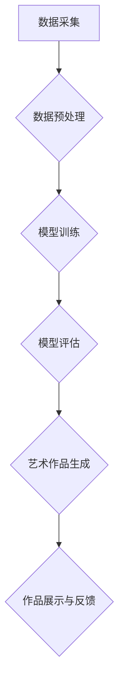

> 人工智能，艺术，价值，创造力，表达，技术，伦理

## 1. 背景介绍

人工智能（AI）的快速发展，正在深刻地改变着我们生活的方方面面。从自动驾驶汽车到智能语音助手，AI技术已经渗透到我们的日常生活。然而，除了其强大的功能和实用价值之外，AI也引发了人们对艺术价值的思考。

Andrej Karpathy，一位享誉全球的人工智能专家，曾指出：“人工智能的艺术价值在于其能够帮助我们以全新的方式表达和创造。”他的观点引发了广泛的讨论，也促使我们重新审视AI与艺术之间的关系。

## 2. 核心概念与联系

**2.1 人工智能与艺术的交汇点**

人工智能与艺术看似是两个截然不同的领域，但实际上它们之间存在着密切的联系。

* **创造力：** 传统的艺术创作往往依赖于人类的想象力和创造力。而人工智能，通过学习和模仿人类的创作模式，也能够产生出具有艺术性的作品。

* **表达：** 艺术是一种表达情感、思想和体验的方式。人工智能可以通过不同的形式，例如绘画、音乐、诗歌等，来表达其对世界的理解和感知。

* **审美：** 艺术的审美价值是主观的，但人工智能可以通过分析大量艺术作品，学习和理解审美规律，从而创作出符合大众审美的作品。

**2.2  AI 艺术创作流程**



## 3. 核心算法原理 & 具体操作步骤

**3.1 算法原理概述**

人工智能在艺术创作中的应用主要依赖于以下几种算法：

* **生成对抗网络（GAN）：** GAN由两个网络组成：生成器和鉴别器。生成器试图生成逼真的艺术作品，而鉴别器则试图区分真实作品和生成作品。通过不断的对抗训练，生成器能够逐渐学习到生成高质量艺术作品的技巧。

* **变分自编码器（VAE）：** VAE是一种无监督学习算法，它可以学习到数据的潜在表示。在艺术创作中，VAE可以用来生成新的艺术作品，或者对现有作品进行修改和增强。

* **强化学习（RL）：** RL是一种通过奖励机制来训练模型的算法。在艺术创作中，RL可以用来训练模型生成符合特定审美标准的作品。

**3.2 算法步骤详解**

以生成对抗网络（GAN）为例，其训练过程可以分为以下步骤：

1. **初始化生成器和鉴别器网络：** 随机初始化两个网络的参数。

2. **生成器生成样本：** 生成器根据随机噪声输入生成一个新的艺术作品样本。

3. **鉴别器判别样本：** 鉴别器对生成的样本和真实样本进行判别，输出其判断结果。

4. **更新生成器参数：** 根据鉴别器的判别结果，更新生成器的参数，使其生成的样本更接近真实样本。

5. **更新鉴别器参数：** 根据鉴别器的判别结果，更新鉴别器的参数，使其对真实样本和生成样本的判别能力更强。

6. **重复步骤2-5：** 重复上述步骤，直到生成器能够生成高质量的艺术作品。

**3.3 算法优缺点**

* **优点：**

    * 可以生成逼真的艺术作品。
    * 可以学习和模仿人类的创作风格。
    * 可以探索新的艺术形式和风格。

* **缺点：**

    * 训练过程复杂，需要大量的计算资源。
    * 生成的作品可能缺乏情感和内涵。
    * 存在伦理问题，例如作品的版权归属。

**3.4 算法应用领域**

* **艺术创作：** 生成绘画、音乐、诗歌等艺术作品。
* **游戏开发：** 生成游戏场景、角色和道具。
* **电影制作：** 生成电影特效和场景。
* **设计领域：** 生成产品设计、建筑设计等。

## 4. 数学模型和公式 & 详细讲解 & 举例说明

**4.1 数学模型构建**

生成对抗网络（GAN）的核心数学模型是两个神经网络之间的博弈过程。

* **生成器网络（G）：** 接收随机噪声作为输入，输出一个模拟真实数据的样本。

* **鉴别器网络（D）：** 接收真实数据和生成数据的样本作为输入，输出一个判断结果，表示样本的真实性。

**4.2 公式推导过程**

* **生成器损失函数：**

$$
L_G(G, D) = E_{x \sim p_{data}(x)}[log(1 - D(G(z)))]
$$

* **鉴别器损失函数：**

$$
L_D(D, G) = E_{x \sim p_{data}(x)}[log(D(x))] + E_{z \sim p_z(z)}[log(1 - D(G(z)))]
$$

其中：

* $p_{data}(x)$ 是真实数据的分布。
* $p_z(z)$ 是随机噪声的分布。
* $D(x)$ 是鉴别器对样本 $x$ 的判断结果。
* $G(z)$ 是生成器对噪声 $z$ 的输出。

**4.3 案例分析与讲解**

在图像生成领域，GAN已经取得了显著的成果。例如，DeepFake技术利用GAN生成逼真的视频，而StyleGAN则可以生成具有特定风格的图像。

## 5. 项目实践：代码实例和详细解释说明

**5.1 开发环境搭建**

* Python 3.x
* TensorFlow 或 PyTorch
* CUDA 和 cuDNN

**5.2 源代码详细实现**

```python
# 生成器网络
class Generator(nn.Module):
    def __init__(self):
        super(Generator, self).__init__()
        # ...

    def forward(self, z):
        # ...

# 鉴别器网络
class Discriminator(nn.Module):
    def __init__(self):
        super(Discriminator, self).__init__()
        # ...

    def forward(self, x):
        # ...

# 训练循环
for epoch in range(num_epochs):
    for batch_idx, (real_images, _) in enumerate(train_loader):
        # ...
```

**5.3 代码解读与分析**

* 生成器网络负责生成新的图像样本。
* 鉴别器网络负责判断图像样本的真实性。
* 训练循环中，生成器和鉴别器网络交替训练，直到生成器能够生成逼真的图像样本。

**5.4 运行结果展示**

训练完成后，可以将生成器网络用于生成新的图像样本。

## 6. 实际应用场景

**6.1 艺术创作辅助工具**

AI可以帮助艺术家探索新的创作思路，生成灵感，并辅助完成创作过程。

**6.2 个性化艺术品定制**

用户可以根据自己的喜好，使用AI生成个性化的艺术作品。

**6.3 数字艺术品市场**

AI生成的艺术品可以作为数字资产进行交易，推动数字艺术品的市场发展。

**6.4 未来应用展望**

* AI将能够生成更逼真、更具情感的艺术作品。
* AI将能够与人类艺术家进行更紧密的合作，共同创作出更具创新性的作品。
* AI将推动艺术创作的民主化，让更多人能够参与到艺术创作中。

## 7. 工具和资源推荐

**7.1 学习资源推荐**

* **书籍：**

    * 《Deep Learning》 by Ian Goodfellow, Yoshua Bengio, and Aaron Courville
    * 《Generative Deep Learning》 by David Foster

* **在线课程：**

    * Coursera: Deep Learning Specialization
    * Udacity: Deep Learning Nanodegree

**7.2 开发工具推荐**

* TensorFlow
* PyTorch
* Keras

**7.3 相关论文推荐**

* Goodfellow, I., Pouget-Abadie, J., Mirza, M., Xu, B., Warde-Farley, D., Ozair, S., ... & Bengio, Y. (2014). Generative adversarial nets. In Advances in neural information processing systems (pp. 2672-2680).

## 8. 总结：未来发展趋势与挑战

**8.1 研究成果总结**

人工智能在艺术创作领域取得了显著的进展，能够生成逼真的艺术作品，并探索新的艺术形式。

**8.2 未来发展趋势**

* AI艺术创作将更加智能化、个性化和交互式。
* AI将与人类艺术家进行更紧密的合作，共同创作出更具创新性的作品。
* AI艺术创作将推动艺术创作的民主化，让更多人能够参与到艺术创作中。

**8.3 面临的挑战**

* 如何确保AI生成的艺术作品具有真正的艺术价值？
* 如何解决AI艺术作品的版权问题？
* 如何避免AI艺术创作被滥用？

**8.4 研究展望**

未来，我们需要继续探索AI与艺术之间的关系，研究如何让AI更好地理解和表达人类的情感和思想，并推动AI艺术创作朝着更加智能、更加人性化的方向发展。

## 9. 附录：常见问题与解答

**9.1  AI生成的艺术作品是否具有艺术价值？**

这是一个复杂的问题，没有绝对的答案。一些人认为AI生成的艺术作品缺乏情感和内涵，因此不具有真正的艺术价值。而另一些人则认为，只要作品能够引起人们的共鸣和思考，就具有艺术价值。

**9.2  AI艺术作品的版权归属问题如何解决？**

目前，AI艺术作品的版权归属问题还没有得到明确的法律界定。一些观点认为，AI生成的艺术作品的版权应该归属于其创造者，即训练AI模型的人。而另一些观点则认为，AI生成的艺术作品应该视为公共领域的作品。

**9.3  AI艺术创作可能会取代人类艺术家吗？**

AI艺术创作可能会改变艺术创作的方式，但不太可能完全取代人类艺术家。人类艺术家拥有独特的创造力和情感表达能力，这些是AI目前无法替代的。


作者：禅与计算机程序设计艺术 / Zen and the Art of Computer Programming 
<end_of_turn>