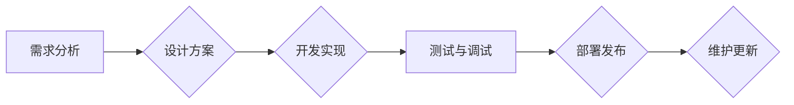

> ChatGPT, 插件开发, API, 自然语言处理, 应用场景, 开发指南, 

## 1. 背景介绍

ChatGPT，作为一款强大的开源语言模型，凭借其出色的文本生成、理解和对话能力，迅速成为了人工智能领域备受瞩目的明星。其开放的API接口为开发者提供了无限的可能性，催生了一系列基于ChatGPT的创新应用。其中，ChatGPT插件的开发尤为重要，它将ChatGPT的强大功能与特定领域或应用场景相结合，赋予其更强的实用性和针对性。

随着ChatGPT插件生态的不断发展，越来越多的开发者开始关注插件开发，希望能够利用ChatGPT的优势，构建出更智能、更便捷的应用。然而，对于初学者而言，ChatGPT插件开发的流程和技术细节可能显得较为复杂。

本指南旨在为开发者提供一个完整的ChatGPT插件开发指南，从基础概念到实践操作，涵盖插件开发的各个方面，帮助开发者快速入门，并构建出高质量的ChatGPT插件。

## 2. 核心概念与联系

### 2.1 ChatGPT 插件概述

ChatGPT插件是一种扩展ChatGPT功能的模块，它可以连接到外部服务或数据源，并通过API接口与ChatGPT进行交互。插件可以提供以下功能：

* **扩展功能：** 提供ChatGPT本身不具备的功能，例如访问外部数据库、执行代码、控制硬件设备等。
* **个性化定制：** 根据特定需求定制ChatGPT的行为和输出，例如调整语言风格、提供特定领域的知识库等。
* **集成应用：** 将ChatGPT与其他应用或平台集成，例如将ChatGPT集成到网站、应用程序或办公软件中。

### 2.2 插件架构

ChatGPT插件通常由以下几个部分组成：

* **插件代码：** 实现插件功能的核心代码，通常使用Python语言编写。
* **插件配置：** 插件的配置信息，例如连接数据库的地址、API密钥等。
* **插件接口：** 插件与ChatGPT进行交互的接口，通常使用RESTful API。

### 2.3 插件开发流程

ChatGPT插件的开发流程通常包括以下步骤：

1. **需求分析：** 确定插件的功能需求和目标用户。
2. **设计方案：** 设计插件的架构、接口和功能实现方案。
3. **开发实现：** 编写插件代码，并进行测试和调试。
4. **部署发布：** 将插件部署到服务器或云平台，并进行发布。
5. **维护更新：** 定期维护和更新插件，修复bug并添加新功能。

### 2.4 Mermaid 流程图



## 3. 核心算法原理 & 具体操作步骤

### 3.1 算法原理概述

ChatGPT插件的开发主要依赖于自然语言处理（NLP）技术，包括文本分类、文本生成、对话系统等。这些技术通常基于深度学习模型，例如Transformer模型。

Transformer模型能够有效地捕捉文本中的长距离依赖关系，从而实现更准确的文本理解和生成。ChatGPT本身就是基于Transformer模型训练的，因此插件开发可以充分利用ChatGPT的预训练能力。

### 3.2 算法步骤详解

1. **文本预处理：** 对用户输入的文本进行预处理，例如分词、去停用词、词向量化等。
2. **模型输入：** 将预处理后的文本作为输入，输入到ChatGPT模型中。
3. **模型推理：** ChatGPT模型对输入文本进行推理，生成相应的输出文本。
4. **文本后处理：** 对模型输出的文本进行后处理，例如解码、格式化等。

### 3.3 算法优缺点

**优点：**

* **高准确率：** 基于深度学习的模型能够实现高准确率的文本理解和生成。
* **可扩展性强：** 可以根据需求添加新的功能模块，扩展插件的功能。
* **易于部署：** 可以使用现有的云平台或服务器部署插件。

**缺点：**

* **训练成本高：** 深度学习模型的训练需要大量的计算资源和数据。
* **模型解释性差：** 深度学习模型的决策过程难以解释，这可能导致模型的不可信赖性。
* **数据依赖性强：** 模型的性能取决于训练数据的质量和数量。

### 3.4 算法应用领域

ChatGPT插件的应用领域非常广泛，例如：

* **客服机器人：** 提供智能客服服务，自动回答用户问题。
* **内容创作：** 自动生成文章、故事、诗歌等内容。
* **代码生成：** 根据用户需求自动生成代码。
* **教育辅助：** 提供个性化的学习辅导和知识问答。

## 4. 数学模型和公式 & 详细讲解 & 举例说明

### 4.1 数学模型构建

ChatGPT的模型架构基于Transformer，其核心是自注意力机制（Self-Attention）。自注意力机制能够捕捉文本中不同词之间的关系，从而更好地理解文本的语义。

### 4.2 公式推导过程

自注意力机制的计算公式如下：

$$
Attention(Q, K, V) = softmax(\frac{QK^T}{\sqrt{d_k}})V
$$

其中：

* $Q$：查询矩阵
* $K$：键矩阵
* $V$：值矩阵
* $d_k$：键向量的维度
* $softmax$：softmax函数

### 4.3 案例分析与讲解

假设我们有一个句子“我爱学习编程”，其词向量表示为：

* 我：[0.1, 0.2, 0.3]
* 爱：[0.4, 0.5, 0.6]
* 学习：[0.7, 0.8, 0.9]
* 编程：[1.0, 1.1, 1.2]

通过自注意力机制，我们可以计算出每个词与其他词之间的关系，例如“我”与“学习”之间的关系。

## 5. 项目实践：代码实例和详细解释说明

### 5.1 开发环境搭建

* Python 3.7+
* pip 安装依赖库：

```bash
pip install openai
```

### 5.2 源代码详细实现

```python
import openai

# 设置OpenAI API密钥
openai.api_key = "YOUR_API_KEY"

def generate_response(prompt):
    response = openai.Completion.create(
        engine="text-davinci-003",
        prompt=prompt,
        max_tokens=100,
        temperature=0.7
    )
    return response.choices[0].text.strip()

# 示例用法
user_input = "你好，ChatGPT插件！"
response = generate_response(user_input)
print(f"ChatGPT插件回复：{response}")
```

### 5.3 代码解读与分析

* 该代码首先导入`openai`库，并设置OpenAI API密钥。
* `generate_response()`函数接收用户输入的文本作为参数，并使用OpenAI的API调用`text-davinci-003`引擎生成回复文本。
* `max_tokens`参数控制回复文本的最大长度，`temperature`参数控制回复文本的随机性。
* 最后，代码打印出ChatGPT插件的回复。

### 5.4 运行结果展示

```
ChatGPT插件回复：你好！很高兴能和你聊天。请问有什么我可以帮你的吗？
```

## 6. 实际应用场景

### 6.1 客服机器人

ChatGPT插件可以用于构建智能客服机器人，自动回答用户常见问题，例如订单查询、退换货流程等。

### 6.2 内容创作

ChatGPT插件可以用于自动生成各种类型的文本内容，例如新闻报道、产品描述、社交媒体文案等。

### 6.3 代码生成

ChatGPT插件可以根据用户需求自动生成代码，例如Python、JavaScript、Java等语言的代码。

### 6.4 未来应用展望

ChatGPT插件的应用场景还在不断扩展，未来可能应用于以下领域：

* **个性化教育：** 提供个性化的学习辅导和知识问答。
* **医疗辅助：** 辅助医生诊断疾病、提供医疗建议。
* **法律辅助：** 辅助律师进行法律研究、撰写法律文件。

## 7. 工具和资源推荐

### 7.1 学习资源推荐

* **OpenAI 官方文档：** https://platform.openai.com/docs/
* **ChatGPT 插件开发指南：** https://platform.openai.com/docs/guides/plugins
* **自然语言处理教程：** https://www.coursera.org/learn/natural-language-processing

### 7.2 开发工具推荐

* **VS Code：** https://code.visualstudio.com/
* **PyCharm：** https://www.jetbrains.com/pycharm/

### 7.3 相关论文推荐

* **Attention Is All You Need：** https://arxiv.org/abs/1706.03762

## 8. 总结：未来发展趋势与挑战

### 8.1 研究成果总结

ChatGPT插件的开发为人工智能应用带来了新的可能性，它将ChatGPT的强大功能与特定领域或应用场景相结合，赋予其更强的实用性和针对性。

### 8.2 未来发展趋势

* **更强大的模型：** 未来将会有更强大的语言模型出现，能够提供更准确、更自然的文本生成和理解能力。
* **更丰富的插件生态：** 将会有越来越多的ChatGPT插件开发出来，覆盖更广泛的应用场景。
* **更智能的交互：** 未来ChatGPT插件将能够进行更智能的交互，例如理解用户的情感、提供个性化的建议等。

### 8.3 面临的挑战

* **数据安全和隐私：** ChatGPT插件需要访问用户数据，因此需要确保数据安全和隐私。
* **模型偏见和误导：** 深度学习模型可能存在偏见和误导，需要进行相应的缓解措施。
* **伦理问题：** ChatGPT插件的应用可能引发一些伦理问题，例如虚假信息传播、工作岗位替代等，需要进行深入的探讨和研究。

### 8.4 研究展望

未来，ChatGPT插件的研究将继续深入，探索更强大的模型、更丰富的应用场景和更智能的交互方式，为人类社会带来更多便利和价值。

## 9. 附录：常见问题与解答

### 9.1 如何获取OpenAI API密钥？

您可以访问OpenAI官网（https://openai.com/）注册账号，并申请API密钥。

### 9.2 ChatGPT插件的开发成本是多少？

ChatGPT插件的开发成本取决于插件的复杂度、功能需求和开发团队规模等因素。

### 9.3 ChatGPT插件的安全性如何保证？

OpenAI提供了一系列的安全措施来保护用户数据和隐私，例如数据加密、访问控制等。

### 9.4 ChatGPT插件的未来发展趋势是什么？

ChatGPT插件的未来发展趋势是更加智能、更加个性化、更加广泛的应用场景。

作者：禅与计算机程序设计艺术 / Zen and the Art of Computer Programming


<end_of_turn>