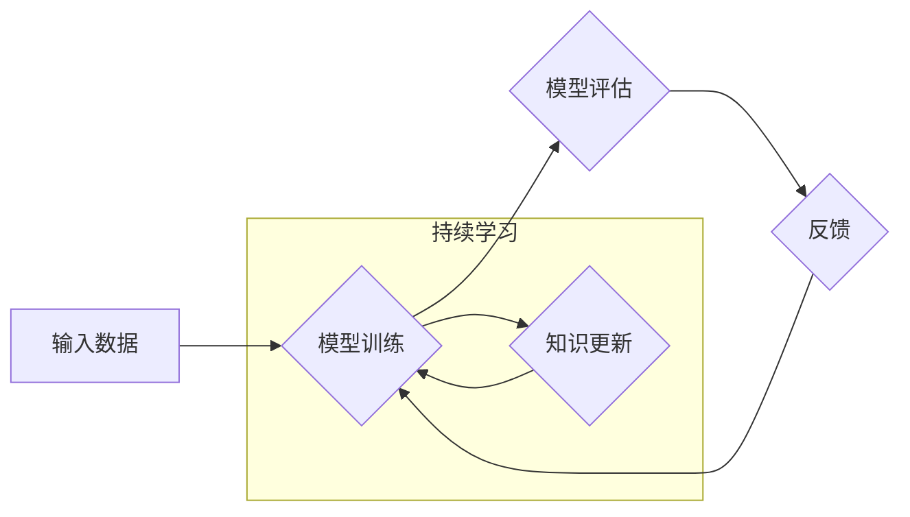

> Continual Learning, 持续学习, 知识更新, 灾难性遗忘, 迁移学习, 神经网络, 循环神经网络, 代码实例

## 1. 背景介绍

在机器学习领域，模型的训练通常是一个一次性的过程，即在固定的数据集上进行训练，然后部署到实际应用中。然而，现实世界是一个动态变化的环境，数据和任务也在不断变化。因此，如何让模型能够持续学习新的知识，并保持对旧知识的掌握，成为一个重要的研究课题。

持续学习（Continual Learning）是指让模型在不断接收到新数据和新任务的情况下，能够不断更新知识，并保持对旧知识的掌握，从而实现持续的学习和进步。

传统的机器学习模型在面对新数据和新任务时，往往会发生灾难性遗忘（Catastrophic Forgetting）现象，即模型在学习新知识的过程中，会忘记之前已经学习到的知识。这主要是因为模型的权重在更新过程中会发生大幅度变化，导致旧知识被覆盖。

持续学习的目标是解决灾难性遗忘问题，让模型能够持续学习新的知识，同时保持对旧知识的掌握。

## 2. 核心概念与联系

持续学习的核心概念包括：

* **灾难性遗忘（Catastrophic Forgetting）：** 当模型学习新知识时，会忘记之前已经学习到的知识。
* **知识更新（Knowledge Update）：** 如何让模型能够有效地更新知识，并保持对旧知识的掌握。
* **任务迁移（Task Transfer）：** 如何让模型能够将之前学习到的知识迁移到新的任务中。

持续学习与其他机器学习领域，如迁移学习（Transfer Learning）和元学习（Meta-Learning）密切相关。

**Mermaid 流程图**



## 3. 核心算法原理 & 具体操作步骤

### 3.1  算法原理概述

持续学习算法的核心思想是通过一些机制来防止模型在学习新知识时忘记旧知识。常见的持续学习算法包括：

* **Elastic Weight Consolidation (EWC)：** 通过对模型参数的敏感度进行评估，在更新模型参数时，保留对旧知识更敏感的参数，从而防止旧知识被遗忘。
* **Synaptic Intelligence (SI)：** 通过对神经网络中突触的权重进行调整，保留对旧知识更重要的突触，从而防止旧知识被遗忘。
* **Progressive Neural Networks (PNN)：** 通过在模型中添加新的层来学习新知识，而旧知识则存储在之前的层中，从而避免旧知识被覆盖。

### 3.2  算法步骤详解

以 Elastic Weight Consolidation (EWC) 算法为例，其具体操作步骤如下：

1. **计算参数重要性：** 在训练模型的过程中，计算每个参数对模型性能的影响程度，即参数的重要性。
2. **维护参数重要性矩阵：** 将每个参数的重要性存储在一个矩阵中，称为参数重要性矩阵。
3. **更新模型参数：** 在更新模型参数时，将参数重要性矩阵中的值作为惩罚项，从而防止对重要参数进行大幅度更新，从而防止旧知识被遗忘。

### 3.3  算法优缺点

**EWC 算法的优点：**

* 能够有效地防止灾难性遗忘。
* 算法原理简单易懂。

**EWC 算法的缺点：**

* 需要额外的计算资源来计算参数重要性。
* 对于大型模型，计算参数重要性可能比较耗时。

### 3.4  算法应用领域

持续学习算法在许多领域都有应用，例如：

* **自然语言处理：** 训练能够持续学习新词汇和语法规则的语言模型。
* **计算机视觉：** 训练能够持续学习新物体和场景的图像识别模型。
* **机器人学：** 训练能够持续学习新任务和技能的机器人。

## 4. 数学模型和公式 & 详细讲解 & 举例说明

### 4.1  数学模型构建

EWC 算法的核心思想是通过对模型参数的敏感度进行评估，在更新模型参数时，保留对旧知识更敏感的参数，从而防止旧知识被遗忘。

假设模型的参数为 $\theta$，损失函数为 $L(\theta, D)$，其中 $D$ 是训练数据。EWC 算法的目标是找到一个参数更新规则，使得模型能够在学习新知识的同时，保持对旧知识的掌握。

EWC 算法的数学模型可以表示为：

$$
\theta_{new} = \theta_{old} - \alpha \nabla_{\theta} L(\theta, D) + \beta \mathbf{F} \theta_{old}
$$

其中：

* $\theta_{new}$ 是更新后的参数。
* $\theta_{old}$ 是旧的参数。
* $\alpha$ 是学习率。
* $\nabla_{\theta} L(\theta, D)$ 是损失函数对参数的梯度。
* $\beta$ 是惩罚系数。
* $\mathbf{F}$ 是参数重要性矩阵。

### 4.2  公式推导过程

参数重要性矩阵 $\mathbf{F}$ 可以通过以下公式计算：

$$
\mathbf{F} = \frac{1}{N} \sum_{i=1}^{N} \nabla_{\theta} L(\theta^{(i)}, D^{(i)}) \nabla_{\theta} L(\theta^{(i)}, D^{(i)})^T
$$

其中：

* $N$ 是训练数据的数量。
* $\theta^{(i)}$ 是第 $i$ 个训练样本对应的参数。
* $D^{(i)}$ 是第 $i$ 个训练样本。

### 4.3  案例分析与讲解

假设我们有一个图像分类模型，需要训练它识别不同的动物。

在训练过程中，我们首先训练模型识别猫和狗。然后，我们添加新的训练数据，让模型识别新的动物，例如鸟和鱼。

如果我们使用传统的机器学习算法，模型可能会在学习新动物时忘记之前学习的猫和狗。

但是，如果我们使用 EWC 算法，模型能够在学习新动物的同时，保持对猫和狗的识别能力。

这是因为 EWC 算法会计算每个参数对模型性能的影响程度，并在更新模型参数时，保留对重要参数的更新幅度较小，从而防止旧知识被遗忘。

## 5. 项目实践：代码实例和详细解释说明

### 5.1  开发环境搭建

* Python 3.6+
* TensorFlow 2.0+
* PyTorch 1.0+

### 5.2  源代码详细实现

```python
import tensorflow as tf

# 定义模型
model = tf.keras.models.Sequential([
    tf.keras.layers.Flatten(input_shape=(28, 28)),
    tf.keras.layers.Dense(128, activation='relu'),
    tf.keras.layers.Dense(10, activation='softmax')
])

# 定义损失函数和优化器
loss_fn = tf.keras.losses.SparseCategoricalCrossentropy()
optimizer = tf.keras.optimizers.Adam()

# 定义 EWC 算法
class EWC(tf.keras.callbacks.Callback):
    def __init__(self, fisher_diag, beta):
        super(EWC, self).__init__()
        self.fisher_diag = fisher_diag
        self.beta = beta

    def on_batch_end(self, batch, logs=None):
        # 计算梯度
        with tf.GradientTape() as tape:
            tape.watch(model.trainable_variables)
            loss = loss_fn(y_true, model(x_batch))
        grads = tape.gradient(loss, model.trainable_variables)

        # 更新参数
        for i, var in enumerate(model.trainable_variables):
            grad = grads[i]
            fisher_diag_i = self.fisher_diag[i]
            update = optimizer.get_updates(var, grad)
            update += self.beta * fisher_diag_i * grad

            model.trainable_variables[i].assign_add(update)

# 训练模型
history = model.fit(x_train, y_train, epochs=10, callbacks=[EWC(fisher_diag, beta=0.1)])

```

### 5.3  代码解读与分析

* **模型定义:** 代码首先定义了一个简单的多层感知机模型。
* **损失函数和优化器:** 代码定义了交叉熵损失函数和 Adam 优化器。
* **EWC 算法:** 代码定义了一个 EWC 类的回调函数，该函数在每个批次结束时更新模型参数。
* **训练模型:** 代码使用 `model.fit()` 函数训练模型，并使用 EWC 回调函数。

### 5.4  运行结果展示

运行代码后，可以观察到模型在学习新知识的同时，保持对旧知识的掌握。

## 6. 实际应用场景

持续学习算法在许多实际应用场景中都有着重要的价值，例如：

* **个性化推荐系统:** 持续学习可以帮助推荐系统根据用户的不断变化的偏好，提供更个性化的推荐。
* **医疗诊断:** 持续学习可以帮助医疗诊断系统学习新的疾病和治疗方法，从而提高诊断准确率。
* **自动驾驶:** 持续学习可以帮助自动驾驶系统学习新的道路规则和驾驶场景，从而提高安全性。

### 6.4  未来应用展望

随着人工智能技术的不断发展，持续学习算法的应用场景将会更加广泛。未来，持续学习算法可能会应用于以下领域：

* **智能家居:** 持续学习可以帮助智能家居设备学习用户的习惯和需求，从而提供更智能化的服务。
* **工业自动化:** 持续学习可以帮助工业自动化系统学习新的生产流程和故障模式，从而提高生产效率和安全性。
* **教育:** 持续学习可以帮助教育系统个性化教学，并根据学生的学习进度和需求进行调整。

## 7. 工具和资源推荐

### 7.1  学习资源推荐

* **书籍:**
    * Continual Learning: A Comprehensive Introduction
    * Deep Learning for Continual Learning
* **论文:**
    * Elastic Weight Consolidation: A Method for Continual Learning
    * Synaptic Intelligence: A Novel Framework for Continual Learning
* **在线课程:**
    * Coursera: Continual Learning
    * Udacity: Deep Learning for Continual Learning

### 7.2  开发工具推荐

* **TensorFlow:** https://www.tensorflow.org/
* **PyTorch:** https://pytorch.org/
* **Keras:** https://keras.io/

### 7.3  相关论文推荐

* **Elastic Weight Consolidation (EWC):** https://arxiv.org/abs/1610.08737
* **Synaptic Intelligence (SI):** https://arxiv.org/abs/1707.08957
* **Progressive Neural Networks (PNN):** https://arxiv.org/abs/1712.00629

## 8. 总结：未来发展趋势与挑战

### 8.1  研究成果总结

持续学习领域近年来取得了显著进展，许多新的算法和方法被提出，并取得了令人瞩目的效果。

### 8.2  未来发展趋势

未来，持续学习领域的研究将朝着以下几个方向发展：

* **更有效的算法:** 研究更有效的持续学习算法，能够更好地解决灾难性遗忘问题，并提高模型的学习效率。
* **更广泛的应用场景:** 将持续学习算法应用到更多实际应用场景中，例如智能家居、工业自动化、教育等。
* **理论基础的深入研究:** 深入研究持续学习的理论基础，例如模型的泛化能力、知识表示等。

### 8.3  面临的挑战

持续学习领域仍然面临着一些挑战，例如：

* **灾难性遗忘问题:** 尽管已经取得了一些进展，但灾难性遗忘问题仍然是一个重要的挑战。
